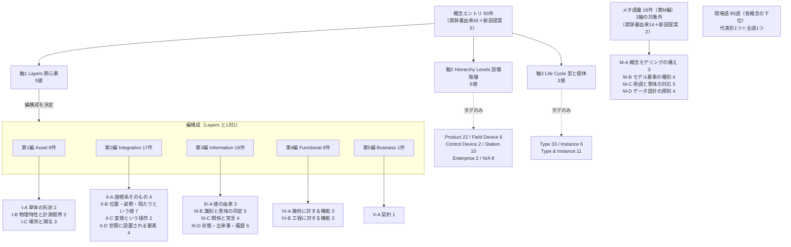

# TECHNICAL SPECIFICATION（試作版 / Pilot）

# 空間データを扱うモデリングの概念辞書 — 全編附属書: 分類軸の検証と索引
Conceptual vocabulary for spatial-data modelling — Consolidated Annexes: Classification verification and indexes

**文書番号（仮）:** STD-EED-0001-0
**版:** 0.1.0-pilot（原辞書 v0.17.0 からの変換試作）
**変換日:** 2026-09-03
**変換範囲:** 原辞書 4章（分類軸・MECE検証・空セル一覧）／8章（索引 8.1〜8.9）、および第1編附属書D NOTE が全編化時へ持ち越した登場人物の統合と双方向網羅性の検証

---

## 前書き (Foreword)

本編は、第1〜5編（対象語彙50概念）と第M編（メタ語彙16概念）の**上に立つ集計と索引の編**である。原辞書5章・6章の変換が全編で完了したことを受け、原辞書4章（分類軸とMECE検証）と8章（索引）を復元する。以下は本編固有の申し合わせである。

- **本編は概念を1件も定義しない。** 規定（normative）にあたる用語及び定義は第1〜5編・第M編の Clause 3 にあり、本編の内容はすべて各編の附属書Bからの集計、または各編への索引である。したがって本編の附属書はすべて informative であり、Clause 3 は他編への参照のみを置く（Clause 3 参照）。
- **文書番号は `STD-EED-0001-0` とする。** `-1`〜`-5` は RAMI 4.0 Layers 軸との一対一対応で振られ（`decisions.md` D-2026-08-18-03）、Layers 軸を持たないメタ語彙は `-6` ではなく `-M` を用いた（D-2026-08-22-19）。本編も Layers 軸を持たないが、メタ語彙とは違って**語彙ですらない**——全編を横断する集計である。原辞書が横断的な内容（0章 ドメイン視点）を `0` に置いたのと同じ位置づけとして `-0` を与える。`0` は Layers 軸の値域（5値＝1〜5）の外にあるため、一対一対応の不変条件は壊れない（`decisions.md` D-2026-09-03-01）。
- **附属書の記号は第1〜5編・第M編と揃えた。** A＝現場語、B＝概念メタデータ、C＝関係型、D＝登場人物、E＝変換対応表という並びは全編共通である。本編ではこれに続けて、第1編附属書E.3 が全編化時の行き先として予告した2つ——**F＝原辞書4章（分類軸・MECE検証・空セル一覧）、G＝原辞書8章（索引）**——を置く。予告された記号がそのまま実現している。
- **本編の集計母数は66エントリである**（対象語彙50＋メタ語彙16）。内訳は原辞書由来59＋本仕様書での新設提案7（`eed:0145` 関与インタフェース、`eed:0146`〜`0151` 対比ペアの親概念6件）。**原辞書4.3節・4.4節・8章の数字はいずれも59件以前の母数で書かれているため、本編の表と直接は一致しない。** 対応は附属書F・附属書Hに示す。
- **本編の集計は提案値を織り込んだ状態で行っている。** `backlog.md` P-02（`eed:0007` の和文名）・P-03（`eed:0040` の名称・語彙区分・Hierarchy Level）・P-04（`eed:0056` の英語主名称）・P-01／P-05（新設7件）はいずれも原辞書側の承認待ちであり、確定するまで索引の該当行には `※提案値` を付す。**提案が却下された場合に元へ戻す先**は附属書G.1・G.2 の注記に明記した。
- **`backlog.md` B-08（`calibrated-from`・`aligns-with` の正式採用可否）を本編で裁いた。** 結論は**いずれも概念間関係型として採用しない**であり、関係型は5型（is-a／part-of／refers-to／constrained-by／transforms）で確定した（附属書C、`decisions.md` D-2026-09-03-02）。これをもって `backlog.md` の§1 判断待ちは0件になる。
- **全編を通した機械照合により、原辞書側の不整合を新たに5件検出した**（`backlog.md` F-16〜F-20）。いずれも個々の編の変換では見えず、**全編を1つの母数として数え直したときにだけ現れる**種類のものである（附属書H）。

## 序文 (Introduction)

辞書は先頭から読むものではない。**引くもの**である。第1〜5編・第M編は概念の側から組み立てられており、「その概念が何であるか」には答えるが、「いま手元にあるこの語はどの概念か」「この役割の人はどこを読むべきか」「この分類の組み合わせに語彙はあるか」には答えない。本編はその逆方向の導線をまとめて置く。

引き方は4つある。

| 手元にあるもの | 引く先 |
| :--- | :--- |
| 現場で聞いた語（「重心」「ハブ」「直（ちょく）」） | **附属書A** 現場語 → 代表形 |
| 和文名または英語名 | **附属書G.1**（50音順）・**G.2**（英字順） |
| 自分の役割（設計／生技／制御／情報／共通） | **附属書G.3** P/C逆引き |
| 実務テーマ（把持を解決したい、契約を定めたい） | **附属書G.4** テーマ別ビュー |

もう一つ、本編には索引ではない役割がある。**分類が漏れなく重なりなく（MECE）成立しているかを、全編を1つの母数として検証すること**である（附属書F）。各編の変換では自分の編の内側しか見えないため、「Layers 軸の5値すべてに語彙があるか」「どの分類の組み合わせが空か」は編をまたいで数え直さなければ答えられない。原辞書4.4節・4.5節がこの役割を担っており、本編はそれを66エントリの現状で作り直す。

**空である組み合わせを黙っておかないことが、この編の主眼である。** 索引は「ある」ものを並べるが、附属書Fは「ない」ものを並べる。原辞書4.5節が置いた「空であること自体は問題ではないが、空であることを黙っておくと『網羅した』という誤解を生む」という原則を、本編もそのまま引き継ぐ。

## 1 適用範囲 (Scope)

本仕様書は、STD-EED-0001 シリーズ（第1〜5編および第M編）に収録された全エントリについて、**分類軸の分布・MECE検証・空セルの一覧、および各種索引**を規定します。

適用範囲は以下の通りです：

* 全編のエントリを1つの母数とした、RAMI 4.0 3軸の分布とクロス集計
* 分類の MECE 性の検証と、検証対象件数が検証項目ごとに異なることの明示
* 語彙が存在しない分類の組み合わせ（空セル）の網羅的な列挙と、空である理由の分類
* 和文名・英語主名称・現場語・ドメインロール・実務テーマ・登場人物・語彙区分の各索引
* 概念間関係型の全編を通じた使用実績と、型の確定

本編は**用語を定義しません**。定義は各編の Clause 3 にあります。また本編は原辞書の記述を**集計し直したもの**であり、原辞書側の数値をそのまま転記したものではありません（附属書H）。

## 2 参照標準・参考文献 (References)

第1〜5編・第M編と同一の参照群によります。本編で主に依拠するのは以下です：

* ISO 704:2009, Terminology work — Principles and methods（概念体系と概念間関係）
* ISO/IEC Directives, Part 2（附属書の位置づけ、informative／normative の別）
* RAMI 4.0（DIN SPEC 91345）— Layers / Hierarchy Levels / Life Cycle の3軸
* IEC 61360 / ISO 13584（データ辞書方式。属性を本文でなく登録簿側で管理する考え方）
* IEC 63278（AAS）

## 3 用語及び定義 (Terms and Definitions)

本編は用語を定義しません。本仕様書で用いる用語及び定義は、次の各編の Clause 3 によります。

| 編 | 文書番号 | 収録概念数 |
| :--- | :--- | ---: |
| 第1編 物理資産 (Asset層) | STD-EED-0001-1 | 8 |
| 第2編 空間統合 (Integration層) | STD-EED-0001-2 | 17 |
| 第3編 意味・情報 (Information層) | STD-EED-0001-3 | 18 |
| 第4編 機能・変換 (Functional層) | STD-EED-0001-4 | 6 |
| 第5編 契約・ガバナンス (Business層) | STD-EED-0001-5 | 1 |
| 第M編 メタ語彙 | STD-EED-0001-M | 16 |
| **計** | | **66** |

## 4 集計の母数と表記規約 (Aggregation Basis and Notation)

### 4.1 母数

本編の集計は、集計する対象によって母数が3通りに分かれます。**行によって母数が違うことは誤りではなく、軸の適用範囲がエントリの種別によって違うことの現れです。** 表を読むときは、まずどの母数の表かを確認してください。

| 母数 | 件数 | 対象 | 使う集計 |
| :--- | ---: | :--- | :--- |
| **全エントリ** | **66** | 第1〜5編＋第M編 | 索引（附属書G.1・G.2・G.3・G.5・G.8）、サブグループのMECE検証 |
| **対象語彙のみ** | **50** | 第1〜5編（RAMI 4.0 の3軸を持つ） | 分類軸の分布・クロス表・空セル（附属書F.3・F.5）、Layers軸と編構成のMECE検証、登場人物の逆引き（附属書G.6） |
| **メタ語彙のみ** | **16** | 第M編（3軸をいずれも持たない） | 軸に関する集計から除外されることの明示 |

**メタ語彙が軸の集計に入らない理由**は原辞書6.1節にあり、「軸そのものが工場の対象を前提にしている」ためです。メタ語彙は工場に実在するモノ・人を主語にして述語として言えないため、設備階層（軸2）も型と個体の別（軸3）も問いとして成立しません。これは欠落ではなく、対象語彙とメタ語彙を分ける基準そのものです（第M編 序文）。

### 4.2 集計元

すべての集計は各編の**附属書B（概念メタデータ一覧）**を単一の集計元とします。附属書Bは IEC 61360 のデータ辞書方式に倣い、分類メタデータを用語記述の本文から分離して登録簿側で管理するために置かれたものであり、本編はその設計意図が実際に機能するかを試す最初の場面にあたります。本編の附属書Bは、6編ぶんを1表に統合したものです。

**エントリ本文（Clause 3）からは何も集計していません。** 本文と附属書Bが食い違っていれば集計は誤りますが、その食い違いは各編の変換時に照合済みです（`decisions.md` D-2026-09-02-10）。

### 4.3 表記規約

| 記法 | 意味 |
| :--- | :--- |
| `第N編3.M` | 本仕様書のエントリ参照。編番号＋その編での採番（`decisions.md` D-2026-09-02-13） |
| `原1.07`・`原M.11` | 原辞書 v0.17.0 の採番。`原` を冠する |
| `eed:0042#001` | 恒久ID（IRDI）。採番が変わっても動かない（原辞書8.9節、附属書G.9） |
| ★ | 本仕様書での**新設提案**エントリ（7件。`backlog.md` P-01・P-05） |
| ※提案値 | 原辞書側の承認待ちの値（`backlog.md` P-02・P-03・P-04） |
| — | 未確認・該当なし（存在しない値を創作しない） |

---

## 附属書A (informative) 現場語・通称対応表 — 全編統合 (Shopfloor Terms, Consolidated)

原辞書8.7節（現場語 → 代表形 正規化表）を全編ぶん統合したものです。第M編3.12（用語正規化）を、この辞書自身に適用した結果にあたります。

**現場語85語は、ちょうど1つの代表形（概念）とちょうど1つの主語（登場人物）を持ちます。** この2つの一意性は自動検証の対象です（原辞書4.4節）。同義・異表記の列に載っている語も、同じ代表形へ畳み込まれます。

**並び順は現場語ID順です。** 現場語IDは代表形の順に発番されているため、この並びは概念の側からの並びと一致します。50音順の索引は作成していません——原辞書8.7節には現場語の**読み**欄がなく、概念の索引（附属書G.1）で用いた読みのように原辞書から引き直すことができないためです。存在しない読みを創作しない方針により、読みが与えられるまで50音索引は保留とします（`backlog.md` F-21）。

| 現場語ID | 現場語 (JP) | 代表形（概念） | 主語（登場人物） | 同義・異表記 |
|---|---|---|---|---|
| `eed:0060#001` | **外形バウンディングボックス** | 第1編3.1 bounding volume | ワーク（被加工物・部品・製品） | BBox／外形ボックス／AABB |
| `eed:0061#001` | **外接球近似** | 第1編3.1 bounding volume | ワーク（被加工物・部品・製品） | バウンディングスフィア |
| `eed:0062#001` | **境界グラフ** | 第1編3.2 topology | ワーク（被加工物・部品・製品） | B-rep の接続情報 |
| `eed:0063#001` | **重心** | 第1編3.3 mass properties | ワーク（被加工物・部品・製品） | 質量中心／CoG |
| `eed:0064#001` | **慣性テンソル** | 第1編3.3 mass properties | ワーク（被加工物・部品・製品） | イナーシャ |
| `eed:0065#001` | **搬送安定姿勢** | 第1編3.4 stable pose | ワーク（被加工物・部品・製品） | 置き姿勢／安定置き |
| `eed:0066#001` | **エンコーダ分解能** | 第1編3.5 resolution | 産業用ロボット（多関節マニピュレータ） | パルス分解能 |
| `eed:0067#001` | **画素分解能** | 第1編3.5 resolution | ビジョンカメラ・3Dスキャナ | ピクセル分解能／画素サイズ |
| `eed:0068#001` | **搬入場所** | 第1編3.6 process location | 工程内場所（ステーション・セル） | 受入／入荷ステーション |
| `eed:0069#001` | **搬出場所** | 第1編3.6 process location | 工程内場所（ステーション・セル） | 出荷ステーション |
| `eed:0070#001` | **加工場所** | 第1編3.6 process location | 工程内場所（ステーション・セル） | 加工ステーション |
| `eed:0071#001` | **マテハン変換場所** | 第1編3.6 process location | 工程内場所（ステーション・セル） | 整列ステーション／ばらし工程 |
| `eed:0072#001` | **製品基準座標系** | 第2編3.2 reference coordinate frame | ワーク（被加工物・部品・製品） | MCS／ワーク原点 |
| `eed:0073#001` | **データム系** | 第2編3.2 reference coordinate frame | ワーク（被加工物・部品・製品） | DRF／datum reference frame／データム参照系 |
| `eed:0074#001` | **座標フレーム** | 第2編3.2 reference coordinate frame | 架台・ベースプレート・床 | フレーム／ノード座標系 |
| `eed:0075#001` | **クォータニオン** | 第2編3.6 rotation representation convention | 産業用ロボット（多関節マニピュレータ） | 四元数／$[q_x, q_y, q_z, q_w]$ |
| `eed:0076#001` | **回転行列** | 第2編3.6 rotation representation convention | 産業用ロボット（多関節マニピュレータ） | 姿勢行列／DCM |
| `eed:0077#001` | **回転ベクトル** | 第2編3.6 rotation representation convention | 産業用ロボット（多関節マニピュレータ） | 軸角／Rodriguesベクトル |
| `eed:0078#001` | **オイラー角** | 第2編3.6 rotation representation convention | 産業用ロボット（多関節マニピュレータ） | RPY／ロール・ピッチ・ヨー／ABC角 |
| `eed:0079#001` | **内因性・外因性** | 第2編3.6 rotation representation convention | 産業用ロボット（多関節マニピュレータ） | intrinsic／extrinsic、rotated axes／static axes、可動軸／固定軸 |
| `eed:0080#001` | **TFツリー** | 第2編3.10 hierarchical coordinate structure | 産業用ロボット（多関節マニピュレータ） | 座標変換ツリー／TF |
| `eed:0081#001` | **アセンブリ親子構成** | 第2編3.10 hierarchical coordinate structure | ワーク（被加工物・部品・製品） | BOM構造／構成ツリー |
| `eed:0082#001` | **ユークリッド距離** | 第2編3.11 distance metric convention | ワーク（被加工物・部品・製品） | 直線距離／L2ノルム |
| `eed:0083#001` | **マンハッタン距離** | 第2編3.11 distance metric convention | 工作機械・専用機（CNC、プレス、溶接機など） | 市街地距離／L1ノルム |
| `eed:0084#001` | **チェビシェフ距離** | 第2編3.11 distance metric convention | ワーク（被加工物・部品・製品） | L∞ノルム／最大値ノルム |
| `eed:0085#001` | **4×4変換行列** | 第2編3.12 homogeneous transformation matrix | 産業用ロボット（多関節マニピュレータ） | 同次行列／変換マトリクス |
| `eed:0086#001` | **データムフィーチャー** | 第2編3.14 datum reference feature | ワーク（被加工物・部品・製品） | データム／基準面・基準穴 |
| `eed:0087#001` | **位置決めフィーチャー** | 第2編3.14 datum reference feature | 治具（ジグ）・位置決めピン・突き当て面 | 基準ピン穴／突き当て面 |
| `eed:0088#001` | **データム** | 第2編3.14 datum reference feature | ワーク（被加工物・部品・製品） | 理論データム／datum |
| `eed:0089#001` | **ランドマーク** | 第2編3.15 calibration reference | 架台・ベースプレート・床 | 校正基準／（本アーキテクチャ内の呼称）ハブ |
| `eed:0090#001` | **チェッカーボード** | 第2編3.15 calibration reference | ビジョンカメラ・3Dスキャナ | 校正ボード／格子パターン |
| `eed:0091#001` | **ARマーカー** | 第2編3.15 calibration reference | ビジョンカメラ・3Dスキャナ | ArUco／AprilTag／基準マーカー |
| `eed:0092#001` | **基準球** | 第2編3.15 calibration reference | ビジョンカメラ・3Dスキャナ | 校正球／ターゲットスフィア |
| `eed:0093#001` | **校正治具** | 第2編3.15 calibration reference | 治具（ジグ）・位置決めピン・突き当て面 | キャリブレーションジグ／マスタージグ |
| `eed:0094#001` | **接触禁止領域** | 第2編3.16 exclusion zone | ワーク（被加工物・部品・製品） | タッチ禁止面／NGエリア |
| `eed:0095#001` | **許容アプローチ方向** | 第2編3.17 approach vector | エンドエフェクタ（ハンド・グリッパ・吸着パッド） | 進入ベクトル／アプローチベクトル |
| `eed:0096#001` | **実測質量** | 第3編3.2 declared value | ワーク（被加工物・部品・製品） | 実測値 |
| `eed:0097#001` | **手動指定把持位置** | 第3編3.2 declared value | エンドエフェクタ（ハンド・グリッパ・吸着パッド） | 手動ティーチ位置 |
| `eed:0098#001` | **CAD理論質量** | 第3編3.3 derived value | ワーク（被加工物・部品・製品） | 理論値／設計質量 |
| `eed:0099#001` | **自動導出把持候補** | 第3編3.3 derived value | エンドエフェクタ（ハンド・グリッパ・吸着パッド） | 把持候補サンプリング結果 |
| `eed:0100#001` | **ワーク品種識別子** | 第3編3.5 type identifier | ワーク（被加工物・部品・製品） | 品番／設計型番／機種コード |
| `eed:0101#001` | **部品テンプレートID** | 第3編3.5 type identifier | CADシステム・PLM | ファミリID |
| `eed:0102#001` | **ワーク個体識別子** | 第3編3.6 instance identifier | ワーク（被加工物・部品・製品） | シリアル／製造番号／個体ID |
| `eed:0103#001` | **部品リビジョン** | 第3編3.7 revision | ワーク（被加工物・部品・製品） | 版数／rev／改訂記号 |
| `eed:0104#001` | **IRDI** | 第3編3.8 property dictionary reference | CADシステム・PLM | International Registration Data Identifier |
| `eed:0105#001` | **ECLASS** | 第3編3.8 property dictionary reference | CADシステム・PLM | eCl@ss |
| `eed:0106#001` | **semanticId** | 第3編3.8 property dictionary reference | MES・上位システム | セマンティックID |
| `eed:0107#001` | **IEC CDD** | 第3編3.8 property dictionary reference | CADシステム・PLM | Common Data Dictionary |
| `eed:0108#001` | **親子構成関係** | 第3編3.9 typed relation | ワーク（被加工物・部品・製品） | アセンブリ関係 |
| `eed:0109#001` | **ジョイント種別** | 第3編3.9 typed relation | 産業用ロボット（多関節マニピュレータ） | fixed／revolute／prismatic |
| `eed:0110#001` | **ルート** | 第3編3.10 spatial element classification | 架台・ベースプレート・床 | 経路注記 |
| `eed:0111#001` | **境界** | 第3編3.10 spatial element classification | 安全柵・ライトカーテン | 区画線 |
| `eed:0112#001` | **ゾーン** | 第3編3.10 spatial element classification | 安全柵・ライトカーテン | エリア／区画 |
| `eed:0113#001` | **ノード** | 第3編3.10 spatial element classification | 架台・ベースプレート・床 | 結節点／node（旧称：ハブ） |
| `eed:0114#001` | **目印** | 第3編3.10 spatial element classification | 架台・ベースプレート・床 | landmark（都市モデル由来。第2編3.15 キャリブレーション基準は本値の下位概念候補） |
| `eed:0115#001` | **アンカー** | 第3編3.10 spatial element classification | 架台・ベースプレート・床 | 外部参照点 |
| `eed:0116#001` | **把持点** | 第3編3.11 grasp specification and synthesis | ワーク（被加工物・部品・製品） | ピック位置／掴み代／チャック位置 |
| `eed:0117#001` | **把持目標姿勢** | 第3編3.11 grasp specification and synthesis | エンドエフェクタ（ハンド・グリッパ・吸着パッド） | TCP目標姿勢（ISO 9787） |
| `eed:0118#001` | **把持特徴宣言** | 第3編3.11 grasp specification and synthesis | ワーク（被加工物・部品・製品） | 把持宣言 |
| `eed:0119#001` | **軸対称** | 第3編3.12 symmetry rule | ワーク（被加工物・部品・製品） | 連続対称／回転対称 |
| `eed:0120#001` | **90度刻み対称** | 第3編3.12 symmetry rule | ワーク（被加工物・部品・製品） | 4回対称／N回対称 |
| `eed:0121#001` | **シミュレーション検証済** | 第3編3.13 v&v level | エンドエフェクタ（ハンド・グリッパ・吸着パッド） | シム検証済 |
| `eed:0122#001` | **実機検証済** | 第3編3.13 v&v level | エンドエフェクタ（ハンド・グリッパ・吸着パッド） | 実機確認済／立会済 |
| `eed:0123#001` | **加工工程状態** | 第3編3.14 process state | ワーク（被加工物・部品・製品） | 工程ステータス／進捗区分 |
| `eed:0124#001` | **入力状態期待値** | 第3編3.15 state expectation | 搬送トレー・パレット・コンテナ | 事前条件／受入条件 |
| `eed:0125#001` | **出力状態期待値** | 第3編3.15 state expectation | 搬送トレー・パレット・コンテナ | 事後条件／完了条件 |
| `eed:0126#001` | **アラーム** | 第3編3.16 event | PLC（シーケンサ） | 警報／異常履歴 |
| `eed:0127#001` | **稼働ログ** | 第3編3.16 event | PLC（シーケンサ） | 運転ログ／イベントログ |
| `eed:0128#001` | **サイクル完了信号** | 第3編3.16 event | 工程内場所（ステーション・セル） | 完了トリガ／サイクルエンド |
| `eed:0129#001` | **状態遷移ログ** | 第3編3.16 event | ワーク（被加工物・部品・製品） | ステータス履歴 |
| `eed:0130#001` | **日次集計** | 第3編3.17 aggregation window | MES・上位システム | デイリー集計／日報 |
| `eed:0131#001` | **シフト単位** | 第3編3.17 aggregation window | 工程内場所（ステーション・セル） | 直（ちょく）単位／勤務帯 |
| `eed:0132#001` | **移動平均** | 第3編3.17 aggregation window | MES・上位システム | ローリング平均／移動窓 |
| `eed:0133#001` | **締め時刻** | 第3編3.17 aggregation window | MES・上位システム | カットオフ／締め |
| `eed:0134#001` | **通過履歴** | 第3編3.18 traceability record | ワーク（被加工物・部品・製品） | トレース記録／履歴データ |
| `eed:0135#001` | **ライン作成** | 第4編3.2 dimension-raising operation | ワーク（被加工物・部品・製品） | 作図／線分生成 |
| `eed:0136#001` | **スケッチ** | 第4編3.2 dimension-raising operation | ワーク（被加工物・部品・製品） | sketch |
| `eed:0137#001` | **押し出し** | 第4編3.2 dimension-raising operation | ワーク（被加工物・部品・製品） | extrude／押出し |
| `eed:0138#001` | **寸法測定** | 第4編3.3 measurement | 検査装置（三次元測定機、画像検査機） | 実測／採寸 |
| `eed:0139#001` | **クリアランス確認** | 第4編3.3 measurement | ワーク（被加工物・部品・製品） | 隙間確認／逃げ確認 |
| `eed:0140#001` | **角度計測** | 第4編3.3 measurement | 検査装置（三次元測定機、画像検査機） | 振れ測定／傾き測定 |
| `eed:0141#001` | **制約** | 第4編3.6 transformation activity | 工程内場所（ステーション・セル） | ハード制約／必須条件 |
| `eed:0142#001` | **選好** | 第4編3.6 transformation activity | 工程内場所（ステーション・セル） | 目的関数／評価スコア |
| `eed:0143#001` | **JSON Schema契約** | 第5編3.1 contract boundary | MES・上位システム | スキーマ契約 |
| `eed:0144#001` | **OPC UA情報モデル** | 第5編3.1 contract boundary | MES・上位システム | OPC UAモデル |

NOTE 1 **85語は欠番なく揃っている。** 現場語IDの割り当て `eed:0060`〜`eed:0144` は連番であり、第1編12語／第2編24語／第3編39語／第4編8語／第5編2語＝85語で全域を埋める。第M編には現場語が1語もない（第M編附属書A）。これは欠落ではなく、現場で口にされるのは対象語彙の側だという構造の現れである。

NOTE 2 **現場語を持つ代表形は35件、持たない対象語彙は15件である**（対象語彙50件のうち。メタ語彙16件は全件が現場語を持たない）。1概念あたりの現場語数は最多6語（第3編3.10 空間注記の意味分類）から1語まで幅があり、未抽出の15件は原辞書の記載を保存した結果である（存在しない現場語を創作しない）。本仕様書での新設提案7件にはいずれも現場語が付いていないが、`eed:0145`（第1編3.8 関与インタフェース）については「パトライト」「操作盤」「置き治具」等が有力な候補として挙がっている（第1編3.8 Note 4、`backlog.md` P-01）。

NOTE 3 **主語（登場人物）の分布は偏っている。** 現場語を持つ登場人物は20件中14件であり、ワーク31語・産業用ロボット9語・工程内場所8語の3者だけで全体の56%（48語）を占める。逆にセンサ・無人搬送車・HMI・操作盤・作業者・コンベア・設計担当者の6登場人物には現場語が1語もない。この偏りは記述の厚みの直接の指標であり、附属書D.2 の型分けと合わせて読むと、どの登場人物の記述が薄いかが見える。各登場人物の現場語数は原辞書1.3節の表と全件一致することを本編で再検証した。

---

## 附属書B (informative) 概念メタデータ一覧 — 全編統合 (Concept Metadata Registry, Consolidated)

各編の附属書Bを1表に統合したものです。**本編のすべての集計はこの表を単一の集計元とします**（Clause 4.2）。

- **Layers**: RAMI 4.0 軸1。各編の附属書Bはこの欄を持ちません（編構成と一対一に対応するため）。本編は編をまたいで集計するため、ここでだけ明示します。第M編は3軸をいずれも持たないため `—` です。
- **Hier. Level / Life Cycle**: RAMI 4.0 軸2・軸3。
- **P / C**: 責務タグ。PD＝製品設計、MR＝生技ロボティクス、SC＝設備制御、IT＝情報MES、MA＝共通アーキテクチャ。P＝定義・決定する側、C＝参照・利用する側。
- **語彙区分**: 標準（外部規格に定義あり）／業界一般／独自（本アーキテクチャの造語）。
- **カバレッジ**: 実例を確認済みの分野。`—` は未確認。
- **★**: 本仕様書での新設提案。**※提案値**: 原辞書側の承認待ちの値。

| 編・採番 | 用語 (EN) | 和文名 | IRDI | Layers | Hier. Level | Life Cycle | P | C | 語彙区分 | カバレッジ |
|---|---|---|---|---|---|---|---|---|---|---|
| 第1編3.1 | bounding volume | バウンディングボリューム | `eed:0001#001` | Asset | Product | Type | PD | MR, SC | 業界一般 | 生産 ◯ / CAD ◯ |
| 第1編3.2 | topology | トポロジー構造 | `eed:0002#001` | Asset | Product | Type | PD | MR | 標準 | 生産 ◯ / CAD ◯ |
| 第1編3.3 | mass properties | 質量特性 | `eed:0003#001` | Asset | Product | Type & Instance | PD | MR, SC | 標準 | 生産 ◯ / CAD — |
| 第1編3.4 | stable pose | 安定姿勢 | `eed:0004#001` | Asset | Product | Type | MR | SC | 業界一般 | 生産 ◯ / CAD — |
| 第1編3.5 | resolution | 分解能 | `eed:0005#001` | Asset | Control Device | Type | SC | MR, IT | 標準 | 生産 ◯ / CAD — |
| 第1編3.6 | process location | 工程内場所 | `eed:0006#001` | Asset | Station | Type & Instance | SC | MR, IT | 独自 | 生産 ◯ / CAD — |
| 第1編3.7 | human-machine function allocation | 人・機械機能配分 | `eed:0007#001` | Asset | Station | Type & Instance | SC | MR, IT | 業界一般 | 生産 ◯ / CAD — |
| 第1編3.8 ★ | interaction interface | 関与インタフェース | `eed:0145#001`（新設提案） | Asset | Station | Type & Instance | SC | MR, IT | 独自 | 生産 ◯ / CAD — |
| 第2編3.1 | coordinate system | 座標系 | `eed:0008#001` | Integration | N/A | Type | MA | PD, MR, SC, IT | 標準 | 生産 ◯ / CAD ◯ |
| 第2編3.2 | reference coordinate frame | 参照座標系 | `eed:0009#001` | Integration | Product | Type | PD | MR, SC, IT | 標準 | 生産 ◯ / CAD ◯ |
| 第2編3.3 | handedness | 座標系のハンドネス | `eed:0010#001` | Integration | Product | Type | MA | PD, MR, SC | 標準 | 生産 ◯ / CAD ◯ |
| 第2編3.4 | unit scale convention | 尺度定義 | `eed:0011#001` | Integration | Product | Type | MA | PD, MR, SC | 業界一般 | 生産 ◯ / CAD ◯ |
| 第2編3.5 | pose | 姿勢 | `eed:0012#001` | Integration | Product | Type & Instance | PD, MR | SC, IT | 標準 | 生産 ◯ / CAD ◯ |
| 第2編3.6 | rotation representation convention | 回転表現規約 | `eed:0013#001` | Integration | Product | Type | MA | PD, MR, SC | 標準 | 生産 ◯ / CAD ◯ |
| 第2編3.7 ★ | spatial representation | 空間表現 | `eed:0146#001`（新設提案） | Integration | Product | Type | MA | PD, MR, SC | 独自 | 生産 ◯ / CAD ◯ |
| 第2編3.8 | local space | ローカル空間 | `eed:0014#001` | Integration | Product | Type | MA | PD, MR, SC | 業界一般 | 生産 ◯ / CAD ◯ |
| 第2編3.9 | world space | ワールド空間 | `eed:0015#001` | Integration | Product | Type | MA | PD, MR, SC | 業界一般 | 生産 ◯ / CAD ◯ |
| 第2編3.10 | hierarchical coordinate structure | 階層座標構造 | `eed:0016#001` | Integration | Product | Type & Instance | PD, MR | SC, IT | 業界一般 | 生産 ◯ / CAD ◯ |
| 第2編3.11 | distance metric convention | 距離定義規約 | `eed:0017#001` | Integration | N/A | Type | MA | MR, SC, PD | 標準 | 生産 ◯ / CAD ◯ |
| 第2編3.12 | homogeneous transformation matrix | 同次変換行列 | `eed:0018#001` | Integration | Product | Type | PD, MR | SC, IT | 標準 | 生産 ◯ / CAD ◯ |
| 第2編3.13 | coordinate transformation | 座標変換 | `eed:0019#001` | Integration | Product | Type & Instance | PD, MR | SC, IT | 標準 | 生産 ◯ / CAD ◯ |
| 第2編3.14 | datum reference feature | 基準フィーチャー | `eed:0020#001` | Integration | Field Device | Type | PD | MR, SC | 標準 | 生産 ◯ / CAD ◯ |
| 第2編3.15 | calibration reference | キャリブレーション基準 | `eed:0021#001` | Integration | Control Device | Type | SC | MR, PD | 業界一般 | 生産 ◯ / CAD ◯ |
| 第2編3.16 | exclusion zone | 干渉禁止領域 | `eed:0022#001` | Integration | Field Device | Type | PD, MR | SC | 独自 | 生産 ◯ / CAD — |
| 第2編3.17 | approach vector | アプローチ方向 | `eed:0023#001` | Integration | Field Device | Type | MR | SC | 業界一般 | 生産 ◯ / CAD ◯ |
| 第3編3.1 ★ | value | 値 | `eed:0147#001`（新設提案） | Information | N/A | Type | MA | PD, MR, IT | 独自 | 生産 ◯ / CAD ◯ |
| 第3編3.2 | declared value | 入力値 | `eed:0024#001` | Information | N/A | Type | MA | PD, MR, IT | 独自 | 生産 ◯ / CAD ◯ |
| 第3編3.3 | derived value | 算出値 | `eed:0025#001` | Information | N/A | Type | MA | PD, MR, IT | 独自 | 生産 ◯ / CAD ◯ |
| 第3編3.4 ★ | identifier | 識別子 | `eed:0148#001`（新設提案） | Information | Product | Type & Instance | PD, IT | MR, SC | 業界一般 | 生産 ◯ / CAD ◯ |
| 第3編3.5 | type identifier | 型識別子 | `eed:0026#001` | Information | Product | Type | PD, IT | MR, SC | 標準 | 生産 ◯ / CAD ◯ |
| 第3編3.6 | instance identifier | 個体識別子 | `eed:0027#001` | Information | Product | Instance | PD, IT | MR, SC | 標準 | 生産 ◯ / CAD — |
| 第3編3.7 | revision | リビジョン | `eed:0028#001` | Information | Product | Type | PD | MR, SC, IT | 業界一般 | 生産 ◯ / CAD — |
| 第3編3.8 | property dictionary reference | プロパティ辞書参照 | `eed:0029#001` | Information | Product | Type | MA, PD | IT, SC, MR | 標準 | 生産 ◯ / CAD — |
| 第3編3.9 | typed relation | 型付き関係 | `eed:0030#001` | Information | Product | Type | PD, MR | SC, IT | 業界一般 | 生産 ◯ / CAD ◯ |
| 第3編3.10 | spatial element classification | 空間注記の意味分類 | `eed:0031#001` | Information | Field Device | Type | PD, MR | SC | 業界一般 | 生産 — / CAD ◯ |
| 第3編3.11 | grasp specification and synthesis | 把持宣言と解決 | `eed:0032#001` | Information | Field Device | Type & Instance | MR | PD, SC | 業界一般 | 生産 ◯ / CAD ◯ |
| 第3編3.12 | symmetry rule | 対称性ルール | `eed:0033#001` | Information | Product | Type | PD | MR, SC | 業界一般 | 生産 ◯ / CAD — |
| 第3編3.13 | v&v level | 検証レベル | `eed:0034#001` | Information | Station | Instance | MR, SC | IT | 業界一般 | 生産 ◯ / CAD — |
| 第3編3.14 | process state | 工程状態 | `eed:0035#001` | Information | Station | Instance | SC, IT | MR | 標準 | 生産 ◯ / CAD — |
| 第3編3.15 | state expectation | 状態期待値 | `eed:0036#001` | Information | Station | Type & Instance | SC | MR, IT | 業界一般 | 生産 ◯ / CAD — |
| 第3編3.16 | event | イベント | `eed:0037#001` | Information | Station | Instance | SC, IT | MR | 標準 | 生産 ◯ / CAD — |
| 第3編3.17 | aggregation window | 集計期間 | `eed:0038#001` | Information | Enterprise | Type | IT | SC, PD | 業界一般 | 生産 ◯ / CAD — |
| 第3編3.18 | traceability record | トレーサビリティ記録 | `eed:0039#001` | Information | Enterprise | Instance | MR, SC | IT | 標準 | 生産 ◯ / CAD — |
| 第4編3.1 ★ | geometric operation | 幾何要素に対する操作 | `eed:0149#001`（新設提案） | Functional | N/A | Type | MA, PD | MR, SC | 独自 | 生産 ◯ / CAD ◯ |
| 第4編3.2 | dimension-raising operation | 次元上昇操作 | `eed:0040#001` | Functional | N/A | Type | MA, PD | MR | 業界一般 ※提案値 | 生産 ◯ / CAD ◯ |
| 第4編3.3 | measurement | 計測 | `eed:0041#001` | Functional | Field Device | Instance | PD, MR | SC, IT | 標準 | 生産 ◯ / CAD ◯ |
| 第4編3.4 | work interface | 作業インタフェース | `eed:0042#001` | Functional | Station | Type | SC | MR, IT | 独自 | 生産 ◯ / CAD — |
| 第4編3.5 | nested IPO decomposition | IPOネスト構造 | `eed:0043#001` | Functional | Station | Type | SC | MR, IT | 標準 | 生産 ◯ / CAD — |
| 第4編3.6 | transformation activity | 変換行為 | `eed:0044#001` | Functional | Station | Type & Instance | MR, SC | SC, IT | 業界一般 | 生産 ◯ / CAD ◯ |
| 第5編3.1 | contract boundary | 契約境界 | `eed:0045#001` | Business | N/A | Type | MA | PD, MR, SC, IT | 業界一般 | 生産 ◯ / CAD ◯ |
| 第M編3.1 | conceptual modeling | 概念モデリング | `eed:0046#001` | — | — | — | MA | PD, MR, SC, IT | 業界一般 | 生産 ◯ / CAD ◯ |
| 第M編3.2 | domain-driven design | ドメイン駆動設計 | `eed:0047#001` | — | — | — | MA | PD, MR, SC, IT | 業界一般 | 生産 ◯ / CAD ◯ |
| 第M編3.3 | bounded context | 境界づけられたコンテキスト | `eed:0048#001` | — | — | — | MA | PD, MR, SC, IT | 業界一般 | 生産 ◯ / CAD ◯ |
| 第M編3.4 ★ | model element | モデル要素 | `eed:0150#001`（新設提案） | — | — | — | MA | PD, MR, SC, IT | 業界一般 | 生産 ◯ / CAD ◯ |
| 第M編3.5 | entity | エンティティ | `eed:0049#001` | — | — | — | MA, PD, IT | MR, SC | 業界一般 | 生産 ◯ / CAD ◯ |
| 第M編3.6 | value object | 値オブジェクト | `eed:0050#001` | — | — | — | MA, PD | MR, SC, IT | 業界一般 | 生産 ◯ / CAD ◯ |
| 第M編3.7 | aggregate root | 集約ルート | `eed:0051#001` | — | — | — | MA | PD, IT | 業界一般 | 生産 ◯ / CAD ◯ |
| 第M編3.8 | ubiquitous language | ユビキタス言語 | `eed:0052#001` | — | — | — | MA | PD, MR, SC, IT | 業界一般 | 生産 ◯ / CAD ◯ |
| 第M編3.9 ★ | term–concept mismatch | 用語–概念対応のズレ | `eed:0151#001`（新設提案） | — | — | — | MA | PD, MR, SC, IT | 独自 | 生産 ◯ / CAD ◯ |
| 第M編3.10 | homonymy | 同音異義 | `eed:0053#001` | — | — | — | MA | PD, MR, SC, IT | 標準 | 生産 ◯ / CAD ◯ |
| 第M編3.11 | synonymy | 異音同義 | `eed:0054#001` | — | — | — | MA | PD, MR, SC, IT | 標準 | 生産 ◯ / CAD ◯ |
| 第M編3.12 | canonicalization | 用語正規化 | `eed:0055#001` | — | — | — | MA | PD, MR, SC, IT | 標準 | 生産 ◯ / CAD ◯ |
| 第M編3.13 | self-validating freshness guarantee | キャッシュ鮮度の自己保証 | `eed:0056#001` | — | — | — | MA | PD, MR, IT | 業界一般 | 生産 ◯ / CAD ◯ |
| 第M編3.14 | cardinality state | 多重度状態 | `eed:0057#001` | — | — | — | MA | PD, MR, IT | 独自 | 生産 — / CAD ◯ |
| 第M編3.15 | allowed-transition list | 遷移許可リスト | `eed:0058#001` | — | — | — | MA | MR, SC, IT | 業界一般 | 生産 ◯ / CAD ◯ |
| 第M編3.16 | single write path | 単一更新経路の強制 | `eed:0059#001` | — | — | — | MA, IT | MR, SC | 業界一般 | 生産 ◯ / CAD ◯ |

NOTE 1 **恒久IDは `eed:0001`〜`eed:0059`（原辞書由来59件）と `eed:0145`〜`eed:0151`（本仕様書での新設提案7件）からなり、欠番はない。** `eed:0060`〜`eed:0144` は現場語に割り当てられている（附属書A）。項目コードは概念・メタ語彙・現場語を単一の番号空間で採番するため、番号の範囲で種別を判定してはならない（附属書G.9）。

NOTE 2 **`eed:0145` の項目コードは、原辞書の割り当ての末尾 `0144` の直後に置いた。** `eed:0146`〜`0151` はそれに続く。いずれも**発番自体が提案**であり、原辞書側で承認されるまで確定しない（`backlog.md` P-01・P-05）。

NOTE 3 **第4編3.6（変換行為）は SC を P と C の両方に持つ。** これは原辞書 `原4.04` の責務タグ（`P: [生技ロボティクス] [設備制御] / C: [設備制御] [情報MES]`）をそのまま写したものである。同一エントリ・同一ロールが定義側と利用側を兼ねるのは全59エントリ中この1件だけであり、原辞書8.3節の逆引きでも `4.04 変換行為` が `[設備制御]` の P リストと C リストの両方に現れる。本仕様書では原辞書の記載を変更せず保存し、是正は原辞書側の判断に委ねる（`backlog.md` F-20、附属書H）。附属書G.3 では該当行に `※` を付した。

NOTE 4 **本表の Layers 欄は編構成から導出したものであり、独立した入力ではない。** したがって「Layers 値と所属編が一致するか」という検証（附属書F.4 の1行目）は、本表の上では自明に成立する。実質的な検証は各編の変換時、エントリ本文が本当にその層の関心事を述べているかを読んで行われた。

---

## 附属書C (informative) 関係型セマンティクス — 全編レビュー (Relational Semantics, Full Review)

### C.1 概念間関係型（確定）

**全6編・66概念の変換を通じて、概念間関係型は次の5型で確定した。**

| 関係型 | 意味 | ISO 704 分類 | 向き | 確定使用 |
|---|---|---|---|---:|
| **is-a** | 上位概念・下位概念関係（Taxonomic Specialization） | 類種関係 (generic) | 有向 | 15件 |
| **part-of** | 全体・部分構成関係（Aggregation / Composition） | 部分関係 (partitive) | 有向 | 1件 |
| **refers-to** | 参照・パラメータ関連付け（Semantic Reference） | 連想関係 (associative) | 無向に近い | 上記以外の全関係 |
| **constrained-by** | 幾何条件・境界拘束（Constraint Enforcement） | 連想関係 (associative) | 有向 | 2件 |
| **transforms** | 変換操作（ある概念の値を別の概念の値へ移す） | 連想関係 (associative) | 有向 | 2件 |

**廃止・不採用となった3型**（第1編附属書C.1 NOTE 1 が見本規格 STD-GEO-24159 由来として予告したもの）:

| 関係型 | 処置 | 根拠 |
|---|---|---|
| ~~mates-to~~ | **廃止** | 全6編・66概念で確定使用ゼロ（`decisions.md` D-2026-09-02-05） |
| ~~calibrated-from~~ | **不採用** | 候補2件はいずれも概念のすべての個体について成立する結びつきではない（C.3） |
| ~~aligns-with~~ | **不採用** | 候補1件の根拠が作業手順の連鎖であり、概念間の関係ではない（C.3） |

### C.2 全編を通じた使用実績

| 関係型 | 第1編 | 第2編 | 第3編 | 第4編 | 第5編 | 第M編 | 計 | 判定 |
|---|---|---|---|---|---|---|---:|---|
| refers-to | ◯ | ◯ | ◯ | ◯ | ◯ | ◯ | — | **確定**（全6編で使用） |
| is-a | ◯ 1 | ◯ 3 | ◯ 4 | ◯ 2 | — | ◯ 5 | **15** | **確定**（第5編を除く全編） |
| part-of | 候補 | 候補 | — | ◯ 1 | — | — | **1** | **確定**（第4編で初） |
| constrained-by | 候補 | 候補 | — | ◯ 1 | — | ◯ 1（逆方向） | **2** | **確定**（第4編で初） |
| transforms | — | ◯ 1組 | — | ◯ 1 | — | — | **2** | **確定**（第2編で初） |
| calibrated-from | — | 候補2 | — | — | — | — | **0** | **不採用**（C.3） |
| aligns-with | — | 候補1 | — | — | — | — | **0** | **不採用**（C.3） |
| mates-to | 予告のみ | — | — | — | — | — | **0** | **廃止** |

**`is-a` 15件のうち12件は、対比ペアの親概念を新設したことで生まれた**（`decisions.md` D-2026-09-02-12）。親概念を立てる前、第3編・第4編には `is-a` の確定使用が1件もなく、附属書C.1 は「未確定使用」と記していた。**対比ペアは、上位概念を立てて初めて `is-a` として型付けできる**——それまでは「対比」という注記レベルの対応にとどまっていた。関係型の充実は、親概念を立てたことの副次的な成果である。

**`part-of` と `transforms` が1〜2件にとどまるのは、本辞書が「モノの構成」ではなく「モノを語るための約束事」を収録しているためである。** 部分関係が現れるのは工程の分解（第4編3.6 変換行為 part-of 第4編3.5 IPOネスト構造）だけであり、変換関係が現れるのは座標変換と工程の状態変換だけである。件数の少なさは記述の不足ではなく、収録対象の性格の現れと読むべきである。

### C.3 B-08 の裁定 — `calibrated-from`・`aligns-with` は概念間関係型として採用しない

`backlog.md` B-08 は、第2編で候補として提示された3箇所（`calibrated-from` 2件、`aligns-with` 1件）を正式な関係型として採用するかを、**全編化時のレビュー**へ委ねていた（`decisions.md` D-2026-08-21-03）。本項がそのレビューである。

**判定に用いた基準:** 確定済み5型が満たしていて、候補2型が満たしていない条件を探した。次の1点が分かれ目になった。

> **概念間関係は、その概念の**すべての個体**について成立しなければならない。一部の個体についてだけ成立する結びつきは、概念体系ではなく個体データ（由来の記述）に属する。**

確定済みの型はいずれもこの条件を満たす。すべての座標変換はローカル空間の値をワールド空間の値へ移し（transforms）、すべての計測は分解能に下限を課され（constrained-by）、すべての安定姿勢は姿勢である（is-a）。

| 候補 | 該当箇所 | 判定 | 理由 |
| :--- | :--- | :--- | :--- |
| **calibrated-from** | 第2編3.2（参照座標系）↔ 3.15（キャリブレーション基準） | **不採用** | すべての参照座標系がキャリブレーションに由来するわけではない。CAD上でデータムから立てた参照座標系には、この由来がない |
| **calibrated-from** | 第2編3.12（同次変換行列）↔ 3.15 | **不採用** | 第2編3.12 の Note 2 が自ら「**全ての同次変換行列がこの由来を持つわけではない**」と書いている。本仕様書自身が、概念関係ではなく個体レベルの由来であることを明示していた |
| **aligns-with** | 第2編3.14（基準フィーチャー）↔ 3.15 | **不採用** | 根拠は「2つの位置合わせ手段が連鎖して使われる」という**作業手順**の記述である。連鎖しているのは概念ではなく、キャリブレーションという作業の段取りである。加えて本型は対称関係であり、向きを持たない点で `refers-to` と情報量が変わらない |

**2件目の根拠は本仕様書の中にあった。** 第2編3.12 の Note 2 は候補を提示した同じ文で「全ての同次変換行列がこの由来を持つわけではない」と留保しており、これは概念関係の要件を満たさないことの自認にあたる。**候補として書き留めておいたことが、後から裁くときの決定的な材料になった**——確信が持てないものを保守的に `refers-to` としたうえで根拠を Note に残す方針（第1編附属書C.1 NOTE 2）が、ここで報われている。

**`mates-to` の廃止（D-2026-09-02-05）とは理由が違う。** `mates-to` は確定使用がゼロ、すなわち**受け皿を用意する理由がなかった**。本件は該当箇所が実在するが、**その結びつきが概念の階層にない**。前者は「使う場面がない」、後者は「使う場面はあるが、置く場所が違う」である。

**処置:** 該当3箇所は `refers-to` のまま据え置く。第2編の各エントリの Note 2 に付されていた「※calibrated-from の候補」「※aligns-with の候補」の注記は、**候補ではなく個体レベルの由来である旨の注記へ書き改める**（第2編3.2・3.12・3.14・3.15 の Note 2、および附属書C.1・概念体系図）。**キャリブレーションによる由来そのものは失われない**——それは概念体系ではなく、実装側のデータモデルが個体の属性として持つべき情報である（第M編3.5 エンティティの同一性追跡が扱う領域）。

### C.4 型を追加する条件（今後のための取り決め）

関係型は5型で閉じたが、閉じたまま固定するわけではない。次の**両方**を満たす結びつきが現れたときに、新しい型の導入を検討する。

1. **定義文のレベルで根拠がある**こと。用法上の注意や具体例が示す運用上の関連にとどまらないこと。
2. **その概念のすべての個体について成立する**こと（C.3 の基準）。

いずれか一方だけでは足りない。1のみを満たすものは定義の言い換えにすぎないことが多く、2のみを満たすものは `refers-to` で表せる。なお `mates-to` については、嵌合そのものを画定するエントリ（例：組立の結合構成）が新設された時点で再導入を検討する（`decisions.md` D-2026-09-02-05）。

NOTE 本項の基準は関係型についてのものであり、エントリの新設・分割・統合の3段判定（`decisions.md` 冒頭）とは別である。両者を混同しないこと——3段判定は「概念を立てるか」を、本項の基準は「関係に名前を与えるか」を裁く。

### C.5 「全編化時に精密化する」として保留されていた候補の裁定

型そのものの要否（C.3）とは別に、**個々の箇所について `refers-to` をより具体的な型へ精密化するか**を保留していた候補が2件あります。いずれも `part-of` に関するもので、`part-of` は第4編で確定使用があるため型としては存在します。問題は「この2箇所がその型に当たるか」です。**結論はいずれも `refers-to` のまま据え置きですが、理由は異なります。**

| 候補 | 判定 | 理由 |
| :--- | :--- | :--- |
| **第2編3.2（参照座標系） part-of 第2編3.10（階層座標構造）** | **据え置き** | **すべての個体について成立しない**（C.3 と同じ基準）。階層座標構造を構成する各ノードが参照座標系であることは正しいが、逆は言えない——単独で立つ参照座標系（製品基準座標系、データム系）は階層に属していなくても参照座標系である。部分関係は「その概念であるものは必ず全体の部分である」と読めなければならない |
| **第2編3.14（基準フィーチャー） part-of 第1編3.2（トポロジー構造）** | **据え置き** | **部分関係の相手が概念エントリでない。** 基準フィーチャーは面・穴・エッジという**トポロジーの要素に役割を与えたもの**であり、トポロジー構造を構成する部分ではない。**すべての基準フィーチャー指定を外してもトポロジー構造は変わらない**——これは部分ではないことの検査になる。部分にあたるのは面・穴・エッジそのものだが、これらは本仕様書のエントリではないため、部分関係を張る相手がいない |

**2件目の検査法は一般化できる:** ある概念 X を全部取り除いたとき、全体 Y が変わらないなら、X は Y の部分ではない。役割・分類・注記の類はこの検査で落ちる。第4編で確定使用した唯一の `part-of`（第4編3.6 変換行為 part-of 第4編3.5 IPOネスト構造）はこの検査を通る——変換行為を取り除けば、IPOネスト構造は分解する先を失う。

**この裁定により、「全編化時に精密化する」として各編の Note に残っていた保留はすべて解消した。** 該当2箇所の Note 2 は、候補の表記から本項を参照する形へ書き改めた（第1編3.2、第2編3.2）。第1編附属書C.1 NOTE 2 が挙げるもう1件（第1編3.5 の `constrained-by` 逆方向）は、第4編3.3（計測）側に `constrained-by 第1編3.5` として確定使用が現れたため、第1編側は逆方向の記述のまま据え置く。

---

## 附属書D (informative) 登場人物対応表 — 全編統合 (Actors, Consolidated)

第1編附属書D の NOTE が「登場人物の完全な一覧と双方向網羅性の検証は、全編化時に本附属書へ統合する」として持ち越した内容を、ここで果たします。原辞書1.2節・1.3節に対応します。

**登場人物は、工場に物理的に実在するモノ・人です。** 概念とはメタレベルが異なるため Clause 3 には収めず、informative な附属書として維持しています（原辞書1.2節の但し書き）。関係は「包含」ではなく「実在物 ↔ それを語る語彙」です。

### D.1 全編を通じた対応表

| # | 登場人物 | 一言でいうと | 本仕様書ではどう語られるか | 概念数 | 現場語数 |
| ---: | :--- | :--- | :--- | ---: | ---: |
| 1 | **ワーク（被加工物・部品・製品）** | 工場の主役。加工され、運ばれ、組み立てられる当のもの | 形は第1編3.1・3.2、重さと重心は3.3、置き方は3.4。品番は第3編3.5、その1個は3.6、版は3.7、組み付けの関係は3.9、対称性は3.12、工程状態は3.14、履歴は3.18。品番と個体番号を束ねる上位概念が第3編3.4 ★ | 12 | 31 |
| 2 | **搬送トレー・パレット・コンテナ** | ワークを載せて運ぶ入れ物 | 置かれる場は第1編3.6、載せ方の約束は第3編3.15、積載から引き渡しまでの入れ子分解は第4編3.5 | 3 | 2 |
| 3 | **治具（ジグ）・位置決めピン・突き当て面** | ワークを毎回同じ位置・姿勢に固定する道具 | 基準となる穴や面は第2編3.14、そこから立つ座標系は3.2、固定後の状態は第3編3.15 | 3 | 2 |
| 4 | **架台・ベースプレート・床** | 設備が据え付けられる土台 | 物差しの枠組みは第2編3.1、シーン全体の基準は3.9、親子関係は3.10、その両者の上位概念が3.7 ★ | 4 | 6 |
| 5 | **工程内場所（ステーション・セル）** | 役割を持って区切られた、名前のついた作業場所 | 場所そのものは第1編3.6、関与の接点は3.8 ★、通過するワークの状態は第3編3.14、境界での約束は3.15、機能的な役割は第4編3.4、内部の入れ子構造は3.5 | 6 | 8 |
| 6 | **安全柵・ライトカーテン** | 人と機械を隔てる境界 | 人の関与のしかたは第1編3.7、立ち入り禁止空間は第2編3.16、床面の意味づけは第3編3.10 | 3 | 2 |
| 7 | **産業用ロボット（多関節マニピュレータ）** | 掴んで運ぶ・組み付ける腕 | 関節連鎖は第2編3.10、その計算は3.12・3.13、手先の位置と向きは3.5、向きの書き方は3.6 | 5 | 9 |
| 8 | **エンドエフェクタ（ハンド・グリッパ・吸着パッド）** | ロボットの手先。実際にワークに触れる部分 | 掴み方は第3編3.11、近づく向きは第2編3.17、触れてはいけない場所は3.16、持てる重さの判断材料は第1編3.3 | 4 | 6 |
| 9 | **コンベア・シュート** | ワークを一定方向へ流し続ける機構 | 機械側の関与として第1編3.7、場所の役割としては第4編3.4（変化対象＝配置または無変化） | 2 | 0 |
| 10 | **無人搬送車（AGV／AMR）** | 床を走ってワークを別の場所へ運ぶ | 走行して基準が動くため第2編3.8と3.9の区別が要になり、その上位概念が3.7 ★。機械側の関与として第1編3.7 | 4 | 0 |
| 11 | **工作機械・専用機（CNC、プレス、溶接機など）** | ワークの形そのものを変える設備 | 形を変える場所として第4編3.4（変化対象＝形状）、加工という操作の抽象は3.2、その上位概念が3.1 ★。軸ごとの移動量の見積もりは第2編3.11 | 4 | 1 |
| 12 | **ビジョンカメラ・3Dスキャナ** | ワークがどこにどの向きであるかを見つける目 | 出力は第2編3.5、読み取れる細かさの限界は第1編3.5、一致とみなす範囲は第3編3.12、実機検証済みかは3.13、座標系の対応づけは第2編3.15 | 5 | 4 |
| 13 | **センサ（近接・光電・力覚・エンコーダ）** | 「ある／ない」「どこまで動いた」を検出する | 検出できる最小変化量は第1編3.5 | 1 | 0 |
| 14 | **検査装置（三次元測定機、画像検査機）** | 良否や寸法を判定する | 情報だけを付加する場所として第4編3.4（変化対象＝情報）、量を取り出す行為は3.3、その上位概念が3.1 ★、結果は第3編3.18へ | 4 | 2 |
| 15 | **PLC（シーケンサ）** | 設備をどの順で動かすかを制御する頭脳 | 扱う状態は第3編3.14、アラームや稼働ログは3.16 | 2 | 2 |
| 16 | **HMI・操作盤** | 人が値を入れ、状況を見る画面 | 人が明示的に入れた値は第3編3.2、その上位概念が3.1 ★。人側の関与区分は第1編3.7、接点そのものは3.8 ★ | 4 | 0 |
| 17 | **MES・上位システム** | 生産計画と実績を管理する情報システム | 個体シリアルは第3編3.6とその上位概念3.4 ★、工程の進捗は3.14、時刻つきの出来事は3.16、集計は3.17、履歴は3.18、他システムとの取り決めは第5編3.1 | 7 | 6 |
| 18 | **CADシステム・PLM** | 設計データの出どころ | 型番と版は第3編3.5・3.7、自動計算された値は3.3とその上位概念3.1 ★、識別の上位概念は3.4 ★、属性の意味づけは3.8。軸の向きと単位の食い違いは第2編3.3・3.4 | 8 | 4 |
| 19 | **作業者・オペレータ・保全担当** | 手を動かす人、見ている人、異常時に呼ばれる人 | 関与の度合いは第1編3.7、関与の接点は3.8 ★、人が判断して入れた値は第3編3.2とその上位概念3.1 ★、人が埋めている作業は第4編3.6 | 5 | 0 |
| 20 | **設計・生技・制御・情報の各担当者（0章の4ドメイン）** | 部署をまたいで会話し、この辞書を書き、使う人たち | 部署間・システム間の取り決めを閉じた形式にするのが第5編3.1 | 1 | 0 |
| | **計** | | | **87組** | **85語** |

**★ が付いた箇所は、本仕様書での新設提案エントリ（対比ペアの親概念および `eed:0145`）による接続である。** 新設7件のうち対象語彙にあたる5件は、いずれも子概念の登場人物をそのまま受け継ぐ。**上位概念は、その下位概念が語られるところでは必ず語られている**——親概念を立てたことで登場人物との接続が新たに13組増えたが、新しい登場人物は1人も増えていない。これは親概念が既存の記述の**括り出し**であって、新しい対象の導入ではないことの裏づけになる（`decisions.md` D-2026-09-02-12 の4操作表「括り出し」）。

### D.2 双方向の網羅性（検証結果）

原辞書1.2節が課している2つの不変条件を、66エントリ・20登場人物で検証しました。

| 不変条件 | 検証対象 | 結果 |
| :--- | :--- | :--- |
| **すべての登場人物は、少なくとも1つのエントリに接続する** | 登場人物20件 | **成立**（最少1件＝センサ・設計担当者、最多12件＝ワーク） |
| **すべての対象語彙エントリは、少なくとも1つの登場人物に接続する** | 第1〜5編 50件 | **成立**（50件すべて。最少1件、最多5件＝第1編3.7 人・機械機能配分） |
| （メタ語彙はこの条件の対象外） | 第M編 16件 | 接続0件。**これは欠落ではなく、対象語彙とメタ語彙を分ける基準そのもの**（第M編附属書D） |

**現在この表が主張している組は87組で、20×50＝1000の組み合わせのうち8.7%にあたる。** 残り91.3%が空であることは、まだ語られていないという意味ではなく、意味のある組だけを明示的に選んでいるという意味です（すべての登場人物にすべての語彙が当てはまるわけではありません）。

NOTE **原辞書1.2節の末尾が挙げる3つの数値は、いずれも自らの1.3節・8.6節と食い違っている**（登場人物「19件」→ 実際は20件、「71組」→ 実際は74組、本文の「ワークが参照エントリ14件」→ 1.3節の表も8.6節も11件）。本編の検証は原辞書の数値ではなく、1.3節の表と8.6節の逆引きを突き合わせて行った（両者は完全に一致する）。原辞書への指摘は `backlog.md` F-18 に登録した（附属書H）。第1編附属書D の NOTE が「完全な一覧（19件）」と書いていたのは、この誤った件数を引き写したものであり、本編の成立にあわせて20件へ是正した。

### D.3 登場人物の型 — どの層まで語られているか

D.1 の区分（①〜⑥の役割）とは**別の基準**として、各登場人物が本仕様書のどの編（＝どのRAMI層）で語られているかを見ると、登場人物は4つの型に分かれます。区分基準は「**参照する概念が到達する最も上の層**」であり、各登場人物はちょうど1つの型に属します。

| 型 | 登場人物 | 語られる層のプロファイル | 概念数 | 現場語数 |
| :--- | :--- | :--- | ---: | ---: |
| **型0 物理型** | センサ（近接・光電・力覚・エンコーダ） | I | 1 | 0 |
| **型1 空間型** | 産業用ロボット（多関節マニピュレータ） | II | 5 | 9 |
| **〃** | 架台・ベースプレート・床 | II | 4 | 6 |
| **〃** | 無人搬送車（AGV／AMR） | I+II | 4 | 0 |
| **型2 情報型** | ワーク（被加工物・部品・製品） | I+III | 12 | 31 |
| **〃** | エンドエフェクタ（ハンド・グリッパ・吸着パッド） | I+II+III | 4 | 6 |
| **〃** | CADシステム・PLM | II+III | 8 | 4 |
| **〃** | ビジョンカメラ・3Dスキャナ | I+II+III | 5 | 4 |
| **〃** | 治具（ジグ）・位置決めピン・突き当て面 | II+III | 3 | 2 |
| **〃** | 安全柵・ライトカーテン | I+II+III | 3 | 2 |
| **〃** | PLC（シーケンサ） | III | 2 | 2 |
| **〃** | HMI・操作盤 | I+III | 4 | 0 |
| **型3 機能型** | 工程内場所（ステーション・セル） | I+III+IV | 6 | 8 |
| **〃** | 搬送トレー・パレット・コンテナ | I+III+IV | 3 | 2 |
| **〃** | 検査装置（三次元測定機、画像検査機） | III+IV | 4 | 2 |
| **〃** | 工作機械・専用機（CNC、プレス、溶接機など） | II+IV | 4 | 1 |
| **〃** | 作業者・オペレータ・保全担当 | I+III+IV | 5 | 0 |
| **〃** | コンベア・シュート | I+IV | 2 | 0 |
| **型4 契約型** | MES・上位システム | III+V | 7 | 6 |
| **〃** | 設計・生技・制御・情報の各担当者（0章の4ドメイン） | V | 1 | 0 |

| 型 | 到達する最上位層 | 語られ方 | 件数 |
| :--- | :--- | :--- | ---: |
| **型0 物理型** | 第1編 | 物理的な性質としてしか語られていない | 1 |
| **型1 空間型** | 第2編 | 位置と姿勢としてしか語られていない | 3 |
| **型2 情報型** | 第3編 | 意味・識別・状態として語られる | 8 |
| **型3 機能型** | 第4編 | 工程で何かを変える主体として語られる | 6 |
| **型4 契約型** | 第5編 | システム間・部署間の約束を持つ | 2 |

**新設7件を加えても、型の割り当ては1件も動かなかった。** 親概念はいずれも子と同じ編に置かれているため、到達する最上位層を押し上げることがない。型分けが記述の抜けを見つける道具として働き続けるのは、この安定性のためである。

**型が直感とずれている登場人物は、記述不足の候補である。** 原辞書1.3節が挙げた3つの指摘は、本仕様書でもそのまま残っている。

- **産業用ロボットが型1（第2編止まり）** — 座標変換の話しかなく、ロボット自身の質量・可搬重量（Asset層）も、動作という機能（Functional層）も語彙がない。これは附属書F.5 の空セル `Asset × Field Device` と `Functional × Field Device` に対応する。
- **工作機械が第2編＋第4編、コンベアが第1編＋第4編** — 設備が「何をするか」だけで語られ、「何であるか」が薄い。
- **架台・床が型1なのは不足ではない** — 座標の基準であること以上の役割を持たないため、妥当な到達点である。

**現場語数0の登場人物が6件ある**（センサ・無人搬送車・HMI・操作盤・作業者・コンベア・設計担当者）。概念としては語られているが、その登場人物について現場で使われる語が1語も採録されていない。`eed:0145`（関与インタフェース）の現場語候補「パトライト」「操作盤」がHMI・操作盤に、「置き治具」が工程内場所に付く見込みであり（第1編3.8 Note 4）、確定すればこの空白の一部が埋まる。

---

## 附属書E (informative) 変換対応表 (Conversion Mapping)

### E.1 原辞書の章とISO構成の対応 — 全編での実現状況

第1編附属書E.3 が全編化時の構成案として掲げた対応表の、最終的な実現状況です。**本編の成立をもって、この表のすべての行が閉じます。**

| 原辞書 | 第1編E.3 での計画 | 実現 |
|---|---|---|
| 0章 ドメイン視点 | 附属書B 冒頭のロール定義 | **実現**（各編 附属書B の凡例、本編 附属書B・G.3） |
| 1.1 適用範囲 | Clause 1 Scope | **実現**（各編 Clause 1） |
| 1.2〜1.4 登場人物・型・物語 | 附属書D (informative) | **実現**（各編 附属書D＝抜粋、本編 **附属書D**＝全編統合と双方向網羅性の検証） |
| 2章 言葉のズレの実例 | 序文に要約、全文は附属書 (informative) | **実現**（各編 序文。同音異義・異音同義の概念そのものは第M編3.10・3.11、上位概念は3.9 ★） |
| 3章 基礎規約 | 第2編（Integration層）の Clause 4 として規定 | **実現**（第2編 Clause 4。`decisions.md` D-2026-08-21-02） |
| 4章 分類軸・MECE検証・空セル一覧 | 附属書F (informative)（全編化時。集計元は附属書B） | **実現**（本編 **附属書F**。集計元は本編 附属書B＝6編ぶんの統合） |
| 5章 用語及び定義 | 各編の Clause 3 | **実現**（第1〜5編 Clause 3、50概念） |
| 6章 メタ語彙・手順 | 別編（メタ語彙編）または附属書（全編化時に要判断） | **実現**（**別編**として。6.1節→第M編 Clause 3、6.2・6.3節→第M編 附属書G。`decisions.md` D-2026-08-22-19） |
| 7章 外部規格リファレンス | Clause 2 References | **実現**（各編 Clause 2） |
| 8章 索引 | 附属書G (informative)（全編化時） | **実現**（本編 **附属書G**。8.7節は引く方向が違うため本編 附属書A へ分離） |

**予告された記号がそのまま実現している。** 第1編を書いた時点では、全編化が「6編を1文書に統合すること」なのか「横断する編を1つ足すこと」なのかは決まっていなかった。結果は後者になったが、4章→F・8章→G という記号の対応は、独立した編になっても保てた（E.2）。

### E.2 附属書記号の対応

本編は独立した文書でありながら、附属書の記号を第1〜5編・第M編と揃えています。

| 記号 | 第1〜5編・第M編での内容 | 本編での内容 | 関係 |
|---|---|---|---|
| A | 現場語・通称対応表（その編ぶん） | 現場語・通称対応表（**全85語**、現場語ID順） | 統合 |
| B | 概念メタデータ一覧（その編ぶん） | 概念メタデータ一覧（**全66件**、Layers欄を追加） | 統合 |
| C | 関係型セマンティクス（その編での使用） | 関係型セマンティクス（**全編レビューと型の確定**） | 統合＋裁定 |
| D | 登場人物対応表（その編の抜粋） | 登場人物対応表（**全20件**、双方向網羅性の検証） | 統合＋検証 |
| E | 変換対応表（その編の採番対応・写像規則） | 変換対応表（**章構成の対応の完了確認**） | 統合 |
| F | （第4編＝参考表4-1／第M編＝対比ペアの棚卸し） | **分類軸・MECE検証・空セル一覧**（原辞書4章） | 本編で新設 |
| G | （第4編＝参考表4-2／第M編＝手順） | **索引**（原辞書8章） | 本編で新設 |
| H | — | **全編化検証で検出した原辞書の不整合** | 本編で新設 |

**記号 F・G は編によって内容が違う。** 第4編・第M編の F・G はその編に固有の附属書であり、本編の F・G とは別物です。編をまたいで参照するときは `第M編附属書F` のように編を明示してください（`decisions.md` D-2026-09-02-13 の記法をそのまま附属書にも適用します）。

### E.3 採番対応

本編は概念を収録しないため、採番対応表はありません。全66概念の採番対応（本仕様書の採番 ↔ 原辞書の採番 ↔ 恒久ID）は各編の附属書E.1 にあり、本編の附属書B と附属書G.1・G.2 がその全編ぶんの一覧を兼ねます。

**原辞書の採番と本仕様書の採番の対応は、編によって性質が違います。**

| 編 | 原採番との対応 | 備考 |
|---|---|---|
| 第1編 | `原1.0N` → `3.N`（1対1） | `3.8` のみ新設（原1.07からの概念分離） |
| 第2編 | `原2.NN` → `3.N`（`3.7` の新設で `原2.07` 以降が1つ繰り下がる） | |
| 第3編 | `原3.NN` → `3.N`（`3.1`・`3.4` の新設で2段階繰り下がる） | |
| 第4編 | **1対1でない**（主題順に振り直し。`原4.05` → `3.3`） | `decisions.md` D-2026-08-22-10。加えて `3.1` の新設 |
| 第5編 | `原5.01` → `3.1`（1対1） | |
| 第M編 | `原M.NN` → `3.N`（`3.4`・`3.9` の新設で2段階繰り下がる） | |

**恒久ID（IRDI）はこれらの繰り下がりの影響を受けません。** 項目コードは採番に意味を持たせない設計だからです（附属書G.9）。編をまたぐ参照や外部からの参照には、採番ではなく恒久IDを用いてください。

---

## 附属書F (informative) 分類軸・MECE検証・空セル一覧 (Classification Axes, MECE Verification, Empty Cells)

原辞書4章に対応します。**集計元は本編 附属書B（66件）であり、母数は集計項目ごとに異なります**（Clause 4.1）。

### F.1 三つの分類軸

対象語彙（第1〜5編、50件）のすべてのエントリに、RAMI 4.0 の直交する3軸のメタデータを付与しています。

| 軸 | 取りうる値 |
| :--- | :--- |
| **軸1 Layers**（関心事） | `Asset`（物理） / `Integration`（仮想化・座標） / `Information`（意味・データ） / `Functional`（機能・変換） / `Business`（契約） |
| **軸2 Hierarchy Levels**（設備階層） | `Product`（ワーク） / `Field Device`（ハンド・治具） / `Control Device`（PLC・ビジョン） / `Station`（工程内場所・セル） / `Enterprise`（工場・MES） / `N/A（メタ概念）` |
| **軸3 Life Cycle**（ライフサイクル） | `Type`（型・設計・CAD） / `Instance`（個体・現場実機） / `Type & Instance`（型と個体の両段階で同一の構造がそのまま成立する概念） |

**値の使い分けに関する注意:**

- `N/A（メタ概念）` は「階層という問いがそもそも成立しない」ことを意味する。「あらゆる階層で同じ意味を持つ」という意味の `All` とは異なる値であり、混同しないこと（`All` は本仕様書では使用しない）。
- `Type & Instance` は、型としての定義と個体への適用が同一構造でそのまま成立する概念にのみ使う（例：第1編3.6 工程内場所、第3編3.15 状態期待値）。
- **軸1 Layers だけが編構成を決定する。** 軸2・軸3は編構成に影響しない、横断的なタグである。
- **第M編（メタ語彙、16件）は3軸をいずれも持たない。** 本附属書の集計にメタ語彙は入らない（Clause 4.1）。

### F.2 分類構造の全体図



図の見方：エントリは3本の軸すべてに値を持つ。左の系統（軸1）だけが物理的な配置（何編の何番か）を決め、右の2系統（軸2・軸3）はどのエントリにも付いている検索用のタグにすぎない。**編構成を見ても軸2・軸3の分布は分からない**ため、次節に実際の分布を示す。

### F.3 実際の分布（附属書Bから機械集計）

**軸1 × 軸2 のクロス表**（母数＝対象語彙50件。数字はエントリ件数）

| | Product | Field Device | Control Device | Station | Enterprise | N/A | 計 |
| :--- | ---: | ---: | ---: | ---: | ---: | ---: | ---: |
| **Asset** | 4 | 0 | 1 | 3 | 0 | 0 | **8** |
| **Integration** | 11 | 3 | 1 | 0 | 0 | 2 | **17** |
| **Information** | 7 | 2 | 0 | 4 | 2 | 3 | **18** |
| **Functional** | 0 | 1 | 0 | 3 | 0 | 2 | **6** |
| **Business** | 0 | 0 | 0 | 0 | 0 | 1 | **1** |
| **計** | **22** | **6** | **2** | **10** | **2** | **8** | **50** |

30セル中、実際に使われているのは16セル。

**軸1 × 軸3 のクロス表**（母数＝対象語彙50件）

| | Type | Instance | Type & Instance | 計 |
| :--- | ---: | ---: | ---: | ---: |
| **Asset** | 4 | 0 | 4 | **8** |
| **Integration** | 14 | 0 | 3 | **17** |
| **Information** | 10 | 5 | 3 | **18** |
| **Functional** | 4 | 1 | 1 | **6** |
| **Business** | 1 | 0 | 0 | **1** |
| **計** | **33** | **6** | **11** | **50** |

15セル中、実際に使われているのは11セル。

**原辞書4.3節との差分（合計45件 → 50件）**

| 差分の内訳 | 軸1×軸2 への影響 | 軸1×軸3 への影響 |
| :--- | :--- | :--- |
| 原辞書4.3節 Integration 行の集計誤り（`backlog.md` F-07） | `N/A` 1→**2**、行計 15→**16** | なし |
| `eed:0145` 関与インタフェース ★（第1編3.8） | Asset × Station +1 | Asset × Type & Instance +1 |
| `eed:0146` 空間表現 ★（第2編3.7） | Integration × Product +1 | Integration × Type +1 |
| `eed:0147` 値 ★（第3編3.1） | Information × N/A +1 | Information × Type +1 |
| `eed:0148` 識別子 ★（第3編3.4） | Information × Product +1 | Information × Type & Instance +1 |
| `eed:0149` 幾何要素に対する操作 ★（第4編3.1） | Functional × N/A +1 | Functional × Type +1 |
| `eed:0040` の Hierarchy Level 是正 `Product`→`N/A`（`backlog.md` P-03／F-10） | Functional × Product −1、Functional × N/A +1 | なし |

**この差分表は、提案が却下された場合に元へ戻すための対応表でもある。** ★の5件と P-03 の是正はいずれも原辞書側の承認待ちであり、確定していない（`backlog.md` P-01・P-03・P-05）。F-07 の集計誤りだけは提案ではなく**是正**であり、承認の有無にかかわらず原辞書側の数字が誤っている。

### F.4 MECEはどこまで成立しているか

分類が MECE（漏れなく・重複なく）であるかは、**どの分類について問うかによって答えが違います。** さらに、**検証項目によって母数が違います**（`decisions.md` D-2026-09-02-11）。

| 検証対象 | 母数 | ME（重複なし） | CE（漏れなし） | 判定 |
| :--- | ---: | :--- | :--- | :--- |
| **軸1 Layers ↔ 編構成** | **50** | ○ 各エントリのLayers値は1つで、所属する編と必ず一致 | ○ RAMI 4.0の5層すべてに最低1件ある | **成立** |
| **サブグループ（I-A〜V-A・M-A〜M-D、18グループ）** | **66** | ○ 各エントリはちょうど1グループに属し、**グループ内で採番が連続する** | ○ 各編の概念体系（Clause 4／5）が全サブグループを列挙しており、どこにも属さないエントリはない | **成立** |
| **軸2 Hierarchy Levels** | **50** | ○ 各エントリに値は1つ | △ 6値のうち `Control Device` と `Enterprise` が各2件のみ。さらに8件が `N/A`（軸が適用されない） | 部分的 → F.5 |
| **軸3 Life Cycle** | **50** | ○ 各エントリに値は1つ | ✗ `Instance` が6件のみで、うち5件がInformation層に集中 | **実質2値** → F.5 |
| **現場語の一意性** | **85** | ○ 各現場語はちょうど1つの代表形とちょうど1つの主語を持つ | ○ 現場語ID `0060`〜`0144` に欠番がない | **成立** |
| **登場人物との双方向接続** | 50／20 | — | ○ 両方向とも切れている箇所がない | **成立**（附属書D.2） |

**「サブグループ内で採番が連続する」は、本仕様書では18グループすべてで成立する。** 原辞書4.4節は同じ主張をしているが、第IV部では成立していなかった（IV-A が `原4.01` と `原4.05` の2つで、間に IV-B の3件が挟まっていた。`backlog.md` F-04）。本仕様書は第4編の採番を主題順に振り直すことでこれを解消し（`decisions.md` D-2026-08-22-10）、さらに対比ペアの親概念を**子の直前**に挿入したため（D-2026-09-02-12）、新設によっても連続性は崩れていない。**F-04 が原辞書に示した2つの選択肢——「条件を緩める」か「採番を振り直す」か——のうち、本仕様書は後者を選んだ結果が全編で成立している。**

**軸3の `Instance` について、原辞書4.4節の記述は陳腐化している。** 同節は「`Instance` が5件のみで、しかも全件がInformation層」と書くが、原辞書4.3節のクロス表自身が Instance 計を**6件**とし、うち1件（`原4.05` 計測）を Functional 層に数えている。`原4.05` の追加が4.4節・4.5節へ反映されていない（`backlog.md` F-16、附属書H）。本仕様書での正しい記述は「6件のうち5件がInformation層に集中」である。

**サブグループの区分基準は「主題」の一つに統一されている**（原辞書 v0.6.0 での是正）。第M編3.9（用語–概念対応のズレ）のように、サブグループ名と同名の上位概念エントリが立った箇所があるが、これは二重化にはあたらない——サブグループは**区分の単位**（目次上の見出し）であり、エントリは**定義文を持つ概念**である（第M編附属書F.1）。

### F.5 空になっている組み合わせの一覧

分類軸を掛け合わせると、エントリが1件もない組み合わせ（セル）が生じます。**空であること自体は問題ではありませんが、空であることを黙っておくと「網羅した」という誤解を生みます。** そのため、以下にすべての空セルを理由つきで列挙します。理由は4種類に分類します。

| ラベル | 意味 |
| :--- | :--- |
| **原理的に空** | その組み合わせは概念として成立しない。今後も埋まらない。 |
| **適用範囲外** | 成立はするが、Clause 1 の適用範囲の外にある。この辞書では扱わない。 |
| **未収録** | 成立し、適用範囲内でもあるが、まだ語彙を立てていない。埋めるべき候補。 |
| **判断保留** | 成立するかどうかの判断がついていない。 |

**軸1 × 軸2 の空セル（30セル中14セル）**

| 組み合わせ | ラベル | 補足 |
| :--- | :--- | :--- |
| Asset × Field Device | **未収録** | ハンド・治具そのものの質量・剛性・最大把持力といった物理特性。第1編3.3 質量特性のツール版にあたる。附属書D.3 の「産業用ロボットが型1止まり」に対応する |
| Asset × Enterprise | 適用範囲外 | 工場建屋・敷地といった規模の物理 |
| Asset × N/A | 原理的に空 | 物理資産は必ずいずれかの設備階層に属するため、`N/A` にはならない |
| Integration × Station | **未収録** | セル原点・ステーション座標系。第1編3.6 工程内場所の座標的な側面 |
| Integration × Enterprise | 適用範囲外 | 工場全体座標系 |
| Information × Control Device | **未収録** | PLCタグ・ビジョン出力のデータ構造 |
| Functional × Product | **未収録** | **本仕様書で新たに空になったセル。** `eed:0040` の Hierarchy Level を `Product` から `N/A（メタ概念）` へ是正した結果（`backlog.md` P-03）、ワーク階層に固有の機能を主題とする語彙が1件もなくなった。加工そのものをワークの側から語る語彙が候補 |
| Functional × Control Device | **未収録** | 制御ロジックの機能単位 |
| Functional × Enterprise | 適用範囲外 | 生産計画・スケジューリング機能 |
| Business × Product | 原理的に空 | 契約は部品単体に対しては結ばれない |
| Business × Field Device | 原理的に空 | 同上 |
| Business × Control Device | 原理的に空 | 同上 |
| Business × Station | **未収録** | 工程間の受け渡し契約。第3編3.15 状態期待値がInformation層にある分、Business層側が空洞になっている。**新設しないと裁定済み**（`decisions.md` D-2026-09-02-09、`backlog.md` B-05 クローズ）。空洞を空洞として明示し続けることが本節の趣旨であるため、表示は維持する |
| Business × Enterprise | **未収録** | 企業間・システム間の契約。第5編3.1 契約境界を階層に具体化したもの |

**軸1 × 軸3 の空セル（15セル中4セル）**

| 組み合わせ | ラベル | 補足 |
| :--- | :--- | :--- |
| Asset × Instance | **未収録** | 「この1本のワーク」という物理個体そのものを主題とする語彙。軸3が実質2値になっている最大の原因 |
| Integration × Instance | **未収録** | 実機で実測されたこの1台の座標系（キャリブレーション実測値） |
| Business × Instance | 原理的に空 | 契約は型として結ばれ、個体ごとには結ばれない |
| Business × Type & Instance | 原理的に空 | 同上 |

**空セルの内訳（計18セル）:** 原理的に空 6件／適用範囲外 3件／**未収録 9件**／判断保留 **0件**。

**判断保留は0件になった。** 原辞書4.5節が唯一の判断保留としていた `Functional × N/A`（`原4.01` を `Product` としてよいか）は、`decisions.md` D-2026-08-22-08 で `N/A（メタ概念）` と裁定され、埋まった。同じセルには本仕様書での新設 `eed:0149`（幾何要素に対する操作）も入っている。**保留は解けたが、その代わりに `Functional × Product` が新しく空になった**——保留の解消は空セルの消滅ではなく、移動だった。

**原辞書4.5節が挙げていた「新たに判明した未収録」（集計期間）は解消済みである。** `原3.15 Aggregation Window` は既に確定収録されており、Information層・`Enterprise`・`Type` の値も確定している（`decisions.md` D-2026-08-22-02、`backlog.md` F-02）。

**この辞書が主張できるのは「軸1について網羅している」ところまでであり、軸2・軸3については上の9件が未収録であることを明示したうえで使うこと。**

NOTE **原辞書4.5節の空セル一覧は、`原4.05`（計測）の追加を反映していない。** 同節は `Functional × Field Device` と `Functional × Instance` を「未収録」として挙げるが、`原4.05` の RAMI 値は `Functional / Field Device / Instance` であり、どちらのセルも埋まっている。同節末尾の内訳（原理的に空7／適用範囲外3／未収録9／判断保留1）も、同節自身が列挙している20件の内訳（6／3／10／1）と一致しない。`backlog.md` F-16・F-17 に登録した（附属書H）。

---

## 附属書G (informative) 索引 (Indexes)

原辞書8章に対応します。**G.1〜G.3・G.5・G.6・G.8 は附属書A・Bから機械的に生成されるものであり、手で編集しないでください。** 内容を変えるときは各編の附属書A・Bを直し、そこから生成し直します。

### G.1 和文名索引（概念・メタ語彙、50音順）

**★** ＝本仕様書での新設提案。**※提案値** ＝原辞書側の承認待ちの名称。

| 和文名 | 読み | 主名称（英） | 本仕様書 | 原採番 | 種別 | 語彙区分 |
| :--- | :--- | :--- | :--- | :--- | :--- | :--- |
| **IPOネスト構造** | あいぴーおーねすとこうぞう | nested IPO decomposition | 第4編3.5 | 原4.03 | 概念 | 標準 |
| **値** ★ | あたい | value | 第3編3.1 | —（新設） | 概念 | 独自 |
| **値オブジェクト** | あたいおぶじぇくと | value object | 第M編3.6 | 原M.05 | メタ語彙 | 業界一般 |
| **アプローチ方向** | あぷろーちほうこう | approach vector | 第2編3.17 | 原2.16 | 概念 | 業界一般 |
| **安定姿勢** | あんていしせい | stable pose | 第1編3.4 | 原1.04 | 概念 | 業界一般 |
| **異音同義** | いおんどうぎ | synonymy | 第M編3.11 | 原M.09 | メタ語彙 | 標準 |
| **イベント** | いべんと | event | 第3編3.16 | 原3.14 | 概念 | 標準 |
| **エンティティ** | えんてぃてぃ | entity | 第M編3.5 | 原M.04 | メタ語彙 | 業界一般 |
| **階層座標構造** | かいそうざひょうこうぞう | hierarchical coordinate structure | 第2編3.10 | 原2.09 | 概念 | 業界一般 |
| **回転表現規約** | かいてんひょうげんきやく | rotation representation convention | 第2編3.6 | 原2.06 | 概念 | 標準 |
| **型識別子** | かたしきべつし | type identifier | 第3編3.5 | 原3.03 | 概念 | 標準 |
| **型付き関係** | かたつきかんけい | typed relation | 第3編3.9 | 原3.07 | 概念 | 業界一般 |
| **干渉禁止領域** | かんしょうきんしりょういき | exclusion zone | 第2編3.16 | 原2.15 | 概念 | 独自 |
| **関与インタフェース** ★ | かんよいんたふぇーす | interaction interface | 第1編3.8 | —（新設） | 概念 | 独自 |
| **概念モデリング** | がいねんもでりんぐ | conceptual modeling | 第M編3.1 | 原M.01 | メタ語彙 | 業界一般 |
| **幾何要素に対する操作** ★ | きかようそにたいするそうさ | geometric operation | 第4編3.1 | —（新設） | 概念 | 独自 |
| **基準フィーチャー** | きじゅんふぃーちゃー | datum reference feature | 第2編3.14 | 原2.13 | 概念 | 標準 |
| **キャッシュ鮮度の自己保証** | きゃっしゅせんどのじこほしょう | self-validating freshness guarantee | 第M編3.13 | 原M.11 | メタ語彙 | 業界一般 |
| **キャリブレーション基準** | きゃりぶれーしょんきじゅん | calibration reference | 第2編3.15 | 原2.14 | 概念 | 業界一般 |
| **境界づけられたコンテキスト** | きょうかいづけられたこんてきすと | bounded context | 第M編3.3 | 原M.03 | メタ語彙 | 業界一般 |
| **距離定義規約** | きょりていぎきやく | distance metric convention | 第2編3.11 | 原2.10 | 概念 | 標準 |
| **空間注記の意味分類** | くうかんちゅうきのいみぶんるい | spatial element classification | 第3編3.10 | 原3.08 | 概念 | 業界一般 |
| **空間表現** ★ | くうかんひょうげん | spatial representation | 第2編3.7 | —（新設） | 概念 | 独自 |
| **計測** | けいそく | measurement | 第4編3.3 | 原4.05 | 概念 | 標準 |
| **契約境界** | けいやくきょうかい | contract boundary | 第5編3.1 | 原5.01 | 概念 | 業界一般 |
| **検証レベル** | けんしょうれべる | v&v level | 第3編3.13 | 原3.11 | 概念 | 業界一般 |
| **工程状態** | こうていじょうたい | process state | 第3編3.14 | 原3.12 | 概念 | 標準 |
| **工程内場所** | こうていないばしょ | process location | 第1編3.6 | 原1.06 | 概念 | 独自 |
| **個体識別子** | こたいしきべつし | instance identifier | 第3編3.6 | 原3.04 | 概念 | 標準 |
| **作業インタフェース** | さぎょういんたふぇーす | work interface | 第4編3.4 | 原4.02 | 概念 | 独自 |
| **算出値** | さんしゅつち | derived value | 第3編3.3 | 原3.02 | 概念 | 独自 |
| **参照座標系** | さんしょうざひょうけい | reference coordinate frame | 第2編3.2 | 原2.02 | 概念 | 標準 |
| **座標系** | ざひょうけい | coordinate system | 第2編3.1 | 原2.01 | 概念 | 標準 |
| **座標系のハンドネス** | ざひょうけいのはんどねす | handedness | 第2編3.3 | 原2.03 | 概念 | 標準 |
| **座標変換** | ざひょうへんかん | coordinate transformation | 第2編3.13 | 原2.12 | 概念 | 標準 |
| **識別子** ★ | しきべつし | identifier | 第3編3.4 | —（新設） | 概念 | 業界一般 |
| **姿勢** | しせい | pose | 第2編3.5 | 原2.05 | 概念 | 標準 |
| **質量特性** | しつりょうとくせい | mass properties | 第1編3.3 | 原1.03 | 概念 | 標準 |
| **尺度定義** | しゃくどていぎ | unit scale convention | 第2編3.4 | 原2.04 | 概念 | 業界一般 |
| **集計期間** | しゅうけいきかん | aggregation window | 第3編3.17 | 原3.15 | 概念 | 業界一般 |
| **集約ルート** | しゅうやくるーと | aggregate root | 第M編3.7 | 原M.06 | メタ語彙 | 業界一般 |
| **次元上昇操作** ※提案値 | じげんじょうしょうそうさ | dimension-raising operation | 第4編3.2 | 原4.01 | 概念 | 業界一般 |
| **状態期待値** | じょうたいきたいち | state expectation | 第3編3.15 | 原3.13 | 概念 | 業界一般 |
| **遷移許可リスト** | せんいきょかりすと | allowed-transition list | 第M編3.15 | 原M.13 | メタ語彙 | 業界一般 |
| **対称性ルール** | たいしょうせいるーる | symmetry rule | 第3編3.12 | 原3.10 | 概念 | 業界一般 |
| **多重度状態** | たじゅうどじょうたい | cardinality state | 第M編3.14 | 原M.12 | メタ語彙 | 独自 |
| **単一更新経路の強制** | たんいつこうしんけいろのきょうせい | single write path | 第M編3.16 | 原M.14 | メタ語彙 | 業界一般 |
| **トポロジー構造** | とぽろじーこうぞう | topology | 第1編3.2 | 原1.02 | 概念 | 標準 |
| **トレーサビリティ記録** | とれーさびりてぃきろく | traceability record | 第3編3.18 | 原3.16 | 概念 | 標準 |
| **同音異義** | どうおんいぎ | homonymy | 第M編3.10 | 原M.08 | メタ語彙 | 標準 |
| **同次変換行列** | どうじへんかんぎょうれつ | homogeneous transformation matrix | 第2編3.12 | 原2.11 | 概念 | 標準 |
| **ドメイン駆動設計** | どめいんくどうせっけい | domain-driven design | 第M編3.2 | 原M.02 | メタ語彙 | 業界一般 |
| **入力値** | にゅうりょくち | declared value | 第3編3.2 | 原3.01 | 概念 | 独自 |
| **把持宣言と解決** | はじせんげんとかいけつ | grasp specification and synthesis | 第3編3.11 | 原3.09 | 概念 | 業界一般 |
| **バウンディングボリューム** | ばうんでぃんぐぼりゅーむ | bounding volume | 第1編3.1 | 原1.01 | 概念 | 業界一般 |
| **人・機械機能配分** ※提案値 | ひときかいきのうはいぶん | human-machine function allocation | 第1編3.7 | 原1.07 | 概念 | 業界一般 |
| **分解能** | ぶんかいのう | resolution | 第1編3.5 | 原1.05 | 概念 | 標準 |
| **プロパティ辞書参照** | ぷろぱてぃじしょさんしょう | property dictionary reference | 第3編3.8 | 原3.06 | 概念 | 標準 |
| **変換行為** | へんかんこうい | transformation activity | 第4編3.6 | 原4.04 | 概念 | 業界一般 |
| **モデル要素** ★ | もでるようそ | model element | 第M編3.4 | —（新設） | メタ語彙 | 業界一般 |
| **ユビキタス言語** | ゆびきたすげんご | ubiquitous language | 第M編3.8 | 原M.07 | メタ語彙 | 業界一般 |
| **用語–概念対応のズレ** ★ | ようごがいねんたいおうのずれ | term–concept mismatch | 第M編3.9 | —（新設） | メタ語彙 | 独自 |
| **用語正規化** | ようごせいきか | canonicalization | 第M編3.12 | 原M.10 | メタ語彙 | 標準 |
| **リビジョン** | りびじょん | revision | 第3編3.7 | 原3.05 | 概念 | 業界一般 |
| **ローカル空間** | ろーかるくうかん | local space | 第2編3.8 | 原2.07 | 概念 | 業界一般 |
| **ワールド空間** | わーるどくうかん | world space | 第2編3.9 | 原2.08 | 概念 | 業界一般 |

NOTE 1 **読みは原辞書8.1節から引き直した。** 本仕様書は原辞書の「読み」欄を不採録としているため（`decisions.md` D-2026-08-18-03）、索引を復元する際に原辞書側から取得する必要がある。新設提案7件と改称提案2件の読みは、原辞書に存在しないため本変換で与えた（`きかようそにたいするそうさ`・`くうかんひょうげん`・`あたい`・`しきべつし`・`かんよいんたふぇーす`・`もでるようそ`・`ようごがいねんたいおうのずれ`、および `ひときかいきのうはいぶん`・`じげんじょうしょうそうさ`）。**これらの読みも提案値**であり、確定時は原辞書8.1節と合わせること。

NOTE 2 **並び位置が原辞書8.1節から動く行が2つある。** `原1.07` は和文名の改称提案（`backlog.md` P-02）により「かんよ〜」から「ひとき〜」へ移り、`原4.01` は同じく改称提案（P-03）により「そういん〜」から「じげん〜」へ移る。**改称が却下された場合は元の位置に戻す。** 旧和文名「関与インタフェース分類」は `eed:0145`（第1編3.8）の admitted term として保全されているため、旧名で引いた読者は新設エントリに到達する。

NOTE 3 `原M.11` は**英語主名称のみ**の改称提案（`backlog.md` P-04）であるため、和文名「キャッシュ鮮度の自己保証」は変わらず、**本索引での並び位置も動かない**。動くのは G.2（主名称索引）の側だけである。

### G.2 主名称索引（英字順）

| 主名称（英） | 和文名 | 本仕様書 | 原採番 | 種別 | 恒久ID |
| :--- | :--- | :--- | :--- | :--- | :--- |
| **aggregate root** | 集約ルート | 第M編3.7 | 原M.06 | メタ語彙 | `eed:0051#001` |
| **aggregation window** | 集計期間 | 第3編3.17 | 原3.15 | 概念 | `eed:0038#001` |
| **allowed-transition list** | 遷移許可リスト | 第M編3.15 | 原M.13 | メタ語彙 | `eed:0058#001` |
| **approach vector** | アプローチ方向 | 第2編3.17 | 原2.16 | 概念 | `eed:0023#001` |
| **bounded context** | 境界づけられたコンテキスト | 第M編3.3 | 原M.03 | メタ語彙 | `eed:0048#001` |
| **bounding volume** | バウンディングボリューム | 第1編3.1 | 原1.01 | 概念 | `eed:0001#001` |
| **calibration reference** | キャリブレーション基準 | 第2編3.15 | 原2.14 | 概念 | `eed:0021#001` |
| **canonicalization** | 用語正規化 | 第M編3.12 | 原M.10 | メタ語彙 | `eed:0055#001` |
| **cardinality state** | 多重度状態 | 第M編3.14 | 原M.12 | メタ語彙 | `eed:0057#001` |
| **conceptual modeling** | 概念モデリング | 第M編3.1 | 原M.01 | メタ語彙 | `eed:0046#001` |
| **contract boundary** | 契約境界 | 第5編3.1 | 原5.01 | 概念 | `eed:0045#001` |
| **coordinate system** | 座標系 | 第2編3.1 | 原2.01 | 概念 | `eed:0008#001` |
| **coordinate transformation** | 座標変換 | 第2編3.13 | 原2.12 | 概念 | `eed:0019#001` |
| **datum reference feature** | 基準フィーチャー | 第2編3.14 | 原2.13 | 概念 | `eed:0020#001` |
| **declared value** | 入力値 | 第3編3.2 | 原3.01 | 概念 | `eed:0024#001` |
| **derived value** | 算出値 | 第3編3.3 | 原3.02 | 概念 | `eed:0025#001` |
| **dimension-raising operation** ※提案値 | 次元上昇操作 | 第4編3.2 | 原4.01 | 概念 | `eed:0040#001` |
| **distance metric convention** | 距離定義規約 | 第2編3.11 | 原2.10 | 概念 | `eed:0017#001` |
| **domain-driven design** | ドメイン駆動設計 | 第M編3.2 | 原M.02 | メタ語彙 | `eed:0047#001` |
| **entity** | エンティティ | 第M編3.5 | 原M.04 | メタ語彙 | `eed:0049#001` |
| **event** | イベント | 第3編3.16 | 原3.14 | 概念 | `eed:0037#001` |
| **exclusion zone** | 干渉禁止領域 | 第2編3.16 | 原2.15 | 概念 | `eed:0022#001` |
| **geometric operation** ★ | 幾何要素に対する操作 | 第4編3.1 | —（新設） | 概念 | `eed:0149#001` |
| **grasp specification and synthesis** | 把持宣言と解決 | 第3編3.11 | 原3.09 | 概念 | `eed:0032#001` |
| **handedness** | 座標系のハンドネス | 第2編3.3 | 原2.03 | 概念 | `eed:0010#001` |
| **hierarchical coordinate structure** | 階層座標構造 | 第2編3.10 | 原2.09 | 概念 | `eed:0016#001` |
| **homogeneous transformation matrix** | 同次変換行列 | 第2編3.12 | 原2.11 | 概念 | `eed:0018#001` |
| **homonymy** | 同音異義 | 第M編3.10 | 原M.08 | メタ語彙 | `eed:0053#001` |
| **human-machine function allocation** | 人・機械機能配分 | 第1編3.7 | 原1.07 | 概念 | `eed:0007#001` |
| **identifier** ★ | 識別子 | 第3編3.4 | —（新設） | 概念 | `eed:0148#001` |
| **instance identifier** | 個体識別子 | 第3編3.6 | 原3.04 | 概念 | `eed:0027#001` |
| **interaction interface** ★ | 関与インタフェース | 第1編3.8 | —（新設） | 概念 | `eed:0145#001` |
| **local space** | ローカル空間 | 第2編3.8 | 原2.07 | 概念 | `eed:0014#001` |
| **mass properties** | 質量特性 | 第1編3.3 | 原1.03 | 概念 | `eed:0003#001` |
| **measurement** | 計測 | 第4編3.3 | 原4.05 | 概念 | `eed:0041#001` |
| **model element** ★ | モデル要素 | 第M編3.4 | —（新設） | メタ語彙 | `eed:0150#001` |
| **nested IPO decomposition** | IPOネスト構造 | 第4編3.5 | 原4.03 | 概念 | `eed:0043#001` |
| **pose** | 姿勢 | 第2編3.5 | 原2.05 | 概念 | `eed:0012#001` |
| **process location** | 工程内場所 | 第1編3.6 | 原1.06 | 概念 | `eed:0006#001` |
| **process state** | 工程状態 | 第3編3.14 | 原3.12 | 概念 | `eed:0035#001` |
| **property dictionary reference** | プロパティ辞書参照 | 第3編3.8 | 原3.06 | 概念 | `eed:0029#001` |
| **reference coordinate frame** | 参照座標系 | 第2編3.2 | 原2.02 | 概念 | `eed:0009#001` |
| **resolution** | 分解能 | 第1編3.5 | 原1.05 | 概念 | `eed:0005#001` |
| **revision** | リビジョン | 第3編3.7 | 原3.05 | 概念 | `eed:0028#001` |
| **rotation representation convention** | 回転表現規約 | 第2編3.6 | 原2.06 | 概念 | `eed:0013#001` |
| **self-validating freshness guarantee** ※提案値 | キャッシュ鮮度の自己保証 | 第M編3.13 | 原M.11 | メタ語彙 | `eed:0056#001` |
| **single write path** | 単一更新経路の強制 | 第M編3.16 | 原M.14 | メタ語彙 | `eed:0059#001` |
| **spatial element classification** | 空間注記の意味分類 | 第3編3.10 | 原3.08 | 概念 | `eed:0031#001` |
| **spatial representation** ★ | 空間表現 | 第2編3.7 | —（新設） | 概念 | `eed:0146#001` |
| **stable pose** | 安定姿勢 | 第1編3.4 | 原1.04 | 概念 | `eed:0004#001` |
| **state expectation** | 状態期待値 | 第3編3.15 | 原3.13 | 概念 | `eed:0036#001` |
| **symmetry rule** | 対称性ルール | 第3編3.12 | 原3.10 | 概念 | `eed:0033#001` |
| **synonymy** | 異音同義 | 第M編3.11 | 原M.09 | メタ語彙 | `eed:0054#001` |
| **term–concept mismatch** ★ | 用語–概念対応のズレ | 第M編3.9 | —（新設） | メタ語彙 | `eed:0151#001` |
| **topology** | トポロジー構造 | 第1編3.2 | 原1.02 | 概念 | `eed:0002#001` |
| **traceability record** | トレーサビリティ記録 | 第3編3.18 | 原3.16 | 概念 | `eed:0039#001` |
| **transformation activity** | 変換行為 | 第4編3.6 | 原4.04 | 概念 | `eed:0044#001` |
| **type identifier** | 型識別子 | 第3編3.5 | 原3.03 | 概念 | `eed:0026#001` |
| **typed relation** | 型付き関係 | 第3編3.9 | 原3.07 | 概念 | `eed:0030#001` |
| **ubiquitous language** | ユビキタス言語 | 第M編3.8 | 原M.07 | メタ語彙 | `eed:0052#001` |
| **unit scale convention** | 尺度定義 | 第2編3.4 | 原2.04 | 概念 | `eed:0011#001` |
| **v&v level** | 検証レベル | 第3編3.13 | 原3.11 | 概念 | `eed:0034#001` |
| **value** ★ | 値 | 第3編3.1 | —（新設） | 概念 | `eed:0147#001` |
| **value object** | 値オブジェクト | 第M編3.6 | 原M.05 | メタ語彙 | `eed:0050#001` |
| **work interface** | 作業インタフェース | 第4編3.4 | 原4.02 | 概念 | `eed:0042#001` |
| **world space** | ワールド空間 | 第2編3.9 | 原2.08 | 概念 | `eed:0015#001` |

NOTE **`eed:0056` は F の位置から S の位置へ移る。** 英語主名称の改称提案「freshness guarantee」→「self-validating freshness guarantee」（`backlog.md` P-04）による。旧名は admitted term として保全されている（第M編3.13）。同様に `eed:0040` は「Sweep Operation」の S から「dimension-raising operation」の D へ移る（P-03）。**いずれも却下された場合は元の位置に戻す。**

### G.3 ドメインロール別 責任マッピング（P / C 逆引き）

責務タグの逆引きです。**P＝定義・決定する側、C＝参照・利用する側。** ロールの定義は原辞書0章（ドメイン視点）にあります。★は本仕様書での新設提案。

#### `[製品設計]`

**P（定義・決定する 23件）:** 第1編3.1 バウンディングボリューム、第1編3.2 トポロジー構造、第1編3.3 質量特性、第2編3.2 参照座標系、第2編3.5 姿勢、第2編3.10 階層座標構造、第2編3.12 同次変換行列、第2編3.13 座標変換、第2編3.14 基準フィーチャー、第2編3.16 干渉禁止領域、第3編3.4 識別子★、第3編3.5 型識別子、第3編3.6 個体識別子、第3編3.7 リビジョン、第3編3.8 プロパティ辞書参照、第3編3.9 型付き関係、第3編3.10 空間注記の意味分類、第3編3.12 対称性ルール、第4編3.1 幾何要素に対する操作★、第4編3.2 次元上昇操作、第4編3.3 計測、第M編3.5 エンティティ、第M編3.6 値オブジェクト

**C（参照・利用する 27件）:** 第2編3.1 座標系、第2編3.3 座標系のハンドネス、第2編3.4 尺度定義、第2編3.6 回転表現規約、第2編3.7 空間表現★、第2編3.8 ローカル空間、第2編3.9 ワールド空間、第2編3.11 距離定義規約、第2編3.15 キャリブレーション基準、第3編3.1 値★、第3編3.2 入力値、第3編3.3 算出値、第3編3.11 把持宣言と解決、第3編3.17 集計期間、第5編3.1 契約境界、第M編3.1 概念モデリング、第M編3.2 ドメイン駆動設計、第M編3.3 境界づけられたコンテキスト、第M編3.4 モデル要素★、第M編3.7 集約ルート、第M編3.8 ユビキタス言語、第M編3.9 用語–概念対応のズレ★、第M編3.10 同音異義、第M編3.11 異音同義、第M編3.12 用語正規化、第M編3.13 キャッシュ鮮度の自己保証、第M編3.14 多重度状態

#### `[生技ロボティクス]`

**P（定義・決定する 14件）:** 第1編3.4 安定姿勢、第2編3.5 姿勢、第2編3.10 階層座標構造、第2編3.12 同次変換行列、第2編3.13 座標変換、第2編3.16 干渉禁止領域、第2編3.17 アプローチ方向、第3編3.9 型付き関係、第3編3.10 空間注記の意味分類、第3編3.11 把持宣言と解決、第3編3.13 検証レベル、第3編3.18 トレーサビリティ記録、第4編3.3 計測、第4編3.6 変換行為※

**C（参照・利用する 50件）:** 第1編3.1 バウンディングボリューム、第1編3.2 トポロジー構造、第1編3.3 質量特性、第1編3.5 分解能、第1編3.6 工程内場所、第1編3.7 人・機械機能配分、第1編3.8 関与インタフェース★、第2編3.1 座標系、第2編3.2 参照座標系、第2編3.3 座標系のハンドネス、第2編3.4 尺度定義、第2編3.6 回転表現規約、第2編3.7 空間表現★、第2編3.8 ローカル空間、第2編3.9 ワールド空間、第2編3.11 距離定義規約、第2編3.14 基準フィーチャー、第2編3.15 キャリブレーション基準、第3編3.1 値★、第3編3.2 入力値、第3編3.3 算出値、第3編3.4 識別子★、第3編3.5 型識別子、第3編3.6 個体識別子、第3編3.7 リビジョン、第3編3.8 プロパティ辞書参照、第3編3.12 対称性ルール、第3編3.14 工程状態、第3編3.15 状態期待値、第3編3.16 イベント、第4編3.1 幾何要素に対する操作★、第4編3.2 次元上昇操作、第4編3.4 作業インタフェース、第4編3.5 IPOネスト構造、第5編3.1 契約境界、第M編3.1 概念モデリング、第M編3.2 ドメイン駆動設計、第M編3.3 境界づけられたコンテキスト、第M編3.4 モデル要素★、第M編3.5 エンティティ、第M編3.6 値オブジェクト、第M編3.8 ユビキタス言語、第M編3.9 用語–概念対応のズレ★、第M編3.10 同音異義、第M編3.11 異音同義、第M編3.12 用語正規化、第M編3.13 キャッシュ鮮度の自己保証、第M編3.14 多重度状態、第M編3.15 遷移許可リスト、第M編3.16 単一更新経路の強制

#### `[設備制御]`

**P（定義・決定する 13件）:** 第1編3.5 分解能、第1編3.6 工程内場所、第1編3.7 人・機械機能配分、第1編3.8 関与インタフェース★、第2編3.15 キャリブレーション基準、第3編3.13 検証レベル、第3編3.14 工程状態、第3編3.15 状態期待値、第3編3.16 イベント、第3編3.18 トレーサビリティ記録、第4編3.4 作業インタフェース、第4編3.5 IPOネスト構造、第4編3.6 変換行為※

**C（参照・利用する 46件）:** 第1編3.1 バウンディングボリューム、第1編3.3 質量特性、第1編3.4 安定姿勢、第2編3.1 座標系、第2編3.2 参照座標系、第2編3.3 座標系のハンドネス、第2編3.4 尺度定義、第2編3.5 姿勢、第2編3.6 回転表現規約、第2編3.7 空間表現★、第2編3.8 ローカル空間、第2編3.9 ワールド空間、第2編3.10 階層座標構造、第2編3.11 距離定義規約、第2編3.12 同次変換行列、第2編3.13 座標変換、第2編3.14 基準フィーチャー、第2編3.16 干渉禁止領域、第2編3.17 アプローチ方向、第3編3.4 識別子★、第3編3.5 型識別子、第3編3.6 個体識別子、第3編3.7 リビジョン、第3編3.8 プロパティ辞書参照、第3編3.9 型付き関係、第3編3.10 空間注記の意味分類、第3編3.11 把持宣言と解決、第3編3.12 対称性ルール、第3編3.17 集計期間、第4編3.1 幾何要素に対する操作★、第4編3.3 計測、第4編3.6 変換行為※、第5編3.1 契約境界、第M編3.1 概念モデリング、第M編3.2 ドメイン駆動設計、第M編3.3 境界づけられたコンテキスト、第M編3.4 モデル要素★、第M編3.5 エンティティ、第M編3.6 値オブジェクト、第M編3.8 ユビキタス言語、第M編3.9 用語–概念対応のズレ★、第M編3.10 同音異義、第M編3.11 異音同義、第M編3.12 用語正規化、第M編3.15 遷移許可リスト、第M編3.16 単一更新経路の強制

#### `[情報MES]`

**P（定義・決定する 8件）:** 第3編3.4 識別子★、第3編3.5 型識別子、第3編3.6 個体識別子、第3編3.14 工程状態、第3編3.16 イベント、第3編3.17 集計期間、第M編3.5 エンティティ、第M編3.16 単一更新経路の強制

**C（参照・利用する 38件）:** 第1編3.5 分解能、第1編3.6 工程内場所、第1編3.7 人・機械機能配分、第1編3.8 関与インタフェース★、第2編3.1 座標系、第2編3.2 参照座標系、第2編3.5 姿勢、第2編3.10 階層座標構造、第2編3.12 同次変換行列、第2編3.13 座標変換、第3編3.1 値★、第3編3.2 入力値、第3編3.3 算出値、第3編3.7 リビジョン、第3編3.8 プロパティ辞書参照、第3編3.9 型付き関係、第3編3.13 検証レベル、第3編3.15 状態期待値、第3編3.18 トレーサビリティ記録、第4編3.3 計測、第4編3.4 作業インタフェース、第4編3.5 IPOネスト構造、第4編3.6 変換行為※、第5編3.1 契約境界、第M編3.1 概念モデリング、第M編3.2 ドメイン駆動設計、第M編3.3 境界づけられたコンテキスト、第M編3.4 モデル要素★、第M編3.6 値オブジェクト、第M編3.7 集約ルート、第M編3.8 ユビキタス言語、第M編3.9 用語–概念対応のズレ★、第M編3.10 同音異義、第M編3.11 異音同義、第M編3.12 用語正規化、第M編3.13 キャッシュ鮮度の自己保証、第M編3.14 多重度状態、第M編3.15 遷移許可リスト

#### `[共通アーキテクチャ]`

**P（定義・決定する 31件）:** 第2編3.1 座標系、第2編3.3 座標系のハンドネス、第2編3.4 尺度定義、第2編3.6 回転表現規約、第2編3.7 空間表現★、第2編3.8 ローカル空間、第2編3.9 ワールド空間、第2編3.11 距離定義規約、第3編3.1 値★、第3編3.2 入力値、第3編3.3 算出値、第3編3.8 プロパティ辞書参照、第4編3.1 幾何要素に対する操作★、第4編3.2 次元上昇操作、第5編3.1 契約境界、第M編3.1 概念モデリング、第M編3.2 ドメイン駆動設計、第M編3.3 境界づけられたコンテキスト、第M編3.4 モデル要素★、第M編3.5 エンティティ、第M編3.6 値オブジェクト、第M編3.7 集約ルート、第M編3.8 ユビキタス言語、第M編3.9 用語–概念対応のズレ★、第M編3.10 同音異義、第M編3.11 異音同義、第M編3.12 用語正規化、第M編3.13 キャッシュ鮮度の自己保証、第M編3.14 多重度状態、第M編3.15 遷移許可リスト、第M編3.16 単一更新経路の強制

**C（参照・利用する）:** なし（横断ガバナンス役割のため。附属書B の凡例を参照）
NOTE 1 **`※` を付した第4編3.6（変換行為）は、`[設備制御]` の P リストと C リストの両方に現れる。** 原辞書 `原4.04` の責務タグをそのまま保存した結果であり、全66エントリ中この1件だけに起きている（附属書B NOTE 3、`backlog.md` F-20）。是正は原辞書側の判断を待つ。

NOTE 2 **`[共通アーキテクチャ]` は C を1件も持たない。** 横断ガバナンス役割であり、語彙を定義・決定する側にのみ立つためである（原辞書0章）。P が31件と最多になるのは、メタ語彙16件すべての P を担うこと（第M編附属書B NOTE 1）と、層をまたぐ約束事（座標系・値・契約境界）の定義者であることによる。

NOTE 3 **新設提案7件は、いずれも既存の子概念と同じ責務タグを継承している。** 上位概念を立てても、それを定義・決定する主体と参照・利用する主体は変わらない。この継承により、`[生技ロボティクス]` の C が43件から50件へ、`[製品設計]` の C が23件から27件へ増えている。**責務タグの分布そのものは動いていない**——増えたのは接続の本数であって、役割の配分ではない。

### G.4 テーマ別ビュー（編をまたいで読むための導線）

編構成は RAMI 4.0 の Layers 軸に揃えてあるため、1つの実務テーマに関わるエントリは複数の編に分かれて配置されます。テーマから入る場合は以下の順に読んでください。**★ は本仕様書での新設エントリで、いずれもテーマの入口（上位概念）に立ちます。**

| テーマ | 読む順序 |
| :--- | :--- |
| **工程内の場所を設計する** | 第1編3.6 工程内場所 → 第4編3.4 作業インタフェース → 第4編附属書F（場所種別のファセット分類） → 第1編3.7 人・機械機能配分 → 第1編3.8 関与インタフェース ★ → 第3編3.14 工程状態 → 第4編3.5 IPOネスト構造 → 第3編3.15 状態期待値 → 第4編3.6 変換行為 → 第4編附属書G（適用例） |
| **座標と空間を扱う** | 第2編 Clause 4 基礎規約 → 第2編3.1 座標系 → 3.2 参照座標系 → 3.3 ハンドネス → 3.4 尺度定義 → 3.5 姿勢 → **3.7 空間表現 ★** → 3.8 ローカル空間 → 3.9 ワールド空間 → 3.10 階層座標構造 → 3.12 同次変換行列 → 3.13 座標変換 |
| **把持を宣言し、解決する** | 第3編3.11 把持宣言と解決 → 第2編3.17 アプローチ方向 → 第2編3.16 干渉禁止領域 → 第1編3.4 安定姿勢 → 第3編3.12 対称性ルール → 第2編3.5 姿勢 → 第1編3.3 質量特性 → 第3編3.13 検証レベル |
| **個体を識別し、追跡する** | **第3編3.4 識別子 ★** → 第3編3.5 型識別子 → 3.6 個体識別子 → 3.7 リビジョン → 第M編3.5 エンティティ → 第3編3.18 トレーサビリティ記録 → 第M編3.16 単一更新経路の強制 |
| **用語のズレを解消する** | 各編 序文（言葉のズレの実例） → 第M編3.8 ユビキタス言語 → **第M編3.9 用語–概念対応のズレ ★** → 3.10 同音異義 → 3.11 異音同義 → 3.12 用語正規化 → 3.3 境界づけられたコンテキスト |
| **値の由来と信頼性を管理する** | **第3編3.1 値 ★** → 第3編3.2 入力値 → 3.3 算出値 → 第M編3.13 キャッシュ鮮度の自己保証 → 第3編3.13 検証レベル → 第1編3.5 分解能 |
| **形状を表現する** | 第1編3.1 バウンディングボリューム → 3.2 トポロジー構造 → **第4編3.1 幾何要素に対する操作 ★** → 第4編3.2 次元上昇操作 → 第2編3.14 基準フィーチャー → 第3編3.10 空間注記の意味分類 |
| **システム間の契約を定める** | 第5編3.1 契約境界 → 第3編3.15 状態期待値 → 第M編3.15 遷移許可リスト → 第M編3.16 単一更新経路の強制 → 第M編3.3 境界づけられたコンテキスト → 第M編附属書G.1 手順4 |

**新設した親概念は、8テーマ中5テーマで読む順序の先頭または上流に入った。** これは対比ペアの親概念を立てた判断（`decisions.md` D-2026-09-02-12）に対する、テーマ側からの裏づけになる——テーマから入る読者は、まず「何の話か」を求めており、それに答えるのが上位概念だからである。逆に、親概念がテーマの入口にならなかった3テーマ（把持・工程内の場所・契約）は、いずれも**実務の手順**をたどるテーマであり、概念の階層ではなく作業の順序で並んでいる。

### G.5 実例カバレッジ一覧

全66エントリ中、両分野の実例を確認できているのは **45件**です。以下の **21件**は片方が未確認です（実例を創作しない方針による）。

| 編・採番 | 見出し語 | 実例カバレッジ |
| :--- | :--- | :--- |
| 第1編3.3 | 質量特性 | 生産 ◯ / CAD・ロボティクス — |
| 第1編3.4 | 安定姿勢 | 生産 ◯ / CAD・ロボティクス — |
| 第1編3.5 | 分解能 | 生産 ◯ / CAD・ロボティクス — |
| 第1編3.6 | 工程内場所 | 生産 ◯ / CAD・ロボティクス — |
| 第1編3.7 | 人・機械機能配分 | 生産 ◯ / CAD・ロボティクス — |
| 第1編3.8 ★ | 関与インタフェース | 生産 ◯ / CAD・ロボティクス — |
| 第2編3.16 | 干渉禁止領域 | 生産 ◯ / CAD・ロボティクス — |
| 第3編3.6 | 個体識別子 | 生産 ◯ / CAD・ロボティクス — |
| 第3編3.7 | リビジョン | 生産 ◯ / CAD・ロボティクス — |
| 第3編3.8 | プロパティ辞書参照 | 生産 ◯ / CAD・ロボティクス — |
| 第3編3.10 | 空間注記の意味分類 | 生産 — / CAD・ロボティクス ◯ |
| 第3編3.12 | 対称性ルール | 生産 ◯ / CAD・ロボティクス — |
| 第3編3.13 | 検証レベル | 生産 ◯ / CAD・ロボティクス — |
| 第3編3.14 | 工程状態 | 生産 ◯ / CAD・ロボティクス — |
| 第3編3.15 | 状態期待値 | 生産 ◯ / CAD・ロボティクス — |
| 第3編3.16 | イベント | 生産 ◯ / CAD・ロボティクス — |
| 第3編3.17 | 集計期間 | 生産 ◯ / CAD・ロボティクス — |
| 第3編3.18 | トレーサビリティ記録 | 生産 ◯ / CAD・ロボティクス — |
| 第4編3.4 | 作業インタフェース | 生産 ◯ / CAD・ロボティクス — |
| 第4編3.5 | IPOネスト構造 | 生産 ◯ / CAD・ロボティクス — |
| 第M編3.14 | 多重度状態 | 生産 — / CAD・ロボティクス ◯ |

NOTE **原辞書8.5節の20件に対し、増えたのは第1編3.8（関与インタフェース ★）の1件だけである。** 新設提案7件のうち残る6件（対比ペアの親概念）は、下位概念の実例をそのまま継承するため両分野 ◯ とした。上位概念に固有の実例を作る必要はない——親概念の実例は、子概念の実例がそのまま親の実例でもあるからである。

**未確認が `CAD・ロボティクス` 側に偏っている（21件中19件）。** これは、この辞書が生産現場の語彙から育ってきたことの現れであり、附属書D.3 の型分けが示す偏り（ワークに記述が集中する）と同じ方向を向いている。

### G.6 概念 → 登場人物 逆引き

附属書D.1 の対応表を機械的に反転したものです。**第M編のメタ語彙16件は主語が工場のモノではないため本表に現れません**（第M編 序文）。

| 編・採番 | 見出し語 | 語る対象となる登場人物 |
| :--- | :--- | :--- |
| 第1編3.1 | バウンディングボリューム | ワーク |
| 第1編3.2 | トポロジー構造 | ワーク |
| 第1編3.3 | 質量特性 | ワーク、エンドエフェクタ |
| 第1編3.4 | 安定姿勢 | ワーク |
| 第1編3.5 | 分解能 | ビジョンカメラ、センサ |
| 第1編3.6 | 工程内場所 | 搬送トレー、工程内場所 |
| 第1編3.7 | 人・機械機能配分 | 安全柵、コンベア、無人搬送車、HMI・操作盤、作業者 |
| 第1編3.8 ★ | 関与インタフェース | 工程内場所、HMI・操作盤、作業者 |
| 第2編3.1 | 座標系 | 架台 |
| 第2編3.2 | 参照座標系 | 治具 |
| 第2編3.3 | 座標系のハンドネス | CADシステム |
| 第2編3.4 | 尺度定義 | CADシステム |
| 第2編3.5 | 姿勢 | 産業用ロボット、ビジョンカメラ |
| 第2編3.6 | 回転表現規約 | 産業用ロボット |
| 第2編3.7 ★ | 空間表現 | 架台、無人搬送車 |
| 第2編3.8 | ローカル空間 | 無人搬送車 |
| 第2編3.9 | ワールド空間 | 架台、無人搬送車 |
| 第2編3.10 | 階層座標構造 | 架台、産業用ロボット |
| 第2編3.11 | 距離定義規約 | 工作機械 |
| 第2編3.12 | 同次変換行列 | 産業用ロボット |
| 第2編3.13 | 座標変換 | 産業用ロボット |
| 第2編3.14 | 基準フィーチャー | 治具 |
| 第2編3.15 | キャリブレーション基準 | ビジョンカメラ |
| 第2編3.16 | 干渉禁止領域 | 安全柵、エンドエフェクタ |
| 第2編3.17 | アプローチ方向 | エンドエフェクタ |
| 第3編3.1 ★ | 値 | HMI・操作盤、作業者、CADシステム |
| 第3編3.2 | 入力値 | HMI・操作盤、作業者 |
| 第3編3.3 | 算出値 | CADシステム |
| 第3編3.4 ★ | 識別子 | ワーク、CADシステム、MES |
| 第3編3.5 | 型識別子 | ワーク、CADシステム |
| 第3編3.6 | 個体識別子 | ワーク、MES |
| 第3編3.7 | リビジョン | ワーク、CADシステム |
| 第3編3.8 | プロパティ辞書参照 | CADシステム |
| 第3編3.9 | 型付き関係 | ワーク |
| 第3編3.10 | 空間注記の意味分類 | 安全柵 |
| 第3編3.11 | 把持宣言と解決 | エンドエフェクタ |
| 第3編3.12 | 対称性ルール | ワーク、ビジョンカメラ |
| 第3編3.13 | 検証レベル | ビジョンカメラ |
| 第3編3.14 | 工程状態 | ワーク、工程内場所、PLC、MES |
| 第3編3.15 | 状態期待値 | 搬送トレー、治具、工程内場所 |
| 第3編3.16 | イベント | PLC、MES |
| 第3編3.17 | 集計期間 | MES |
| 第3編3.18 | トレーサビリティ記録 | ワーク、検査装置、MES |
| 第4編3.1 ★ | 幾何要素に対する操作 | 工作機械、検査装置 |
| 第4編3.2 | 次元上昇操作 | 工作機械 |
| 第4編3.3 | 計測 | 検査装置 |
| 第4編3.4 | 作業インタフェース | 工程内場所、コンベア、工作機械、検査装置 |
| 第4編3.5 | IPOネスト構造 | 搬送トレー、工程内場所 |
| 第4編3.6 | 変換行為 | 作業者 |
| 第5編3.1 | 契約境界 | MES、設計・生技・制御・情報の各担当者 |

NOTE 本表の組は87組であり、附属書D.1 の登場人物側から数えた87組と一致する（両方向の集計が一致することが、双方向網羅性の検証そのものである。附属書D.2）。

### G.7 現場語 → 代表形 正規化表

**附属書A を参照してください。** 現場語85語の全件が、代表形（概念）・主語（登場人物）・同義異表記とともに載っています。本編で唯一、索引の側ではなく附属書Aに置いた索引です——現場語は「引く対象」ではなく「引かれる語」であり、概念より下位の登録簿だからです（各編の附属書A と同じ位置づけ）。

### G.8 語彙区分別一覧

全66エントリを出どころで分けたものです。**独自の11件は、他社・他部門に対して説明責任が生じる語**です。外部と共有する資料では、この11件に定義を添える必要があります。

| 区分 | 件数 | 原辞書8.8節 | 差分 | 意味 |
| :--- | ---: | ---: | :--- | :--- |
| **標準** | 23 | 24 | −1 | 外部の規格・標準文書に定義があり、典拠を示せる |
| **業界一般** | 32 | 29 | +3 | 規格名はないが、業界で広く通用し説明を要さない |
| **独自** | 11 | 6 | +5 | 本アーキテクチャが定義した語。外部には通じない |
| **計** | **66** | **59** | **+7** | |

**差分の内訳:** 標準 −1 と 業界一般 +1 は `eed:0040` の語彙区分の是正提案（`backlog.md` P-03）による。残る 業界一般 +2・独自 +5 は新設提案7件の内訳（業界一般2件＝`eed:0148` 識別子・`eed:0150` モデル要素／独自5件＝`eed:0145`・`0146`・`0147`・`0149`・`0151`）である。**新設が独自に偏るのは当然の結果である**——既存の呼称があるなら3段判定の第2段でそれを採ることになり、独自造語にはならないからである（`decisions.md` 冒頭）。

#### 独自（11件）

第1編3.6 工程内場所（process location）、第1編3.8 関与インタフェース ★（interaction interface）、第2編3.7 空間表現 ★（spatial representation）、第2編3.16 干渉禁止領域（exclusion zone）、第3編3.1 値 ★（value）、第3編3.2 入力値（declared value）、第3編3.3 算出値（derived value）、第4編3.1 幾何要素に対する操作 ★（geometric operation）、第4編3.4 作業インタフェース（work interface）、第M編3.9 用語–概念対応のズレ ★（term–concept mismatch）、第M編3.14 多重度状態（cardinality state）

#### 標準（23件）

第1編3.2 トポロジー構造（topology）、第1編3.3 質量特性（mass properties）、第1編3.5 分解能（resolution）、第2編3.1 座標系（coordinate system）、第2編3.2 参照座標系（reference coordinate frame）、第2編3.3 座標系のハンドネス（handedness）、第2編3.5 姿勢（pose）、第2編3.6 回転表現規約（rotation representation convention）、第2編3.11 距離定義規約（distance metric convention）、第2編3.12 同次変換行列（homogeneous transformation matrix）、第2編3.13 座標変換（coordinate transformation）、第2編3.14 基準フィーチャー（datum reference feature）、第3編3.5 型識別子（type identifier）、第3編3.6 個体識別子（instance identifier）、第3編3.8 プロパティ辞書参照（property dictionary reference）、第3編3.14 工程状態（process state）、第3編3.16 イベント（event）、第3編3.18 トレーサビリティ記録（traceability record）、第4編3.3 計測（measurement）、第4編3.5 IPOネスト構造（nested IPO decomposition）、第M編3.10 同音異義（homonymy）、第M編3.11 異音同義（synonymy）、第M編3.12 用語正規化（canonicalization）

#### 業界一般（32件）

第1編3.1 バウンディングボリューム（bounding volume）、第1編3.4 安定姿勢（stable pose）、第1編3.7 人・機械機能配分（human-machine function allocation）、第2編3.4 尺度定義（unit scale convention）、第2編3.8 ローカル空間（local space）、第2編3.9 ワールド空間（world space）、第2編3.10 階層座標構造（hierarchical coordinate structure）、第2編3.15 キャリブレーション基準（calibration reference）、第2編3.17 アプローチ方向（approach vector）、第3編3.4 識別子 ★（identifier）、第3編3.7 リビジョン（revision）、第3編3.9 型付き関係（typed relation）、第3編3.10 空間注記の意味分類（spatial element classification）、第3編3.11 把持宣言と解決（grasp specification and synthesis）、第3編3.12 対称性ルール（symmetry rule）、第3編3.13 検証レベル（v&v level）、第3編3.15 状態期待値（state expectation）、第3編3.17 集計期間（aggregation window）、第4編3.2 次元上昇操作（dimension-raising operation）※提案値、第4編3.6 変換行為（transformation activity）、第5編3.1 契約境界（contract boundary）、第M編3.1 概念モデリング（conceptual modeling）、第M編3.2 ドメイン駆動設計（domain-driven design）、第M編3.3 境界づけられたコンテキスト（bounded context）、第M編3.4 モデル要素 ★（model element）、第M編3.5 エンティティ（entity）、第M編3.6 値オブジェクト（value object）、第M編3.7 集約ルート（aggregate root）、第M編3.8 ユビキタス言語（ubiquitous language）、第M編3.13 キャッシュ鮮度の自己保証（self-validating freshness guarantee）、第M編3.15 遷移許可リスト（allowed-transition list）、第M編3.16 単一更新経路の強制（single write path）

### G.9 恒久IDの体系

原辞書8.9節をそのまま引き継ぎます。

**形式:**

```
eed:0042#003
 |    |    |
 |    |    +-- 版（3桁、001から）
 |    +------- 項目コード（4桁の連番、意味を持たない）
 +------------ 名前空間プレフィクス
```

`eed` は名前空間プレフィクスであり、解決可能なURIに束縛されます（`eed:` → `https://<authority>/dict/`）。IEC 61360／ECLASS の IRDI（`0173-1#02-AAO677#002`）と同じ考え方で、**登録機関・不透明なコード本体・版**の3要素からなります。

| 決めごと | 内容 | 理由 |
| :--- | :--- | :--- |
| 項目コードに意味を持たせない | 採番・層・編が変わっても番号は動かない | 意味を埋めると、意味が変わったときに恒久でなくなる |
| 種別セグメントを持たない | 概念・メタ語彙・現場語を単一の番号空間で採番する | 過去に14件が対象語彙からメタ語彙へ移った。種別を埋めるとその移動でIDが変わる |
| 再利用しない | 削除しても欠番のまま残す | 古い参照が別の概念を指し始めるのを防ぐ |
| 版は定義の意味が変わったときだけ上げる | 主名称・和文名・具体例・現場語の追加では上げない | 版が上がる＝「前の版で書いたことが今も真とは限らない」の合図 |
| 非互換な変更は新しい項目コードを振る | 旧項目は廃止扱いとし、`後継ID` を書く | 概念そのものが別物になったなら、それは別の項目である |

**現在の割り当て:**

| 範囲 | 内容 | 件数 |
| :--- | :--- | ---: |
| `eed:0001`〜`eed:0059` | 概念・メタ語彙（原辞書由来） | 59 |
| `eed:0060`〜`eed:0144` | 現場語 | 85 |
| `eed:0145`〜`eed:0151` | 概念（本仕様書での新設提案 ★） | 7 |
| **計** | すべて版 `#001`、欠番なし | **151** |

**この割り当ては登録順にすぎず、番号の範囲で種別を判定してはなりません。** `0145`〜`0151` が概念であることは、`0060`〜`0144` が現場語であることと同じ番号空間の中で起きており、今後の追加も末尾に続くため範囲は混ざります。

**本仕様書が実際に適用した規則が2つあります。**

- **非互換な変更は新しい項目コードを振る**（`eed:0145`）。`原1.07` の定義文と命名意図が互いに素な2概念を指していたため、版上げではなく新項目コードを発番した（`decisions.md` D-2026-08-18-01）。
- **採番が変わっても項目コードは動かない**（第4編の採番振り直し、および親概念挿入による第2・3・4・M編の繰り下がり）。**採番は2度動いたが、恒久IDは1つも動いていない**（D-2026-08-22-10、D-2026-09-02-12）。この2件は、項目コードに意味を持たせない設計が実際に効いた事例である。

---

## 附属書H (informative) 全編化検証で検出した原辞書の不整合 (Findings)

本編の作成にあたり、**全66エントリ・85現場語・20登場人物を1つの母数として機械照合しました。** 個々の編の変換では見えず、全編を数え直したときにだけ現れる不整合を5件、および推奨を1件検出しました。いずれも `backlog.md` §3 に F-16〜F-21 として登録しています。

| ID | 該当箇所 | 内容 | 是正値 |
| :--- | :--- | :--- | :--- |
| **F-16** | 4.4節・4.5節 | `原4.05`（計測、`Functional / Field Device / Instance`）の追加が反映されていない**3箇所**。①4.4節「`Instance` が5件のみで、しかも全件がInformation層」②4.5節「`Functional × Field Device` 未収録」③4.5節「`Functional × Instance` 未収録」 | ①「6件のうち5件がInformation層」②③ 該当行を削除（どちらも `原4.05` が埋めている） |
| **F-17** | 4.5節 末尾の内訳 | 「原理的に空 7件／適用範囲外 3件／未収録 9件／判断保留 1件」が、同節が列挙している20件の実際の内訳（6／3／10／1）と一致しない。本文末尾の「上の10件が未収録」とも矛盾する | F-16 の2行を削除したうえで「原理的に空 6件／適用範囲外 3件／未収録 8件／判断保留 1件（計18）」、本文も「上の8件」へ |
| **F-18** | 1.2節 末尾 | 3つの数値が、自らの1.3節の表および8.6節の逆引きと食い違う。①登場人物「19件すべて成立」→ 1.2節が列挙しているのは**20件**（①2＋②4＋③5＋④3＋⑤4＋⑥2）②「主張している組は71組」→ 1.3節の概念数の列も8.6節の逆引きも**74組**③1.3節本文「ワークが参照エントリ14件と突出」→ 同節の表も8.6節も**11件** | ①20件 ②74組（「19×45＝855の約8%」も「20×45＝900の約8%」へ）③11件 |
| **F-19** | 4.2節 分類構造の全体図 | 図の中に手書きされたサブグループ件数が5章の実体とも部立て説明文とも一致しない**5箇所**（II-B 5→**6**、II-D 3→**4**、III-B 3→**4**、III-D 4→**6**、IV-A 1→**2**）。第II部は図の合計が14、第III部は13、第IV部は4となり、同じ図の中の「第II部 16件」「第III部 16件」「第IV部 5件」と合わない。加えて軸2の内訳 `N/A 4` は F-07 の是正後は **5** になる | 各件数を左記へ。**サブグループ件数は5章から機械生成するか、図から落とす**ことを推奨する |
| **F-20** | `原4.04` の責務タグ | `P: [生技ロボティクス] [設備制御] / C: [設備制御] [情報MES]` と、`[設備制御]` が定義側と利用側の両方に置かれている。全59エントリ中この1件だけ。8.3節の逆引きでも `[設備制御]` の P と C の両リストに `4.04 変換行為` が現れる | **責務タグの排他性を定めるか、両立を認めるかの判断が要る。** 排他とするなら `原4.04` の C から `[設備制御]` を落とす。両立を認めるなら0章にその旨を明記し、8.3節の重複を意図的なものとして注記する |
| **F-21** | 8.7節（推奨） | 現場語85語に**読み**欄がないため、現場語の50音索引を作れない。概念の側（8.1節）には読みがあるのに、実際に現場で口にされる語の側にはない | 8.7節に読み欄を追加することを推奨する。追加されれば本編 附属書A に50音索引を起こせる |

### H.1 検出された不整合の共通点

**検出した6件のうち4件（F-16〜F-19）は、いずれも「手で書かれた集計」に生じている。** 先行編で検出済みの F-01・F-03・F-04・F-07・F-08 も同じ場所に集中しており、原辞書への指摘21件のうち9件が手書きの集計に由来する。

原辞書8章の冒頭には「8.1〜8.3および8.5〜8.7は各エントリと1.2節から機械的に生成される。手で編集しないこと」という但し書きがあります。**本編はこの但し書きが正しいことを確認しました。**

| 節 | 生成方法 | 全件照合の結果 |
| :--- | :--- | :--- |
| 8.1 和文名索引（59行） | 機械生成 | **不整合0件**（和文名・読み・主名称・語彙区分すべてエントリと一致） |
| 8.2 主名称索引（59行） | 機械生成 | **不整合0件** |
| 8.3 P/C逆引き（P 80件・C 141件） | 機械生成 | **不整合0件**（件数の申告値も、エントリの責務タグとの突合も一致） |
| 8.5 実例カバレッジ（20行） | 機械生成 | **不整合0件**（片方未確認のエントリ集合が完全一致） |
| 8.7 現場語正規化表（85行） | 機械生成 | **不整合0件**（採番・代表形・主語すべて一致） |
| 8.8 語彙区分別一覧（59件） | 機械生成 | **不整合0件** |
| 1.2節 末尾の数値 | **手書き** | 3件の不一致（F-18） |
| 4.2節 図の件数 | **手書き** | 6件の不一致（F-19） |
| 4.4節 MECE検証の記述 | **手書き** | 2件の陳腐化（F-08・F-16） |
| 4.5節 空セル一覧と内訳 | **手書き** | 4件の陳腐化・数え違い（F-16・F-17） |
| 各部の部立て説明文 | **手書き** | 2件の誤記（F-01・F-03） |

**索引はエントリが増減しても壊れないが、集計の文章は壊れる。** 索引は生成のたびに全件を読み直すのに対し、集計の文章は「前回の数字＋今回の差分」を人が頭の中で足すためです。原辞書に加わった変更（`原4.05` の追加、`原2.10` の追加、`原3.15`・`原3.16` の追加、メタ語彙14件の分離）は、そのつど索引には反映されましたが、4.2節の図・4.4節・4.5節・1.2節には反映されませんでした。

**推奨: 4.2節の図の件数・4.3節のクロス表・4.4節の検証対象件数・4.5節の内訳・1.2節末尾の数値も、機械生成の対象に含めること。** 集計元は各エントリの RAMI 4.0 欄・責務タグ欄と1.2節の対応表であり、いずれもすでに構造化されています。8章と同じ但し書き（「手で編集しないこと」）を4章と1.2節末尾にも付けるのが、同種の陳腐化を止める最も確実な方法です。

NOTE **この検出は「全編を1つの母数として数え直す」ことでしか起きなかった。** 各編の変換では自分の編のエントリしか数えないため、たとえば「`Instance` は全件がInformation層」という第III部の外側についての主張は、第III部を変換していても検証できません。**部ごとの変換が概念ドリフト検出器として働くのに対し、全編化は集計ドリフト検出器として働く**——本編の6件はすべて後者にあたります（`decisions.md` D-2026-09-03-03）。
