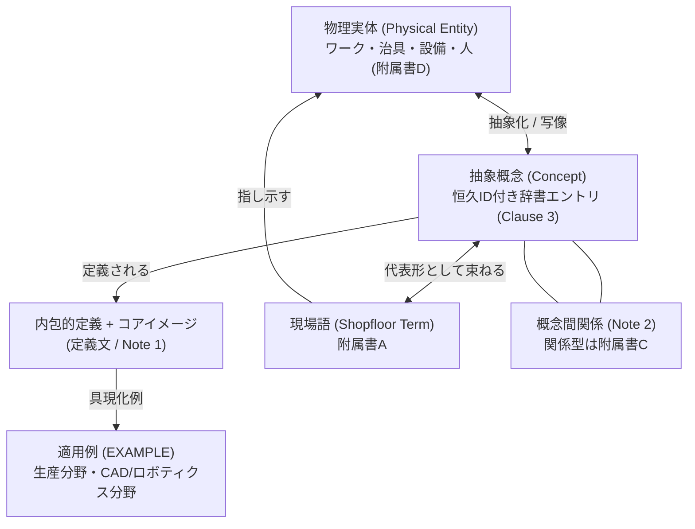
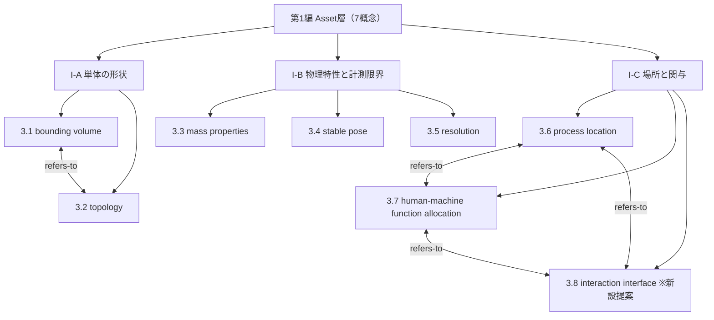

# TECHNICAL SPECIFICATION（試作版 / Pilot）

# 空間データを扱うモデリングの概念辞書 — 第1編: 物理資産 (Asset層)
Conceptual vocabulary for spatial-data modelling — Part 1: Physical assets (Asset layer)

**文書番号（仮）:** STD-EED-0001-1
**版:** 0.3.0-pilot（原辞書 v0.17.0 からの変換試作）
**変換日:** 2026-08-18
**変換範囲:** 原辞書 第I部（1.01〜1.07、概念7件・現場語12語）＋ 概念分離による新設1件（3.8）

---

## 前書き (Foreword)

本仕様書は、空間データを扱うモデリング（生産・ロボティクス・CAD・3Dソフトウェア全般）における概念語彙のセマンティック相互運用性を確保することを目的に策定された**自主技術仕様書**です。

用語エントリの構造および記述フォーマットは ISO 704:2009（用語作業の原則及び方法）および ISO/IEC Directives Part 2 の記載規約を参考に構成されていますが、本規格は非公的な独自仕様書であり、ISO/IEC 等の国際標準化機構による公式発行物ではありません。

本試作版に関する変換上の申し合わせ:

- 本文書は既存の概念辞書（v0.17.0、以下「原辞書」）の第I部（Asset層）のみを ISO 形式に変換した試作である。第2編以降（Integration層〜Business層、原辞書 第II部〜第V部）は同一フォーマットで順次変換する。
- 原辞書の**恒久ID（IRDI: `eed:XXXX#YYY` 形式）は一切変更していない**。外部参照は引き続き恒久IDで行うこと。採番（3.1〜3.7）は本仕様書内の表示位置であり、原辞書採番（1.01〜1.07）との対応は附属書Eに示す。
- **エントリ本文には IRDI のみを残し、その他のメタデータ（RAMI 4.0 軸・責務タグ・語彙区分・実例カバレッジ）は附属書Bの一覧表に集約**した（v0.2.0）。RAMI 4.0 の Layers 軸は編構成（第1編＝Asset層）と一対一のため欄そのものを廃止し、他の2軸（Hierarchy Levels / Life Cycle）と責務タグはデータとして保全する。空セル分析（原辞書4.5節）・P/C逆引き（原辞書8.3節）・OWL出力は附属書Bの表から再構築できる。
- 原辞書の「関連エントリ」欄は関係の存在のみを示し関係型を持たなかった（原辞書5章冒頭が既知の弱点として明記）。本変換では各関係に**関係型（附属書C）を新規に付与**した。関係型の付与は本変換における提案であり、原辞書の記載事実ではない。
- 原1.07 には**概念ドリフト**が確認された：定義文は関与の度合い・主体の配分（機能配分）を定義しているが、旧ID `term.involvement-interface` と旧和文名「関与インタフェース分類」が示す元来の意図は「関与を媒介する接点（パトライト・制御盤・置き治具等）」だった。本変換では両概念を分離し、`eed:0007` は定義文どおり機能配分概念として存続（3.7、和文名のみ「人・機械機能配分」へ是正）、接点概念は新項目コード `eed:0145` で新設した（3.8）。版上げでなく新規発番としたのは原辞書8.9節の規則（非互換な変更は新しい項目コードを振る）に従うため。詳細経緯は別紙 decisions ドラフト参照。
- 原辞書の独自コンテンツ（登場人物対応表・現場語体系・MECE検証・索引）は削除せず、informative な附属書として保全する。本試作には第I部スコープ分の附属書A（現場語）・附属書D（登場人物）を収録し、全編化時に MECE 検証・索引類を附属書F以降として追加する。

## 序文 (Introduction)

製造自動化の現場では、製品設計（CAD/PLM）、生産技術・ロボティクス、設備制御（PLC/OT）、製造実行管理（MES/IT）の4ドメインが同じモノについて語りながら、同じ言葉が違う意味を持ち（同音異義：「原点」「姿勢」「クリアランス」）、違う言葉が同じ対象を指す（異音同義：「データムフィーチャー」と「基準穴」「治具固定点」）事態が頻発しています。

本仕様書は、DIN SPEC 91345 (RAMI 4.0) の分類軸を各概念のメタデータ（附属書B）とし、ISO 704 の用語記述形式に従って概念を定義する辞書体系です。本編（第1編）は RAMI 4.0 の **Asset層** — 物理世界に実在するモノそのものと、物理法則に直接支配される性質・限界 — を扱います。デジタル表現（第2編以降）はすべて、本編の物理的実体を写像したものです。

概念は次の二層構造を持ちます。見出し概念（Clause 3）は現場でそのまま口にされることが少ない抽象語であり、現場で実際に使われる語は**現場語**（附属書A）の側にあります。知識が蓄積するのは現場語の側で、概念は現場語を束ねる代表形として働きます。



## 1 適用範囲 (Scope)

本仕様書は、空間データを扱うモデリングにおいてステークホルダー間の共通言語を確立するための概念語彙のうち、**物理資産（Asset層）に属する用語、定義、および概念間関係のセマンティクス**について規定します。

適用範囲は以下の通りです：

* 単体の形状（バウンディングボリューム、トポロジー構造）
* 物理特性と計測限界（質量特性、安定姿勢、分解能）
* 場所と関与（工程内場所、人・機械機能配分、関与インタフェース）
* 形式的概念と現場通称（Shopfloor Terms）の紐付け規約（附属書A）

特定のプログラミング言語、ファイル形式、通信規格、製品、リポジトリには依存しません。実装（JSON Schema、OPC UA 情報モデル等）へのマッピングは、本仕様書を下敷きにした別工程として扱います。

## 2 参照標準・参考文献 (References)

本仕様書の構築にあたり、以下の標準・規格の構成ルールおよび技術概念を参照・活用しています：

* ISO 704:2009, Terminology work — Principles and methods
* ISO 10303 (STEP), Industrial automation systems and integration — Product data representation and exchange（B-rep 境界表現）
* IEC 61360-1, Standard data element types with associated classification scheme
* IEC 62264 (ISA-95), Enterprise-control system integration（設備階層）
* IEC 63278, Asset Administration Shell for industrial applications
* DIN SPEC 91345:2016-04, Reference Architecture Model Industrie 4.0 (RAMI 4.0)
* ISO/IEC Guide 99 (VIM), International vocabulary of metrology（分解能）
* ROS REP-103, Standard Units of Measure and Coordinate Conventions

## 3 用語及び定義 (Terms and Definitions)

各エントリは、用語（英語主名称・和文名・admitted term）、恒久ID（IRDI）、定義文、適用例（EXAMPLE）、およびエントリ注記（Note 1: コアイメージ／Note 2: 概念間関係／Note 3以降: 用法上の注意）で構成されます。分類メタデータ（RAMI 4.0 軸・責務タグ・語彙区分・実例カバレッジ）は附属書Bの概念メタデータ一覧に集約しています。

### 3.1
**bounding volume**
バウンディングボリューム
admitted term: 外接包絡形状
IRDI: `eed:0001#001`

対象物を包含する最小限の単純な立体（直方体・球など）。搬送経路や干渉チェックの一次スクリーニングに使う簡略表現。

EXAMPLE 1 （生産）ワークの外形バウンディングボックス。搬送経路・パレット仕分けの一次スクリーニングに使用。

EXAMPLE 2 （CAD・ロボティクス）操作対象外のオブジェクトを障害物として扱う際の外接球近似。

Note 1 to entry: Core image：ワークをすっぽり包む透明な段ボール箱。

Note 2 to entry: Concept relations:
— refers-to 3.2 (topology)

Note 3 to entry: 実務でより頻繁に使われる「バウンディングボックス（bounding box）」は、形状を直方体に限定した特殊形（AABB：軸平行境界ボックス、OBB：有向境界ボックス）であり、球や凸包を含む本概念の部分集合にあたる。

### 3.2
**topology**
トポロジー構造
admitted term: 境界グラフ（boundary graph）
IRDI: `eed:0002#001`

頂点・辺・面から成る局所的な幾何構造。次元によって要素数が決まる。

EXAMPLE 1 （生産）データムフィーチャー（面・穴・エッジ）による基準の定義。

EXAMPLE 2 （CAD・ロボティクス）1次元（頂点2／辺1）、2次元（頂点4／辺4）、3次元（頂点8／辺12／面6）という境界グラフの実装。

Note 1 to entry: Core image：立体を頂点・辺・面という骨組みだけで表した針金細工。

Note 2 to entry: Concept relations:
— refers-to 3.1 (bounding volume)
— refers-to 第2編3.14 (datum reference feature) ※データムフィーチャーは本概念の要素（面・穴・エッジ）から選定されるため、全編化時に部分関係（part-of の逆方向）へ精密化する候補
— refers-to 第4編3.2 (dimension-raising operation) ※原4.01。第4編で名称を「掃引操作」から是正した（同編3.1 Note 3）

Note 3 to entry: トポロジーは「頂点・辺・面がどうつながっているか」という connectivity（接続関係）を表し、各頂点の座標値そのもの（形状・寸法、ジオメトリ）とは区別される。本概念はこのうち、頂点・辺・面数といった構造の数え上げに焦点を当てた側面を指す。

### 3.3
**mass properties**
質量特性
IRDI: `eed:0003#001`

対象の質量中心位置と質量、慣性テンソル。高速な移動・操作時の遠心力・慣性補償計算に必須。

EXAMPLE （生産）ワークの重心・慣性テンソル。CAD の理論値か実測値かの区別が必須であり、密度が不均一な鋳造品では両者の乖離が大きい。

Note 1 to entry: Core image：ワークを指一本でバランスさせられる、やじろべえの支点。

Note 2 to entry: Concept relations:
— refers-to 第3編3.2 (declared value)
— refers-to 第3編3.3 (derived value)
※理論値／実測値の由来区別は第3編の値由来概念で表現される

### 3.4
**stable pose**
安定姿勢
IRDI: `eed:0004#001`

対象が外力なしに静止できる姿勢。支持多角形と接地面の法線ベクトルで表す。

EXAMPLE （生産）搬送安定姿勢。複数の安定姿勢がある部品では供給確率を持たせ、ビジョン認識の事前分布に使う。

Note 1 to entry: Core image：机の上に置いたときに倒れずに静止する置き方。

Note 2 to entry: Concept relations:
— is-a 第2編3.5 (pose) ※安定姿勢は、静的安定条件で拘束された姿勢の下位概念
— refers-to 第3編3.11 (grasp specification and synthesis)

### 3.5
**resolution**
分解能
IRDI: `eed:0005#001`

センサ・エンコーダ・ビジョン系などの計測系が区別できる最小の変化量。対象の実際の精密さがどれほど高くても、計測系の分解能を超えた差異はデータ上で区別できない。

EXAMPLE （生産）ロボット関節エンコーダのパルス分解能、ビジョンカメラの画素分解能。姿勢（原2.05）推定誤差の理論的な下限を規定する。

Note 1 to entry: Core image：ものさしの最小目盛りより細かい違いは、そもそも読み取れないという、計測装置そのものの限界。

Note 2 to entry: Concept relations:
— refers-to 第2編3.5 (pose), 第2編3.15 (calibration reference), 第3編3.12 (symmetry rule), 第3編3.13 (v&v level), 第4編3.3 (measurement)
※逆方向では、姿勢推定・計測の各概念が constrained-by 3.5 (resolution) の関係に立つ

Note 3 to entry: 計測限界は計測装置という物理資産そのものの限界であるため、規約（第2編）ではなく本編（Asset層）に置く。

### 3.6
**process location**
工程内場所
admitted term: station
IRDI: `eed:0006#001`

生産ラインやワークフローの中で、特定の役割（work interface、原4.02）と、特定の人・機械の関与（3.7）を持つ、機能的に区切られた場所。

EXAMPLE （生産）搬入場所、搬出場所、加工場所、マテハン変換場所など。これらは「変化対象」「境界位置」「実行トリガ」という3本の独立した軸（原4.02）の組み合わせとして整理できる。

Note 1 to entry: Core image：工程図の中の、名前の付いた1つの箱。

Note 2 to entry: Concept relations:
— refers-to 3.7 (human-machine function allocation)
— refers-to 第4編3.4 (work interface), 第4編3.5 (nested IPO decomposition), 第3編3.10 (spatial element classification), 第3編3.14 (process state), 第3編3.15 (state expectation)

Note 3 to entry: 場所そのもの（物理資産）は本概念、その場所が果たす機能的役割は work interface（原4.02）、そこを通過する対象の状態は process state（原3.12）。関心事の層が異なるため編をまたぐ。

### 3.7
**human-machine function allocation**
人・機械機能配分
admitted term: 人・機械の2軸
IRDI: `eed:0007#001`

ある場所への関与のしかたを、人インタフェース（手動操作／監視／例外対応／無人）と機械インタフェース（ロボット／専用機／コンベア／搬送車／無し）という2軸の組み合わせで表す分類。1つの場所は両軸の値を同時に持つ。

EXAMPLE （生産）ロボットが把持し人が最終確認する組立場所など、両軸を組み合わせて定義する。

Note 1 to entry: Core image：その場所で人は「触れる」のか「見ているだけ」なのか。機械は「ロボット」か「コンベア」か「無し」か。

Note 2 to entry: Concept relations:
— refers-to 3.6 (process location)
— refers-to 3.8 (interaction interface) ※機能配分は接点を通じて行使される（「監視」はパトライトを介し、「手動操作」は制御盤を介する）
— refers-to 第4編3.4 (work interface) ※3軸ファセット分類である同エントリと同型の構造であり、対比によって識別すべき2概念ではない。原辞書 参考表4-1 の「典型的な人インタフェース／機械インタフェース」2列は本概念の値を用いており、第4編附属書Fで列名を「典型的な機能配分」へ是正済み（原辞書側は未反映。`backlog.md` F-11）

Note 3 to entry: 原辞書 v0.17.0 では本エントリ（原1.07）の和文名が「関与インタフェース分類」だったが、定義文が表すのは関与の度合い・主体の配分であり、旧和文名が指す「接点」概念（3.8）とは別概念であることが本変換で判明した。定義文はそのまま存続させ、和文名のみ「人・機械機能配分」へ是正した（**提案値**。名称変更は恒久IDの版を上げない — 原辞書8.9節）。

Note 4 to entry: 本概念に対応する現場語は未抽出（附属書A参照）。

### 3.8
**interaction interface**
関与インタフェース
admitted term: 関与インタフェース分類（原1.07の旧和文名）
IRDI: `eed:0145#001`（本変換で新設提案）

工程内場所とその関与者（人・機械）との間で関与を媒介する、物理的・情報的な接点。接点は方向により3種に分かれる：**提示**（場所→関与者：状態を見せる）、**操作**（関与者→場所：指示を受け付ける）、**受け渡し**（ワークの授受）。

EXAMPLE （生産）人向け接点：パトライト・表示灯（提示）、制御盤・HMI（操作）。機械向け接点：置き治具（受け渡し）。受け渡し接点における置き方の条件——整列位置決めか、向き不問（Don't care）か——は状態期待値（原3.13）が規定する。

Note 1 to entry: Core image：場所の「受付窓口」。ランプは見せる窓、盤は聞く窓、治具は手渡しの窓。

Note 2 to entry: Concept relations:
— refers-to 3.6 (process location) ※接点は場所に設置される
— refers-to 3.7 (human-machine function allocation) ※どの接点が要るかは機能配分に依存する（無人なら制御盤は不要になりうる）
— refers-to 第3編3.15 (state expectation) ※受け渡し接点の受け入れ条件を規定
— refers-to 第2編3.14 (datum reference feature) ※受け渡し接点の幾何的位置決めを担う

Note 3 to entry: 本概念は原1.07の元来の意図（旧ID `term.involvement-interface`）を独立エントリとして再建したもの。原1.07の定義文は機能配分概念（3.7）を定義していたため、恒久IDは版上げではなく新項目コード `eed:0145` で発番した（原辞書8.9節「非互換な変更は新しい項目コードを振る」。項目コード0145は原辞書の割り当て 0001〜0144 の直後）。**新設・発番とも提案値**であり、確定時は原辞書と decisions.md に反映のこと。

Note 4 to entry: 本概念に対応する現場語は未抽出。ただし「パトライト」「操作盤」「置き治具」等は現場語候補として有力（主語＝工程内場所またはHMI・操作盤。存在確認のうえ発番すること）。

## 4 概念体系 (Concept System)

本編の8概念（うち3.8は本変換での新設提案）は、主題により3つのサブグループに区分されます（区分基準＝主題。原辞書4.4節で MECE 成立を検証済み。3.8追加後の再検証は確定時に実施）。



---

## 附属書A (informative) 現場語・通称対応表 (Shopfloor & Colloquial Terms Mapping)

本編で定義された概念（Clause 3）と、現場で実際に使われる通称・俗称（Shopfloor Terms）との対比表です。各現場語は**ちょうど1つの代表形（概念）**と**ちょうど1つの主語（登場人物、附属書D）**を持ちます。現場語の恒久IDは概念とは独立に発番されています。

| 現場語ID | 代表形（概念） | 現場語 (JP) | 主語（登場人物） | 現場での使用場面例 | 同義・異表記 |
|---|---|---|---|---|---|
| `eed:0060#001` | 3.1 bounding volume | 外形バウンディングボックス | ワーク（被加工物・部品・製品） | 搬送経路とパレット仕分けの一次スクリーニング | BBox／外形ボックス／AABB |
| `eed:0061#001` | 3.1 bounding volume | 外接球近似 | ワーク（被加工物・部品・製品） | CAD・対象外オブジェクトを障害物として扱うとき | バウンディングスフィア |
| `eed:0062#001` | 3.2 topology | 境界グラフ | ワーク（被加工物・部品・製品） | CAD・頂点／辺／面の接続関係の実装 | B-rep の接続情報 |
| `eed:0063#001` | 3.3 mass properties | 重心 | ワーク（被加工物・部品・製品） | 生産・高速動作時の慣性補償 | 質量中心／CoG |
| `eed:0064#001` | 3.3 mass properties | 慣性テンソル | ワーク（被加工物・部品・製品） | 生産・ロボット動作計画への入力 | イナーシャ |
| `eed:0065#001` | 3.4 stable pose | 搬送安定姿勢 | ワーク（被加工物・部品・製品） | 生産・供給時にワークが倒れない置き方 | 置き姿勢／安定置き |
| `eed:0066#001` | 3.5 resolution | エンコーダ分解能 | 産業用ロボット（多関節マニピュレータ） | ロボット関節の角度検出限界 | パルス分解能 |
| `eed:0067#001` | 3.5 resolution | 画素分解能 | ビジョンカメラ・3Dスキャナ | ビジョン系の空間検出限界 | ピクセル分解能／画素サイズ |
| `eed:0068#001` | 3.6 process location | 搬入場所 | 工程内場所（ステーション・セル） | 生産ライン・系外からワークが入る場所 | 受入／入荷ステーション |
| `eed:0069#001` | 3.6 process location | 搬出場所 | 工程内場所（ステーション・セル） | 生産ライン・系外へワークが出る場所 | 出荷ステーション |
| `eed:0070#001` | 3.6 process location | 加工場所 | 工程内場所（ステーション・セル） | 生産ライン・ワークの形が変わる場所 | 加工ステーション |
| `eed:0071#001` | 3.6 process location | マテハン変換場所 | 工程内場所（ステーション・セル） | 生産ライン・ばら積みから整列へ変換する場所 | 整列ステーション／ばらし工程 |

NOTE 3.7 (human-machine function allocation) および 3.8 (interaction interface) に対応する現場語は未抽出（原辞書の記載を保存。存在しない現場語を創作しない）。3.8 の現場語候補（パトライト・操作盤・置き治具等）は 3.8 の Note 4 参照。

## 附属書B (informative) 概念メタデータ一覧 (Concept Metadata Registry)

Clause 3 の各エントリに付随する分類メタデータの一覧です。エントリ本文から分離することで用語記述を ISO 704 の形式に純化しつつ、機械集計・逆引き・OWL出力に必要なデータを保全します（IEC 61360 のデータ辞書方式に倣い、属性は本文でなく登録簿側で管理する）。

- **Hier. Level / Life Cycle**: RAMI 4.0 の Hierarchy Levels 軸・Life Cycle 軸。**Layers 軸の欄は設けない**（編構成と一対一に対応するため。本編収録の全概念は `Asset`）。
- **Provider / Consumer**: 責務タグ。Provider＝定義・決定者、Consumer＝参照・利用者。ロール名は ProductDesign＝製品設計、MfgRobotics＝生技ロボティクス、StationControl＝設備制御、ShopfloorIT＝情報MES。
- **語彙区分**: 標準（外部規格に定義あり）／業界一般／独自（本アーキテクチャの造語。外部共有時に説明が必要）。
- **カバレッジ**: 実例を確認済みの分野（生産 / CAD・ロボティクス）。`—` は未確認（実例を創作しない）。

| 採番 | 用語 | IRDI | 旧ID | Hier. Level | Life Cycle | Provider | Consumer | 語彙区分 | カバレッジ |
|---|---|---|---|---|---|---|---|---|---|
| 3.1 | bounding volume | `eed:0001#001` | `term.bounding-volume` | Product | Type | ProductDesign | MfgRobotics, StationControl | 業界一般 | 生産 ◯ / CAD ◯ |
| 3.2 | topology | `eed:0002#001` | `term.topology` | Product | Type | ProductDesign | MfgRobotics | 標準（ISO 10303 B-rep） | 生産 ◯ / CAD ◯ |
| 3.3 | mass properties | `eed:0003#001` | `term.mass-properties` | Product | Type & Instance | ProductDesign | MfgRobotics, StationControl | 標準（IEC 61360、OPC UA for Robotics） | 生産 ◯ / CAD — |
| 3.4 | stable pose | `eed:0004#001` | `term.stable-pose` | Product | Type | MfgRobotics | StationControl | 業界一般（ばら積みピッキング） | 生産 ◯ / CAD — |
| 3.5 | resolution | `eed:0005#001` | `term.resolution` | Control Device | Type | StationControl | MfgRobotics, ShopfloorIT | 標準（VIM） | 生産 ◯ / CAD — |
| 3.6 | process location | `eed:0006#001` | `term.process-location` | Station | Type & Instance | StationControl | MfgRobotics, ShopfloorIT | 独自（ISA-95 Station 対応、呼称は本アーキテクチャ） | 生産 ◯ / CAD — |
| 3.7 | human-machine function allocation | `eed:0007#001` | `term.involvement-interface` | Station | Type & Instance | StationControl | MfgRobotics, ShopfloorIT | 業界一般（Frohm らの LoA、Fitts list の系譜） | 生産 ◯ / CAD — |
| 3.8 | interaction interface | `eed:0145#001`（新設提案） | —（新設） | Station | Type & Instance | StationControl | MfgRobotics, ShopfloorIT | 独自 | 生産 ◯ / CAD — |

NOTE 1 全編化時、本表は軸2×軸3の空セル分析（原辞書4.5節）およびドメインロール別P/C逆引き（原辞書8.3節）の集計元となる。

NOTE 2 本表の各行は附属書Cの OWL 記述例における個体・クラス注釈（`rami:hierarchyLevel`、`rami:lifeCycleStage`、責務プロパティ）と一対一に対応する。

## 附属書C (informative) 関係型セマンティクス (Relational Semantics)

### C.1 概念間関係型

本仕様書の Note 2（Concept relations）で用いる関係型です。原辞書の「関連エントリ」欄には関係型がなかったため、本変換で以下の型を新規に付与しました。ISO 704 の3大別（類種関係・部分関係・連想関係）との対応を併記します。

| 関係型 | 意味 | ISO 704 分類 |
|---|---|---|
| is-a | 上位概念・下位概念関係（Taxonomic Specialization） | 類種関係 (generic) |
| part-of | 全体・部分構成関係（Aggregation / Composition） | 部分関係 (partitive) |
| refers-to | 参照・パラメータ関連付け（Semantic Reference） | 連想関係 (associative) |
| constrained-by | 幾何条件・境界拘束（Constraint Enforcement） | 連想関係 (associative) |

NOTE 1 原辞書の見本（STD-GEO-24159）はこのほか transforms、calibrated-from、aligns-with、mates-to の4型を定義するが、これらは座標変換・校正・作業一致・嵌合を表す型であり、Asset層（本編）には出現しない。第2編（Integration層）以降の変換で導入する。（2026-09-02追補：`transforms` は第2編・第4編で確定使用、`calibrated-from`・`aligns-with` は第2編で候補提示のまま全編化時のレビュー待ち、`mates-to` は全6編を通じて確定使用ゼロのため**廃止した** — 第M編附属書C.1 NOTE 3、`decisions.md` D-2026-09-02-05。）

NOTE 2 本編で関係型を確定できたのは is-a 1件（3.4 → pose）のみで、他は保守的に refers-to とした。付与判断が原辞書の記載を超える箇所（3.2 の部分関係候補、3.5 の constrained-by 逆方向）は、各エントリの Note 2 内に「候補」「逆方向」として明示し、確定は全編化時のレビューに委ねる。

### C.2 OWL / RDF ナレッジグラフ記述例 (Turtle形式)

```turtle
@prefix eed:   <http://example.org/eed/vocab/> .
@prefix rami:  <http://www.plattform-i40.de/rami/ontology#> .
@prefix owl:   <http://www.w3.org/2002/07/owl#> .
@prefix rdfs:  <http://www.w3.org/2000/01/rdf-schema#> .
@prefix xsd:   <http://www.w3.org/2001/XMLSchema#> .
@prefix skos:  <http://www.w3.org/2004/02/skos/core#> .

eed:BoundingVolume a owl:Class ;
    rdfs:label "bounding volume"@en , "バウンディングボリューム"@ja ;
    eed:irdi "eed:0001#001"^^xsd:string ;
    rami:layer rami:AssetLayer ;                # 編構成から導出（附属書B NOTE 2）
    rami:hierarchyLevel rami:ProductLevel ;
    rami:lifeCycleStage rami:TypeStage ;
    eed:refersTo eed:Topology .

eed:StablePose a owl:Class ;
    rdfs:label "stable pose"@en , "安定姿勢"@ja ;
    eed:irdi "eed:0004#001"^^xsd:string ;
    rdfs:subClassOf eed:Pose ;    # is-a（第2編で eed:Pose 定義後に有効化）
    rami:layer rami:AssetLayer .

# 現場語は SKOS の altLabel ではなく独立ノードとする
# （主語・使用場面という固有属性を持つため）
eed:sft0066 a eed:ShopfloorTerm ;
    rdfs:label "エンコーダ分解能"@ja ;
    eed:irdi "eed:0066#001"^^xsd:string ;
    eed:canonicalForm eed:Resolution ;
    eed:subjectActor eed:IndustrialRobot ;
    skos:altLabel "パルス分解能"@ja .
```

## 附属書D (informative) 登場人物対応表 — 本編の概念で語られる実在物

原辞書1.2節の趣旨を保全する附属書です。登場人物（工場に物理的に実在するモノ・人）は概念とはメタレベルが異なるため Clause 3 には収めず、informative な附属書として維持します。以下は本編（Asset層）の7概念に接続する登場人物の抜粋です。

| 登場人物 | 一言でいうと | 本編ではどう語られるか |
|---|---|---|
| ワーク（被加工物・部品・製品） | 工場の主役。加工され、運ばれ、組み立てられる当のもの | 形は 3.1・3.2、重さと重心は 3.3、どう置けるかは 3.4 |
| センサ（近接・光電・力覚・エンコーダ） | 「ある／ない」「どこまで動いた」を検出する | 検出できる最小変化量は 3.5 |
| ビジョンカメラ・3Dスキャナ | ワークの位置・向きを見つける目 | 読み取れる細かさの限界は 3.5 |
| 工程内場所（ステーション・セル） | 役割を持って区切られた、名前のついた作業場所 | 場所そのものは 3.6 |
| 作業者・オペレータ・保全担当 | 手を動かす人、見ている人、異常時に呼ばれる人 | 関与の度合いは 3.7（手動操作／監視／例外対応／無人） |
| 産業用ロボット・コンベア・搬送車 | ワークを動かす機械 | 機械インタフェースの値として 3.7 |

NOTE 登場人物の完全な一覧（19件）と双方向網羅性の検証（すべての登場人物が最低1概念に、すべての概念が最低1登場人物に接続）は、全編化時に本附属書へ統合する。

## 附属書E (informative) 変換対応表 (Conversion Mapping)

### E.1 採番対応

| 本仕様書 | 原辞書採番 | 恒久ID (IRDI) | English Name |
|---|---|---|---|
| 3.1 | 1.01 | `eed:0001#001` | bounding volume |
| 3.2 | 1.02 | `eed:0002#001` | topology |
| 3.3 | 1.03 | `eed:0003#001` | mass properties |
| 3.4 | 1.04 | `eed:0004#001` | stable pose |
| 3.5 | 1.05 | `eed:0005#001` | resolution |
| 3.6 | 1.06 | `eed:0006#001` | process location |
| 3.7 | 1.07 | `eed:0007#001` | human-machine function allocation |
| 3.8 | —（原1.07から概念分離により新設） | `eed:0145#001`（提案） | interaction interface |

NOTE（2026-09-02追補） 本編の Note 2（Concept relations）が編をまたいで参照する箇所は、**参照先の編の採番と編番号を必ず含む**（例：`第4編3.4 (work interface)`。原採番を併記している箇所もある — 例：`第1編3.4 (stable pose)`）。第4編のみ原辞書の採番と本仕様書の採番が一致しないため（原 `4.02` → 第4編 `3.3` 等）、原採番との対応は第4編附属書E.1 を参照すること。他の編は原採番と1対1で対応する（第1編は `1.0N` → `3.N`）。

### E.2 欄の写像規則（全編展開時にこの規則で機械的に変換する）

| 原辞書の欄 | ISO形式での行き先 |
|---|---|
| 見出し（English Name） | エントリの主見出し（preferred term、英語小文字） |
| 和文名 | 見出し直下の副見出し（英語名との不一致は改称提案＋旧称の admitted term 降格で解消し、Note に経緯を記す） |
| 別称 | admitted term |
| 恒久ID | エントリ頭の IRDI 行＋附属書B |
| 定義 | 定義文（エントリ本文、無番） |
| 具体例（生産／CAD） | EXAMPLE 1 / EXAMPLE 2（片方未確認なら EXAMPLE 1件のみ） |
| コアイメージ | Note 1 to entry: Core image |
| 関連エントリ | Note 2 to entry: Concept relations（関係型を新規付与、附属書C） |
| 用法上の注意 | Note 3 to entry 以降 |
| RAMI 4.0（3軸） | Layers＝編構成に吸収（欄廃止）。Hierarchy Levels / Life Cycle＝附属書B |
| 責務タグ（P/C） | 附属書B（英語ロール名で表記） |
| 語彙区分 | 附属書B |
| 実例カバレッジ | 附属書B |
| 旧恒久ID | 附属書B |
| 現場語（枝番表） | 附属書A（現場語IDで一元管理） |
| 読み | **不採録**（ISO形式に対応欄なし。索引を全編化時に附属書として復元する際に使用） |

### E.3 原辞書の章とISO構成の対応（全編化時の構成案）

| 原辞書 | ISO形式での行き先 |
|---|---|
| 0章 ドメイン視点 | 附属書B 冒頭のロール定義 |
| 1.1 適用範囲 | Clause 1 Scope |
| 1.2〜1.4 登場人物・型・物語 | 附属書D (informative) |
| 2章 言葉のズレの実例 | 序文 (Introduction) に要約、全文は附属書 (informative) |
| 3章 基礎規約 | 第2編（Integration層）の Clause 4 として規定 |
| 4章 分類軸・MECE検証・空セル一覧 | 附属書F (informative)（全編化時。集計元は附属書B） |
| 5章 用語及び定義 | 各編の Clause 3 |
| 6章 メタ語彙・手順 | 別編（メタ語彙編）または附属書（全編化時に要判断） |
| 7章 外部規格リファレンス | Clause 2 References |
| 8章 索引 | 附属書G (informative)（全編化時） |
