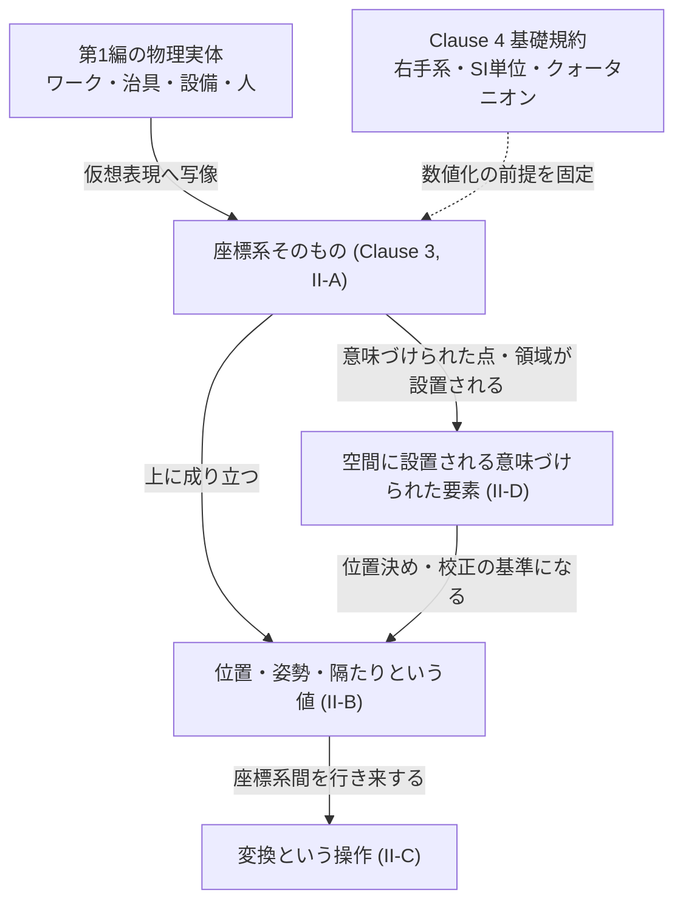
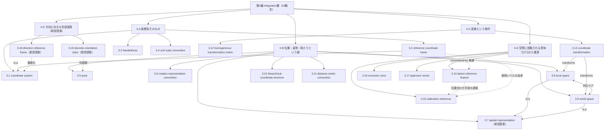

# TECHNICAL SPECIFICATION（試作版 / Pilot）

# 空間データを扱うモデリングの概念辞書 — 第2編: 空間統合 (Integration層)
Conceptual vocabulary for spatial-data modelling — Part 2: Spatial integration (Integration layer)

**文書番号（仮）:** STD-EED-0001-2
**版:** 0.1.0-pilot（原辞書 v0.17.0 からの変換試作）
**変換日:** 2026-08-21（最終更新 2026-09-05）
**変換範囲:** 原辞書 第II部（2.01〜2.16、概念16件・現場語24語）＋ 新設提案3件（3.7・3.18・3.19）＋ 同音異義の現場語登録（附属書A）

---

## 前書き (Foreword)

本仕様書は、第1編（物理資産／Asset層、STD-EED-0001-1）に続く、空間データを扱うモデリングにおける概念語彙の自主技術仕様書である。用語エントリの構造・記述フォーマット・変換方針は第1編と同一であり、詳細は第1編前書きを参照。以下は本編（第2編）固有の申し合わせである。

- 原辞書の**恒久ID（IRDI）は一切変更していない**。第II部の概念採番（原 `2.01`〜`2.16`）は本仕様書の `3.1`〜`3.6`・`3.8`〜`3.17` に**欠番なく対応**する（附属書E.1）。`3.7` と `3.18`〜`3.19` は本仕様書での新設提案であり、原辞書に対応する採番はない。第1編で発生した概念分離（原1.07 → 3.7／3.8）は本編には生じていない。
- 第1編の申し合わせどおり、**エントリ本文には IRDI のみを残し、その他のメタデータは附属書Bに集約**する。
- **概念間関係には第1編で定義した4型（is-a／part-of／refers-to／constrained-by）に加え、本編で新たに `transforms` 型を導入する**（附属書C.1）。第1編附属書C.1 NOTE 1 で予告した4型のうち、`transforms` は 3.13（座標変換）が 3.8（ローカル空間）の値を 3.9（ワールド空間）の値へ変換するという操作関係を表すために確定使用した。`calibrated-from`・`aligns-with`・`mates-to` は本編でも根拠となりうる候補箇所が見つかったが、確信度が is-a／transforms ほど高くないため、各該当エントリの Note に**候補**として明記するにとどめ、正式な型としては採用しなかった（`decisions.md` D-2026-08-21-03）。**2026-09-03 追補：全編化時のレビュー（全編附属書C.3）により、3型はいずれも概念間関係型として採用しないことが確定した。** `calibrated-from` の候補2件は概念のすべての個体について成立する結びつきではなく（個体レベルの由来）、`aligns-with` の候補1件は作業手順の連鎖であって概念間の関係ではない。該当箇所は `refers-to` のまま据え置き、Note の注記を書き改めた（`decisions.md` D-2026-09-03-02、`backlog.md` B-08 クローズ）。
- **対比ペア「ローカル空間／ワールド空間」の上位概念として `3.7`（空間表現、`eed:0146#001`）を新設した**（**新設提案**）。子概念だけが並んでいると、読み手はそれが何の一種なのかを掴めないまま定義文に入ることになる、という理由による（`decisions.md` D-2026-09-02-12、`backlog.md` P-05）。これにともない `3.7` 以降の採番が1つずつ繰り下がった（附属書E.1。恒久IDは不変）。
- **2026-09-05 追補：方向の言語表現を受ける2概念を新設し、サブグループ II-E を末尾に追加した。** `3.18`（方向参照枠、`eed:0152#001`）と `3.19`（離散姿勢区分、`eed:0153#001`）である（いずれも**新設提案**）。本辞書の動機は「右と言っても誰から見て右か」という視点依存の解消にあるが、数値化された空間（参照座標系・ローカル／ワールド・ハンドネス）についての語彙はあっても、現場で口にされる方向語（右・左・手前・奥・上流・下流・表・裏）を受ける概念が1件もなかった（`review/2026-09-05-design-review.md` §1.1〜1.3、`decisions.md` D-2026-09-05-02・-03）。末尾に置いたのは既存の採番を動かさないためであり、II-A〜II-D の採番は変わらない。
- **2026-09-05 追補：Clause 4 の「空間座標系」1行を、ワールド座標系・装置ボディ座標系・光学座標系の3行に分けた（提案値）。** 原辞書3章の「+X 前方、Y 左、Z 上」はROS REP-103 の**ボディフレーム**の規約であり、ワールド空間（3.9）には「前方」がない。「前方」が誰の前方かを規約が書いていなかったことは、動機が挙げる問題そのものが基礎規約の中で未解決だったことを意味する（`decisions.md` D-2026-09-05-01、`backlog.md` F-22）。
- **2026-09-05 追補：附属書Aの現場語の一意性を「語」単位から「（語, 主語）の組」単位へ改めた。** 従来の規則では、原辞書2.1節が同音異義の筆頭に挙げる「原点」「姿勢」「クリアランス」は代表形が複数あるため現場語として登録できず、2.1節の表は辞書本体と接続されていなかった。改定により同じ語を主語違いで複数登録でき、2.1節の3語と「インタフェース」（D-2026-08-22-14）を本編・第1編・第3編・第4編の附属書Aに登録した（`decisions.md` D-2026-09-05-04）。
- **写像作業（定義文の逐語読み直し）による検証の結果、原辞書由来の16概念に、原1.07（`eed:0007`、第1編3.7）のような概念ドリフト（定義文と命名意図の乖離）は確認されなかった（0/16）。** 英語主名称・旧恒久ID（`term.*` スラグ）・定義文の三者は全エントリで整合していた。
- **原辞書の記述に、部立て説明文（4.2節相当）の件数・範囲の誤記を1件発見した。** 原辞書該当箇所（前文592行目付近）は「II-B 位置・姿勢という値（2.05〜2.09、4件）」「II-D 空間に設置される意味づけられた要素（2.13〜2.16、3件）」と記すが、実際の本文見出し・エントリ配置は II-B が `2.05`〜`2.10`（6件、見出し自体は「位置・姿勢・**隔たり**という値」と正しく `2.10` を含意している）、II-D が `2.13`〜`2.16`（4件）である。本仕様書 Clause 5 では実体に合わせて是正した表記を採用する（`decisions.md` D-2026-08-21-01）。
- 原辞書 3章「基礎規約」は、第1編附属書E.3が定めた変換計画（「3章 基礎規約 → 第2編（Integration層）の Clause 4 として規定」）に従い、本編 **Clause 4** として収録する。第1編には基礎規約に相当するClauseがなかったため、本編で初めて登場する（`decisions.md` D-2026-08-21-02）。この配置替えに伴い、第1編で Clause 4 だった「概念体系」は本編では **Clause 5** に繰り下がる。
- 原辞書の独自コンテンツ（登場人物対応表の該当抜粋）は、第1編と同様に informative な附属書Dとして保全する。

## 序文 (Introduction)

第II部が扱うのは、物理世界（第1編／Asset層）を計算可能な仮想表現へ橋渡しする関心事である。物理資産そのものではなく、その位置・向き・隔たりを、数値として一意に読み書きできるようにする仕組みを定義する。



## 1 適用範囲 (Scope)

本仕様書は、空間データを扱うモデリングにおいてステークホルダー間の共通言語を確立するための概念語彙のうち、**物理世界を計算可能な仮想表現へ橋渡しする関心事（Integration層）に属する用語、定義、および概念間関係のセマンティクス**について規定します。

適用範囲は以下の通りです：

* 座標系そのものの定義・基準・手性・尺度（II-A）
* 位置・姿勢・隔たりという値とその表現規約（II-B）
* 座標系間の変換という操作（II-C）
* 空間に設置される意味づけられた要素（基準フィーチャー・キャリブレーション基準・干渉禁止領域・アプローチ方向）（II-D）

特定のプログラミング言語、ファイル形式、通信規格、製品、リポジトリには依存しません。実装（TFツリー実装、URDF、OPC UA情報モデル等）へのマッピングは、本仕様書を下敷きにした別工程として扱います。

## 2 参照標準・参考文献 (References)

第1編と同一の参照群に加え、本編では以下を主に参照・活用しています：

* ISO 704:2009, Terminology work — Principles and methods
* ROS REP-103, Standard Units of Measure and Coordinate Conventions
* ISO 10303 (STEP AP242), Industrial automation systems and integration — Product data representation and exchange
* ISO 5459 / ISO 10303-242, Geometrical product specifications (GD&T / PMI) — Datums
* ISO 9787, Robots and robotic devices — Coordinate systems and motion nomenclatures
* OPC UA for Robotics（ロボットの姿勢表現・負荷特性の標準データモデル）
* DIN SPEC 91345:2016-04, Reference Architecture Model Industrie 4.0 (RAMI 4.0)

## 3 用語及び定義 (Terms and Definitions)

各エントリは、用語（英語主名称・和文名・admitted term）、恒久ID（IRDI）、定義文、適用例（EXAMPLE）、およびエントリ注記（Note 1: コアイメージ／Note 2: 概念間関係／Note 3以降: 用法上の注意）で構成されます。分類メタデータは附属書Bに集約しています。

**サブグループ（区分基準＝主題。原辞書の件数誤記を是正、`decisions.md` D-2026-08-21-01）:** II-A 座標系そのもの（3.1〜3.4、4件）／ II-B 位置・姿勢・隔たりという値（3.5〜3.11、7件。うち3.7は本仕様書での新設提案）／ II-C 変換という操作（3.12〜3.13、2件）／ II-D 空間に設置される意味づけられた要素（3.14〜3.17、4件）／ II-E 方向と向きの言語表現（3.18〜3.19、2件。いずれも本仕様書での新設提案。2026-09-05追加）。

**II-A. 座標系そのもの**

### 3.1
**coordinate system**
座標系
IRDI: `eed:0008#001`

空間上の点の位置・向きを、1つの原点と、互いに直交する軸（本仕様書ではClause 4に従い右手系のX, Y, Z軸）に対する数値の組として表現するための、最も基本的な枠組み。本編の他のエントリ（3.2、3.8、3.9等）は、いずれもこの枠組みが具体的にどこに設置され、他の座標系とどう関係するかを規定する下位概念である。

EXAMPLE 1 （生産・CAD共通）Clause 4 に定めるROS REP-103準拠の右手直交座標系。あらゆる位置・姿勢データは、最終的にこの座標系上の数値の組として表現される。

EXAMPLE 2 （生産・ロボティクス）Clause 4 は座標系を3種に分けて規定する——架台・床に固定されるワールド座標系（Z上・+X＝ラインの流れ方向）、装置ごとに「前方」を持つボディ座標系（+X前方・Y左・Z上）、カメラの光軸を Z とする光学座標系。同じ「X」でも、どの種の座標系かによって指す向きが違う。

Note 1 to entry: Core image：空間内のあらゆる位置を、原点からの数値の組（X, Y, Z）として一意に読み取れるようにする、物差しと目盛りの枠組みそのもの。

Note 2 to entry: Concept relations:
— refers-to 3.3 (handedness)
— refers-to 3.8 (local space), 3.9 (world space)
— refers-to 3.10 (hierarchical coordinate structure)
— refers-to 3.11 (distance metric convention)

### 3.2
**reference coordinate frame**
参照座標系
IRDI: `eed:0009#001`

座標系（3.1）のうち、ある親座標系（またはワールド座標系）からの相対的な位置と向きによって定義される、局所的な基準座標系。

EXAMPLE 1 （生産）製品基準座標系（MCS）。データムフィーチャーの交点として定義され、すべての把持点・配置基準点がこの座標系からの相対値として表現される。

EXAMPLE 2 （CAD）親を持ち木構造を成す座標フレーム。並進と回転を持つ。

Note 1 to entry: Core image：空間のどこかに立てられた、それ自身の見取り図の原点を持つ旗。

Note 2 to entry: Concept relations:
— is-a 3.1 (coordinate system)
— refers-to 3.3 (handedness), 3.4 (unit scale convention), 3.5 (pose), 3.8 (local space), 3.9 (world space), 3.12 (homogeneous transformation matrix), 3.13 (coordinate transformation)
— refers-to 3.10 (hierarchical coordinate structure) ※階層座標構造を構成する各ノードは参照座標系である。**part-of（3.2 が 3.10 の部分）への精密化は行わない**——単独で立つ参照座標系は階層に属さないため、すべての個体については成立しない（全編附属書C.5）
— refers-to 3.14 (datum reference feature) ※constrained-by（拘束）の候補。3-2-1データム拘束によって参照座標系（例：製品基準座標系）が確立される関係にあたる
— refers-to 3.15 (calibration reference) ※2つの参照座標系間の未知変換がキャリブレーション基準によって解かれる関係にあたる。**この由来は個体レベルのものであり、概念間関係型（`calibrated-from`）としては採用しない**——CAD上でデータムから立てた参照座標系にはこの由来がないため、すべての個体について成立しない（全編附属書C.3）

### 3.3
**handedness**
座標系のハンドネス
admitted term: right-handed / left-handed
IRDI: `eed:0010#001`

座標系の3軸（X, Y, Z）の向きの組み合わせが、右手系（$X \times Y = Z$）と左手系（$X \times Y = -Z$）のどちらの規約に従うかという区別。軸のラベル（前方・左・上等）が一致していても、ハンドネスが異なれば回転の正負や外積の結果が反転する。

EXAMPLE 1 （生産）ROS REP-103に基づく右手系を全社的な規約として採用（Clause 4）。

EXAMPLE 2 （CAD）一部のCADソフトウェアやゲームエンジンはY-up左手系をデフォルトとするため、外部データ取り込み時にハンドネス変換（Z軸反転等）が必要になる。

Note 1 to entry: Core image：右手でも左手でも「X軸→Y軸→Z軸」という並びの名前は同じに見えるが、実際に指を折ってみると、Z軸が上を向くか下を向くかが逆になる。

Note 2 to entry: Concept relations:
— refers-to 3.1 (coordinate system), 3.2 (reference coordinate frame)
— refers-to 3.8 (local space), 3.9 (world space)
— refers-to 3.6 (rotation representation convention)

### 3.4
**unit scale convention**
尺度定義
admitted term: scale factor（スケールファクタ）
IRDI: `eed:0011#001`

モデル内部で扱う数値が、どの物理単位（またはどの縮尺）を1として表現されているかを明示し、実データがその規約通りの尺度で保存・送受信されているかを保証する考え方。

EXAMPLE 1 （生産）異なるCADシステム間でファイルを受け渡す際、内部単位がmmかcmかを確認せずインポートし、ワークが1000倍の大きさで配置されてしまう不具合とその防止策。

EXAMPLE 2 （CAD）シーンファイルの単位設定（メートル法／インペリアル）を読み込み時に検証し、規約と異なる場合は自動変換または警告を発する仕組み。

Note 1 to entry: Core image：図面に書かれた「10」という数値が、mm単位なのかcm単位なのか、それとも単位のない相対値なのかによって、実際の大きさが最大1000倍も変わってしまう取り違えの罠。

Note 2 to entry: Concept relations:
— refers-to 3.2 (reference coordinate frame)
— refers-to 3.12 (homogeneous transformation matrix)

Note 3 to entry: 単位系そのものの規定はClause 4が担う。本エントリは、個々のCADファイル・センサデータ・通信メッセージが実際にその規約を守れているかを検証・変換する運用側の責務を指す。

**II-B. 位置・姿勢・隔たりという値**

### 3.5
**pose**
姿勢
IRDI: `eed:0012#001`

位置（並進）と向き（回転）を組み合わせた空間的状態。

EXAMPLE 1 （生産）把持目標姿勢、搬送安定姿勢。

EXAMPLE 2 （CAD）立体の主要状態（原点位置と向き）。

Note 1 to entry: Core image：「どこにいて、どちらを向いているか」を一組で表す1枚のスナップショット。

Note 2 to entry: Concept relations:
— refers-to 第1編3.4 (stable pose), 第1編3.5 (resolution)
— refers-to 3.2 (reference coordinate frame), 3.6 (rotation representation convention), 3.11 (distance metric convention), 3.12 (homogeneous transformation matrix), 3.17 (approach vector)
— refers-to 第3編3.11 (grasp specification and synthesis), 第3編3.12 (symmetry rule)
— refers-to 3.19 (discrete orientation class) ※本概念の向きの成分を、対称性による同値類ごとに区切って現場の呼称を与えた分類（2026-09-05追加）

Note 3 to entry: 姿勢の値は参照座標系（3.2）を伴って初めて一意になる（3.7 空間表現）。原辞書の定義文には参照座標系が現れないが、参照座標系を伴わない姿勢は値として成立しない。定義文への明記は定義の意味変更（恒久IDの版上げ）を伴うため、原辞書側の判断に委ねる（`backlog.md` B-10）。

### 3.6
**rotation representation convention**
回転表現規約
IRDI: `eed:0013#001`

回転をどの形式で表現するか、およびその形式に付随する曖昧さをどう固定するかの取り決め。クォータニオン・回転行列・回転ベクトル（軸角）は表現として一意だが人が直感的に読めない。オイラー角は読める代わりに、次の2つを併記しなければ姿勢が一意に定まらない。(1) **回転順序**：どの軸をどの順に回すか（Z-Y-X、X-Y-Z など全12通り）。(2) **内因性 / 外因性**：各回転を、直前の回転で一緒に動いた軸まわりに行う内因性（intrinsic / rotated axes）か、常に固定された基準軸まわりに行う外因性（extrinsic / static axes）か。

EXAMPLE 1 （生産）ロボットティーチングペンダントに表示されるRPY値。メーカーごとに内因性・外因性と順序が異なり、同じ数値でも別の姿勢を指す。

EXAMPLE 2 （CAD）外部フォーマットからオイラー角を取り込む際、順序と内因性・外因性を確定させないとクォータニオンへ変換できない。

Note 1 to entry: Core image：「Z→Y→X の順に回す」と言われても、軸が回転に連れて一緒に動くのか、床に描いた線のように固定されたままなのかで、行き着く姿勢はまったく別物になる。

Note 2 to entry: Concept relations:
— refers-to 3.3 (handedness), 3.5 (pose), 3.12 (homogeneous transformation matrix)

Note 3 to entry: ジンバルロックはオイラー角に固有の縮退であり、表現形式の選択理由になる。Clause 4 は本アーキテクチャの既定値（クォータニオン、外因性X→Y→Z）を定めるが、外部から受け取るデータがその規約に従っている保証はないため、取り込み時に必ず順序と内因性・外因性を確認する。

### 3.7
**spatial representation**
空間表現
IRDI: `eed:0146#001`（**新設提案**。Note 3参照）

対象の位置・姿勢を、ある参照座標系（3.2）を基準として表した値。どの参照座標系を基準に取るかによって、同じ対象が異なる値で表される。

EXAMPLE 1 （CAD）同じ頂点が、部品自身を基準にすれば (0, 0, 0)、シーン全体を基準にすれば (1200, 300, 850) と表される。

EXAMPLE 2 （生産）同じ把持点を、ワークを基準に語るか、ロボットベースを基準に語るか。

Note 1 to entry: Core image：「どこから見た値か」を添えなければ意味を持たない数値。

Note 2 to entry: Concept relations:
— is-a の逆方向: 3.8 (local space)、3.9 (world space) が本概念の下位概念である。両者は基準に取る参照座標系が**親フレームか、シーン全体のルートか**で分かれる
— refers-to 3.2 (reference coordinate frame) ※基準に取るもの
— refers-to 3.13 (coordinate transformation) ※基準を取り替える操作
— refers-to 3.10 (hierarchical coordinate structure) ※基準の親子関係をたどる木構造

Note 3 to entry: 本エントリは、原辞書2.4節の対比ペア「ローカル空間／ワールド空間」の**上位概念（genus）として本仕様書で新設した**ものである（**新設提案**。恒久IDの発番は原辞書側の承認を要する。`decisions.md` D-2026-09-02-12、`backlog.md` P-05）。下位2概念は互いを参照して差異を述べているが、両者に共通する上位概念には原辞書に見出し語がなかった。

Note 4 to entry: 本エントリを「値」一般（第3編3.1）と混同しないこと。本概念が画定するのは**参照座標系を伴う**表現であり、参照座標系を持たない量（質量、時間、個数）は含まない。Clause 4（基礎規約）が「ローカル空間とワールド空間の混同を禁止」と定めているのは、この上位概念のもとで基準の取り違えが起こりうるためである。

### 3.8
**local space**
ローカル空間
IRDI: `eed:0014#001`

ある参照座標系（3.2）を基準とした相対位置・相対姿勢として表現される空間。親フレームからの相対値であり、親フレーム自体が動いても局所的な値は変化しない。

EXAMPLE 1 （生産）すべての位置・姿勢データに参照座標系を明示する基礎規約（Clause 4）における、親フレーム相対の表現。

EXAMPLE 2 （CAD）オブジェクトの原点位置・向きを親フレーム基準で保持する型システム。

Note 1 to entry: Core image：「自分の部屋の中での位置」。部屋（親フレーム）が動けば、部屋の中の物の見え方は変わらないまま一緒に動く。

Note 2 to entry: Concept relations:
— is-a 3.7 (spatial representation) ※本概念は、基準に取る参照座標系を親フレームとした空間表現である
— refers-to 3.1 (coordinate system), 3.2 (reference coordinate frame), 3.3 (handedness)
— refers-to 3.9 (world space) ※対比ペア。原辞書2.4節参照
— refers-to 3.13 (coordinate transformation)

Note 3 to entry: 対になるワールド空間（3.9）と暗黙に混同してはならない（Clause 4 の規約）。原辞書2.4節「対比によって識別される語彙ペア」の一組（ローカル空間／ワールド空間）にあたる。

### 3.9
**world space**
ワールド空間
IRDI: `eed:0015#001`

シーン全体（ルートとなる座標系）を基準とした絶対的な空間。ローカル空間（3.8）の値を、階層座標構造（3.10）に沿って親から親へと座標変換（3.13）することで得られる。

EXAMPLE 1 （生産）搬送経路計画で、複数のロボット・治具の位置を1つの共通基準で比較する際に必要になる表現。

EXAMPLE 2 （CAD）ワールド座標キャッシュが保持する、シーン全体基準の座標値。

Note 1 to entry: Core image：「街全体の地図での位置」。どの建物（親フレーム）に属していても、同じ1枚の地図上の1点として表せる。

Note 2 to entry: Concept relations:
— is-a 3.7 (spatial representation) ※本概念は、基準に取る参照座標系をシーン全体のルートとした空間表現である
— refers-to 3.1 (coordinate system), 3.2 (reference coordinate frame), 3.3 (handedness)
— refers-to 3.8 (local space) ※対比ペア。原辞書2.4節参照
— refers-to 3.10 (hierarchical coordinate structure), 3.13 (coordinate transformation) ※定義文が「階層座標構造（3.10）に沿って親から親へと座標変換（3.13）することで得られる」と両者を名指ししている（3.10 は第M編附属書F.4 で追加）
— refers-to 第M編3.13 (self-validating freshness guarantee)

### 3.10
**hierarchical coordinate structure**
階層座標構造
IRDI: `eed:0016#001`

複数の参照座標系を木構造として組み上げ、上位フレームの変化が下位フレームに伝播する構造。

EXAMPLE 1 （生産）アセンブリの親子構成関係や、ロボットのTFツリー。

EXAMPLE 2 （CAD）座標フレームの親子関係、ロボットのベースフレームとTCPフレームという2ノード構造。

Note 1 to entry: Core image：体の各部位が親子関係でつながった骨格アニメーションの骨。

Note 2 to entry: Concept relations:
— refers-to 3.1 (coordinate system), 3.2 (reference coordinate frame) ※3.2 を本エントリの部分とする精密化は行わない（3.2 のNote 2、全編附属書C.5）
— refers-to 3.7 (spatial representation) ※3.7 が「基準の親子関係をたどる木構造」として本エントリを名指ししている（逆参照。2026-09-05 追加）
— refers-to 3.12 (homogeneous transformation matrix), 3.13 (coordinate transformation)
— refers-to 第3編3.9 (typed relation)

### 3.11
**distance metric convention**
距離定義規約
admitted term: metric／Minkowski距離（L1・L2・L∞）
IRDI: `eed:0017#001`

2点間の隔たりをどう測るかという取り決め。同じ2点であっても採る距離の定義が変われば数値が変わるため、距離を数値として扱う場面では、どの定義によるかを併記しなければ一意にならない。

EXAMPLE 1 （生産）直交機構（門型ローダやガントリ）の各軸を順に動かす移動時間は、軸ごとの移動量の和（マンハッタン距離）に比例する。一方、同時5軸で補間しながら動く場合は直線距離（ユークリッド距離）に近い。同じ2点でも、機構が違えば「近い」の意味が変わる。

EXAMPLE 2 （CAD・ロボティクス）干渉判定のクリアランスはユークリッド距離、格子状のパス探索コストはマンハッタン距離、バウンディングボックスの重なり判定はチェビシェフ距離が自然になる。

Note 1 to entry: Core image：「2点間の距離は5」と言われても、まっすぐ突っ切った5なのか、縦と横に分けて足した5なのかで、意味も所要時間もまったく違う。

Note 2 to entry: Concept relations:
— refers-to 3.1 (coordinate system), 3.5 (pose)
— refers-to 第4編3.3 (measurement)
— refers-to 3.4 (unit scale convention), 3.6 (rotation representation convention) ※Note 3 が名指しする「同じ型の落とし穴」の2件（第M編附属書F.4 で追加）

Note 3 to entry: 3.4（尺度定義）、3.6（回転表現規約）と同じ型の落とし穴である。いずれも「技術的には他の選択肢でも成立するが、どれを採ったかを書かなければ受け手が復元できない」取り決めであり、書き忘れても数値としては通ってしまう。

**II-C. 変換という操作**

### 3.12
**homogeneous transformation matrix**
同次変換行列
IRDI: `eed:0018#001`

回転行列と並進ベクトルを1つの4×4正方行列にまとめ、複数の座標変換を単純な行列積の連鎖として合成できるようにする数学的表現。

EXAMPLE 1 （生産）ロボットのベースフレームからTCPフレームへの変換を表す4×4行列。TFツリー（3.10）のノード間変換の実体。

EXAMPLE 2 （CAD）座標フレームの親子関係を辿って、あるオブジェクトのワールド座標を求める際に内部で連鎖させる変換行列。

Note 1 to entry: Core image：「回転」と「平行移動」という別々の操作を、1回の掛け算だけで連続的につなげられるようにする、4×4の計算専用の箱。

Note 2 to entry: Concept relations:
— refers-to 3.2 (reference coordinate frame), 3.4 (unit scale convention), 3.5 (pose), 3.6 (rotation representation convention), 3.10 (hierarchical coordinate structure), 3.13 (coordinate transformation)
— refers-to 3.15 (calibration reference) ※キャリブレーションで得られた変換行列である場合に成立する関係であり、全ての同次変換行列がこの由来を持つわけではない。**この留保がそのまま、概念間関係型（`calibrated-from`）を採用しない根拠になった**（全編附属書C.3）

Note 3 to entry: 姿勢（3.5）が「位置と向きという値そのもの」を指すのに対し、本エントリはその値を座標変換の計算に使える形に変換した**表現手段**を指す。

### 3.13
**coordinate transformation**
座標変換
IRDI: `eed:0019#001`

ある参照座標系で表現された位置・姿勢の値を、別の参照座標系（親・子・ワールド等）で表現された値へと変換する操作。設計段階の幾何（Type）にも、実機の姿勢計算（Instance）にも同じ操作が成立する。

EXAMPLE 1 （生産）製品基準座標系（MCS）で定義された把持点を、ロボットのベースフレーム基準の値へ変換してロボットに渡す処理。

EXAMPLE 2 （CAD）親フレームのローカル座標をワールド座標へ変換してレンダリングする処理（ワールド座標キャッシュ）。

Note 1 to entry: Core image：「自分の部屋の中での位置」を「街全体の地図での位置」に翻訳する、変換という作業そのもの。

Note 2 to entry: Concept relations:
— transforms 3.8 (local space) → 3.9 (world space) ※本編で確定した最初の transforms 型。ローカル空間の値を、階層座標構造（3.10）に沿ってワールド空間の値へ変換する操作関係を表す
— refers-to 3.2 (reference coordinate frame), 3.10 (hierarchical coordinate structure), 3.12 (homogeneous transformation matrix), 3.15 (calibration reference)
— refers-to 3.7 (spatial representation) ※3.7 が「基準を取り替える操作」として本エントリを名指ししている（逆参照。2026-09-05 追加）
— refers-to 第M編3.13 (self-validating freshness guarantee)

Note 3 to entry: 階層座標構造（3.10）が座標系同士の木構造そのものを指すのに対し、本エントリはその木を辿って値を実際に計算する**動作**を指す。

**II-D. 空間に設置される意味づけられた要素**

### 3.14
**datum reference feature**
基準フィーチャー
IRDI: `eed:0020#001`

位置決め・原点定義・意味的な基準点となる、面・穴・中心線・結節点などの幾何要素。

EXAMPLE 1 （生産）データムフィーチャーおよび位置決めフィーチャー（治具の基準ピン穴・突き当て面）。

EXAMPLE 2 （CAD）空間注記における「ハブ」（結節点・基準点：交差点、出入口、基準穴、治具固定点）。この役割は一般には**ランドマーク**と呼ばれ、校正基準としての側面は 3.15（キャリブレーション基準）が扱う。

Note 1 to entry: Core image：測るときに誰もが指を置く物差しの起点。

Note 2 to entry: Concept relations:
— refers-to 第1編3.2 (topology)
— refers-to 3.2 (reference coordinate frame) ※constrained-by の候補（3.2 のNote 2参照）
— refers-to 3.15 (calibration reference) ※カメラ座標系とロボットベース座標系はランドマーク（3.15）で結び、ロボットとワーク座標系は本エントリ（データム）を実測して結ぶという、2つの位置合わせ手段が連鎖する関係にあたる。**連鎖しているのは概念ではなくキャリブレーション作業の段取りであるため、概念間関係型（`aligns-with`）としては採用しない**（全編附属書C.3）
— refers-to 第3編3.9 (typed relation), 第3編3.10 (spatial element classification)

### 3.15
**calibration reference**
キャリブレーション基準
admitted term: calibration target
IRDI: `eed:0021#001`

**既知の幾何**（寸法・形状・特徴点の配置）を持ち込むことで、2つの座標系のあいだの未知の変換を解けるようにするための基準物または基準特徴。既知量がなければ観測値と真値の差を取れないため、既知の幾何を含むことが本質的な要件であり、単に「目印になる」だけでは足りない。

EXAMPLE 1 （生産）チェッカーボード（格子ピッチが既知）、ARマーカー（辺長と符号が既知）、基準球（直径が既知、3Dスキャナ用）、校正治具（穴位置が既知）。ハンドアイキャリブレーションでは、ロボットのTCPの既知幾何そのものが基準になる。

EXAMPLE 2 （CAD・ロボティクス）校正結果はカメラ座標系からロボットベース座標系への同次変換行列（3.12）として保存される。

Note 1 to entry: Core image：寸法が分かっているものを1つ置いてやると、カメラとロボットが「同じ世界の話をしている」と初めて言えるようになる。

Note 2 to entry: Concept relations:
— refers-to 第1編3.5 (resolution)
— refers-to 3.2 (reference coordinate frame) ※個体レベルの由来（3.2 のNote 2参照）
— refers-to 3.12 (homogeneous transformation matrix) ※個体レベルの由来（3.12 のNote 2参照）
— refers-to 3.13 (coordinate transformation)
— refers-to 3.14 (datum reference feature) ※位置合わせ手段の連鎖（3.14 のNote 2参照。概念間関係型としては採用しない）
— refers-to 第3編3.10 (spatial element classification)

Note 3 to entry: 3.14（基準フィーチャー）とは役割が異なるが、実務では**連鎖して使う**。カメラ座標系とロボットベース座標系はランドマークや校正ボード（本エントリ）で結び、ロボットとワーク座標系はデータム（3.14）を実測して結ぶ。どちらか一方だけでは、カメラで見た点をワークのどこかとして語れない。読み取れる細かさは 第1編3.5（分解能）が上限を決める。

### 3.16
**exclusion zone**
干渉禁止領域
IRDI: `eed:0022#001`

ツールや治具が接触・侵入してはならないと定義された幾何領域。

EXAMPLE （生産）鏡面加工部・センサ受光部など、把持ツールの接触が禁止される領域。安全マージンを必ず持つ。

Note 1 to entry: Core image：「ここに触れるな」という見えない立入禁止テープ。

Note 2 to entry: Concept relations:
— refers-to 第3編3.11 (grasp specification and synthesis)

### 3.17
**approach vector**
アプローチ方向
IRDI: `eed:0023#001`

把持や接触の直前に、ツールが対象へ近づく方向を表す単位ベクトル。

EXAMPLE 1 （生産）把持目標姿勢に付随する許容アプローチ方向。

EXAMPLE 2 （CAD）エンドエフェクタのフレームから導出される進入ベクトル。

Note 1 to entry: Core image：手を伸ばす最後の一瞬、どの向きから近づくか。

Note 2 to entry: Concept relations:
— refers-to 3.5 (pose)
— refers-to 第3編3.11 (grasp specification and synthesis)

**II-E. 方向と向きの言語表現**（2026-09-05 追加。いずれも新設提案）

### 3.18
**direction reference frame**
方向参照枠
admitted term: frame of reference（言語学・認知科学での呼称）
IRDI: `eed:0152#001`（**新設提案**。Note 3参照）

方向を表す語（右・左・前・後・手前・奥・上流・下流など）が、どの基準に対して解釈されるかを定める枠組み。基準の取り方によって、対象自身が持つ向きを基準にする**内在的**枠、観察者の立ち位置を基準にする**相対的**枠、環境に固定された軸を基準にする**絶対的**枠の3種に分かれる。

EXAMPLE 1 （生産）作業者が機械の正面に立って言う「右のトレー」は相対的枠であり、機械の反対側に立つ保全担当にとっては左になる。同じトレーを「下流側のトレー」と言えば絶対的枠（ラインの流れ方向）であり、立ち位置に依らない。

EXAMPLE 2 （CAD・ロボティクス）ロボットのベース座標系の +X（「前方」）は内在的枠であり、ティーチング中の作業者から見た「奥」と一致するとは限らない。Clause 4 が座標系をワールド（絶対的）・装置ボディ（内在的）・光学の3種に分けるのは、この違いを数値データの側で固定するためである。

Note 1 to entry: Core image：「右」と言われたら、まず「誰の右か」と聞き返す——その問いの答えの型。

Note 2 to entry: Concept relations:
— refers-to 3.1 (coordinate system) ※絶対的枠・内在的枠は、それぞれワールド座標系・装置ボディ座標系（Clause 4）として数値化される
— refers-to 3.2 (reference coordinate frame) ※内在的枠を数値で固定したものが、その対象のボディ座標系である
— refers-to 3.7 (spatial representation) ※「どこから見た値か」という問いを、数値ではなく言葉の側で立てたもの
— refers-to 3.19 (discrete orientation class) ※「表」「正」も何に対する表・正かという参照枠を要する
— refers-to 第1編3.6 (process location) ※現場で既定となる内在的枠（正面・上流側）は工程内場所に固定される
— refers-to 第M編3.10 (homonymy) ※同じ「右」が枠によって別の向きを指す現象は、同音異義の一種である

Note 3 to entry: 本エントリは、本辞書の動機（「右と言っても誰から見て右か」という視点依存の解消）に直接答えるものとして本仕様書で新設した（**新設提案**。恒久IDの発番は原辞書側の承認を要する。`decisions.md` D-2026-09-05-02、`backlog.md` P-06）。3分類は言語学の参照枠（Levinson, *Space in Language and Cognition*, 2003）に由来し、語彙区分は「業界一般」とした。3段判定は次のとおり通った——第1段（上位概念「枠組み」＋区別的特性「方向語の解釈の基準」で定義できる）、第2段（既存の呼称 frame of reference がある）、第3段（書き手側：Clause 4 の「前方」が誰の前方かを書けなかった。読み手側：現場語「右」「左」を登録する代表形がなかった）。

Note 4 to entry: 本仕様書の既定は次のとおりである。**数値データ**（位置・姿勢の値）は絶対的枠（ワールド座標系）または内在的枠（装置ボディ座標系）で表し、相対的枠は用いない（Clause 4）。**会話・図面注記・手順書**で相対的枠の語（右・左・手前・奥）を用いるときは、主語（誰から見て）を添える。絶対的枠の語（上流・下流）は主語を要しないため、現場の指示ではこちらを優先する。

Note 5 to entry: 附属書Aに登録した現場語（右・左・手前・奥・上流・下流）は、いずれも**存在確認前の提案**である。原辞書の現場語は現場での使用実績を確認したうえで発番されているため、本エントリの現場語も同じ手続きを経てから確定する（`backlog.md` P-06）。

### 3.19
**discrete orientation class**
離散姿勢区分
IRDI: `eed:0153#001`（**新設提案**。Note 3参照）

姿勢（3.5）のうち向きの成分を、実務上同一とみなされる範囲ごとに有限個に区切り、それぞれに現場の呼称を与えた分類。連続値である姿勢に対し、表／裏、正／逆、N回対称の各位置、向き不問といった粗い目盛りで向きを語れるようにする。

EXAMPLE 1 （生産）搬送トレー上のワークについてPLCが持つ「表向き／裏向き」「正／逆」のフラグ。状態期待値（第3編3.15）の「向き不問」「向き既知」は、この区分の粒度で書かれている。

EXAMPLE 2 （生産）四角柱ワークの90度刻み対称（第3編3.12）では区分は4つになり、円柱ワークのZ軸周り連続対称ではZ軸周りの区分は1つ（＝向き不問）になる。区分の切り方は対称性ルールから導かれることが多いが、非対称なワークの「表／裏」のように、機能上の都合（刻印面・加工面）で切られる区分もある。

Note 1 to entry: Core image：「何度回っているか」ではなく「表か裏か」で答える、向きの粗い目盛り。

Note 2 to entry: Concept relations:
— refers-to 3.5 (pose) ※本分類の各区分は、姿勢の集合（同一とみなされる向きの同値類）である
— refers-to 3.18 (direction reference frame) ※「表」「正」が何に対する表・正かは参照枠が定める
— refers-to 第3編3.12 (symmetry rule) ※対称性から導かれる区分の切り方
— refers-to 第3編3.15 (state expectation) ※「向き不問」「向き既知」はこの区分で書かれた期待値

Note 3 to entry: 本エントリは、原辞書2.1節の同音異義表がPLC文脈の「姿勢／向き」として挙げる「ワークの表裏・正逆フラグ」を受ける概念として本仕様書で新設した（**新設提案**。`decisions.md` D-2026-09-05-03、`backlog.md` P-06）。原辞書には現場語（表裏・正逆・向き不問）の記載はあるが、それらを束ねる概念がなく、第3編3.15 の EXAMPLE は「向き不問」を概念なしで書いていた。3段判定は次のとおり通った——第1段（上位概念「分類」＋区別的特性「向きの成分を有限個に区切る」）、第2段（概念名は独自造語だが、区分値には既存の現場語がある）、第3段（書き手側：第3編3.15 の EXAMPLE が本概念を名指せずにいた。読み手側：同音異義「姿勢」のPLC義に代表形がなかった）。

Note 4 to entry: 姿勢（3.5）と混同しないこと。姿勢は連続値（位置と向き）であり、本エントリはその向きを有限個に丸めた分類である。両者は「正確さ」ではなく「粒度」で選ぶ——ロボットへの指令には姿勢が要り、トレーの受け入れ条件には本区分で足りる。

## 4 基礎規約 (Foundational Physical & Mathematical Rules)

原辞書3章「基礎規約」を、第1編附属書E.3の変換計画に従い本編Clauseとして収録したものである（`decisions.md` D-2026-08-21-02）。本章は規約そのものを定める。**規約が実データ上で実際にどう扱われるか**（変換・尺度検証・軸の向きの取り違え防止）はClause 3の各エントリ（3.1〜3.13）が扱う。ただし計測限界（分解能）は計測装置という物理資産そのものの限界であるため、第1編3.5（Resolution）にある。

| 項目 | 規定仕様 | 準拠規格 / 備考 |
| :--- | :--- | :--- |
| **ワールド座標系（絶対的枠）** | 原点＝架台・床に固定した基準点、$Z$ 上（重力の逆）、$+X$ ＝ 生産ラインの流れ方向（上流→下流）、$Y$ は右手系から定まる | ROS REP-103 のワールドフレーム（ENU）に対応。**$+X$ の向きは提案値**（原辞書3章はワールド座標系の「前方」を定義していない。`backlog.md` F-22）→ 3.1, 3.3, 3.9, 3.18 |
| **装置ボディ座標系（内在的枠）** | $+X$ 前方、$Y$ 左、$Z$ 上、右手直交座標系。「前方」は装置ごとに定義書で固定する（ロボットはベース座標系＝ISO 9787） | ROS REP-103 のボディフレーム準拠（原辞書3章の記述はこの行にあたる）→ 3.2, 3.3, 3.18 |
| **光学・センサ座標系** | カメラ・3Dスキャナの出力は $Z$ 前方（光軸）、$X$ 右、$Y$ 下 | ROS REP-103 の optical frame。取り込み時にボディ座標系またはワールド座標系へ座標変換する（3.13）→ 3.15 |
| **長さ・距離** | $\text{mm}$ (ミリメートル) | SI単位系 → 3.4, 3.11 |
| **角度** | $\text{deg}$ (度) または $\text{rad}$ (ラジアン) | 内部処理は $\text{rad}$、UI/対話は $\text{deg}$ → 3.6 |
| **質量 / 慣性** | $\text{kg}$ / $\text{kg}\cdot\text{m}^2$ | IEC 61360 → 第1編3.3 |
| **力 / トルク** | $\text{N}$ / $\text{N}\cdot\text{m}$ | 把持力・締結トルク（第3編 把持宣言と解決で使用） |
| **回転姿勢** | クォータニオン $[q_x, q_y, q_z, q_w]$ ($q_w$ は実部) | 補助表示としてオイラー角を併記する場合は、**外因性（extrinsic・固定軸）$X$→$Y$→$Z$**（ROS REP-103のroll-pitch-yaw、内因性 $Z$-$Y$-$X$ と等価）と明示する。順序と内因性・外因性の指定を欠いた「RPY」表記は姿勢を一意に定めない → 3.6 |
| **空間参照** | 親フレーム中心からの相対オフセット | ローカル空間とワールド空間の混同を禁止 → 3.8, 3.9 |
| **方向語の参照枠** | 数値データは絶対的枠（ワールド座標系）または内在的枠（装置ボディ座標系）で表す。相対的枠（作業者から見た右・左・手前・奥）は数値データに用いない | 会話・注記で相対的枠の語を使うときは主語（誰から見て）を添える → 3.18 |

NOTE（2026-09-05 追補） 原辞書3章の「空間座標系」1行を上の3行（ワールド／装置ボディ／光学）に分けた。原辞書の「$+X$ 前方、$Y$ 左、$Z$ 上」は ROS REP-103 のボディフレームの規約であり、ワールドフレーム（REP-103 では ENU：$X$ 東、$Y$ 北、$Z$ 上）や光学フレーム（$Z$ 前方）には当てはまらない。「前方」が誰の前方かを規約が書いていなかったことは、本辞書の動機（誰から見て右か）が基礎規約の中で未解決だったことを意味する。ワールド座標系の $+X$ をラインの流れ方向としたのは提案値であり、東（ENU）を採る選択肢もある（`decisions.md` D-2026-09-05-01、`backlog.md` F-22）。

## 5 概念体系 (Concept System)

本編の19概念（うち3.7 空間表現・3.18 方向参照枠・3.19 離散姿勢区分は本仕様書での新設提案）は、主題により5つのサブグループに区分されます（区分基準＝主題。原辞書の件数・範囲の誤記を是正、`decisions.md` D-2026-08-21-01）。



図の見方：実線矢印は本編で確定した関係型（is-a・transforms）、点線矢印は根拠はあるが型としては確定しなかった結びつきである。`D1 -.-> D2`・`A2 -.-> D2` の2本は全編化時のレビューで**概念間関係型としない**ことが確定し（`calibrated-from`・`aligns-with` の不採用。全編附属書C.3）、`A2 -.-> D1` は `constrained-by` の候補のまま第4編で同型が確定使用された（`decisions.md` D-2026-08-21-03、D-2026-09-03-02）。`E1 -.-> A1`・`E2 -.-> B1` は2026-09-05 に追加した II-E と既存概念の結びつき（いずれも refers-to。方向参照枠は座標系として数値化され、離散姿勢区分は姿勢の同値類である）。

---

## 附属書A (informative) 現場語・通称対応表 (Shopfloor & Colloquial Terms Mapping)

本編で定義された概念（Clause 3）と、現場で実際に使われる通称・俗称（Shopfloor Terms）との対比表です。各現場語は**（語, 主語）の組で一意**であり、各組は**ちょうど1つの代表形（概念）**を持ちます（2026-09-05 改定。従来は語単位で一意としていたため、同じ語が文脈によって別の概念を指す同音異義を登録できなかった。`decisions.md` D-2026-09-05-04）。同じ語が主語違いで複数行に現れる場合、それは同音異義（第M編3.10）の登録であり、主語（誰について言っているか）が代表形を選びます。★は本仕様書での新設提案（存在確認前）。

| 現場語ID | 代表形（概念） | 現場語 (JP) | 主語（登場人物） | 現場での使用場面例 | 同義・異表記 |
|---|---|---|---|---|---|
| `eed:0072#001` | 3.2 reference coordinate frame | 製品基準座標系 | ワーク（被加工物・部品・製品） | 製品設計・データムの交点として定義し、把持点や配置基準点の相対原点にする | MCS／ワーク原点 |
| `eed:0073#001` | 3.2 reference coordinate frame | データム系 | ワーク（被加工物・部品・製品） | 一次・二次・三次の3つのデータム平面で6自由度を拘束し、ワーク座標系を確立する（3-2-1拘束） | DRF／datum reference frame／データム参照系 |
| `eed:0074#001` | 3.2 reference coordinate frame | 座標フレーム | 架台・ベースプレート・床 | CAD・親を持ち木構造を成す局所座標 | フレーム／ノード座標系 |
| `eed:0075#001` | 3.6 rotation representation convention | クォータニオン | 産業用ロボット（多関節マニピュレータ） | 内部処理・補間と合成に使う一意な表現 | 四元数／$[q_x, q_y, q_z, q_w]$ |
| `eed:0076#001` | 3.6 rotation representation convention | 回転行列 | 産業用ロボット（多関節マニピュレータ） | 座標変換の計算に使う$3 \times 3$表現 | 姿勢行列／DCM |
| `eed:0077#001` | 3.6 rotation representation convention | 回転ベクトル | 産業用ロボット（多関節マニピュレータ） | 一部のロボットメーカーが姿勢指令に使う軸角表現 | 軸角／Rodriguesベクトル |
| `eed:0078#001` | 3.6 rotation representation convention | オイラー角 | 産業用ロボット（多関節マニピュレータ） | UI表示と人手ティーチング。順序と内因性・外因性の併記が必須 | RPY／ロール・ピッチ・ヨー／ABC角 |
| `eed:0079#001` | 3.6 rotation representation convention | 内因性・外因性 | 産業用ロボット（多関節マニピュレータ） | オイラー角の解釈を確定させる指定 | intrinsic／extrinsic、rotated axes／static axes、可動軸／固定軸 |
| `eed:0080#001` | 3.10 hierarchical coordinate structure | TFツリー | 産業用ロボット（多関節マニピュレータ） | ロボティクス・ベースからTCPまでの座標系の木 | 座標変換ツリー／TF |
| `eed:0081#001` | 3.10 hierarchical coordinate structure | アセンブリ親子構成 | ワーク（被加工物・部品・製品） | 製品設計・部品の組み付け階層 | BOM構造／構成ツリー |
| `eed:0082#001` | 3.11 distance metric convention | ユークリッド距離 | ワーク（被加工物・部品・製品） | 2点を直線で結んだときの隔たり。クリアランスや公差の評価 | 直線距離／L2ノルム |
| `eed:0083#001` | 3.11 distance metric convention | マンハッタン距離 | 工作機械・専用機（CNC、プレス、溶接機など） | 軸ごとの移動量を足し合わせた隔たり。直交機構の移動コスト評価 | 市街地距離／L1ノルム |
| `eed:0084#001` | 3.11 distance metric convention | チェビシェフ距離 | ワーク（被加工物・部品・製品） | 各軸の差の最大値。AABB同士の隔たり判定 | L∞ノルム／最大値ノルム |
| `eed:0085#001` | 3.12 homogeneous transformation matrix | 4×4変換行列 | 産業用ロボット（多関節マニピュレータ） | ロボティクス・ベースからTCPへの変換の実体 | 同次行列／変換マトリクス |
| `eed:0086#001` | 3.14 datum reference feature | データムフィーチャー | ワーク（被加工物・部品・製品） | 製品設計・GD&T（ISO 5459）における測定と位置決めの起点 | データム／基準面・基準穴 |
| `eed:0087#001` | 3.14 datum reference feature | 位置決めフィーチャー | 治具（ジグ）・位置決めピン・突き当て面 | 設備制御・治具側でワークを毎回同じ姿勢に決める要素 | 基準ピン穴／突き当て面 |
| `eed:0088#001` | 3.14 datum reference feature | データム | ワーク（被加工物・部品・製品） | データムフィーチャーから導かれる、理論的に完全な点・軸・平面 | 理論データム／datum |
| `eed:0089#001` | 3.15 calibration reference | ランドマーク | 架台・ベースプレート・床 | ビジョン系の校正・自己位置推定で、既知の位置に固定して座標系どうしを対応づける | 校正基準／（本アーキテクチャ内の呼称）ハブ |
| `eed:0090#001` | 3.15 calibration reference | チェッカーボード | ビジョンカメラ・3Dスキャナ | カメラ内部パラメータと外部パラメータの同時校正 | 校正ボード／格子パターン |
| `eed:0091#001` | 3.15 calibration reference | ARマーカー | ビジョンカメラ・3Dスキャナ | 辺長既知の平面マーカーで単眼から姿勢を得る | ArUco／AprilTag／基準マーカー |
| `eed:0092#001` | 3.15 calibration reference | 基準球 | ビジョンカメラ・3Dスキャナ | 直径既知の球で3Dスキャナ間の位置合わせを行う | 校正球／ターゲットスフィア |
| `eed:0093#001` | 3.15 calibration reference | 校正治具 | 治具（ジグ）・位置決めピン・突き当て面 | 穴位置が既知の治具でロボットとワーク座標系を対応づける | キャリブレーションジグ／マスタージグ |
| `eed:0094#001` | 3.16 exclusion zone | 接触禁止領域 | ワーク（被加工物・部品・製品） | 生産・鏡面加工部やセンサ受光部など触れてはならない面 | タッチ禁止面／NGエリア |
| `eed:0095#001` | 3.17 approach vector | 許容アプローチ方向 | エンドエフェクタ（ハンド・グリッパ・吸着パッド） | ロボティクス・把持直前の進入向き | 進入ベクトル／アプローチベクトル |
| `eed:0154#001` ★ | 3.18 direction reference frame | 右 | 作業者・オペレータ・保全担当 | 相対的枠。作業者の立ち位置から見た右。主語（誰から見て）を伴わなければ一意にならない | 右側／向かって右 |
| `eed:0155#001` ★ | 3.18 direction reference frame | 左 | 作業者・オペレータ・保全担当 | 相対的枠。作業者の立ち位置から見た左 | 左側／向かって左 |
| `eed:0156#001` ★ | 3.18 direction reference frame | 手前 | 工作機械・専用機（CNC、プレス、溶接機など） | 内在的枠。機械の正面（操作側）に近い側 | 前／フロント側 |
| `eed:0157#001` ★ | 3.18 direction reference frame | 奥 | 工作機械・専用機（CNC、プレス、溶接機など） | 内在的枠。機械の正面から遠い側 | 後ろ／リア側 |
| `eed:0158#001` ★ | 3.18 direction reference frame | 上流 | コンベア・シュート | 絶対的枠。ラインの流れ方向でワークが来る側 | 前工程側／入側 |
| `eed:0159#001` ★ | 3.18 direction reference frame | 下流 | コンベア・シュート | 絶対的枠。ラインの流れ方向でワークが去る側 | 後工程側／出側 |
| `eed:0160#001` ★ | 3.19 discrete orientation class | 表・裏 | ワーク（被加工物・部品・製品） | 設備制御・対称でない面のどちらが上を向いているか（原辞書2.1節「ワークの表裏フラグ」） | 表向き／裏向き／表裏フラグ |
| `eed:0161#001` ★ | 3.19 discrete orientation class | 正・逆 | ワーク（被加工物・部品・製品） | 設備制御・長手方向の向きが基準と同じか逆か（原辞書2.1節「正逆フラグ」） | 正逆フラグ／向き反転 |
| `eed:0162#001` ★ | 3.19 discrete orientation class | 向き不問 | 搬送トレー・パレット・コンテナ | 設備制御・状態期待値で向きの区分を問わないこと（第3編3.15 EXAMPLE） | Don't care／向きフリー |
| `eed:0163#001` ★ | 3.9 world space | 原点 | CADシステム・PLM | CAD・CAD空間の絶対原点（原辞書2.1節・機械設計文脈）。同音異義：治具の「原点」は 3.14、エンドエフェクタの「原点」は第3編3.11 | 絶対原点／シーン原点 |
| `eed:0164#001` ★ | 3.14 datum reference feature | 原点 | 治具（ジグ）・位置決めピン・突き当て面 | 設備制御・治具突き当てピン位置（原辞書2.1節・制御文脈）。同音異義 | 突き当て原点／機械原点 |
| `eed:0166#001` ★ | 3.5 pose | 姿勢 | ワーク（被加工物・部品・製品） | 製品設計・組立基準に対する角度（原辞書2.1節・機械設計文脈）。同音異義：PLCの「姿勢」は 3.19 | 向き／角度 |
| `eed:0167#001` ★ | 3.5 pose | 姿勢 | 産業用ロボット（多関節マニピュレータ） | ロボティクス・ツール座標系の向き（クォータニオン）（原辞書2.1節・ロボット文脈） | ツール姿勢／TCP姿勢 |
| `eed:0168#001` ★ | 3.19 discrete orientation class | 姿勢 | PLC（シーケンサ） | 設備制御・ワークの表裏・正逆フラグ（原辞書2.1節・制御文脈）。同音異義：連続値の「姿勢」は 3.5 | 向きフラグ |
| `eed:0170#001` ★ | 3.16 exclusion zone | クリアランス | エンドエフェクタ（ハンド・グリッパ・吸着パッド） | ロボティクス・アプローチ経路上の干渉回避マージン（原辞書2.1節・ロボット文脈）。同音異義：ワークの「クリアランス」は第4編3.3 | 安全マージン／逃げ |

NOTE 1 3.1（座標系）、3.2の別表現、3.3（ハンドネス）、3.4（尺度定義）、3.8（ローカル空間）、3.13（座標変換）に対応する現場語は未抽出（原辞書の記載を保存。存在しない現場語を創作しない）。3.5（姿勢）・3.9（ワールド空間）には2026-09-05 に同音異義の登録（★）により現場語が付いた。

NOTE 2（2026-09-05 追補） **★の15語は本仕様書で登録した現場語であり、いずれも原辞書側での存在確認と発番の承認を要する**（`backlog.md` P-06）。出どころは2系統ある。`eed:0154`〜`0162` は新設概念 3.18・3.19 の現場語で、うち `0160`〜`0162` は原辞書2.1節・第3編3.15 EXAMPLE に記載のある語、`0154`〜`0159` は原辞書に記載のない語（存在確認前）。`eed:0163`〜`0170`（`0165`・`0169` は第3編・第4編に登録）は原辞書2.1節の同音異義表の3語（原点・姿勢・クリアランス）を、文脈（主語）ごとに代表形へ振り分けたものである。2.1節が挙げる「原点（センサON位置）」と「クリアランス（設備・シリンダストロークの逃げしろ）」は代表形となる概念が未収録のため登録していない（全編附属書F.5 の `Asset × Field Device`・`Information × Control Device` に対応）。現場語IDは登録順に振ったため、`0154` 以降は「代表形の順」に並んでいない。

## 附属書B (informative) 概念メタデータ一覧 (Concept Metadata Registry)

- **Hier. Level / Life Cycle**: RAMI 4.0 の Hierarchy Levels 軸・Life Cycle 軸。**Layers 軸の欄は設けない**（編構成と一対一に対応するため。本編収録の全概念は `Integration`）。
- **Provider / Consumer**: 責務タグ。ロール名は第1編と同じ（ProductDesign／MfgRobotics／StationControl／ShopfloorIT／MetaArchitecture＝共通アーキテクチャ）。
- **語彙区分**: 標準／業界一般／独自の3値。
- **カバレッジ**: 実例を確認済みの分野（生産 / CAD・ロボティクス）。`—` は未確認。

| 採番 | 用語 | IRDI | 旧ID | Hier. Level | Life Cycle | Provider | Consumer | 語彙区分 | カバレッジ |
|---|---|---|---|---|---|---|---|---|---|
| 3.1 | coordinate system | `eed:0008#001` | `term.coordinate-system` | N/A（メタ概念） | Type | MetaArchitecture | ProductDesign, MfgRobotics, StationControl, ShopfloorIT | 標準（数学・ROS REP-103） | 生産 ◯ / CAD ◯ |
| 3.2 | reference coordinate frame | `eed:0009#001` | `term.reference-frame` | Product | Type | ProductDesign | MfgRobotics, StationControl, ShopfloorIT | 標準（ROS REP-103、ISO 10303-242） | 生産 ◯ / CAD ◯ |
| 3.3 | handedness | `eed:0010#001` | `term.handedness` | Product | Type | MetaArchitecture | ProductDesign, MfgRobotics, StationControl | 標準（数学・CG） | 生産 ◯ / CAD ◯ |
| 3.4 | unit scale convention | `eed:0011#001` | `term.scale-factor` | Product | Type | MetaArchitecture | ProductDesign, MfgRobotics, StationControl | 業界一般 | 生産 ◯ / CAD ◯ |
| 3.5 | pose | `eed:0012#001` | `term.pose` | Product | Type & Instance | ProductDesign, MfgRobotics | StationControl, ShopfloorIT | 標準（ISO 9787、OPC UA for Robotics） | 生産 ◯ / CAD ◯ |
| 3.6 | rotation representation convention | `eed:0013#001` | `term.rotation-convention` | Product | Type | MetaArchitecture | ProductDesign, MfgRobotics, StationControl | 標準（ROS REP-103） | 生産 ◯ / CAD ◯ |
| 3.7 | spatial representation | `eed:0146#001`（新設提案） | —（新設） | Product | Type | MetaArchitecture | ProductDesign, MfgRobotics, StationControl | 独自 | 生産 ◯ / CAD ◯ |
| 3.8 | local space | `eed:0014#001` | `term.local-space` | Product | Type | MetaArchitecture | ProductDesign, MfgRobotics, StationControl | 業界一般 | 生産 ◯ / CAD ◯ |
| 3.9 | world space | `eed:0015#001` | `term.world-space` | Product | Type | MetaArchitecture | ProductDesign, MfgRobotics, StationControl | 業界一般 | 生産 ◯ / CAD ◯ |
| 3.10 | hierarchical coordinate structure | `eed:0016#001` | `term.coordinate-hierarchy` | Product | Type & Instance | ProductDesign, MfgRobotics | StationControl, ShopfloorIT | 業界一般（シーングラフ、ROSのTFツリー） | 生産 ◯ / CAD ◯ |
| 3.11 | distance metric convention | `eed:0017#001` | `term.distance-metric` | N/A（メタ概念） | Type | MetaArchitecture | MfgRobotics, StationControl, ProductDesign | 標準（数学の距離空間） | 生産 ◯ / CAD ◯ |
| 3.12 | homogeneous transformation matrix | `eed:0018#001` | `term.homogeneous-transform` | Product | Type | ProductDesign, MfgRobotics | StationControl, ShopfloorIT | 標準（線形代数・ロボティクス） | 生産 ◯ / CAD ◯ |
| 3.13 | coordinate transformation | `eed:0019#001` | `term.coordinate-transformation` | Product | Type & Instance | ProductDesign, MfgRobotics | StationControl, ShopfloorIT | 標準（線形代数・ロボティクス） | 生産 ◯ / CAD ◯ |
| 3.14 | datum reference feature | `eed:0020#001` | `term.datum-feature` | Field Device | Type | ProductDesign | MfgRobotics, StationControl | 標準（ISO 5459、ISO 10303-242） | 生産 ◯ / CAD ◯ |
| 3.15 | calibration reference | `eed:0021#001` | `term.calibration-reference` | Control Device | Type | StationControl | MfgRobotics, ProductDesign | 業界一般 | 生産 ◯ / CAD ◯ |
| 3.16 | exclusion zone | `eed:0022#001` | `term.exclusion-zone` | Field Device | Type | ProductDesign, MfgRobotics | StationControl | 独自 | 生産 ◯ / CAD — |
| 3.17 | approach vector | `eed:0023#001` | `term.approach-vector` | Field Device | Type | MfgRobotics | StationControl | 業界一般 | 生産 ◯ / CAD ◯ |
| 3.18 | direction reference frame | `eed:0152#001`（新設提案） | —（新設） | Station | Type | StationControl, MetaArchitecture | ProductDesign, MfgRobotics, ShopfloorIT | 業界一般（言語学の frame of reference） | 生産 ◯ / CAD ◯ |
| 3.19 | discrete orientation class | `eed:0153#001`（新設提案） | —（新設） | Product | Type & Instance | ProductDesign, StationControl | MfgRobotics, ShopfloorIT | 独自 | 生産 ◯ / CAD — |

NOTE 本編で Hierarchy Level が `N/A` なのは `eed:0008`（3.1 座標系、原辞書表記 `N/A（メタ概念）`）と `eed:0017`（3.11 距離定義規約、原辞書表記 `N/A`）の**2件**である。いずれも数学的な取り決めであり設備階層に依存しない。原辞書4.3節 軸1×軸2 クロス表の Integration 行はこのセルを1件としており、行計も16ではなく15になっている（`decisions.md` D-2026-08-22-15）。

NOTE（2026-09-05 追補） 3.18 の Hierarchy Level を `Station` としたのは、現場で「右」「上流」を解決する既定の枠が工程内場所の内在的枠（正面・流れ方向）に固定されるためである。これにより、全編附属書F.5 が「未収録（セル原点・ステーション座標系）」としていた `Integration × Station` が埋まる。3.19 は姿勢（3.5）と同じ `Product` で、型（品種ごとの区分の定義）と個体（この1個の向き）の両方に同じ構造で成立するため `Type & Instance` とした。

## 附属書C (informative) 関係型セマンティクス (Relational Semantics)

### C.1 概念間関係型

第1編で導入した4型に加え、本編で `transforms` 型を確定使用した。

| 関係型 | 意味 | ISO 704 分類 | 本編での使用 |
|---|---|---|---|
| is-a | 上位概念・下位概念関係（Taxonomic Specialization） | 類種関係 (generic) | **3件**（3.2 → 3.1、および 3.8・3.9 → 3.7 空間表現。後者は本仕様書での新設提案にともなう。`decisions.md` D-2026-09-02-12） |
| part-of | 全体・部分構成関係（Aggregation / Composition） | 部分関係 (partitive) | 本編では未使用（3.2/3.10 の候補は全編化時に**据え置き**が確定 — 全編附属書C.5）。型としては第4編で確定使用がある |
| refers-to | 参照・パラメータ関連付け（Semantic Reference） | 連想関係 (associative) | 大多数の関係 |
| constrained-by | 幾何条件・境界拘束（Constraint Enforcement） | 連想関係 (associative) | 本編では未確定使用（3.2/3.14 は候補にとどめる）。型としては第4編・第M編で確定使用がある |
| **transforms** | ある空間・座標系上の値を、別の空間・座標系上の値へ変換する操作関係（本編で新規確定） | 連想関係 (associative) | 3.13 → 3.8, 3.9（1組） |
| ~~calibrated-from~~ | 未知の変換が、既知幾何を持つ基準物によって解かれた、という由来関係 | 連想関係 (associative) | 候補：3.2↔3.15、3.12↔3.15 → **不採用**（NOTE 1） |
| ~~aligns-with~~ | 異なる位置合わせ手段が、同じ2座標系間の対応づけを目的として連鎖的に使われる関係 | 連想関係 (associative) | 候補：3.14↔3.15 → **不採用**（NOTE 1） |
| ~~mates-to~~ | 嵌合・作業一致を表す関係（第1編で予告） | 連想関係 (associative) | 本編でも未出現。第3〜5編・第M編でも出現せず、**廃止**（第M編附属書C.1 NOTE 3） |

NOTE 1 `calibrated-from`・`aligns-with` を候補にとどめた理由：どちらも実務上の連携（キャリブレーションのワークフロー、位置合わせ手段の使い分け）としては明確だが、概念定義そのものが相手概念を前提とする関係（is-aやtransformsのように定義文が直接その関係を述べている）ではなく、**エントリの用法上の注意・具体例が間接的に示す運用上の関係**にとどまるためである（`decisions.md` D-2026-08-21-03）。**2026-09-03 追補：全編化時のレビューで両型とも不採用が確定した。** 決め手は「概念間関係は、その概念の**すべての個体**について成立しなければならない」という基準であり、`calibrated-from` の候補2件はこれを満たさない（3.12 の Note 2 が自ら「全ての同次変換行列がこの由来を持つわけではない」と書いている）。`aligns-with` の候補1件は、連鎖しているのが概念ではなく作業手順であるうえ、対称関係であって `refers-to` と情報量が変わらない。該当3箇所は `refers-to` のまま据え置く（全編附属書C.3、`decisions.md` D-2026-09-03-02、`backlog.md` B-08 クローズ）。

NOTE 2 `transforms` の方向は「操作 → 操作対象（変換前・変換後）」で統一する。3.13 の場合、変換前（3.8）・変換後（3.9）の両方を transforms の対象として記載した。

### C.2 OWL / RDF ナレッジグラフ記述例 (Turtle形式)

```turtle
@prefix eed:   <http://example.org/eed/vocab/> .
@prefix rami:  <http://www.plattform-i40.de/rami/ontology#> .
@prefix owl:   <http://www.w3.org/2002/07/owl#> .
@prefix rdfs:  <http://www.w3.org/2000/01/rdf-schema#> .
@prefix xsd:   <http://www.w3.org/2001/XMLSchema#> .

eed:ReferenceCoordinateFrame a owl:Class ;
    rdfs:label "reference coordinate frame"@en , "参照座標系"@ja ;
    eed:irdi "eed:0009#001"^^xsd:string ;
    rdfs:subClassOf eed:CoordinateSystem ;   # is-a
    rami:layer rami:IntegrationLayer ;
    rami:hierarchyLevel rami:ProductLevel ;
    rami:lifeCycleStage rami:TypeStage .

eed:CoordinateTransformation a owl:Class ;
    rdfs:label "coordinate transformation"@en , "座標変換"@ja ;
    eed:irdi "eed:0019#001"^^xsd:string ;
    eed:transforms eed:LocalSpace , eed:WorldSpace ;  # transforms（本編で新規確定）
    rami:layer rami:IntegrationLayer .

eed:LocalSpace a owl:Class ;
    rdfs:label "local space"@en , "ローカル空間"@ja ;
    eed:irdi "eed:0014#001"^^xsd:string ;
    eed:contrastsWith eed:WorldSpace ;   # 対比ペア（2.4節）。正式な関係型ではなく注記レベルの対応
    rami:layer rami:IntegrationLayer .
```

---

## 附属書D (informative) 登場人物対応表 — 本編の概念で語られる実在物

原辞書1.2節の趣旨を保全する附属書です。以下は本編（Integration層）の19概念に接続する登場人物の抜粋です。

| 登場人物 | 一言でいうと | 本編ではどう語られるか |
|---|---|---|
| 産業用ロボット（多関節マニピュレータ） | 掴んで運ぶ・組み付ける腕 | ベースからTCPまでの関節連鎖は3.10、その計算は3.12・3.13、手先の位置と向きは3.5、向きの形式は3.6 |
| 架台・ベースプレート・床 | 設備が据え付けられる土台 | そもそもの物差しの枠組みは3.1、シーン全体基準の3.9、そこからの親子関係は3.10、ランドマーク（3.15）の設置場所 |
| 治具（ジグ）・位置決めピン・突き当て面 | ワークを毎回同じ位置・姿勢に固定する道具 | 基準となる穴や面そのものは3.14、そこから立つ座標系は3.2、校正治具としては3.15 |
| ビジョンカメラ・3Dスキャナ | ワークがどこにどの向きであるかを見つける目 | 出力そのものは3.5、カメラとロボットの座標系を対応づけるのは3.15 |
| 無人搬送車（AGV／AMR） | 床を走ってワークを別の場所へ運ぶ | 走行して基準が動くため3.8と3.9の区別が要になる |
| 工作機械・専用機（CNC、プレス、溶接機など） | ワークの形そのものを変える設備 | 軸ごとに順に動かす移動量の見積もりは3.11（マンハッタン距離）。「手前」「奥」は機械の正面を基準にした内在的枠として3.18 |
| エンドエフェクタ（ハンド・グリッパ・吸着パッド） | ロボットの手先。実際にワークに触れる部分 | 最後に近づく向きは3.17、触れてはいけない場所は3.16 |
| 安全柵・ライトカーテン | 人と機械を隔てる境界 | 立ち入ってはいけない空間として3.16 |
| CADシステム・PLM | 設計データの出どころ | 他システムへ渡す際の軸の向きと単位の食い違いは3.3・3.4。CAD空間の「原点」は3.9 |
| 作業者・オペレータ・保全担当 | 手を動かす人、見ている人、異常時に呼ばれる人 | 「右」「左」は作業者の立ち位置を基準にした相対的枠として3.18 |
| コンベア・シュート | ワークを一定方向へ流し続ける機構 | 「上流」「下流」は流れ方向に固定された絶対的枠として3.18 |
| 工程内場所（ステーション・セル） | 役割を持って区切られた、名前のついた作業場所 | 現場で既定となる方向の枠（正面・上流側）を固定するのが3.18 |
| ワーク（被加工物・部品・製品） | 工場の主役 | CAD文脈の「姿勢」（組立基準に対する角度）は3.5、「表・裏」「正・逆」という粗い向きの区分は3.19 |
| PLC（シーケンサ） | 設備をどの順で動かすかを制御する頭脳 | 表裏・正逆フラグとして持つ「姿勢」は3.19 |
| 搬送トレー・パレット・コンテナ | ワークを載せて運ぶ入れ物 | 受け入れ条件の「向き不問」は3.19 の区分で書かれる |

## 附属書E (informative) 変換対応表 (Conversion Mapping)

### E.1 採番対応

| 本仕様書 | 原辞書採番 | 恒久ID (IRDI) | English Name |
|---|---|---|---|
| 3.1 | 2.01 | `eed:0008#001` | coordinate system |
| 3.2 | 2.02 | `eed:0009#001` | reference coordinate frame |
| 3.3 | 2.03 | `eed:0010#001` | handedness |
| 3.4 | 2.04 | `eed:0011#001` | unit scale convention |
| 3.5 | 2.05 | `eed:0012#001` | pose |
| 3.6 | 2.06 | `eed:0013#001` | rotation representation convention |
| 3.7 | —（本仕様書での新設提案） | `eed:0146#001`（提案） | spatial representation |
| 3.8 | 2.07 | `eed:0014#001` | local space |
| 3.9 | 2.08 | `eed:0015#001` | world space |
| 3.10 | 2.09 | `eed:0016#001` | hierarchical coordinate structure |
| 3.11 | 2.10 | `eed:0017#001` | distance metric convention |
| 3.12 | 2.11 | `eed:0018#001` | homogeneous transformation matrix |
| 3.13 | 2.12 | `eed:0019#001` | coordinate transformation |
| 3.14 | 2.13 | `eed:0020#001` | datum reference feature |
| 3.15 | 2.14 | `eed:0021#001` | calibration reference |
| 3.16 | 2.15 | `eed:0022#001` | exclusion zone |
| 3.17 | 2.16 | `eed:0023#001` | approach vector |
| 3.18 | —（本仕様書での新設提案、2026-09-05） | `eed:0152#001`（提案） | direction reference frame |
| 3.19 | —（本仕様書での新設提案、2026-09-05） | `eed:0153#001`（提案） | discrete orientation class |

NOTE 本編には概念分離は発生していないが、新設提案が3件ある（`3.7` は対比ペアの親概念、`3.18`・`3.19` は方向の言語表現）。原辞書の採番（`2.01`〜`2.16`）は本仕様書の `3.1`〜`3.6`・`3.8`〜`3.17` に欠番なく対応し、`原2.07` 以降は `3.7` の挿入により1つ繰り下がっている。`3.18`〜`3.19` は末尾に置いたため既存の採番を動かしていない。

NOTE（2026-09-02追補） 本編の Note 2（Concept relations）が編をまたいで参照する箇所は、**参照先の編の採番と編番号を必ず含む**（例：`第4編3.4 (work interface)`。原採番を併記している箇所もある — 例：`第1編3.4 (stable pose)`）。第4編のみ原辞書の採番と本仕様書の採番が一致しないため（原 `4.02` → 第4編 `3.3` 等）、原採番との対応は第4編附属書E.1 を参照すること。他の編は原採番と1対1で対応する（第1編は `1.0N` → `3.N`）。

### E.2 欄の写像規則

第1編附属書E.2と同一の規則を適用した。変更なし。

### E.3 原辞書の章とISO構成の対応（本編での実現状況）

| 原辞書 | 第1編附属書E.3の計画 | 本編（第2編）での実現 |
|---|---|---|
| 3章 基礎規約 | 第2編（Integration層）の Clause 4 として規定 | Clause 4 として実現。第1編ではこの内容に相当するClauseがなかったため、本編で初めて登場する |
| 4章 分類軸・MECE検証・空セル一覧 | 附属書F (informative)（全編化時。集計元は附属書B） | **実現**（全編附属書 STD-EED-0001-0 の附属書F。本編の附属書Bが集計元の一部となった） |
| 5章 用語及び定義 | 各編の Clause 3 | Clause 3（3.1〜3.19）として実現 |

NOTE Clause 4 を基礎規約に割り当てたことに伴い、第1編で Clause 4 だった「概念体系」は本編では **Clause 5** に繰り下がる。この繰り下げは編ごとの構成差であり、恒久IDやエントリ内容には影響しない。
