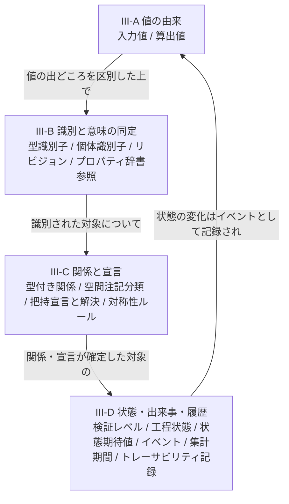
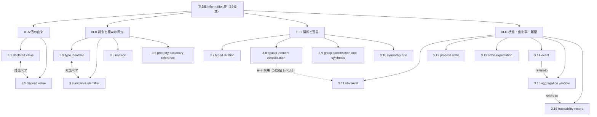

# TECHNICAL SPECIFICATION（試作版 / Pilot）

# 空間データを扱うモデリングの概念辞書 — 第3編: 意味・情報 (Information層)
Conceptual vocabulary for spatial-data modelling — Part 3: Semantics and information (Information layer)

**文書番号（仮）:** STD-EED-0001-3
**版:** 0.1.0-pilot（原辞書 v0.17.0 からの変換試作）
**変換日:** 2026-08-22
**変換範囲:** 原辞書 第III部（3.01〜3.16、概念16件・現場語39語）

---

## 前書き (Foreword)

本仕様書は、第1編（物理資産／Asset層）・第2編（空間統合／Integration層）に続く、空間データを扱うモデリングにおける概念語彙の自主技術仕様書である。用語エントリの構造・記述フォーマット・変換方針は先行2編と同一であり、詳細は第1編前書きを参照。以下は本編（第3編）固有の申し合わせである。

- 原辞書の**恒久ID（IRDI）は一切変更していない**。第III部の概念採番（原 `3.01`〜`3.16`）は本仕様書の `3.1`〜`3.16` に**欠番なく1対1で対応**する（附属書E.1）。
- **メタ語彙（M.01〜M.14、原辞書6.1節）への参照は、変換時点では forward reference として先送りした。** 第III部は第I・II部より参照頻度が高い（`M.04` エンティティ・`M.11` キャッシュ鮮度の自己保証・`M.13` 遷移許可リスト・`M.14` 単一更新経路の強制）。（2026-09-02追補：メタ語彙は独立編 `STD-EED-0001-M`（第M編）として変換され、本編の該当5箇所は第M編の採番（`第M編3.4`／`3.11`／`3.13`／`3.14`）への参照に解決済み。3.12 の `M.13` への参照は同時に `constrained-by` へ精密化した — `decisions.md` D-2026-09-02-01、-04。）
- **写像作業の結果、本編16概念に新規の概念ドリフトは確認されなかった（0/16）。** ただし `3.11 V&V Level` は、原辞書5章の命名規約（State／Status／Level の使い分け）に基づき「検証ステータス」から「検証レベル」へ改称された経緯が既に原辞書側で記録されている（本仕様書では既解決の履歴として3.11のNoteに残した。`decisions.md` D-2026-08-22-04）。
- **原辞書4.5節「新たに判明した未収録」の記述に陳腐化を1件発見した。** 同節は集計期間（ウィンドウ）を「判断保留」の未収録項目として記すが、Clause 5には `3.15 Aggregation Window` が RAMI 4.0 `Information / Enterprise / Type` として既に確定収録されている。本仕様書では3.15を通常の確定エントリとして収録した（`decisions.md` D-2026-08-22-02）。
- 原辞書2.4節「対比によって識別される語彙ペア」のうち2組が本編に含まれる：`3.1 declared value` ／ `3.2 derived value`、`3.3 type identifier` ／ `3.4 instance identifier`。両組とも該当エントリのNote 2に対比ペアである旨を明記した。
- 原辞書の一部エントリが持つ「対応する外部規格・慣例」欄（本編では3.13）は、Note 3 to entry（用法上の注意と同枠）へ統合する規則を新たに定めた（附属書E.2追補、`decisions.md` D-2026-08-22-03）。
- `mates-to`（嵌合）関係型は本編でも確定使用箇所が見つからなかった。3.7（型付き関係）が内部ファセット値として近い内容を持つが、概念エントリ間の関係を表すNote 2の対象とは性質が異なるため採用を見送った（`decisions.md` D-2026-08-22-05）。（2026-09-02追補：全6編で確定使用ゼロが確定し、本型は廃止された。）

## 序文 (Introduction)

第III部が扱うのは、データに意味を与え、識別し、状態として管理する関心事である。現物や座標値そのものではなく、「これは何であり、どれと同じで、いまどういう状態か」を語る層である。

## 1 適用範囲 (Scope)

本仕様書は、空間データを扱うモデリングにおいてステークホルダー間の共通言語を確立するための概念語彙のうち、**データに意味を与え、識別し、状態として管理する関心事（Information層）に属する用語、定義、および概念間関係のセマンティクス**について規定します。

適用範囲は以下の通りです：

* 値の由来の区別（利用者が明示的に指定した値か、自動的に計算された値か）（III-A）
* 型と個体の識別、版管理、外部プロパティ辞書との対応（III-B）
* エンティティ間の型付き関係、空間注記の意味分類、把持の宣言と解決、対称性ルール（III-C）
* 検証レベル・工程状態・状態期待値・イベント・集計期間・トレーサビリティ記録という状態管理の語彙（III-D）

特定のプログラミング言語、ファイル形式、通信規格、製品、リポジトリには依存しません。

## 2 参照標準・参考文献 (References)

第1・2編と同一の参照群に加え、本編では以下を主に参照・活用しています：

* ISO 704:2009, Terminology work — Principles and methods
* RAMI 4.0（DIN SPEC 91345）Life Cycle 軸（Type / Instance の区別）
* IEC 63278（AAS）
* IEC 61360, ISO 13584, ECLASS, IEC CDD（プロパティ辞書・IRDI）
* ISA-95（IEC 62264）（工程状態モデル、トレーサビリティ）
* IEC 62541（OPC UA Events）
* ISO/IEC/IEEE 15288（検証・妥当性確認の区別）
* Design by Contract（事前条件・事後条件）
* Kevin Lynch, *The Image of the City* (1960)（空間注記の意味分類の由来）

## 3 用語及び定義 (Terms and Definitions)

各エントリは、用語（英語主名称・和文名・admitted term）、恒久ID（IRDI）、定義文、適用例（EXAMPLE）、およびエントリ注記（Note 1: コアイメージ／Note 2: 概念間関係／Note 3以降: 用法上の注意）で構成されます。分類メタデータは附属書Bに集約しています。

**サブグループ（区分基準＝主題。件数・範囲は原辞書の記述と一致、訂正なし）:** III-A 値の由来（3.1〜3.2、2件）／ III-B 識別と意味の同定（3.3〜3.6、4件）／ III-C 関係と宣言（3.7〜3.10、4件）／ III-D 状態・出来事・履歴（3.11〜3.16、6件）。

**III-A. 値の由来**

### 3.1
**declared value**
入力値
admitted term: 宣言値／input value
IRDI: `eed:0024#001`

利用者が明示的に指定した情報。幾何やロジックからの自動計算を経ていない値。

EXAMPLE 1 （生産）CADの理論値ではなく、現場で実測して入力した質量特性の値。

EXAMPLE 2 （CAD）利用者が明示的に指定した把持位置。

Note 1 to entry: Core image：「本人が申告した値」。誰かが明示的にそう決めた、という事実そのもの。

Note 2 to entry: Concept relations:
— refers-to 3.2 (derived value) ※対比ペア。原辞書2.4節参照
— refers-to 1.3 (mass properties, 第1編)
— refers-to 3.9 (grasp specification and synthesis), 3.11 (v&v level)
— refers-to 3.5 (transformation activity, 第4編)

Note 3 to entry: プログラミング言語の変数宣言（declare）やアサーション（assert）とは別の軸の概念である。変数宣言は「この名前の変数が存在し、この型を持つ」という構文上の取り決め、assertは「ある条件が真であるはずだ」という実行時の検証手段であり、いずれも**値の由来を問わない**。本エントリは値の出どころが「利用者が明示的に与えた」ものか「システムが計算で導いた」ものかを区別する分類である。対になる算出値（3.2）との違いを、1つの答えの裏に隠さないこと。

### 3.2
**derived value**
算出値
admitted term: 導出値／computed value
IRDI: `eed:0025#001`

幾何やロジックから自動的に計算された情報。入力値（3.1）と明確に区別する。

EXAMPLE 1 （生産）CADの理論値としての質量特性。

EXAMPLE 2 （CAD）幾何から自動導出された把持できる場所。

Note 1 to entry: Core image：「他のデータから計算で割り出した値」。元になる幾何やロジックが変われば、追従して変わる。

Note 2 to entry: Concept relations:
— refers-to 3.1 (declared value) ※対比ペア。原辞書2.4節参照
— refers-to 1.3 (mass properties, 第1編)
— refers-to 3.9 (grasp specification and synthesis), 3.11 (v&v level), 3.15 (aggregation window)
— refers-to 3.5 (transformation activity, 第4編), 3.2 (measurement, 第4編)
— refers-to 3.11 (self-validating freshness guarantee, 第M編)

**III-B. 識別と意味の同定**

### 3.3
**type identifier**
型識別子
IRDI: `eed:0026#001`

設計上のテンプレートを指す識別子。同じ型識別子を持つ個体は、同じ設計（幾何・仕様）を共有する。

EXAMPLE 1 （生産）ワーク品種識別子（設計型番、テンプレートを決定）。

EXAMPLE 2 （CAD）部品テンプレート・ファミリを指すID。

Note 1 to entry: Core image：「その部品の型番名」。設計図が同じであれば、何個作っても同じ型番を名乗る。

Note 2 to entry: Concept relations:
— refers-to 3.4 (instance identifier) ※対比ペア。原辞書2.4節参照
— refers-to 3.5 (revision), 3.6 (property dictionary reference)

Note 3 to entry: 対になる個体識別子（3.4）と混同してはならない。

### 3.4
**instance identifier**
個体識別子
IRDI: `eed:0027#001`

物理的・具体的な個体を指す識別子。同じ型識別子（3.3）を共有する個体同士でも、個体識別子は重複しない。発番権限は単一システムに限定される（single write path、第M編3.14）。

EXAMPLE （生産）ワーク個体識別子（2次元コード・RFIDで個体に紐づく）。

Note 1 to entry: Core image：「一個一個に貼られたシリアル名札」。同じ型番の部品でも、名札は世界に1つしかない。

Note 2 to entry: Concept relations:
— refers-to 3.3 (type identifier) ※対比ペア。原辞書2.4節参照
— refers-to 3.16 (traceability record)
— refers-to 3.4 (entity, 第M編), 3.14 (single write path, 第M編)

### 3.5
**revision**
リビジョン
IRDI: `eed:0028#001`

型識別子（3.3）に対する設計変更履歴上のバージョン。

EXAMPLE （生産）部品リビジョン。幾何・把持ルールがリビジョンで変わる場合、下流システムはこの値の変化を検知して再同期する。

Note 1 to entry: Core image：設計図の版数、何回描き直されたか。

Note 2 to entry: Concept relations:
— refers-to 3.3 (type identifier), 3.6 (property dictionary reference)

### 3.6
**property dictionary reference**
プロパティ辞書参照
IRDI: `eed:0029#001`

属性（プロパティ）の意味・データ型・単位・許容値を、外部の標準辞書に登録された一意な識別子へ結びつけること。属性名の文字列一致に頼らず、**識別子の一致**で意味の同一性を判定できるようにする。

EXAMPLE （生産・CAD共通）ECLASSは各プロパティにIRDI（International Registration Data Identifier、IEC 61360とISO 13584が形式を定める）を与える。たとえば `0173-1#02-AAO677#002` は「製造者名」を表し、独語 Bemessungsspannung と英語 rated voltage のように表記が違っても同じIRDIへ解決されるため、機械間のカタログ交換が成立する。AASのSubmodelでは、各PropertyのsemanticIdにこのIRDIを入れる。

Note 1 to entry: Core image：「定格電圧」という言葉を各社が勝手に書くのではなく、世界共通の番号札を貼っておく。翻訳しても改名しても、同じ札で引ける。

Note 2 to entry: Concept relations:
— refers-to 3.3 (type identifier), 3.5 (revision)

Note 3 to entry: 辞書はリリース単位で版が変わり、あるリリースで有効なIRDIが別のリリースでは解決できないことがある。3.5（リビジョン）と同じ問題が辞書そのものにも起きるため、どのリリースのIRDIかを併記する。

**III-C. 関係と宣言**

### 3.7
**typed relation**
型付き関係
IRDI: `eed:0030#001`

2つのエンティティ（第M編3.4）間の関係を、幾何情報を持たない純粋な関係性として、種類（型）付きの有向辺で表現する考え方。

EXAMPLE 1 （生産）ワークの親子構成関係（アセンブリ構造）。

EXAMPLE 2 （CAD）運動学的種類（固定/回転/直動等）と意味カテゴリ（固定/取付/包含/整列等）の2軸を持つ有向辺。

Note 1 to entry: Core image：二つの物を線でつなぐとき、その線に「何のためにつながっているか」というラベルを必ず貼る。

Note 2 to entry: Concept relations:
— refers-to 2.9 (hierarchical coordinate structure, 第2編), 2.13 (datum reference feature, 第2編)
— refers-to 3.4 (entity, 第M編)

Note 3 to entry: 本エントリの「意味カテゴリ」軸が持つ「固定／取付／包含／整列」という値は、`mates-to`（嵌合）型が本来対象とする実務内容に近い。しかしこれは本エントリという1つの概念が内部に持つファセット値であり、2つの概念エントリ間の関係（Note 2の対象）とは表現の階層が異なるため、`mates-to` をここに正式適用することは見送った（`decisions.md` D-2026-08-22-05）。

### 3.8
**spatial element classification**
空間注記の意味分類
IRDI: `eed:0031#001`

空間上に配置される注記要素を、許容されるジオメトリ形状（線／領域／点）ごとに意味分類する体系。

EXAMPLE （CAD）ルート（経路）、境界（区切り）、ゾーン（範囲）、ノード（結節点）、目印、アンカー（外部参照）の6分類。前5者は都市計画のKevin Lynchが『The Image of the City』で示した path／edge／district／node／landmark にそのまま対応する。人が空間を把握するときの要素は、都市でも工場でも変わらないという含意がある。

Note 1 to entry: Core image：地図記号の凡例。「これは道」「これは区画」「これは目印」と一目で分かる色分け。

Note 2 to entry: Concept relations:
— refers-to 1.6 (process location, 第1編)
— refers-to 2.13 (datum reference feature, 第2編), 2.14 (calibration reference, 第2編) ※is-a の候補。本エントリの分類値の1つである「目印」に対し、第2編2.14（キャリブレーション基準）は「既知の幾何を持つ」という条件を加えた下位概念にあたる（現場語eed:0114の同義欄に明記）。ただし this is a facet-value-level（分類値レベル）の下位関係であり、本エントリ（分類体系）そのものとの is-a ではないため、確定は見送り候補にとどめる

### 3.9
**grasp specification and synthesis**
把持宣言と解決
admitted term: grasp synthesis（解決フェーズの標準語）／grasp specification
IRDI: `eed:0032#001`

対象をどこでどう掴むかを、利用者の明示的な宣言（またはその不在）から解決し、最終的に実行可能な目標姿勢へと落とし込む一連の考え方。

EXAMPLE 1 （生産）把持目標姿勢（TCP目標姿勢、ツール種別・アプローチ方向・許容把持力）。

EXAMPLE 2 （CAD）把持特徴宣言（幾何自動導出／どこでもよい／特定面／不正の4状態）とサンプリング解決。

Note 1 to entry: Core image：「ここを持って」と物に貼っておく付箋と、実際にロボットの手が掴む瞬間の、手の形と位置のスナップショット。

Note 2 to entry: Concept relations:
— refers-to 1.4 (stable pose, 第1編)
— refers-to 2.5 (pose, 第2編), 2.15 (exclusion zone, 第2編), 2.16 (approach vector, 第2編)
— refers-to 3.1 (declared value), 3.2 (derived value), 3.10 (symmetry rule), 3.11 (v&v level)
— refers-to 3.5 (transformation activity, 第4編)

Note 3 to entry: 「宣言してから解決する」という逐次ワークフローを1つの概念としてまとめて扱っており、原辞書2.4節の対比ペアとは性質が異なる（分割していない）。

### 3.10
**symmetry rule**
対称性ルール
IRDI: `eed:0033#001`

幾何学的・機能的な対称性により、認識・把持・配置において同一とみなせる回転角度の許容性。

EXAMPLE （生産）円柱ワークのZ軸周り連続対称、四角柱の90度刻み対称。ビジョンの姿勢マッチング許容誤差に直結する。

Note 1 to entry: Core image：回しても見分けがつかない角度の範囲。

Note 2 to entry: Concept relations:
— refers-to 1.5 (resolution, 第1編)
— refers-to 2.5 (pose, 第2編)
— refers-to 3.9 (grasp specification and synthesis)

**III-D. 状態・出来事・履歴**

### 3.11
**v&v level**
検証レベル
admitted term: 検証ステータス（旧和文名）／verification and validation level
IRDI: `eed:0034#001`

あるデータが理論値・シミュレーションのみで検証されたものか、実機・実環境で検証済みのものかを区別する状態情報。

EXAMPLE （生産）把持目標姿勢や搬送安定姿勢に付与する「シミュレーション検証済」「実機検証済」の区別。

Note 1 to entry: Core image：「理論上は正しい」と「現場で確かめた」を混同しない、検品済みの印。

Note 2 to entry: Concept relations:
— refers-to 1.5 (resolution, 第1編)
— refers-to 3.1 (declared value), 3.2 (derived value), 3.9 (grasp specification and synthesis), 3.13 (state expectation)

Note 3 to entry: 和文名は原辞書で「検証ステータス」から「検証レベル」へ改称された経緯を持つ（原辞書5章冒頭の命名規約：State／Status／Level の使い分けで「3.11は順序を持つためLevelへ改めた」と明記）。本仕様書はこの既解決の改称履歴をそのまま引き継ぐ（新規のドリフト検出ではない。`decisions.md` D-2026-08-22-04）。対になる3.12工程状態（State）との違いは3.12のNote 3を参照。

### 3.12
**process state**
工程状態
admitted term: lifecycle state
IRDI: `eed:0035#001`

対象がライフサイクルのどの段階にあるかを表す状態。あらかじめ定義された遷移ルール（第M編3.13）に従ってのみ変化する。

EXAMPLE （生産）加工工程状態（原材料／半完成／完成／手直し／廃棄）。

Note 1 to entry: Core image：その対象が今どの工程の途中にいるかを示す信号機の色。

Note 2 to entry: Concept relations:
— refers-to 1.6 (process location, 第1編)
— refers-to 3.14 (event), 3.16 (traceability record)
— refers-to 3.3 (work interface, 第4編)
— refers-to 3.11 (v&v level) ※Note 3 が対比している隣接概念（第M編附属書F.4 で追加）
— constrained-by 3.13 (allowed-transition list, 第M編) ※定義文の「あらかじめ定義された遷移ルールに従ってのみ変化する」による。第M編の変換にあたり refers-to から精密化した（`decisions.md` D-2026-09-02-04）

Note 3 to entry: State と Status を混同しないこと。本エントリ（State）は対象に内在する様態であり、遷移規則（第M編3.13）に従ってのみ変化する。これに対し 3.11 V&V Level（Level）は、外から判定者が付与する、順序のある段階である。「ワークは半完成である」は工程状態、「この把持姿勢は実機検証済である」は 3.11 V&V Level。

### 3.13
**state expectation**
状態期待値
IRDI: `eed:0036#001`

ある処理単位の境界（入口または出口）において、対象がどのような状態であるべきかを表す事前に明示された期待値。入口側を入力状態期待値、出口側を出力状態期待値と呼ぶ。

EXAMPLE （生産）搬入トレー積載時の「個数N個以内・向き不問」と、工程内投入時の「整列済み・向き既知」という異なる期待値定義。

Note 1 to entry: Core image：「ここに来る時はこうなっていてほしい」「ここを出る時はこうなっていてほしい」という、境界に貼られた事前の言い分。

Note 2 to entry: Concept relations:
— refers-to 1.6 (process location, 第1編)
— refers-to 3.11 (v&v level), 3.14 (event)
— refers-to 3.3 (work interface, 第4編), 3.4 (nested IPO decomposition, 第4編), 3.5 (transformation activity, 第4編), 3.1 (contract boundary, 第5編)

Note 3 to entry: 契約による設計（Design by Contract）の事前条件・事後条件と同型であり、原5.01「契約境界」の、状態という側面への適用と見ることもできる（原辞書「対応する外部規格・慣例」欄をNote 3へ統合。`decisions.md` D-2026-08-22-03）。

### 3.14
**event**
イベント
IRDI: `eed:0037#001`

ある時刻に起きた離散的な出来事の記録。**発生時刻・対象個体・種別**を持ち、記録後は変更されない。状態（3.12 工程状態）が「いま何であるか」を表すのに対し、イベントは「何が起きたか」を表す。状態はイベントの列から再構成できるが、逆はできない。

EXAMPLE （生産）搬入場所への到着、把持の成功／失敗、検査NGの発生、工程状態の遷移。RAMI 4.0では、実世界の重要な出来事が仮想世界のイベントへ写像され、現実が変わればCommunication層を経てInformation層へ報告される、という関係が定められている。

Note 1 to entry: Core image：「いま完成品である」（状態）ではなく「17時03分に完成した」（出来事）。起きた瞬間に貼られ、あとから書き換えない付箋。

Note 2 to entry: Concept relations:
— refers-to 3.12 (process state), 3.13 (state expectation), 3.15 (aggregation window), 3.16 (traceability record)

Note 3 to entry: 日次・週次・月次のKPIは、イベントそのものではなく**イベント列を一定期間で集計した結果**である。集計の期間（ウィンドウ）はイベントとは別の概念であり、3.15（集計期間）が扱う。工程のIN/OUTのタイミングは、搬入イベントと搬出イベントという2つのイベントとして表す。

### 3.15
**aggregation window**
集計期間
admitted term: reporting period
IRDI: `eed:0038#001`

イベント（3.14）の列を一定の区間で束ね、数え上げ・平均・最大などの集計値を得るための時間の区切り方。**区間の長さ**、**境界の位置**（何時始まりか、締め時刻はいつか）、**区間どうしが重なるか**（固定窓か移動窓か）の3つを指定して初めて、集計値が一意に定まる。

EXAMPLE （生産）日次・週次・月次の生産台数。シフト単位の稼働率。移動平均による需要予測と、それにもとづく次回部品発注タイミングの見積もり。同じ生産台数でも、シフト境界が日付をまたぐかどうかで日次の値が変わる。

Note 1 to entry: Core image：同じ出来事の山でも、日で区切るか週で区切るかで、出てくる数字も打つ手も変わる。

Note 2 to entry: Concept relations:
— refers-to 3.2 (derived value), 3.14 (event), 3.16 (traceability record)

Note 3 to entry: 集計値はイベントから導出されるため 3.2 算出値であり、元のイベントを書き換えずに何度でも再計算できなければならない。締め時刻を明示しない集計値は、他の期間の値と比較できない。**原辞書4.5節は本エントリを「判断保留の未収録」と記すが、Clause 5には確定済みエントリとして既に収録されている（原辞書側の記述の陳腐化。`decisions.md` D-2026-08-22-02）。**

### 3.16
**traceability record**
トレーサビリティ記録
IRDI: `eed:0039#001`

個体（3.4）がどの設備・ロット・時刻を経由したかの履歴。

EXAMPLE （生産）個体識別子に紐づく形で蓄積される、通過設備・日時・ロット・検査結果の記録。

Note 1 to entry: Core image：その個体が辿ってきた旅の記録（足跡）。

Note 2 to entry: Concept relations:
— refers-to 3.4 (instance identifier), 3.12 (process state), 3.14 (event), 3.15 (aggregation window)

## 4 概念体系 (Concept System)

本編の16概念は、主題により4つのサブグループに区分されます（区分基準＝主題。原辞書の件数・範囲の記述と一致、訂正なし）。

図の見方：`A1<-->A2`・`B1<-->B2` は原辞書2.4節が確認済みの対比ペア。`C2`から`D1`への点線は、第2編3.14（キャリブレーション基準）と本編3.8「目印」分類値の間で見つかった候補関係を模式的に示す（正式な型ではない）。

---

## 附属書A (informative) 現場語・通称対応表 (Shopfloor & Colloquial Terms Mapping)

| 現場語ID | 代表形（概念） | 現場語 (JP) | 主語（登場人物） | 現場での使用場面例 | 同義・異表記 |
|---|---|---|---|---|---|
| `eed:0096#001` | 3.1 declared value | 実測質量 | ワーク（被加工物・部品・製品） | 生産・現場で秤量して入力した値。鋳造品ではCAD理論値と乖離する | 実測値 |
| `eed:0097#001` | 3.1 declared value | 手動指定把持位置 | エンドエフェクタ（ハンド・グリッパ・吸着パッド） | CAD・利用者が明示的に指定した把持位置 | 手動ティーチ位置 |
| `eed:0098#001` | 3.2 derived value | CAD理論質量 | ワーク（被加工物・部品・製品） | 製品設計・均一密度を仮定してCADが計算した値 | 理論値／設計質量 |
| `eed:0099#001` | 3.2 derived value | 自動導出把持候補 | エンドエフェクタ（ハンド・グリッパ・吸着パッド） | CAD・幾何から自動生成した把持できる場所 | 把持候補サンプリング結果 |
| `eed:0100#001` | 3.3 type identifier | ワーク品種識別子 | ワーク（被加工物・部品・製品） | 生産・MES／設計テンプレートを決定する識別子 | 品番／設計型番／機種コード |
| `eed:0101#001` | 3.3 type identifier | 部品テンプレートID | CADシステム・PLM | CAD・部品ファミリを指すID | ファミリID |
| `eed:0102#001` | 3.4 instance identifier | ワーク個体識別子 | ワーク（被加工物・部品・製品） | MES・2次元コードやRFIDで物理個体に紐づく | シリアル／製造番号／個体ID |
| `eed:0103#001` | 3.5 revision | 部品リビジョン | ワーク（被加工物・部品・製品） | 製品設計・幾何や把持ルールが変わったことを下流に知らせる版数 | 版数／rev／改訂記号 |
| `eed:0104#001` | 3.6 property dictionary reference | IRDI | CADシステム・PLM | プロパティ・クラス・列挙値に与えられる世界一意な識別子 | International Registration Data Identifier |
| `eed:0105#001` | 3.6 property dictionary reference | ECLASS | CADシステム・PLM | 製品分類とプロパティ辞書。BASIC（平坦なプロパティ列）とADVANCED（アスペクト・ブロック構造）がある | eCl@ss |
| `eed:0106#001` | 3.6 property dictionary reference | semanticId | MES・上位システム | AASのSubmodel要素に付ける、意味の参照先 | セマンティックID |
| `eed:0107#001` | 3.6 property dictionary reference | IEC CDD | CADシステム・PLM | IECが運用する共通データ辞書 | Common Data Dictionary |
| `eed:0108#001` | 3.7 typed relation | 親子構成関係 | ワーク（被加工物・部品・製品） | 製品設計・組み付けによって生じる有向の構成関係 | アセンブリ関係 |
| `eed:0109#001` | 3.7 typed relation | ジョイント種別 | 産業用ロボット（多関節マニピュレータ） | URDF・固定／回転／直動などの運動学的分類 | fixed／revolute／prismatic |
| `eed:0110#001` | 3.8 spatial element classification | ルート | 架台・ベースプレート・床 | CAD・空間注記のうち経路を表す線 | 経路注記 |
| `eed:0111#001` | 3.8 spatial element classification | 境界 | 安全柵・ライトカーテン | CAD・空間注記のうち区切りを表す線 | 区画線 |
| `eed:0112#001` | 3.8 spatial element classification | ゾーン | 安全柵・ライトカーテン | CAD・空間注記のうち範囲を表す領域 | エリア／区画 |
| `eed:0113#001` | 3.8 spatial element classification | ノード | 架台・ベースプレート・床 | CAD・空間注記のうち結節点・交差点を表す点 | 結節点／node（旧称：ハブ） |
| `eed:0114#001` | 3.8 spatial element classification | 目印 | 架台・ベースプレート・床 | CAD・空間注記のうち、方向感覚の手がかりになる目立つ対象 | landmark（都市モデル由来。第2編2.14キャリブレーション基準は本値の下位概念候補） |
| `eed:0115#001` | 3.8 spatial element classification | アンカー | 架台・ベースプレート・床 | CAD・空間注記のうち外部参照を表す点。Lynchの5要素にはない追加分類 | 外部参照点 |
| `eed:0116#001` | 3.9 grasp specification and synthesis | 把持点 | ワーク（被加工物・部品・製品） | 生産・ワーク側で「ここを持つ」と決めた場所 | ピック位置／掴み代／チャック位置 |
| `eed:0117#001` | 3.9 grasp specification and synthesis | 把持目標姿勢 | エンドエフェクタ（ハンド・グリッパ・吸着パッド） | ロボティクス・ツール種別と許容把持力を伴う実行可能な目標 | TCP目標姿勢（ISO 9787） |
| `eed:0118#001` | 3.9 grasp specification and synthesis | 把持特徴宣言 | ワーク（被加工物・部品・製品） | CAD・幾何自動導出／どこでもよい／特定面／不正の4状態 | 把持宣言 |
| `eed:0119#001` | 3.10 symmetry rule | 軸対称 | ワーク（被加工物・部品・製品） | 生産・円柱ワークのZ軸周り連続対称 | 連続対称／回転対称 |
| `eed:0120#001` | 3.10 symmetry rule | 90度刻み対称 | ワーク（被加工物・部品・製品） | 生産・四角柱など離散的な対称 | 4回対称／N回対称 |
| `eed:0121#001` | 3.11 v&v level | シミュレーション検証済 | エンドエフェクタ（ハンド・グリッパ・吸着パッド） | 生技・理論値とシミュレーションだけで確認した段階 | シム検証済 |
| `eed:0122#001` | 3.11 v&v level | 実機検証済 | エンドエフェクタ（ハンド・グリッパ・吸着パッド） | 生技・実機で動かして確認した段階 | 実機確認済／立会済 |
| `eed:0123#001` | 3.12 process state | 加工工程状態 | ワーク（被加工物・部品・製品） | MES・原材料／半完成／完成／手直し／廃棄 | 工程ステータス／進捗区分 |
| `eed:0124#001` | 3.13 state expectation | 入力状態期待値 | 搬送トレー・パレット・コンテナ | 設備制御・工程の入口でワークがどうなっているべきか | 事前条件／受入条件 |
| `eed:0125#001` | 3.13 state expectation | 出力状態期待値 | 搬送トレー・パレット・コンテナ | 設備制御・工程の出口でワークがどうなっているべきか | 事後条件／完了条件 |
| `eed:0126#001` | 3.14 event | アラーム | PLC（シーケンサ） | 異常発生の瞬間を時刻つきで記録する | 警報／異常履歴 |
| `eed:0127#001` | 3.14 event | 稼働ログ | PLC（シーケンサ） | 起動・停止・段取り替えなどの時刻記録 | 運転ログ／イベントログ |
| `eed:0128#001` | 3.14 event | サイクル完了信号 | 工程内場所（ステーション・セル） | 1サイクルの終了という出来事を下流へ知らせる | 完了トリガ／サイクルエンド |
| `eed:0129#001` | 3.14 event | 状態遷移ログ | ワーク（被加工物・部品・製品） | 工程状態が変わった瞬間の記録 | ステータス履歴 |
| `eed:0130#001` | 3.15 aggregation window | 日次集計 | MES・上位システム | 1日単位で生産台数や不良率を締める | デイリー集計／日報 |
| `eed:0131#001` | 3.15 aggregation window | シフト単位 | 工程内場所（ステーション・セル） | 交替勤務の区切りで稼働率を集計する | 直（ちょく）単位／勤務帯 |
| `eed:0132#001` | 3.15 aggregation window | 移動平均 | MES・上位システム | 区間を重ねながらずらして需要をならす | ローリング平均／移動窓 |
| `eed:0133#001` | 3.15 aggregation window | 締め時刻 | MES・上位システム | どこで区間を切るかを定める境界 | カットオフ／締め |
| `eed:0134#001` | 3.16 traceability record | 通過履歴 | ワーク（被加工物・部品・製品） | MES・通過設備／日時／ロット／検査結果の記録 | トレース記録／履歴データ |

## 附属書B (informative) 概念メタデータ一覧 (Concept Metadata Registry)

| 採番 | 用語 | IRDI | 旧ID | Hier. Level | Life Cycle | Provider | Consumer | 語彙区分 | カバレッジ |
|---|---|---|---|---|---|---|---|---|---|
| 3.1 | declared value | `eed:0024#001` | `term.declared-value` | N/A（メタ概念） | Type | MetaArchitecture | ProductDesign, MfgRobotics, ShopfloorIT | 独自 | 生産 ◯ / CAD ◯ |
| 3.2 | derived value | `eed:0025#001` | `term.derived-value` | N/A（メタ概念） | Type | MetaArchitecture | ProductDesign, MfgRobotics, ShopfloorIT | 独自 | 生産 ◯ / CAD ◯ |
| 3.3 | type identifier | `eed:0026#001` | `term.type-id` | Product | Type | ProductDesign, ShopfloorIT | MfgRobotics, StationControl | 標準（RAMI 4.0 Life Cycle軸） | 生産 ◯ / CAD ◯ |
| 3.4 | instance identifier | `eed:0027#001` | `term.instance-id` | Product | Instance | ProductDesign, ShopfloorIT | MfgRobotics, StationControl | 標準（RAMI 4.0、IEC 63278） | 生産 ◯ / CAD — |
| 3.5 | revision | `eed:0028#001` | `term.revision` | Product | Type | ProductDesign | MfgRobotics, StationControl, ShopfloorIT | 業界一般 | 生産 ◯ / CAD — |
| 3.6 | property dictionary reference | `eed:0029#001` | `term.property-dictionary-reference` | Product | Type | MetaArchitecture, ProductDesign | ShopfloorIT, StationControl, MfgRobotics | 標準（IEC 61360, ISO 13584, ECLASS, IEC CDD） | 生産 ◯ / CAD — |
| 3.7 | typed relation | `eed:0030#001` | `term.typed-relation` | Product | Type | ProductDesign, MfgRobotics | StationControl, ShopfloorIT | 業界一般 | 生産 ◯ / CAD ◯ |
| 3.8 | spatial element classification | `eed:0031#001` | `term.spatial-annotation` | Field Device | Type | ProductDesign, MfgRobotics | StationControl | 業界一般（Kevin Lynch） | 生産 — / CAD ◯ |
| 3.9 | grasp specification and synthesis | `eed:0032#001` | `term.grasp-declaration` | Field Device | Type & Instance | MfgRobotics | ProductDesign, StationControl | 業界一般 | 生産 ◯ / CAD ◯ |
| 3.10 | symmetry rule | `eed:0033#001` | `term.symmetry-rule` | Product | Type | ProductDesign | MfgRobotics, StationControl | 業界一般 | 生産 ◯ / CAD — |
| 3.11 | v&v level | `eed:0034#001` | `term.validation-status` | Station | Instance | MfgRobotics, StationControl | ShopfloorIT | 業界一般（ISO/IEC/IEEE 15288） | 生産 ◯ / CAD — |
| 3.12 | process state | `eed:0035#001` | `term.process-state` | Station | Instance | StationControl, ShopfloorIT | MfgRobotics | 標準（ISA-95） | 生産 ◯ / CAD — |
| 3.13 | state expectation | `eed:0036#001` | `term.state-expectation` | Station | Type & Instance | StationControl | MfgRobotics, ShopfloorIT | 業界一般（Design by Contract） | 生産 ◯ / CAD — |
| 3.14 | event | `eed:0037#001` | `term.event` | Station | Instance | StationControl, ShopfloorIT | MfgRobotics | 標準（RAMI 4.0、IEC 62541） | 生産 ◯ / CAD — |
| 3.15 | aggregation window | `eed:0038#001` | `term.aggregation-window` | Enterprise | Type | ShopfloorIT | StationControl, ProductDesign | 業界一般 | 生産 ◯ / CAD — |
| 3.16 | traceability record | `eed:0039#001` | `term.traceability-record` | Enterprise | Instance | MfgRobotics, StationControl | ShopfloorIT | 標準（ISA-95） | 生産 ◯ / CAD — |

NOTE 3.15（集計期間）の Hierarchy Level（`Enterprise`）・Life Cycle（`Type`）は、原辞書4.5節の「判断保留」記述とは異なり、Clause 5では確定値として記載されている（`decisions.md` D-2026-08-22-02）。

## 附属書C (informative) 関係型セマンティクス (Relational Semantics)

### C.1 概念間関係型

本編で確定使用した関係型はrefers-toのみだった。第M編の変換にあたり、3.12（工程状態）→ 第M編3.13（遷移許可リスト）を `constrained-by` へ精密化したため、現在の確定使用は refers-to・constrained-by の2型である（`decisions.md` D-2026-09-02-04）。

| 関係型 | 意味 | 本編での使用 |
|---|---|---|
| refers-to | 参照・パラメータ関連付け | 本編の全関係 |
| is-a | 上位概念・下位概念関係 | 未確定使用（3.8「目印」分類値↔第2編3.14 は候補にとどめる） |
| constrained-by | 条件・規則による拘束 | **確定1件**（3.12 → 第M編3.13。定義文の「あらかじめ定義された遷移ルールに従ってのみ変化する」による。第M編の変換時に refers-to から精密化） |
| part-of / transforms | （第1・2編を参照） | 本編では未出現 |
| calibrated-from / aligns-with | （第2編で候補提示） | 本編では該当箇所なし |
| ~~mates-to~~ | 嵌合を表す関係（第1編で予告） | 本編でも未出現（3.7のNote 3参照）。全6編で確定使用ゼロのため**廃止**（第M編附属書C.1 NOTE 3） |

NOTE 対比ペア（3.1/3.2、3.3/3.4）は正式な関係型ではなく、原辞書2.4節に由来する注記レベルの対応として Note 2 に明記した。第2編の局所/ワールド空間ペアと同じ扱いである。対比ペアの親概念を辞書に立てるかは第M編附属書F.1 で裁き、**立てない**という結論になった（親概念の受け皿はサブグループ名である。`decisions.md` D-2026-09-02-06）。

## 附属書D (informative) 登場人物対応表 — 本編の概念で語られる実在物

| 登場人物 | 一言でいうと | 本編ではどう語られるか |
|---|---|---|
| ワーク（被加工物・部品・製品） | 工場の主役。加工され、運ばれ、組み立てられる当のもの | 品番は3.3、個体としての識別は3.4、設計変更の版は3.5、親子関係は3.7、対称性は3.10、工程状態は3.12、履歴は3.16 |
| HMI・操作盤 | 人が値を入れ、状況を見る画面 | 人が明示的に入れた値は3.1 |
| 作業者・オペレータ・保全担当 | 手を動かす人、見ている人、異常時に呼ばれる人 | 人が判断して入れた値は3.1 |
| CADシステム・PLM | 設計データの出どころ | 自動計算された値は3.2、型と版は3.3・3.5、他システムへの意味参照は3.6 |
| エンドエフェクタ（ハンド・グリッパ・吸着パッド） | ロボットの手先。実際にワークに触れる部分 | 把持の宣言と解決は3.9 |
| 安全柵・ライトカーテン | 人と機械を隔てる境界 | 通路・区画・目印といった床面の意味づけは3.8 |
| ビジョンカメラ・3Dスキャナ | ワークがどこにどの向きであるかを見つける目 | その結果が実機検証済みかは3.11 |
| 工程内場所（ステーション・セル） | 役割を持って区切られた、名前のついた作業場所 | サイクル完了信号は3.14、シフト単位の集計は3.15 |
| PLC（シーケンサ） | 設備をどの順で動かすかを制御する頭脳 | アラームや稼働ログとして記録されるのは3.14 |
| 搬送トレー・パレット・コンテナ | ワークを載せて運ぶ入れ物 | 載せ方の約束は3.13 |
| 治具（ジグ）・位置決めピン・突き当て面 | ワークを毎回同じ位置・姿勢に固定する道具 | 固定後にどうなっているべきかは3.13 |
| MES・上位システム | 生産計画と実績を管理する情報システム | 個体シリアルの発番は3.4、進捗は3.12、履歴は3.16、時刻つき出来事は3.14、日次・週次の集計は3.15 |
| 検査装置（三次元測定機、画像検査機） | 良否や寸法を判定する | 結果は3.16トレーサビリティ記録へ |

## 附属書E (informative) 変換対応表 (Conversion Mapping)

### E.1 採番対応

| 本仕様書 | 原辞書採番 | 恒久ID (IRDI) | English Name |
|---|---|---|---|
| 3.1 | 3.01 | `eed:0024#001` | declared value |
| 3.2 | 3.02 | `eed:0025#001` | derived value |
| 3.3 | 3.03 | `eed:0026#001` | type identifier |
| 3.4 | 3.04 | `eed:0027#001` | instance identifier |
| 3.5 | 3.05 | `eed:0028#001` | revision |
| 3.6 | 3.06 | `eed:0029#001` | property dictionary reference |
| 3.7 | 3.07 | `eed:0030#001` | typed relation |
| 3.8 | 3.08 | `eed:0031#001` | spatial element classification |
| 3.9 | 3.09 | `eed:0032#001` | grasp specification and synthesis |
| 3.10 | 3.10 | `eed:0033#001` | symmetry rule |
| 3.11 | 3.11 | `eed:0034#001` | v&v level |
| 3.12 | 3.12 | `eed:0035#001` | process state |
| 3.13 | 3.13 | `eed:0036#001` | state expectation |
| 3.14 | 3.14 | `eed:0037#001` | event |
| 3.15 | 3.15 | `eed:0038#001` | aggregation window |
| 3.16 | 3.16 | `eed:0039#001` | traceability record |

NOTE 原辞書の採番（`3.01`〜`3.16`）と本仕様書の採番（`3.1`〜`3.16`）は欠番なく1対1で対応する。第1・2編と同様、本編にも概念分離・新設は発生していない。

NOTE（2026-09-02追補） 本編の Note 2（Concept relations）が編をまたいで参照する箇所は、**参照先の編の採番と編番号を必ず含む**（例：`3.3 (work interface, 第4編)`。原採番を併記している箇所もある — 例：`1.04 (stable pose, 第1編 3.4)`）。第4編のみ原辞書の採番と本仕様書の採番が一致しないため（原 `4.02` → 第4編 `3.3` 等）、原採番との対応は第4編附属書E.1 を参照すること。他の編は原採番と1対1で対応する（第1編は `1.0N` → `3.N`）。

### E.2 欄の写像規則（追補）

第1編附属書E.2の規則に加え、本編で以下を追補した（`decisions.md` D-2026-08-22-03）。

| 原辞書の欄 | ISO形式での行き先 |
|---|---|
| 対応する外部規格・慣例（該当エントリのみ） | Note 3 to entry（用法上の注意と同枠） |

### E.3 原辞書の章とISO構成の対応（本編での実現状況）

第1編附属書E.3の計画のうち、本編に関わる項目は「5章 用語及び定義 → 各編の Clause 3」のみであり、Clause 3（3.1〜3.16）として実現した。基礎規約（原3章）は第2編Clause 4に既出のため本編では再掲しない。メタ語彙（原6章）は `decisions.md` D-2026-08-22-01 の決定により本編でも先送りとした。
