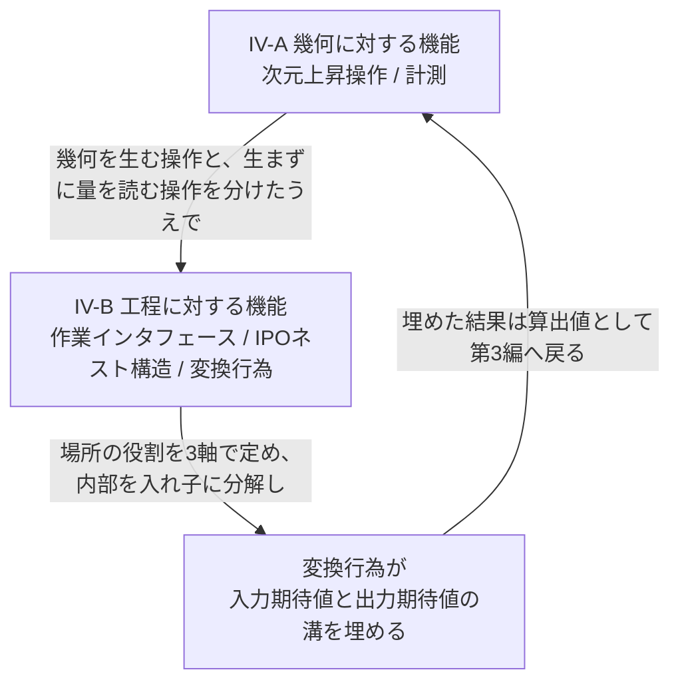
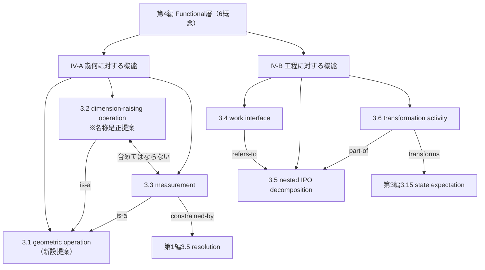

# TECHNICAL SPECIFICATION（試作版 / Pilot）

# 空間データを扱うモデリングの概念辞書 — 第4編: 機能・変換 (Functional層)
Conceptual vocabulary for spatial-data modelling — Part 4: Function and transformation (Functional layer)

**文書番号（仮）:** STD-EED-0001-4
**版:** 0.1.0-pilot（原辞書 v0.17.0 からの変換試作）
**変換日:** 2026-08-22
**変換範囲:** 原辞書 第IV部（4.01〜4.05、概念5件・現場語8語）＋参考表4-1・参考表4-2

---

## 前書き (Foreword)

本仕様書は、第1編（物理資産／Asset層）・第2編（空間統合／Integration層）・第3編（意味・情報／Information層）に続く、空間データを扱うモデリングにおける概念語彙の自主技術仕様書である。用語エントリの構造・記述フォーマット・変換方針は先行3編と同一であり、詳細は第1編前書きを参照。以下は本編（第4編）固有の申し合わせである。

- 原辞書の**恒久ID（IRDI）は一切変更していない**。ただし本編は、先行3編と異なり**原辞書の採番順と本仕様書の採番順が一致しない**。原辞書 第IV部のサブグループ IV-A は `4.01` と `4.05` という非連続な2件で構成されており、サブグループ順に並べると採番が飛ぶためである。本仕様書では主題（サブグループ）順に `3.2`〜`3.6` を振り直した（`3.2`←原`4.01`、`3.3`←原`4.05`、`3.4`←原`4.02`、`3.5`←原`4.03`、`3.6`←原`4.04`）。項目コードは採番に依存しないため影響を受けない（原辞書8.9節「項目コードに意味を持たせない」。附属書E.1、`decisions.md` D-2026-08-22-10）。
- **サブグループ IV-A の主題を上位概念として立て、`3.1`（幾何要素に対する操作、`eed:0149#001`）を新設した**（**新設提案**）。3.2（次元上昇操作）と 3.3（計測）は「一方を他方に含めてはならない」という関係にあるが、両者に共通する上位概念が辞書に立っていなかった（`decisions.md` D-2026-09-02-12、`backlog.md` P-05）。これにともない本編の採番が1つずつ繰り下がった（附属書E.1。恒久IDは不変）。
- **写像作業の結果、原辞書由来の5概念に概念ドリフトを1件検出した（1/5）。** `3.2`（原4.01）の和文名「掃引操作」および英語主名称 Sweep Operation は、定義文が画定している概念（次元を一段上げる操作一般）の**下位概念**にすぎない。定義文・具体例・現場語・旧恒久ID（`term.dimension-raising-op`）のいずれもが上位概念の側を指しているため、原辞書8.9節の規則に従い**定義文を存続させ、名称のみを「次元上昇操作 / dimension-raising operation」へ是正した（提案値。名称変更は版を上げない）**。詳細は3.2のNote 3、および `decisions.md` D-2026-08-22-07。
- **原辞書4.5節の空セル一覧が「判断保留」としていた `Functional × N/A` に、本変換の結果として回答を与えた。** 3.2 の定義文が明示的に「設計パターン」であり設備階層に依存しないことから、Hierarchy Level を `Product` から `N/A（メタ概念）` へ改める提案を附属書Bに記載した（`decisions.md` D-2026-08-22-08）。
- **第1編で予告した参考表4-1の列名是正を本編で実施した。** 「典型的な人インタフェース／典型的な機械インタフェース」の2列は、列名が「インタフェース」でありながら値は機能配分（監視・コンベア等）であったため、「典型的な機能配分（人／機械）」へ改めた（附属書F。第1編3.7 Note 2 の予告どおり。`decisions.md` D-2026-08-18-02 の実施、および D-2026-08-22-12）。
- **原辞書 参考表4-2 の前書きにある「3.18」は宙に浮いた参照である。** 第III部の採番は `3.01`〜`3.16` であり `3.18` は存在しない。同表の列見出しが「入力状態期待値（3.13）」「出力状態期待値（3.13）」と2度 `3.13` を引いていることから、`3.13 状態期待値` の誤記と判断し、本仕様書（附属書G）では `3.13` と記載した（`decisions.md` D-2026-08-22-11）。
- **メタ語彙（M.01〜M.14、原辞書6.1節）への参照は、引き続き forward reference として先送りする**（`decisions.md` D-2026-08-22-01）。本編からの参照は無い。
- 本編で `transforms`・`part-of`・`constrained-by` の確定使用箇所が新たに見つかった（附属書C）。一方 `mates-to` は第I部での予告以来、第II・III・IV部を通じて確定使用箇所が見つかっていない（`decisions.md` D-2026-08-22-05）。
- 原辞書2.4節「対比によって識別される語彙ペア」に該当する組は本編に**含まれない**。ただし 3.2（次元上昇操作）と 3.3（計測）は「新しい幾何要素を生むか、既存の幾何から値を取り出すだけか」で明確に対立し、原辞書自身が「計測を4.01に含めてはならない」と用法上の注意で規定している。2.4節の対比ペア表への追加候補として `decisions.md` D-2026-08-22-07 に記録した。

## 序文 (Introduction)

第IV部が扱うのは、データや現物が「何であるか」ではなく、それらに「何をするか」である。幾何に対して働きかける機能（次元を上げる／量を取り出す）と、工程に対して働きかける機能（場所の役割・入れ子の分解・実際の変換）の二系統からなる。

## 1 適用範囲 (Scope)

本仕様書は、空間データを扱うモデリングにおいてステークホルダー間の共通言語を確立するための概念語彙のうち、**入力を出力へ変換する機能そのもの、およびその機能の分解・分類に関する関心事（Functional層）に属する用語、定義、および概念間関係のセマンティクス**について規定します。

適用範囲は以下の通りです：

* 幾何要素に対する操作の区別（次元を一段上げて新しい要素を生む操作と、既存の要素から量を取り出す操作）（IV-A）
* 場所で何が起きるかの3軸ファセット分類、処理単位の再帰的分解、および入力期待値を出力期待値へ変換する処理そのもの（IV-B）

特定のプログラミング言語、ファイル形式、通信規格、製品、リポジトリには依存しません。

## 2 参照標準・参考文献 (References)

第1〜3編と同一の参照群に加え、本編では以下を主に参照・活用しています：

* ISO 704:2009, Terminology work — Principles and methods
* ISO 10303（STEP）の `swept_area_solid` / `swept_surface`（本編3.2の下位概念に対応）
* 国際計量計測用語（VIM）における測定
* IDEF0（SADT）の機能分解およびICOM表記
* 制約充足問題（CSP）における制約と目的関数の区別
* ファセット分類法（Ranganathanのコロン分類、ISO 704の区分基準）
* RAMI 4.0（DIN SPEC 91345）Hierarchy Levels 軸・Life Cycle 軸

## 3 用語及び定義 (Terms and Definitions)

各エントリは、用語（英語主名称・和文名・admitted term）、恒久ID（IRDI）、定義文、適用例（EXAMPLE）、およびエントリ注記（Note 1: コアイメージ／Note 2: 概念間関係／Note 3以降: 用法上の注意）で構成されます。分類メタデータは附属書Bに集約しています。

**サブグループ（区分基準＝主題）:** IV-A 幾何に対する機能（3.1〜3.3、3件。うち3.1は本仕様書での新設提案）／ IV-B 工程に対する機能（3.4〜3.6、3件）。

NOTE 原辞書の記載は「IV-A（4.01、4.05、2件）／ IV-B（4.02〜4.04、3件）」であり、件数は一致するが IV-A の範囲が非連続である。原辞書4.4節はサブグループについて「各エントリはちょうど1グループに属し、**号数順で連続する**（自動検証）」と述べており、第IV部はこの主張の反例となっている。本仕様書は採番を主題順に振り直すことで連続性を回復した（`decisions.md` D-2026-08-22-10）。

**IV-A. 幾何に対する機能**

### 3.1
**geometric operation**
幾何要素に対する操作
IRDI: `eed:0149#001`（**新設提案**。Note 3参照）

既存の幾何要素を入力として、新しい幾何要素または量を得る操作。得られるものが**幾何要素**か**量**かによって、次元上昇操作（3.2）と計測（3.3）に分かれる。

EXAMPLE 1 （CAD）2点から線分を作る（次元上昇操作）／2点間の距離を読む（計測）。CADのUIは一度の操作で両方をやってしまうことが多い。

EXAMPLE 2 （生産）ワークの輪郭から立体を起こす／起こした立体の寸法を測る。

Note 1 to entry: Core image：幾何を入力に取る操作の総称。出てくるものが「かたち」か「数」かで二手に分かれる。

Note 2 to entry: Concept relations:
— is-a の逆方向: 3.2 (dimension-raising operation)、3.3 (measurement) が本概念の下位概念である
— refers-to 3.4 (work interface) ※本操作が行使される場所の役割
— refers-to 第1編3.2 (topology) ※入力にも出力にもなる幾何要素の接続関係

Note 3 to entry: 本エントリは、サブグループ IV-A（幾何に対する機能）の主題そのものを**上位概念（genus）として本仕様書で新設した**ものである（**新設提案**。`decisions.md` D-2026-09-02-12、`backlog.md` P-05）。原辞書2.4節の対比ペア表への「次元上昇操作／計測」の追加提案（第M編附属書F.2）と対になる。

Note 4 to entry: 3.3（計測）Note 3 の「両者が同じ操作に見えるのは、CADのUIが一度に両方をやってしまうためにすぎない」という注意が成立するのは、両者が本概念という同じ上位概念のもとにあるからである。上位概念がなければ、両者は無関係な2つの操作として並ぶことになる。

### 3.2
**dimension-raising operation**
次元上昇操作
admitted term: 掃引操作／sweep operation（下位概念。Note 3参照）／swept_area_solid・swept_surface (ISO 10303)
IRDI: `eed:0040#001`

低次元のエンティティに対する操作が、それ自体を変化させず、より高次元の新しいエンティティを生成するという設計パターン。

EXAMPLE 1 （CAD）ライン作成（点→線分）、スケッチ（点・線→2D輪郭）、押し出し（2D輪郭→3D立体）、回転（2D輪郭→回転体）、ロフト（複数輪郭→3D立体）という操作の総称。

EXAMPLE 2 （生産）モデリング手順における「基準座標系の固定化→フィーチャーモデリング→スキーマ化」のプロセス（原辞書6.2節）。低次元の取り決めを変えないまま、その上により具体的な層を積み上げていく点で同型である。

Note 1 to entry: Core image：点をなぞれば線になり、線を描けば面になり、面を押せば立体になる、という一段ずつ次元が上がっていく操作。

Note 2 to entry: Concept relations:
— is-a 3.1 (geometric operation) ※得られるものが新しい幾何要素である操作
— refers-to 3.3 (measurement) ※**対比ペア**。新しい幾何要素を生む本概念と、生まずに量を取り出す3.3とは対立する。3.3のNote 3参照。原辞書2.4節（対比によって識別される語彙ペア）への追加を第M編附属書F.2 で提案している
— refers-to 3.4 (work interface) ※変化対象＝形状である場所（加工）で行使される操作の抽象
— refers-to 第1編3.2 (topology) ※生成される高次元エンティティの接続関係

Note 3 to entry: 原辞書 v0.17.0 では本エントリ（原4.01）の和文名が「掃引操作」、英語主名称が Sweep Operation だったが、これは定義文が画定する概念の**下位概念**である。掃引（ISO 10303 の `swept_area_solid`／`swept_surface`）は低次元エンティティを経路に沿って移動させて高次元エンティティを得る操作であり、押し出し・回転・ロフトの3つを覆うが、ライン作成（2点→線分）とスケッチ（点・線→2D輪郭）は掃引ではない。原辞書自身も具体例欄で「〔5操作〕の総称」と「ISO 10303 では〔うち3操作〕をまとめて swept_area_solid／swept_surface として扱う」を書き分けており、5要素の概念に3要素の下位概念名が付いていた。旧恒久ID `term.dimension-raising-op`・旧和文名「次元上昇操作」に本来の意図が残存している。定義文はそのまま存続させ、名称のみ「次元上昇操作 / dimension-raising operation」へ是正した（**提案値**。名称変更は恒久IDの版を上げない — 原辞書8.9節）。掃引は admitted term として保全したうえで、独立した下位概念エントリを立てるかは `decisions.md` D-2026-08-22-06（対比ペアの親概念）と同じ棚卸しで判断する。

Note 4 to entry: 語彙区分は「標準（ISO 10303）」から「業界一般」へ改める提案とした（附属書B）。ISO 10303 が定義しているのは下位概念である掃引であり、本エントリが画定する次元上昇操作一般ではないためである。原辞書8.8節（語彙区分別一覧）・8.1節・8.2節の索引にも同じ是正が波及する。

Note 5 to entry: 原辞書4.5節は空セル `Functional × N/A` を「判断保留（4.01 掃引操作を `Product` としているが、階層に依存しないメタ操作と見る余地がある）」としていた。定義文が明示的に「設計パターン」であり、EXAMPLE 2 のように幾何以外にも適用される以上、設備階層には依存しないと判断し、Hierarchy Level を `N/A（メタ概念）` とする提案を附属書Bに記載した（**提案値**。RAMI軸の値は定義文の意味ではないため版は上げない）。確定時は原辞書4.3節のクロス表（Functional 行：`Product` 1→0、`N/A` 0→1）にも波及する。

### 3.3
**measurement**
計測
admitted term: 測定／measurement operation
IRDI: `eed:0041#001`

既存の幾何要素から距離・角度・面積などの量を取り出す操作。新しい幾何要素を生まない点で3.2（次元上昇操作）と異なり、幾何を生む操作の副次的な結果として値を得る。

EXAMPLE 1 （CAD）2点間距離、面間距離、角度、面積、体積。同じ2点でも、ユークリッド距離で測るかマンハッタン距離で測るかで値が変わる。

EXAMPLE 2 （生産）ノギス・三次元測定機・ビジョンによる寸法測定。

Note 1 to entry: Core image：線を引いたあとで「で、これは何ミリ？」と聞く行為。線そのものではなく、線から取り出す数値のほう。

Note 2 to entry: Concept relations:
— is-a 3.1 (geometric operation) ※得られるものが量である操作
— constrained-by 第1編3.5 (resolution) ※測定値には分解能が下限を与える
— refers-to 第2編3.11 (distance metric convention) ※得られる値はどの距離定義によるかに依存する（`constrained-by` の候補。Note 4参照）
— refers-to 第3編3.3 (derived value) ※計測で得られる値は算出値である
— refers-to 3.2 (dimension-raising operation) ※**対比ペア**。Note 3参照。原辞書2.4節への追加を第M編附属書F.2 で提案している

Note 3 to entry: 計測を3.2（次元上昇操作）に含めてはならない。次元上昇は新しい幾何要素を生むが、計測は既存の幾何から値を取り出すだけで、次元は上がらない。「2点を結ぶ計測線」を引く行為のほうは次元上昇操作であり、そこから長さを読む行為が本エントリである。両者が同じ操作に見えるのは、CADのUIが一度に両方をやってしまうためにすぎない。

Note 4 to entry: 第2編3.11（距離定義規約）との関係は、値が規約に依存するという意味で `constrained-by` の候補であるが、原辞書の定義文は「依存する」としか述べておらず、規約が計測を制約すると明言していない。第1編附属書C.1 NOTE の保守方針（確信できないものは refers-to）に従い、本編では候補にとどめた。

**IV-B. 工程に対する機能**

### 3.4
**work interface**
作業インタフェース
admitted term: 場所の役割
IRDI: `eed:0042#001`

ある場所で、ワークに対してどのような変化（またはどのような評価）が行われるかを表す分類。単一のカテゴリ名の列挙ではなく、区分基準（characteristic of division）を一つに揃えた3本の独立した軸の組み合わせとして定義する。

1. **変化対象**：形状（ジオメトリが変わる）／配置（位置・姿勢・整列状態が変わる）／結合構成（複数個体が親子関係を獲得する）／情報（物理状態は不変で判定・測定値のみ付加される）／無変化（時間経過のみ）
2. **境界位置**：内部（工程内で完結）／境界通過（系外との出入りを伴う）
3. **実行トリガ**：標準フロー（通常の流れの一部）／例外フロー（検査不合格などの例外条件で呼び出される）

EXAMPLE （生産）加工＝内部・形状・標準フロー、マテハン変換＝内部・配置・標準フロー、組立＝内部・結合構成・標準フロー、検査＝内部・情報・標準フロー、保管＝内部・無変化・標準フロー、搬入／搬出＝境界通過・配置または無変化・標準フロー、手直し＝内部・（形状／配置／結合構成のいずれか）・例外フロー。全ての組み合わせは附属書Fを参照。

Note 1 to entry: Core image：その場所を一言で言うなら「入れる場所」か「出す場所」か「変える場所」か。

Note 2 to entry: Concept relations:
— refers-to 第1編3.6 (process location) ※場所そのものは物理資産、その役割が本概念
— refers-to 第1編3.7 (human-machine function allocation) ※同型の（区分基準を揃えた）ファセット分類であり、対比によって識別すべき2概念ではない
— refers-to 3.2 (dimension-raising operation) ※変化対象＝形状の場所で行使される
— refers-to 3.5 (nested IPO decomposition) ※場所の内部は入れ子に分解される
— refers-to 第3編3.14 (process state), 第3編3.15 (state expectation)

Note 3 to entry: 本概念に対応する現場語は未抽出（3軸の値の組み合わせに定着した現場の呼び名があるかは未調査。場所種別そのものの呼び名は第1編3.6にある）。附属書A参照。

Note 4 to entry: 本辞書は「インタフェース」という語を3つの異なる意味で用いている：(a) 第1編3.7 の「人インタフェース／機械インタフェース」＝関与主体の種別（機能配分の軸名）、(b) 第1編3.8 関与インタフェース（`eed:0145`）＝関与を媒介する物理的・情報的な接点、(c) 本エントリ＝場所が果たす役割の分類。原辞書2.2節が「1つのリポジトリの中でさえ起きていた同音異義」として報告しているのと同種の現象が、辞書自身の中にある。本エントリの admitted term「場所の役割」が定義文にもっとも忠実であり、原辞書2.1節の同音異義表への「インタフェース」追加を推奨する。ただし本エントリは旧恒久ID（`term.work-interface`）も現名称と一致しており、第1編3.7 のように旧IDへ別の意図が残存している証拠がないため、概念ドリフトではなく命名品質の問題と判定し、改称は行わなかった（`decisions.md` D-2026-08-22-14）。

### 3.5
**nested IPO decomposition**
IPOネスト構造
admitted term: nested input-process-output decomposition
IRDI: `eed:0043#001`

ある処理単位を、入力状態期待値・処理・出力状態期待値の三つ組として捉え、その処理自体をさらにズームインすると内部に同じ構造が現れる再帰的な分解の考え方。

EXAMPLE （生産）搬入場所を「開梱→トレー積載→工程内投入」へと再帰的に分解する構造。3階層に展開した詳細な適用例を附属書Gに示す。

Note 1 to entry: Core image：ロシアの入れ子人形のように、1つの「工程」を開けると、中にまた小さな「入力→処理→出力」が入っている。

Note 2 to entry: Concept relations:
— refers-to 第1編3.6 (process location)
— refers-to 3.4 (work interface)
— refers-to 第3編3.15 (state expectation) ※分解の境界に置かれる入力・出力
— 3.6 (transformation activity) part-of 本概念 ※三つ組の中央（処理）にあたる

Note 3 to entry: IDEF0（SADT）における機能分解に相当する。上位の1つのボックス（A0）を、内部のより詳細なボックス群（A1、A2、A3…）へと分解していく考え方と同型である。

Note 4 to entry: 分解の境界に置かれる期待値そのもの（第3編3.15）はデータ・意味の関心事であるため `Information`（第3編）に、処理（3.6）と本エントリは機能の関心事であるため `Functional`（本編）にある。Input-Process-Output の Process が機能、Input／Output が状態であることの自然な帰結として、層をまたいで対になる。

### 3.6
**transformation activity**
変換行為
admitted term: ギャップ充填行為／Gap-Filling Action／旧称 処理
IRDI: `eed:0044#001`

入力状態期待値を出力状態期待値（第3編3.15）へと実際に変換する処理そのもの。必ず満たすべき**制約**と、可能なら満たしたい**選好**の両方を持ちうる。

EXAMPLE 1 （生産）搬入トレーから工程内への移載作業。

EXAMPLE 2 （ロボティクス）把持候補生成における衝突制約フィルタと加重スコアリング選好。

Note 1 to entry: Core image：入力状態期待値と出力状態期待値という2つの「あるべき姿」の間にある溝を、実際に埋める作業。

Note 2 to entry: Concept relations:
— transforms 第3編3.15 (state expectation) ※入力状態期待値を出力状態期待値へ変換する。定義文が直接この関係を述べている
— part-of 3.5 (nested IPO decomposition) ※三つ組の中央（処理）にあたる
— refers-to 第3編3.2 (declared value), 第3編3.3 (derived value)
— refers-to 第3編3.11 (grasp specification and synthesis)

Note 3 to entry: 制約充足問題（CSP）における「制約」と「目的関数」の区別に対応する。またIDEF0（SADT、3.5）のICOM表記における中心のボックス、すなわち入力を出力へ変換する「処理（Process）」そのものに相当する（原辞書「対応する外部規格・慣例」欄からの写像。第3編附属書E.2追補の規則による）。

Note 4 to entry: admitted term の「ギャップ充填行為」は、制約・選好という2つの下位概念を持つことを強調したい場面向けの補足呼称である（原辞書1.2節では「変換行為（ギャップ充填行為）」と併記されている）。

## 4 概念体系 (Concept System)

本編の6概念（うち3.1 幾何要素に対する操作は本仕様書での新設提案）は、主題により2つのサブグループに区分されます（区分基準＝主題）。

図の見方：`A1<-->A2` は原辞書が用法上の注意として明示した**非包含**の関係であり、両者は `A0`（本仕様書で新設した上位概念）のもとで対比される。2.4節の対比ペア表への追加は第M編附属書F.2 で提案している（`decisions.md` D-2026-09-02-08、-12）。`B3 --> S` は本編で初めて確定使用した層をまたぐ `transforms`、`B3 --> B2` は本仕様書全体で初めて確定使用した `part-of` である。

---

## 附属書A (informative) 現場語・通称対応表 (Shopfloor & Colloquial Terms Mapping)

| 現場語ID | 代表形（概念） | 現場語 (JP) | 主語（登場人物） | 現場での使用場面例 | 同義・異表記 |
|---|---|---|---|---|---|
| `eed:0135#001` | 3.2 dimension-raising operation | ライン作成 | ワーク（被加工物・部品・製品） | 2点を結んで線分という幾何要素を作る | 作図／線分生成 |
| `eed:0136#001` | 3.2 dimension-raising operation | スケッチ | ワーク（被加工物・部品・製品） | CAD・点や線から2D輪郭を作る操作 | sketch |
| `eed:0137#001` | 3.2 dimension-raising operation | 押し出し | ワーク（被加工物・部品・製品） | CAD・2D輪郭から3D立体を作る操作 | extrude／押出し |
| `eed:0138#001` | 3.3 measurement | 寸法測定 | 検査装置（三次元測定機、画像検査機） | 現物の長さ・径を測って図面値と照合する | 実測／採寸 |
| `eed:0139#001` | 3.3 measurement | クリアランス確認 | ワーク（被加工物・部品・製品） | 干渉しないだけの隙間があるかを距離で確かめる | 隙間確認／逃げ確認 |
| `eed:0140#001` | 3.3 measurement | 角度計測 | 検査装置（三次元測定機、画像検査機） | 面や軸のなす角を測る | 振れ測定／傾き測定 |
| `eed:0141#001` | 3.6 transformation activity | 制約 | 工程内場所（ステーション・セル） | 生技・必ず満たさなければならない条件（衝突回避など） | ハード制約／必須条件 |
| `eed:0142#001` | 3.6 transformation activity | 選好 | 工程内場所（ステーション・セル） | 生技・可能なら満たしたい条件（サイクルタイム最小化など） | 目的関数／評価スコア |

NOTE 1 現場語IDは原辞書の割り当てをそのまま保存している。`eed:0135`〜`eed:0137` は原4.01a〜c、`eed:0138`〜`eed:0140` は原4.05a〜c、`eed:0141`〜`eed:0142` は原4.04a〜b に対応する。概念側の採番を振り直しても現場語IDは動かない（原辞書8.9節）。

NOTE 2 3.4 (work interface) および 3.5 (nested IPO decomposition) に対応する現場語は未抽出（原辞書の記載を保存。存在しない現場語を創作しない）。3.2 の現場語3語のうち「ライン作成」「スケッチ」は掃引ではないため、名称是正（3.2 Note 3）の直接の根拠となっている。

## 附属書B (informative) 概念メタデータ一覧 (Concept Metadata Registry)

- **Hier. Level / Life Cycle**: RAMI 4.0 の Hierarchy Levels 軸・Life Cycle 軸。**Layers 軸の欄は設けない**（編構成と一対一に対応するため。本編収録の全概念は `Functional`）。
- **Provider / Consumer**: 責務タグ。ロール名は先行編と同じ（ProductDesign／MfgRobotics／StationControl／ShopfloorIT／MetaArchitecture）。
- **語彙区分**: 標準／業界一般／独自の3値。
- **カバレッジ**: 実例を確認済みの分野（生産 / CAD・ロボティクス）。`—` は未確認。

| 採番 | 用語 | IRDI | 旧ID | Hier. Level | Life Cycle | Provider | Consumer | 語彙区分 | カバレッジ |
|---|---|---|---|---|---|---|---|---|---|
| 3.1 | geometric operation | `eed:0149#001`（新設提案） | —（新設） | N/A（メタ概念） | Type | MetaArchitecture, ProductDesign | MfgRobotics, StationControl | 独自 | 生産 ◯ / CAD ◯ |
| 3.2 | dimension-raising operation | `eed:0040#001` | `term.dimension-raising-op` | N/A（メタ概念）※提案値 | Type | MetaArchitecture, ProductDesign | MfgRobotics | 業界一般 ※提案値 | 生産 ◯ / CAD ◯ |
| 3.3 | measurement | `eed:0041#001` | `term.measurement` | Field Device | Instance | ProductDesign, MfgRobotics | StationControl, ShopfloorIT | 標準（VIM） | 生産 ◯ / CAD ◯ |
| 3.4 | work interface | `eed:0042#001` | `term.work-interface` | Station | Type | StationControl | MfgRobotics, ShopfloorIT | 独自 | 生産 ◯ / CAD — |
| 3.5 | nested IPO decomposition | `eed:0043#001` | `term.ipo-nesting` | Station | Type | StationControl | MfgRobotics, ShopfloorIT | 標準（IDEF0／SADT） | 生産 ◯ / CAD — |
| 3.6 | transformation activity | `eed:0044#001` | `term.process-action` | Station | Type & Instance | MfgRobotics, StationControl | StationControl, ShopfloorIT | 業界一般（IDEF0／SADT、CSP） | 生産 ◯ / CAD ◯ |

NOTE 1 3.2 の Hier. Level と語彙区分は本変換での**提案値**である。原辞書の記載はそれぞれ `Product`／`標準（ISO 10303）`。変更理由は3.2のNote 4・Note 5、および `decisions.md` D-2026-08-22-07・D-2026-08-22-08 を参照。確定時は原辞書4.3節のクロス表と8.8節（語彙区分別一覧）に波及する。

NOTE 2 提案を確定した場合の原辞書4.3節 Functional 行は、軸1×軸2 が `Product` 0／`Field Device` 1／`Station` 3／`N/A` 1（計5）、軸1×軸3 は変更なし（`Type` 3／`Instance` 1／`Type & Instance` 1）となる。

## 附属書C (informative) 関係型セマンティクス (Relational Semantics)

### C.1 概念間関係型

本編で確定使用した関係型は refers-to・transforms・part-of・constrained-by の4型である。うち `part-of` は本仕様書全体（第1〜4編）で初めての確定使用にあたる。

| 関係型 | 意味 | 本編での使用 |
|---|---|---|
| refers-to | 参照・パラメータ関連付け | 本編の大半の関係 |
| transforms | ある表現を別の表現へ変換する | **確定使用**（3.6 → 第3編3.15（状態期待値）。定義文が直接この関係を述べている） |
| part-of | 全体・部分関係 | **確定使用**（3.6 → 3.5。IPOの三つ組における中央の要素） |
| constrained-by | 制約を課される関係 | **確定使用**（3.3 → 第1編3.5（分解能）。「測定値には分解能が下限を与える」） |
| is-a | 上位概念・下位概念関係 | **確定2件**（3.2・3.3 → 3.1 幾何要素に対する操作。本仕様書での新設提案にともなう。`decisions.md` D-2026-09-02-12）。3.2 と掃引の間にも成立するが、掃引は独立エントリになっていないため確定使用にはならない（3.2 Note 3） |
| calibrated-from / aligns-with | （第2編で候補提示） | 本編では該当箇所なし |
| mates-to | 嵌合を表す関係（第1編で予告） | 本編でも未出現（下記 NOTE 2） |

NOTE 1 3.3 → 第2編3.11（距離定義規約）は `constrained-by` の候補にとどめた（3.3 Note 4）。

NOTE 2 `mates-to` は第I部での予告以来、第II・III・IV部を通じて確定使用箇所が見つかっていない。本編3.4（作業インタフェース）の「変化対象＝結合構成（複数個体が親子関係を獲得する）」は嵌合に近い実務内容を扱うが、これは概念エントリ間の関係ではなく1つの概念が内部に持つファセット値であり、Note 2 の表現対象とは性質が異なる（第3編3.9 と同じ構図）。（2026-09-02追補：第5編・第M編でも出現せず、全6編・59概念で確定使用ゼロが確定したため本型は**廃止**された — 第M編附属書C.1 NOTE 3、`decisions.md` D-2026-09-02-05。）

## 附属書D (informative) 登場人物対応表 — 本編の概念で語られる実在物

| 登場人物 | 一言でいうと | 本編ではどう語られるか |
|---|---|---|
| ワーク（被加工物・部品・製品） | 工場の主役。加工され、運ばれ、組み立てられる当のもの | 幾何を生む操作の対象は3.2、隙間を測られる対象は3.3、場所ごとにどう変化するかは3.4 |
| 工程内場所（ステーション・セル） | 役割を持って区切られた、名前のついた作業場所 | その機能的な役割は3.4（附属書F）、内部の入れ子構造は3.5、制約と選好を持つのは3.6 |
| 工作機械・専用機（CNC、プレス、溶接機など） | ワークの形そのものを変える設備 | 形状を変える場所として3.4（変化対象＝形状）、加工という操作の抽象は3.2 |
| 検査装置（三次元測定機、画像検査機） | 良否や寸法を判定する | 物理状態を変えず情報だけを付加する場所として3.4（変化対象＝情報）、寸法や角度を数値として取り出す行為が3.3 |
| コンベア・シュート | ワークを一定方向へ流し続ける機構 | 場所の役割としては3.4（変化対象＝配置 または 無変化） |
| 作業者・オペレータ・保全担当 | 手を動かす人、見ている人、異常時に呼ばれる人 | 人が埋めている作業そのものは3.6（ギャップ充填行為） |
| 搬送トレー・パレット・コンテナ | ワークを載せて運ぶ入れ物 | 積載と引き渡しの入れ子分解は3.5（附属書G） |
| CADシステム・PLM | 設計データの出どころ | 点→線→面→立体という操作の総称は3.2、そこから量を読む行為は3.3 |
| 産業用ロボット（多関節マニピュレータ） | ワークをつかんで動かす腕 | 把持候補の制約フィルタと選好スコアリングは3.6 |

## 附属書E (informative) 変換対応表 (Conversion Mapping)

### E.1 採番対応

| 本仕様書 | 原辞書採番 | 恒久ID (IRDI) | English Name | サブグループ |
|---|---|---|---|---|
| 3.1 | —（本仕様書での新設提案） | `eed:0149#001`（提案） | geometric operation | IV-A |
| 3.2 | 4.01 | `eed:0040#001` | dimension-raising operation（原: Sweep Operation） | IV-A |
| 3.3 | 4.05 | `eed:0041#001` | measurement | IV-A |
| 3.4 | 4.02 | `eed:0042#001` | work interface | IV-B |
| 3.5 | 4.03 | `eed:0043#001` | nested IPO decomposition | IV-B |
| 3.6 | 4.04 | `eed:0044#001` | transformation activity | IV-B |

NOTE 1 **本編は第1〜3編と異なり、原辞書の採番順と本仕様書の採番順が一致しない。** 原辞書 第IV部のサブグループ IV-A が `4.01` と `4.05` という非連続な2件で構成されているため、主題順に並べると採番が飛ぶ。本仕様書は主題順に振り直して連続性を回復した（`decisions.md` D-2026-08-22-10）。原辞書側は本文の並び順（4.01、4.05、4.02、4.03、4.04）でサブグループの連続性を確保しており、採番順とページ順のどちらを優先するかの選択が両者で異なる。

NOTE 2 **編をまたぐ概念参照の記法は `第N編3.M` に統一した**（例：`第1編3.5 (resolution)`）。旧版では「編番号.採番」の形（`4.2` のように編番号を先頭に置く形）を用いていたが、本編の `4.2` と原辞書の `4.02` のように**原辞書の採番と見分けがつかない**組み合わせが生じる。第M編（メタ語彙）ではこの衝突が `M.11` のように全面的に起きるため、記法そのものを改めた（`decisions.md` D-2026-09-02-13）。原辞書採番との対応は上表を参照すること。

NOTE 3 本編に概念分離・新設は発生していない。5件の恒久IDはすべて原辞書のまま、欠番なく引き継がれている。3.2 の名称是正は名称のみの変更であり、恒久IDの版は上げていない（原辞書8.9節）。

### E.2 欄の写像規則

第1編附属書E.2および第3編附属書E.2追補の規則をそのまま適用した。本編で新たに追補した規則はない。原辞書の「対応する外部規格・慣例」欄（本編では3.5・3.6）は、第3編で定めた規則どおり Note（用法上の注意と同枠）へ統合した。

### E.3 原辞書の章とISO構成の対応（本編での実現状況）

| 原辞書 | 本編での行き先 |
|---|---|
| 5章 第IV部（4.01〜4.05） | Clause 3（3.2〜3.6） |
| 参考表4-1（場所種別のファセット分類表） | 附属書F（列名是正のうえ収録） |
| 参考表4-2（適用例：搬入トレーのIPOネスト） | 附属書G（「3.18」を「3.13」へ是正のうえ収録） |

基礎規約（原3章）は第2編Clause 4に既出のため本編では再掲しない。メタ語彙（原6章）は `decisions.md` D-2026-08-22-01 の決定により本編でも先送りとした。

---

## 附属書F (informative) 場所種別のファセット分類表（原辞書 参考表4-1）

従来の8つの場所種別（搬入・搬出・加工・マテハン変換・検査・保管／バッファ・組立・手直し）を、3.4 の3軸の組み合わせとして再定義したもの。搬入・搬出は「境界位置＝境界通過」の値、手直しは「実行トリガ＝例外フロー」の値がそれぞれ主役であり、他の場所種別（変化対象の値そのものが主役）とは異なる抽象レベルの概念であることが、軸を分けたことで明示的になる。

| 場所種別 | 変化対象 | 境界位置 | 実行トリガ | 典型的な機能配分（人） | 典型的な機能配分（機械） | 関連エントリ |
| :--- | :--- | :--- | :--- | :--- | :--- | :--- |
| 搬入 | 配置、または無変化 | 境界通過（流入） | 標準フロー | 手動操作、または監視 | コンベア／無人搬送車、または無し | 第3編3.14 |
| 搬出 | 配置、または無変化 | 境界通過（流出） | 標準フロー | 手動操作、または監視 | コンベア／無人搬送車、または無し | 第3編3.14 |
| 加工 | 形状 | 内部 | 標準フロー | 監視、または例外対応 | 専用機（CNC等）、またはロボット | 第3編3.14、3.2（本編） |
| マテハン変換（例：ばら→整列） | 配置 | 内部 | 標準フロー | 監視 | ロボット（ビジョン誘導把持）、または専用機（振動フィーダ等） | 第3編3.11、第3編3.12 |
| 検査 | 情報 | 内部 | 標準フロー | 監視、または手動操作（目視検査等） | ロボット（自動検査）、または無し | 第3編3.13、第3編3.14 |
| 保管・バッファ | 無変化 | 内部（境界通過側にも成立しうる） | 標準フロー | 無人が基本 | コンベア／無人搬送車による出し入れ、または無し | 第3編3.14 |
| 組立 | 結合構成 | 内部 | 標準フロー | 手動操作、または監視 | ロボット、または専用機 | 第3編3.9 |
| 手直し | 形状／配置／結合構成のいずれか | 内部 | 例外フロー | 手動操作が基本 | 無しが基本（人手中心） | 第3編3.13、第3編3.14 |
| （再検査・従来未命名） | 情報 | 内部 | 例外フロー | 手動操作、または監視 | ロボット（自動検査）、または無し | 第3編3.13、3.6（本編） |
| （境界通過での簡易処理・従来未命名） | 形状 | 境界通過 | 標準フロー | 監視、または例外対応 | 専用機、または無し | 3.2 |

下2行は、旧8分類には独立した名前が無かった組み合わせである。前者は「手直し後に再検査する」という流れの中に暗黙に埋もれていたもの、後者は「搬入時に簡易な面取り・洗浄を行う」ような、現場ではありうるが旧分類では表現できなかった組み合わせ。保管・バッファは境界位置に依存しない（内部でも境界通過の一部としても成立する）ため、他の行とは軸の性質がやや異なる。

NOTE 1 原辞書 参考表4-1 の列名「典型的な人インタフェース／典型的な機械インタフェース」を「典型的な機能配分（人）／典型的な機能配分（機械）」へ是正した。列名は「インタフェース」でありながら、値（監視・コンベア等）は第1編1.7（人・機械機能配分、`eed:0007#001`）の軸の値だったためである。第1編3.7 Note 2 の予告どおりの実施（`decisions.md` D-2026-08-18-02、D-2026-08-22-12）。

NOTE 2 本表は将来「典型的な関与インタフェース」列（第1編3.8、`eed:0145#001` の値：パトライト・制御盤・置き治具等）を追加できる構造を保っている。表の10行×3軸の本体は無変更である。

NOTE 3 「関連エントリ」列の参照先は、原辞書の採番（3.12、3.9 など）を本仕様書の採番（第3編3.14、第3編3.11 など）へ読み替えた。本編内の参照は編名を付さずに `3.2` のように記す。

## 附属書G (informative) 適用例：搬入トレーのIPOネスト（原辞書 参考表4-2）

3.5・3.6・第3編3.15で定義した構造を、実際に「搬入」という工程内場所（第1編1.6）に当てはめた例。上の階層ほど粗く、下の階層ほど細かくズームインしている。

| 階層 | 処理単位 | 入力状態期待値（第3編3.15） | 処理（3.6） | 出力状態期待値（第3編3.15） |
| :--- | :--- | :--- | :--- | :--- |
| 上位（工程内場所そのもの） | 搬入（第1編3.6、附属書F） | 系外の入荷状態（例：梱包・ダンボールでのばら積み） | 開梱・搬入という行為全体 | 系内の受け入れ済み状態 |
| 1段ズームイン | 搬入トレーへの積載 | 開梱直後のワーク（向き不問、個数は未確定） | トレーへの人手または機械での配置。制約の例：1トレーあたりN個以内、ワークを傷つけない。選好の例：できるだけ人の移動距離が少ない並べ方 | 搬入トレー上の状態（個数・配置がある程度定まった状態） |
| さらに1段ズームイン | 搬入トレーから工程内への引き渡し | 搬入トレー上の状態 | 次の工程内場所（例：マテハン変換＝ばら→整列）への移載 | 次の場所の入力状態期待値と一致する状態（例：整列・既知姿勢であることが期待される） |

「さらに1段ズームイン」の出力状態期待値が、次の工程内場所の入力状態期待値と一致していない場合、そのギャップを埋める行為が本当は必要なのに、どちらの場所の担当者にとっても「自分の担当範囲ではない」という認識の抜け穴が生まれやすい。隣接する階層の出力／入力を並べて書き出すこと自体が、そうした抜け穴の発見に役立つ。

NOTE 原辞書の同表前書きは「4.03・4.04・**3.18**で定義した構造」と記していたが、第III部の採番は `3.01`〜`3.16` であり `3.18` は存在しない。表の列見出しが「入力状態期待値（3.13）」「出力状態期待値（3.13）」と2度 `3.13` を引いていることから `3.13 状態期待値` の誤記と判断し、本仕様書では第3編3.15 と記載した。**原辞書側の記述訂正を推奨する**（`decisions.md` D-2026-08-22-11）。
