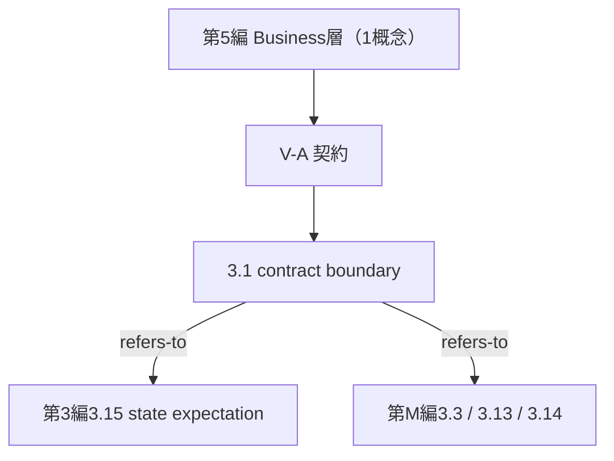

# TECHNICAL SPECIFICATION（試作版 / Pilot）

# 空間データを扱うモデリングの概念辞書 — 第5編: 契約・ガバナンス (Business層)
Conceptual vocabulary for spatial-data modelling — Part 5: Contract and governance (Business layer)

**文書番号（仮）:** STD-EED-0001-5
**版:** 0.1.0-pilot（原辞書 v0.17.0 からの変換試作）
**変換日:** 2026-08-22
**変換範囲:** 原辞書 第V部（5.01、概念1件・現場語2語）

---

## 前書き (Foreword)

本仕様書は、第1〜4編に続く、空間データを扱うモデリングにおける概念語彙の自主技術仕様書であり、**対象語彙（原辞書5章）の最終編**にあたる。用語エントリの構造・記述フォーマット・変換方針は先行4編と同一であり、詳細は第1編前書きを参照。以下は本編（第5編）固有の申し合わせである。

- 原辞書の**恒久ID（IRDI）は一切変更していない**。原辞書 第V部の概念採番（原 `5.01`）は本仕様書の `3.1` に1対1で対応する（附属書E.1）。
- **写像作業の結果、本編1概念に概念ドリフトは確認されなかった（0/1）。** 定義文・具体例・現場語・旧恒久ID（`term.contract-boundary`）はいずれも「契約境界」という命名意図と一貫している。
- **原辞書 第V部の部立て説明文に件数・範囲の誤記を1件発見した。** 原文は「V-A 契約と更新経路の統制（5.01〜M.14、2件）のみ。サブグループが1つしかないのは収録が2件だからであり」と記すが、M.14（単一更新経路の強制）は原辞書6.1節の**メタ語彙**であり、6.1節自身が「RAMI 4.0の3軸は適用しない」と規定している以上、Layers 軸の値 `Business` を持たず、Business層の部の構成員にはなりえない。原辞書4.3節のクロス表も Business 層を計1件としている。本仕様書では「V-A 契約（3.1、1件）」と是正した（`decisions.md` D-2026-08-22-09）。
- **メタ語彙（M.01〜M.14、原辞書6.1節）への参照は、変換時点では forward reference として先送りした**（`decisions.md` D-2026-08-22-01）。本編は3件（M.03、M.13、M.14）を参照しており、収録1件あたりの参照数としては全編で最も多い。（2026-09-02追補：メタ語彙は独立編 `STD-EED-0001-M`（第M編）として変換され、本編の3件は `第M編3.3`／`3.13`／`3.14` への参照に解決済み — `decisions.md` D-2026-08-22-19、D-2026-09-02-01。）
- **`mates-to`（嵌合）関係型は、第I部での予告以来、第II〜V部を通じて確定使用箇所が見つからなかった。** （2026-09-02追補：第M編でも出現せず、全6編・59概念で確定使用ゼロが確定したため本型は**廃止**された — 第M編附属書C.1 NOTE 3、`decisions.md` D-2026-09-02-05。）
- 原辞書2.4節「対比によって識別される語彙ペア」に該当する組は本編に**含まれない**。2.4節の4組のうち3組（`2.07`／`2.08`、`3.01`／`3.02`、`3.03`／`3.04`）は第2・3編に収録済みであり、残る1組（`M.08 同音異義`／`M.09 異音同義`）はメタ語彙編にある。したがって `decisions.md` D-2026-08-22-06（対比ペアの親概念を辞書に立てるべきか）の棚卸しは、**メタ語彙編の変換を待って実施する**こととした。（2026-09-02追補：棚卸しは第M編附属書F で実施し、親概念は**立てない**という結論になった — `decisions.md` D-2026-09-02-06。）

## 序文 (Introduction)

第V部が扱うのは、個々の機能やデータの中身ではなく、部門と部門・システムとシステムの間で交わされる約束事である。状態期待値（3.13、第3編）が工程の入口と出口における約束を扱うのに対し、本編はその約束を閉じたスキーマとして固定し、迂回を許さないという統制の側を扱う。

## 1 適用範囲 (Scope)

本仕様書は、空間データを扱うモデリングにおいてステークホルダー間の共通言語を確立するための概念語彙のうち、**組織・システム間の取り決め（契約）と、それを守らせる統制（ガバナンス）に関する関心事（Business層）に属する用語、定義、および概念間関係のセマンティクス**について規定します。

適用範囲は以下の通りです：

* システム間の入出力を閉じた版管理されたスキーマとして厳密に規定し、非公式なやり取りを許さない境界の語彙（V-A）

特定のプログラミング言語、ファイル形式、通信規格、製品、リポジトリには依存しません。実装（JSON Schema、OPC UA情報モデル、特定のクラス設計等）へのマッピングは、本仕様書を下敷きにした別工程として扱います。

## 2 参照標準・参考文献 (References)

第1〜4編と同一の参照群に加え、本編では以下を主に参照・活用しています：

* ISO 704:2009, Terminology work — Principles and methods
* JSON Schema
* IEC 62541（OPC UA 情報モデル）
* IEC 63278（AAS）
* RAMI 4.0（DIN SPEC 91345）Life Cycle 軸

## 3 用語及び定義 (Terms and Definitions)

各エントリは、用語（英語主名称・和文名・admitted term）、恒久ID（IRDI）、定義文、適用例（EXAMPLE）、およびエントリ注記（Note 1: コアイメージ／Note 2: 概念間関係／Note 3以降: 用法上の注意）で構成されます。分類メタデータは附属書Bに集約しています。

**サブグループ（区分基準＝主題）:** V-A 契約（3.1、1件）のみ。

NOTE 原辞書の記載は「V-A 契約と更新経路の統制（5.01〜M.14、2件）のみ」である。M.14 はメタ語彙（原辞書6.1節）であり Layers 軸の値を持たないため、Business層の部の構成員から外して件数・範囲・名称を是正した（`decisions.md` D-2026-08-22-09）。サブグループが1つしかないのは収録が1件だからであり、契約という主題が本来1種類しかないという意味ではない。空になっている領域は原辞書4.5節に明示されている（`Business × Station` および `Business × Enterprise` がいずれも「未収録」）。

**V-A. 契約**

### 3.1
**contract boundary**
契約境界
IRDI: `eed:0045#001`

システム間の入出力を、閉じたバージョン管理されたスキーマとして厳密に規定し、それ以外の非公式なやり取りを許さない境界。

EXAMPLE 1 （生産）システム連携のためのスキーマ化（JSON Schema、OPC UA情報モデル）。

EXAMPLE 2 （CAD）フロントエンドとバックエンド間のJSON Schema契約。

Note 1 to entry: Core image：部署の壁に貼られた「ここから先はこの書式でしかやり取りしない」という掲示。

Note 2 to entry: Concept relations:
— refers-to 第3編3.15 (state expectation) ※工程の入口・出口における約束を、システム間の契約として固定したもの
— refers-to 第M編3.3 (bounded context), 第M編3.15 (allowed-transition list), 第M編3.16 (single write path)

Note 3 to entry: 本エントリは実装非依存の段階に位置する。スキーマ化（原辞書6.2節の手順4）そのものは本辞書より下流の工程であり、本エントリが規定するのは「境界を閉じたスキーマとして扱う」という概念であって、特定のスキーマ言語ではない。

Note 4 to entry: 原辞書4.5節は `Business × Station`（工程間の受け渡し契約）を「未収録」とし、その理由を「3.13 状態期待値がInformation層にある分、Business層側が空洞になっている」と説明している。本エントリのNote 2にある 第3編3.15（状態期待値）への参照は、この空洞を跨ぐ唯一の橋にあたる。空洞を埋めるエントリの新設要否は第M編附属書F.3 で裁き、**新設しない**（第2段で独自造語となり、第3段で書けなくなっている記述を示せない）という結論になった。原辞書4.5節の「未収録」表示は維持する（`decisions.md` D-2026-09-02-09）。

## 4 概念体系 (Concept System)

本編の1概念は、単一のサブグループ V-A（契約）に属します（区分基準＝主題）。

図の見方：`M` は第M編（メタ語彙）のエントリである。本図は第M編の成立にあわせて forward reference を解決した（`decisions.md` D-2026-09-02-01）。

---

## 附属書A (informative) 現場語・通称対応表 (Shopfloor & Colloquial Terms Mapping)

| 現場語ID | 代表形（概念） | 現場語 (JP) | 主語（登場人物） | 現場での使用場面例 | 同義・異表記 |
|---|---|---|---|---|---|
| `eed:0143#001` | 3.1 contract boundary | JSON Schema契約 | MES・上位システム | CAD・フロントエンドとバックエンド間の閉じたスキーマ | スキーマ契約 |
| `eed:0144#001` | 3.1 contract boundary | OPC UA情報モデル | MES・上位システム | 生産・システム連携のための標準データモデル | OPC UAモデル |

NOTE `eed:0144#001` は原辞書の現場語割り当て（`0060`〜`0144`、85語）の末尾にあたる。第1〜5編の附属書Aを合わせると、原辞書8.7節（現場語→代表形 正規化表）の全85語が欠番なく収録されたことになる（第1編12語／第2編24語／第3編39語／第4編8語／第5編2語）。

## 附属書B (informative) 概念メタデータ一覧 (Concept Metadata Registry)

- **Hier. Level / Life Cycle**: RAMI 4.0 の Hierarchy Levels 軸・Life Cycle 軸。**Layers 軸の欄は設けない**（編構成と一対一に対応するため。本編収録の全概念は `Business`）。
- **Provider / Consumer**: 責務タグ。ロール名は先行編と同じ（ProductDesign／MfgRobotics／StationControl／ShopfloorIT／MetaArchitecture）。
- **語彙区分**: 標準／業界一般／独自の3値。
- **カバレッジ**: 実例を確認済みの分野（生産 / CAD・ロボティクス）。`—` は未確認。

| 採番 | 用語 | IRDI | 旧ID | Hier. Level | Life Cycle | Provider | Consumer | 語彙区分 | カバレッジ |
|---|---|---|---|---|---|---|---|---|---|
| 3.1 | contract boundary | `eed:0045#001` | `term.contract-boundary` | N/A（メタ概念） | Type | MetaArchitecture | ProductDesign, MfgRobotics, StationControl, ShopfloorIT | 業界一般 | 生産 ◯ / CAD ◯ |

NOTE 原辞書4.5節は `Business × Instance` と `Business × Type & Instance` をいずれも「原理的に空（契約は型として結ばれ、個体ごとには結ばれない）」としており、本編の Life Cycle が `Type` の1値のみであることと整合する。

## 附属書C (informative) 関係型セマンティクス (Relational Semantics)

### C.1 概念間関係型

本編で確定使用した関係型は refers-to のみである。収録が1件であるため、概念間関係の大半は編をまたぐ参照になる。

| 関係型 | 意味 | 本編での使用 |
|---|---|---|
| refers-to | 参照・パラメータ関連付け | 本編の全関係（第3編3.15、および第M編3件） |
| is-a / part-of / constrained-by / transforms | （第1〜4編を参照） | 本編では未出現 |
| ~~calibrated-from~~ / ~~aligns-with~~ | （第2編で候補提示） | 本編では該当箇所なし。**全編化時のレビューでいずれも不採用**（全編附属書C.3） |
| mates-to | 嵌合を表す関係（第1編で予告） | 本編でも未出現（下記 NOTE） |

NOTE `mates-to` は第I部での予告以来、対象語彙5編（第II〜V部）を通じて確定使用箇所が見つからなかった。近い実務内容を扱う箇所（第3編3.9（型付き関係）の「意味カテゴリ」軸、第4編3.4（作業インタフェース）の「変化対象＝結合構成」）はいずれも**1つの概念が内部に持つファセット値**であり、概念エントリ間の関係を表す Note 2 の対象とは性質が異なる。（2026-09-02追補：第M編でも出現せず、本型は**廃止**された — 第M編附属書C.1 NOTE 3、`decisions.md` D-2026-09-02-05。）

## 附属書D (informative) 登場人物対応表 — 本編の概念で語られる実在物

| 登場人物 | 一言でいうと | 本編ではどう語られるか |
|---|---|---|
| MES・上位システム | 生産計画と実績を管理する情報システム | 他システムとの間で交わす閉じたスキーマが3.1。現場語（JSON Schema契約、OPC UA情報モデル）の主語でもある |
| CADシステム・PLM | 設計データの出どころ | フロントエンドとバックエンドの間に置く契約として3.1 |
| 工程内場所（ステーション・セル） | 役割を持って区切られた、名前のついた作業場所 | 工程間の受け渡し契約は原辞書4.5節が「未収録」とする領域であり、本編には該当エントリがない（3.1 Note 4） |

NOTE 本編は収録1件であるため、登場人物対応表も3行にとどまる。原辞書4.5節が `Business × Station` を「未収録」としていることの、登場人物側からの現れである。

## 附属書E (informative) 変換対応表 (Conversion Mapping)

### E.1 採番対応

| 本仕様書 | 原辞書採番 | 恒久ID (IRDI) | English Name |
|---|---|---|---|
| 3.1 | 5.01 | `eed:0045#001` | contract boundary |

NOTE 原辞書の採番（`5.01`）と本仕様書の採番（`3.1`）は1対1で対応する。本編に概念分離・新設は発生していない。第4編のような採番の振り直しも、収録が1件であるため生じない。

### E.2 欄の写像規則

第1編附属書E.2および第3編附属書E.2追補の規則をそのまま適用した。本編で新たに追補した規則はない。

### E.3 原辞書の章とISO構成の対応（本編での実現状況）

第1編附属書E.3の計画のうち、本編に関わる項目は「5章 用語及び定義 → 各編の Clause 3」のみであり、Clause 3（3.1）として実現した。基礎規約（原3章）は第2編Clause 4に既出のため本編では再掲しない。メタ語彙（原6章）は `decisions.md` D-2026-08-22-01 の決定により本編でも先送りとし、第M編（`STD-EED-0001-M`）として変換された。

**対象語彙（原辞書5章、45概念）の変換は本編をもって完了した。** （2026-09-03追補：メタ語彙14件も第M編として変換され、原辞書5章・6章の変換は完了した。残っていた全編化時の附属書（MECE検証・索引類）も全編附属書 `STD-EED-0001-0` として成立し、**原辞書の全章の変換が完了した**。D-2026-08-22-01（メタ語彙編の起こし方）は D-2026-08-22-19 で、D-2026-08-22-06（対比ペアの親概念）は D-2026-09-02-06 を経て D-2026-09-02-12 で決着した。）
