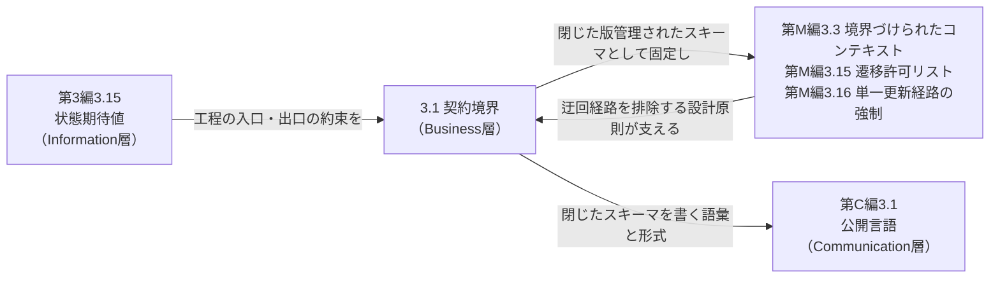
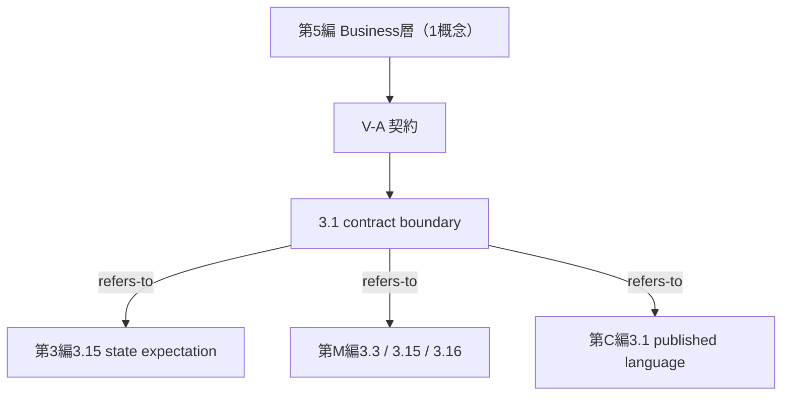

# TECHNICAL SPECIFICATION（試作版 / Pilot）

# 空間データを扱うモデリングの概念辞書 — 第5編: 契約・ガバナンス (Business層)
Conceptual vocabulary for spatial-data modelling — Part 5: Contract and governance (Business layer)

**文書番号（仮）:** STD-EED-0001-5
**版:** 0.1.0-pilot（原辞書 v0.17.0 からの変換試作）
**変換日:** 2026-08-22
**変換範囲:** 原辞書 第V部（5.01、概念1件・現場語2語）

---

## 前書き (Foreword)

本仕様書は、空間データを扱うモデリングにおける概念語彙の自主技術仕様書のうち、第1〜4編に続く**対象語彙（原辞書5章）の最終編**である。
用語エントリの構造、記述フォーマット、変換方針は先行4編と同じであり、詳細は第1編の前書きに記した。
以下に、本編（第5編）に固有の申し合わせを記す。

- 原辞書の**恒久ID（EED-ID）は1件も変更していない**。
  原辞書 第V部の概念採番（原 `5.01`）は、本仕様書の `3.1` に1対1で対応する（附属書E.1）。
- **写像作業では、本編の1概念に概念ドリフトを検出しなかった（0/1）。**
  定義文、具体例、現場語、旧恒久ID（`term.contract-boundary`）は、いずれも「契約境界」という命名意図と一致している。
- **原辞書 第V部の部立て説明文に、件数と範囲の誤記を1件見つけた。**
  原文は「V-A 契約と更新経路の統制（5.01〜M.14、2件）のみ。サブグループが1つしかないのは収録が2件だからであり」と記す。
  しかし M.14（単一更新経路の強制）は原辞書6.1節の**メタ語彙**であり、6.1節自身が「RAMI 4.0の3軸は適用しない」と規定している。
  したがって M.14 は Layers 軸の値 `Business` を持たず、Business 層の部の構成員にはなりえない。
  原辞書4.3節のクロス表も、Business 層を計1件としている。
  本仕様書では「V-A 契約（3.1、1件）」と是正した（`decisions.md` D-2026-08-22-09）。
- **メタ語彙（M.01〜M.14、原辞書6.1節）への参照は、変換時点では forward reference として先送りした**（`decisions.md` D-2026-08-22-01）。
  本編は3件（原 M.03、M.13、M.14）を参照しており、収録1件あたりの参照数は全編で最も多い。
  （2026-09-02追補：メタ語彙は独立編 `STD-EED-0001-M`（第M編）として変換された。本編の3件は、第M編の採番繰り下がり（D-2026-09-02-12）を反映して `第M編3.3`／`3.15`／`3.16` への参照に解決した。`decisions.md` D-2026-08-22-19、D-2026-09-02-01、D-2026-10-04-01。）
- **`mates-to`（嵌合）関係型は、本編でも確定使用箇所がなかった**（附属書C.1 NOTE）。
  （2026-09-02追補：第M編でも出現せず、全6編・59概念で確定使用がゼロだったため、本型を**廃止**した。第M編附属書C.1 NOTE 3、`decisions.md` D-2026-09-02-05。）
- 原辞書2.4節「対比によって識別される語彙ペア」に該当する組は、本編に**含まれない**。
  2.4節の4組のうち3組（`2.07`／`2.08`、`3.01`／`3.02`、`3.03`／`3.04`）は第2・3編に収録済みであり、残る1組（`M.08 同音異義`／`M.09 異音同義`）はメタ語彙編にある。
  そこで、`decisions.md` D-2026-08-22-06（対比ペアの親概念を辞書に立てるべきか）の棚卸しは、**メタ語彙編の変換を待って実施する**こととした。
  （2026-09-02追補：棚卸しは第M編附属書F で実施し、いったん親概念を立てないと判断した（D-2026-09-02-06）。その後、読み手側からの差し戻しを受けて、対比ペア6組すべてで親概念を立てる判断に改めた（D-2026-09-02-12）。）

## 序文 (Introduction)

本編が扱うのは、個々の機能やデータの中身ではなく、部門と部門、システムとシステムの間で交わす約束事である。
状態期待値（第3編3.15）が工程の入口と出口における約束そのものを扱うのに対し、本編は、その約束を閉じたスキーマとして固定し迂回を許さないという統制を扱う。
約束を書き表す語彙と形式は、第C編3.1（公開言語）が扱う。

```mermaid
flowchart LR
    SE["第3編3.15<br/>状態期待値<br/>（Information層）"]
    CB["3.1 契約境界<br/>（Business層）"]
    META["第M編3.3 境界づけられたコンテキスト<br/>第M編3.15 遷移許可リスト<br/>第M編3.16 単一更新経路の強制"]
    PL["第C編3.1<br/>公開言語<br/>（Communication層）"]

    SE -->|"工程の入口・出口の約束を"| CB
    CB -->|"閉じた版管理されたスキーマとして固定し"| META
    META -->|"迂回経路を排除する設計原則が支える"| CB
    CB -->|"閉じたスキーマを書く語彙と形式"| PL
```

## 1 適用範囲 (Scope)

本仕様書は、空間データを扱うモデリングにおいてステークホルダー間の共通言語を確立するための概念語彙のうち、**組織・システム間の取り決め（契約）と、それを守らせる統制（ガバナンス）に関する関心事（Business層）に属する用語、定義、および概念間関係のセマンティクス**について規定します。

適用範囲は以下の通りです：

* システム間の入出力を閉じた版管理されたスキーマとして厳密に規定し、非公式なやり取りを許さない境界の語彙（V-A）

特定のプログラミング言語、ファイル形式、通信規格、製品、リポジトリには依存しません。実装（JSON Schema、OPC UA情報モデル、特定のクラス設計等）へのマッピングは、本仕様書を下敷きにした別工程として扱います。

## 2 参照標準・参考文献 (References)

第1〜4編と同一の参照群に加え、本編では以下を主に参照・活用しています：

* ISO 704:2009, Terminology work — Principles and methods
* JSON Schema
* IEC 62541（OPC UA 情報モデル）
* IEC 63278（AAS）
* RAMI 4.0（DIN SPEC 91345）Life Cycle 軸

## 3 用語及び定義 (Terms and Definitions)

各エントリは、用語（英語主名称・和文名・admitted term・DEPRECATED）、恒久ID（EED-ID）、定義文、適用例（EXAMPLE）、およびエントリ注記（Note 1: コアイメージ／Note 2: 概念間関係／Note 3以降: 用法上の注意）で構成されます。分類メタデータは附属書Bに集約しています。

**サブグループ（区分基準＝主題）:** V-A 契約（3.1、1件）のみ。

NOTE 原辞書の記載は「V-A 契約と更新経路の統制（5.01〜M.14、2件）のみ」である。
M.14 はメタ語彙（原辞書6.1節）であり Layers 軸の値を持たないため、Business 層の部の構成員から外し、件数、範囲、名称を是正した（`decisions.md` D-2026-08-22-09）。
サブグループが1つしかないのは収録が1件だからであり、契約という主題が1種類しかないという意味ではない。
空いている領域は、原辞書4.5節が `Business × Station` と `Business × Enterprise` をいずれも「未収録」として明示している。

**V-A. 契約**

### 3.1
**contract boundary**
契約境界
EED-ID: `eed:0045#001`

システム間の入出力を、閉じたバージョン管理されたスキーマとして厳密に規定し、それ以外の非公式なやり取りを許さない境界。

EXAMPLE 1 （生産）システム連携のためのスキーマ化（JSON Schema、OPC UA情報モデル）。

EXAMPLE 2 （CAD）フロントエンドとバックエンド間のJSON Schema契約。

Note 1 to entry: Core image：部署の壁に貼られた「ここから先はこの書式でしかやり取りしない」という掲示。

Note 2 to entry: Concept relations:
— refers-to 第3編3.15 (state expectation) ※工程の入口・出口における約束を、システム間の契約として固定したもの
— refers-to 第M編3.3 (bounded context), 第M編3.15 (allowed-transition list), 第M編3.16 (single write path)
— refers-to 第C編3.1 (published language) ※本概念が閉じるスキーマは、公開言語で書く。本概念は「非公式なやり取りを許さない」という統制（Business 層）であり、公開言語はそこで交換する語彙と形式（Communication 層）である。EXAMPLE の JSON Schema と OPC UA 情報モデルは、後者の実現物にあたる（2026-09-05 追加。`decisions.md` D-2026-09-05-08）

Note 3 to entry: 本エントリは実装非依存の段階に位置する。
スキーマ化（原辞書6.2節の手順4）そのものは本辞書より下流の工程である。
本エントリが規定するのは「境界を閉じたスキーマとして扱う」という概念であり、特定のスキーマ言語ではない。
設計レビュー（`review/2026-09-05-design-review.md` §3.1）は本エントリを Communication 層へ移す案も挙げたが、定義文が画定するのは統制であるため、Business 層に据え置いた。
Communication 層の受け皿は、第C編3.1（公開言語）として別に立てた（`backlog.md` B-09 クローズ）。

Note 4 to entry: 原辞書4.5節は `Business × Station`（工程間の受け渡し契約）を「未収録」とし、その理由を「3.13 状態期待値がInformation層にある分、Business層側が空洞になっている」と説明している（引用中の `3.13` は原辞書の採番であり、本仕様書の第3編3.15 にあたる）。
本仕様書のなかでこの空洞をまたぐ関係は、本エントリの Note 2 にある第3編3.15（状態期待値）への参照だけである。
空洞を埋めるエントリを新設するかどうかは第M編附属書F.3 で判定し、**新設しない**と結論した。
`decisions.md` 冒頭の3段判定のうち、第2段では既存の呼称がなく独自造語になり、第3段ではその語がないために書けなくなっている記述を示せなかったためである。
原辞書4.5節の「未収録」表示は維持する（`decisions.md` D-2026-09-02-09）。

## 4 概念体系 (Concept System)

本編の1概念は、単一のサブグループ V-A（契約）に属します（区分基準＝主題）。

```mermaid
flowchart TB
    P5["第5編 Business層（1概念）"]
    P5 --> A["V-A 契約"]
    A --> A1["3.1 contract boundary"]
    A1 -->|refers-to| S["第3編3.15 state expectation"]
    A1 -->|refers-to| M["第M編3.3 / 3.15 / 3.16"]
    A1 -->|refers-to| C["第C編3.1 published language"]
```

図の見方：`M` は第M編（メタ語彙）、`C` は第C編（交換語彙）のエントリである。
第M編への参照は第M編の成立時に forward reference を解決したものであり（`decisions.md` D-2026-09-02-01）、第C編への参照は2026-09-05 に追加した（D-2026-09-05-08）。

---

## 附属書A (informative) 現場語・通称対応表 (Shopfloor & Colloquial Terms Mapping)

| 現場語ID | 代表形（概念） | 現場語 (JP) | 主語（登場人物） | 現場での使用場面例 | 同義・異表記 |
|---|---|---|---|---|---|
| `eed:0143#001` | 3.1 contract boundary | JSON Schema契約 | MES・上位システム | CAD・フロントエンドとバックエンド間の閉じたスキーマ | スキーマ契約 |
| `eed:0144#001` | 3.1 contract boundary | OPC UA情報モデル | MES・上位システム | 生産・システム連携のための標準データモデル | OPC UAモデル |

NOTE `eed:0144#001` は、原辞書の現場語割り当て（`0060`〜`0144`、85語）の末尾にあたる。
第1〜5編の附属書Aを合わせると、原辞書8.7節（現場語→代表形 正規化表）の全85語を欠番なく収録している（第1編12語／第2編24語／第3編39語／第4編8語／第5編2語）。

## 附属書B (informative) 概念メタデータ一覧 (Concept Metadata Registry)

- **Hier. Level / Life Cycle**: RAMI 4.0 の Hierarchy Levels 軸・Life Cycle 軸。**Layers 軸の欄は設けない**（編構成と一対一に対応するため。本編収録の全概念は `Business`）。
- **Provider / Consumer**: 責務タグ。ロール名は先行編と同じ（ProductDesign／MfgRobotics／StationControl／ShopfloorIT／MetaArchitecture）。
- **語彙区分**: 標準／業界一般／独自の3値。
- **カバレッジ**: 実例を確認済みの分野（生産 / CAD・ロボティクス）。`—` は未確認。

| 採番 | 用語 | EED-ID | 旧ID | Hier. Level | Life Cycle | Provider | Consumer | 語彙区分 | カバレッジ |
|---|---|---|---|---|---|---|---|---|---|
| 3.1 | contract boundary | `eed:0045#001` | `term.contract-boundary` | N/A（メタ概念） | Type | MetaArchitecture | ProductDesign, MfgRobotics, StationControl, ShopfloorIT | 業界一般 | 生産 ◯ / CAD ◯ |

NOTE 原辞書4.5節は `Business × Instance` と `Business × Type & Instance` をいずれも「原理的に空（契約は型として結ばれ、個体ごとには結ばれない）」としており、本編の Life Cycle が `Type` の1値のみであることと整合する。

## 附属書C (informative) 関係型セマンティクス (Relational Semantics)

### C.1 概念間関係型

本編で確定使用した関係型は refers-to だけである。
収録が1件であるため、本編の概念間関係はすべて編をまたぐ参照になる。

| 関係型 | 意味 | 本編での使用 |
|---|---|---|
| refers-to | 参照・パラメータ関連付け | 本編の全関係（第3編3.15、第M編3件、第C編3.1） |
| is-a / part-of / constrained-by / transforms | （第1〜4編を参照） | 本編では未出現 |
| ~~calibrated-from~~ / ~~aligns-with~~ | （第2編で候補提示） | 本編では該当箇所なし。**全編化時のレビューでいずれも不採用**（全編附属書C.3） |
| mates-to | 嵌合を表す関係（第1編で予告） | 本編でも未出現（下記 NOTE） |

NOTE `mates-to` は、第I部で予告して以来、第II〜V部を通じて確定使用箇所がなかった。
嵌合に近い実務内容を扱う箇所はある（第3編3.9（型付き関係）の「意味カテゴリ」軸、第4編3.4（作業インタフェース）の「変化対象＝結合構成」）。
しかし、いずれも**1つの概念が内部に持つファセット値**であり、概念エントリ間の関係を表す Note 2 の対象ではない。
（2026-09-02追補：第M編でも出現しなかったため、本型を**廃止**した。第M編附属書C.1 NOTE 3、`decisions.md` D-2026-09-02-05。）

## 附属書D (informative) 登場人物対応表 — 本編の概念で語られる実在物

| 登場人物 | 一言でいうと | 本編ではどう語られるか |
|---|---|---|
| MES・上位システム | 生産計画と実績を管理する情報システム | 他システムとの間で交わす閉じたスキーマが3.1。現場語（JSON Schema契約、OPC UA情報モデル）の主語でもある |
| CADシステム・PLM | 設計データの出どころ | フロントエンドとバックエンドの間に置く契約として3.1 |
| 工程内場所（ステーション・セル） | 役割を持って区切られた、名前のついた作業場所 | 工程間の受け渡し契約は原辞書4.5節が「未収録」とする領域であり、本編には該当エントリがない（3.1 Note 4） |

NOTE 本編は収録が1件であるため、登場人物対応表も3行にとどまる。
このうち「工程内場所」の行は、該当エントリがないことを示すために置いた。
原辞書4.5節が `Business × Station` を「未収録」としていることを、登場人物の側から見た記述にあたる。

## 附属書E (informative) 変換対応表 (Conversion Mapping)

### E.1 採番対応

| 本仕様書 | 原辞書採番 | 恒久ID (EED-ID) | English Name |
|---|---|---|---|
| 3.1 | 5.01 | `eed:0045#001` | contract boundary |

NOTE 原辞書の採番（`5.01`）と本仕様書の採番（`3.1`）は1対1で対応する。
本編では概念の分離も新設も行っていない。
収録が1件であるため、第4編のような採番の振り直しも生じない。

### E.2 欄の写像規則

第1編附属書E.2および第3編附属書E.2追補の規則をそのまま適用した。本編で新たに追補した規則はない。

### E.3 原辞書の章とISO構成の対応（本編での実現状況）

第1編附属書E.3の計画のうち、本編に関わる項目は「5章 用語及び定義 → 各編の Clause 3」だけであり、Clause 3（3.1）として実現した。
基礎規約（原3章）は第2編 Clause 4 に既出のため、本編では再掲しない。
メタ語彙（原6章）は `decisions.md` D-2026-08-22-01 の決定により本編でも先送りし、のちに第M編（`STD-EED-0001-M`）として変換した。

**対象語彙（原辞書5章、45概念）の変換は、本編で完了した。**

（2026-09-03追補：メタ語彙14件を第M編として変換し、全編化時の附属書（MECE検証、索引類）を全編附属書 `STD-EED-0001-0` として作成したことで、**原辞書の全章の変換が完了した**。
本編が先送りしていた判断のうち、D-2026-08-22-01（メタ語彙編の起こし方）は D-2026-08-22-19 で、D-2026-08-22-06（対比ペアの親概念）は D-2026-09-02-06 を経て D-2026-09-02-12 で決着した。）
