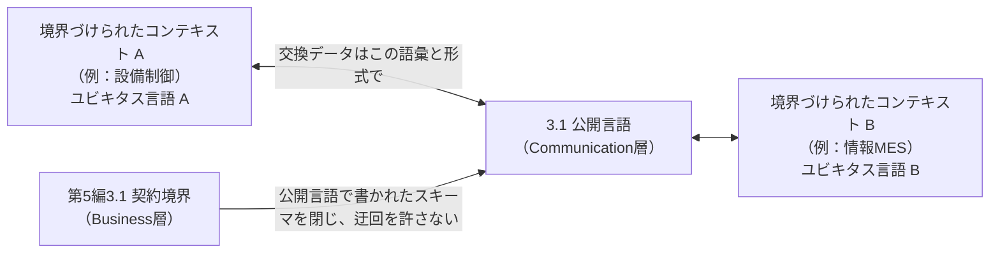
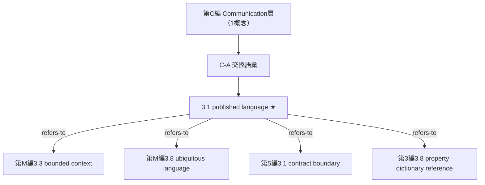

# TECHNICAL SPECIFICATION（試作版 / Pilot）

# 空間データを扱うモデリングの概念辞書 — 第C編: 交換語彙 (Communication層)
Conceptual vocabulary for spatial-data modelling — Part C: Exchange vocabulary (Communication layer)

**文書番号（仮）:** STD-EED-0001-C
**版:** 0.1.0-pilot（設計レビュー 2026-09-05 を受けた新設編）
**作成日:** 2026-09-05
**収録範囲:** 原辞書に対応する部はない（概念1件・現場語0語。いずれも本仕様書での新設提案）

---

## 前書き (Foreword)

本仕様書は、空間データを扱うモデリングにおける概念語彙の自主技術仕様書のうち、RAMI 4.0 の **Communication 層**に属する語彙を収める編である。用語エントリの構造・記述フォーマット・変換方針は第1〜5編と同一であり、詳細は第1編前書きを参照。以下は本編（第C編）固有の申し合わせである。

- **本編は原辞書のどの部にも対応しない。** 原辞書4.1節は RAMI 4.0 の Layers 軸を5値（Asset／Integration／Information／Functional／Business）としていたが、RAMI 4.0（DIN SPEC 91345）の Layers 軸は Communication 層を含む**6層**である。設計レビュー（`review/2026-09-05-design-review.md` §3.1）がこの欠落を指摘し、全編附属書F.1 は同日に軸1を6値へ改めて Communication 層を「未収録」とした（`decisions.md` D-2026-09-05-05、`backlog.md` F-24）。本編はその未収録を埋める最初のエントリを収める。
- **編番号を数字ではなく `C` とした。** RAMI 4.0 の並びでは Communication 層は Integration 層と Information 層のあいだに置かれるが、そこへ数字の編番号を差し込むと第3〜5編の文書番号が繰り下がり、既存の編をまたぐ参照（`第3編3.M` 等）がすべて動く。第M編（メタ語彙）が `-M` としたのと同じ理由で、文書番号は `STD-EED-0001-C` とする（`decisions.md` D-2026-09-05-08）。
- **収録1件はいずれも本仕様書での新設提案である**（`eed:0174#001`。`backlog.md` P-08）。恒久IDの発番は原辞書側の承認を要する。第5編と同じく1概念編であるが、第5編の1件が原辞書由来であるのに対し、本編の1件は原辞書に見出し語を持たない。
- **契約境界（第5編3.1）は Business 層に据え置いた。** レビューは契約境界の適用例（JSON Schema、OPC UA情報モデル）が Communication 層の内容に近いことから、契約境界そのものを Communication 層へ移す案（`backlog.md` B-09 の案(a)）も挙げていたが、契約境界の定義文が画定するのは「非公式なやり取りを許さない」という**統制**であり、これは RAMI の Business 層（契約・規制）に属する。JSON Schema や OPC UA情報モデルは契約境界の**実現物**であって、契約境界と同じ概念ではない。両者の関係は本編3.1 Note 2 に記す。

## 序文 (Introduction)

この辞書の動機は、部署ごと・システムごとに異なる意味で使われる空間語彙のズレを解消することにある。第M編3.8（ユビキタス言語）はその解決の構えを述べ、第M編3.3（境界づけられたコンテキスト）は「境界の外では同じ言葉が別の意味を持ってもよい」と割り切る。しかし本辞書そのものは、0章の4ドメイン（製品設計・生技ロボティクス・設備制御・情報MES）という複数のコンテキストを**またいで**共有される語彙である。コンテキストの内側で成立する共通語彙（ユビキタス言語）と、コンテキストの**あいだ**で交換のために公開される語彙は、ドメイン駆動設計（第M編3.2）が Ubiquitous Language と Published Language として区別してきた別の概念であるにもかかわらず、本辞書には後者を名指しする語がなかった。第M編3.8 の適用例が「この統合辞書そのもの」と書いていたのは、この欠落を迂回した結果である。

Communication 層は RAMI 4.0 において「統一されたデータ形式による標準化された通信」を担う層であり、Integration 層（座標・仮想化）と Information 層（意味・データ）のあいだに置かれる。本編が扱うのは通信規格やプロトコルではなく、**交換されるデータが何という語と形式で書かれるか**という語彙の側である。

## 1 適用範囲 (Scope)

本仕様書は、空間データを扱うモデリングにおいてステークホルダー間の共通言語を確立するための概念語彙のうち、**複数のコンテキスト・システムの間で交換されるデータの用語と形式に関する関心事（Communication層）に属する用語、定義、および概念間関係のセマンティクス**について規定します。

適用範囲は以下の通りです：

* 境界づけられたコンテキストの間で共有される交換語彙（C-A）

特定のプログラミング言語、ファイル形式、通信規格（OPC UA、MQTT 等のプロトコル）、製品、リポジトリには依存しません。第1編 Clause 1 の「通信規格に依存しない」という方針は本編でも維持されます——本編が扱うのは通信の**語彙**であり、通信の**手段**ではありません。

## 2 参照標準・参考文献 (References)

第1〜5編と同一の参照群に加え、本編では以下を主に参照・活用しています：

* ISO 704:2009, Terminology work — Principles and methods
* E. Evans, *Domain-Driven Design*, 2003（Published Language・Context Map）
* ISO 10303-242 (STEP AP242), Managed model-based 3D engineering（CAD 間の交換語彙の例）
* OPC UA for Robotics（VDMA 40010）, Companion Specification（ロボットと上位システムの交換語彙の例）
* IEC 61360 / ISO 13584 / ECLASS / IEC CDD（交換語彙の各語に世界一意の識別子を与える仕組み。第3編3.8）
* DIN SPEC 91345:2016-04, Reference Architecture Model Industrie 4.0 (RAMI 4.0) Communication layer

## 3 用語及び定義 (Terms and Definitions)

各エントリは、用語（英語主名称・和文名・admitted term・DEPRECATED）、恒久ID（EED-ID）、定義文、適用例（EXAMPLE）、およびエントリ注記（Note 1: コアイメージ／Note 2: 概念間関係／Note 3以降: 用法上の注意）で構成されます。分類メタデータは附属書Bに集約しています。

**サブグループ（区分基準＝主題）:** C-A 交換語彙（3.1、1件）のみ。

NOTE サブグループが1つしかないのは収録が1件だからであり、Communication 層の主題が1種類しかないという意味ではない。空になっている領域は全編附属書F.5 に明示されている（`Communication × Product`〜`Communication × Enterprise` の5セルと `Communication × Instance`・`Communication × Type & Instance` の2セルが「未収録」）。

**C-A. 交換語彙**

### 3.1
**published language**
公開言語
admitted term: 交換語彙／exchange vocabulary
EED-ID: `eed:0174#001`（**新設提案**。Note 3参照）

複数の境界づけられたコンテキスト（第M編3.3）の間で交換されるデータの用語と形式を定め、当事者が共同で公開する語彙。

EXAMPLE 1 （生産）OPC UA for Robotics のコンパニオン仕様が定める情報モデル。ロボットコントローラと MES は、どちらの内部語彙でもない公開された語彙でやり取りする。本辞書の英語主名称をプログラムの変数名・UI表示・通信仕様書にそのまま用いる運用も、本辞書を公開言語として使う例である。

EXAMPLE 2 （CAD）STEP AP242（ISO 10303）による CAD システム間のデータ交換。各 CAD の内部表現ではなく、公開された交換語彙で形状と PMI を受け渡す。フロントエンドとバックエンドが JSON Schema で共有する型定義も同型である。

Note 1 to entry: Core image：部署ごとの方言ではなく、部署間でやり取りする「共通の申し込み用紙」に印刷されている言葉。

Note 2 to entry: Concept relations:
— refers-to 第M編3.3 (bounded context) ※本概念が橋渡しする境界。境界の内側の語彙はコンテキストごとに違ってよいが、境界をまたぐデータは本概念で書く
— refers-to 第M編3.8 (ubiquitous language) ※コンテキストの内側で成立した共通語彙をコンテキストの外へ公開した**成果物**が本概念。ユビキタス言語はメタ語彙（辞書について語る語彙）、本概念は交換される当のもの
— refers-to 第5編3.1 (contract boundary) ※契約境界が閉じるスキーマは本概念で書かれる。契約境界は「非公式なやり取りを許さない」という**統制**（Business層）、本概念はそこで交換される**語彙と形式**（Communication層）であり、別の概念である
— refers-to 第3編3.8 (property dictionary reference) ※本概念の各語に世界一意の識別子を与える仕組み
— refers-to 第M編3.12 (canonicalization) ※本概念を定める作業は用語正規化を含む

Note 3 to entry: 本エントリは**本仕様書での新設提案**である（恒久IDの発番は原辞書側の承認を要する。`decisions.md` D-2026-09-05-08、`backlog.md` P-08）。3段判定（`decisions.md` 冒頭）の適用結果は次のとおり。第1段○——上位概念「語彙」＋区別的特性「複数の境界づけられたコンテキストの間で交換されるデータのために当事者が共同で公開する」で定義文が書ける。第2段○——ドメイン駆動設計の Published Language（Evans 2003）という既存の呼称があり、語彙区分は「業界一般」になる。第3段○（書き手側）——第M編3.8（ユビキタス言語）の適用例が「この統合辞書そのもの」と書いていたが、本辞書は0章の4ドメイン（＝複数の境界づけられたコンテキスト）をまたぐ語彙であり、第M編3.3 が「境界の外では別の意味でもよい」と定める以上、コンテキストの内側の語彙とコンテキストの間の語彙を同じ語で呼ぶことはできない。この記述は本概念を名指しできずに迂回していた。第3段○（読み手側）——第5編3.1 の適用例（JSON Schema、OPC UA情報モデル）が何の実現物であるかを、辞書内で引けなかった。

Note 4 to entry: 本概念を対象語彙（RAMI 3軸を持つ）に置き、メタ語彙（第M編）に置かない理由は、「MES とロボットコントローラは公開言語でやり取りする」のように**登場人物を主語にして言える**からである（第M編 序文の分離基準）。第M編3.8（ユビキタス言語）が辞書について語る語彙であるのに対し、本概念は登場人物の間で実際に交換される当のものである。第5編3.1（契約境界）が同じ基準で対象語彙に置かれていることと整合する。

Note 5 to entry: RAMI 4.0 の Layers 値は `Communication` である。Hierarchy Level は、本概念の種別が convention（規約）であるため全編附属書F.1 の規則により `N/A（メタ概念）` とする（公開言語は特定の設備階層に属さず、どの階層のデータにも同じ形で適用される）。Life Cycle は `Type`（語彙は型として定められ、個体ごとには定められない）。

Note 6 to entry: 本概念に対応する現場語は未抽出（存在しない現場語を創作しない）。「コンパニオン仕様」「交換フォーマット」は現場語候補として有力であるが、存在確認のうえ発番すること。

## 4 概念体系 (Concept System)

本編の1概念は、単一のサブグループ C-A（交換語彙）に属します（区分基準＝主題）。

図の見方：★は本仕様書での新設提案。本編の関係はすべて編をまたぐ参照であり、参照先の各エントリ（第M編3.3・3.8、第5編3.1、第3編3.8）の Note 2 にも本エントリへの逆参照を置いた（README 手順4の機械照合）。

---

## 附属書A (informative) 現場語・通称対応表 (Shopfloor & Colloquial Terms Mapping)

本編の概念に対応する現場語は未抽出である（3.1 Note 6）。存在しない現場語を創作しないため、本表は空とする。

## 附属書B (informative) 概念メタデータ一覧 (Concept Metadata Registry)

- **Hier. Level / Life Cycle**: RAMI 4.0 の Hierarchy Levels 軸・Life Cycle 軸。**Layers 軸の欄は設けない**（編構成と一対一に対応するため。本編収録の全概念は `Communication`）。
- **種別**: 概念種別（object／value／operation／convention／classification／principle。全編附属書F.1、2026-09-05 追加）。
- **Provider / Consumer**: 責務タグ。ロール名は先行編と同じ（ProductDesign／MfgRobotics／StationControl／ShopfloorIT／MetaArchitecture）。
- **語彙区分**: 標準／業界一般／独自の3値。
- **カバレッジ**: 実例を確認済みの分野（生産 / CAD・ロボティクス）。`—` は未確認。

| 採番 | 用語 | EED-ID | 旧ID | 種別 | Hier. Level | Life Cycle | Provider | Consumer | 語彙区分 | カバレッジ |
|---|---|---|---|---|---|---|---|---|---|---|
| 3.1 ★ | published language | `eed:0174#001`（新設提案） | —（新設） | convention | N/A（メタ概念） | Type | MetaArchitecture | ProductDesign, MfgRobotics, StationControl, ShopfloorIT | 業界一般 | 生産 ◯ / CAD ◯ |

NOTE 責務タグは第5編3.1（契約境界）と同じ（P＝共通アーキテクチャ、C＝4ドメインすべて）。公開言語を定めるのは横断ガバナンス役割であり、使うのは境界をまたぐすべての当事者である。

## 附属書C (informative) 関係型セマンティクス (Relational Semantics)

### C.1 概念間関係型

本編で確定使用した関係型は refers-to のみである。収録が1件であるため、概念間関係はすべて編をまたぐ参照になる。

| 関係型 | 意味 | 本編での使用 |
|---|---|---|
| refers-to | 参照・パラメータ関連付け | 本編の全関係（第M編3.3・3.8・3.12、第5編3.1、第3編3.8） |
| is-a / part-of / constrained-by / transforms | （第1〜4編を参照） | 本編では未出現 |

NOTE 第M編3.8（ユビキタス言語）との関係を is-a や part-of に精密化することはしない。ユビキタス言語はメタ語彙であり RAMI 3軸を持たないため、対象語彙である本概念と類種関係に置くと、対象語彙とメタ語彙の分離基準（第M編 序文）を壊す。両者は「構え」と「成果物」の関係であり、全編附属書C.4 の条件（すべての個体について成立する型）を満たす名前がまだない。

## 附属書D (informative) 登場人物対応表 — 本編の概念で語られる実在物

| 登場人物 | 一言でいうと | 本編ではどう語られるか |
|---|---|---|
| MES・上位システム | 生産計画と実績を管理する情報システム | 設備側と交わすデータの語彙と形式が3.1（OPC UA コンパニオン仕様） |
| CADシステム・PLM | 設計データの出どころ | 他の CAD・下流システムへ渡す交換語彙が3.1（STEP AP242） |
| 設計・生技・制御・情報の各担当者（0章の4ドメイン） | 部署をまたいで会話し、この辞書を書き、使う人たち | 部署間で交わすデータの語彙を公開したものが3.1。本辞書そのものを公開言語として運用する当事者 |

NOTE 本編は収録1件であるため、登場人物対応表も3行にとどまる。第5編附属書D の3行のうち「工程内場所」が「設計・生技・制御・情報の各担当者」に置き換わった形であり、第5編が「約束を守らせる側」を、本編が「約束の中身を書く語彙」を語っている。

## 附属書E (informative) 変換対応表 (Conversion Mapping)

### E.1 採番対応

| 本仕様書 | 原辞書採番 | 恒久ID (EED-ID) | English Name |
|---|---|---|---|
| 3.1 | —（本仕様書での新設提案） | `eed:0174#001`（提案） | published language |

NOTE 本編は原辞書に対応する部を持たないため、採番対応は新設提案の1行のみである。項目コード `0174` は 2026-09-05 の現場語登録（`eed:0154`〜`0173`）の直後に置いた（全編附属書G.9）。

### E.2 欄の写像規則

第1編附属書E.2（2026-09-05 の `DEPRECATED:` 行の追加を含む）および第3編附属書E.2追補の規則をそのまま適用した。本編で新たに追補した規則はない。

### E.3 原辞書の章とISO構成の対応（本編での実現状況）

本編は原辞書のどの章にも対応しない。原辞書4.1節の Layers 軸に `Communication` を加える指摘（`backlog.md` F-24）が原辞書側で受け入れられた場合、本編の3.1 は原辞書5章に新しい部（第C部または第II部と第III部のあいだ）として収録されることになる。その採番と部立て説明文の書き方は原辞書側の判断に委ねる。
