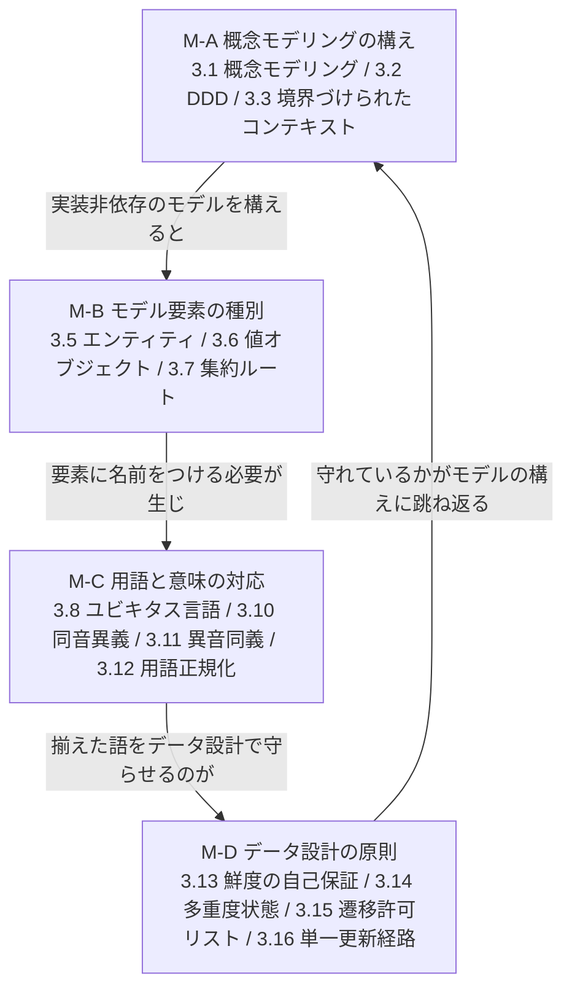
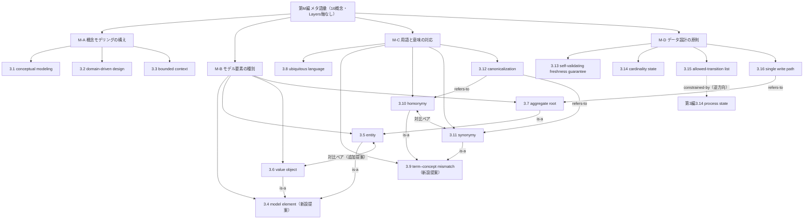

# TECHNICAL SPECIFICATION（試作版 / Pilot）

# 空間データを扱うモデリングの概念辞書 — 第M編: メタ語彙 (Meta-vocabulary)
Conceptual vocabulary for spatial-data modelling — Part M: Meta-vocabulary

**文書番号（仮）:** STD-EED-0001-M
**版:** 0.1.0-pilot（原辞書 v0.17.0 からの変換試作）
**変換日:** 2026-09-02
**変換範囲:** 原辞書 6章（6.1節 メタ語彙 M.01〜M.14、14件／6.2節・6.3節 手順）

---

## 前書き (Foreword)

本仕様書は、第1〜5編（対象語彙、45概念）に続く**メタ語彙の編**である。対象語彙が「工場の対象について語る語彙」であるのに対し、本編が収録するのは「その語彙を作り、揃え、使うための語彙」である。用語エントリの構造・記述フォーマット・変換方針は先行5編と同一であり、詳細は第1編前書きを参照。以下は本編（第M編）固有の申し合わせである。

- **文書番号は `STD-EED-0001-M` とし、`-6` は用いない。** `-1`〜`-5` は RAMI 4.0 Layers 軸との一対一対応で振られており（`decisions.md` D-2026-08-18-03）、Layers 軸を持たないメタ語彙に `-6` を与えるとこの不変条件が壊れる。原辞書6.1節が採番を `6.01` ではなく `M.01` としたのと同じ判断を文書番号にも適用した（D-2026-08-22-19）。
- 原辞書の**恒久ID（IRDI）は一切変更していない**。原辞書6.1節の採番（原 `M.01`〜`M.14`）は本仕様書の `3.1`〜`3.14` に欠番なく1対1で対応する（附属書E.1）。
- **本編は RAMI 4.0 の3軸をいずれも持たない**（原辞書6.1節「軸そのものが工場の対象を前提にしている」）。したがって附属書Bは Hierarchy Levels / Life Cycle の欄を設けない。先行5編との表の形式差は、独立編としたことで編ごと切り分けられている（D-2026-08-22-19）。
- **本編には現場語がない**（附属書Aは該当なし）。原辞書8.7節の現場語85語は第1〜5編の附属書Aにすべて収録済みであり（12＋24＋39＋8＋2＝85。2026-09-05 に本仕様書で登録した20語を加えると105語）、メタ語彙に割り当てられた語は1語もない。これは欠落ではなく、現場で口にされるのは対象語彙の側だという構造の現れである。
- **対比ペアの上位概念として `3.4`（モデル要素、`eed:0150#001`）と `3.9`（用語–概念対応のズレ、`eed:0151#001`）を新設した**（**新設提案**）。附属書F.1 は当初これを「立てない」と裁いたが、**子概念だけが先に現れると読み手がそれを何の一種か掴めないまま定義文に入ることになる**という読み手側の理由により、全6組について上位概念を立てる方針へ改めた（`decisions.md` D-2026-09-02-12、`backlog.md` P-05）。これにともない本編の採番が繰り下がった（附属書E.1。恒久IDは不変）。
- **写像作業の結果、原辞書由来の14概念のうち概念ドリフトを1件検出した（1/14）。** `3.11`（原M.11 キャッシュ鮮度の自己保証）の**英語主名称だけが差異的特性を落としている**。和文名（自己保証）・別称（self-validating cache）は保持しているため、処置は英語主名称の是正のみで足りる（**提案値**。`decisions.md` D-2026-09-02-02、`backlog.md` P-04／F-12）。
- **原辞書6.1節の部立て記述（件数・範囲）に誤記はなかった。** M-A（M.01〜M.03、3件）／M-B（M.04〜M.06、3件）／M-C（M.07〜M.10、4件）／M-D（M.11〜M.14、4件）＝14件は本文と一致する。第II部（D-2026-08-21-01）・第V部（D-2026-08-22-09）で見つかった型の不整合は本編にはない。
- **編をまたぐ概念参照の記法を `第N編3.M` に統一した**（`decisions.md` D-2026-09-02-13）。旧版の「編番号.採番」形は、第M編では `M.11` のように**原辞書のメタ語彙採番と完全に衝突する**ため、本編の成立にあわせて全6編の記法を改めた。
- **参照の集計（D-2026-08-22-19 の根拠）を本編の変換で再確認した。** 原辞書のメタ語彙内部の相互参照34件は**すべて双方向で対**になっており（17組×2）、片側だけの参照は1件もない。境界をまたぐ参照も、メタ語彙側から対象語彙への10件と対象語彙側からメタ語彙への10件が**完全に一致**する。独立編としても参照の非対称は生じない。
- **ただし、関連エントリ欄に載っていない関係を1件検出した。** 原M.06（集約ルート）の定義文は上位概念を「境界となる**エンティティ**」と述べており、これは原M.04 を名指しているが、M.06・M.04 のどちらの関連エントリ欄にも相手がない。本編では 3.7 → 3.5 に `is-a` を付与したため、本編の内部参照は34件＋1組＝36件になる（附属書C.1、F.4）。同種の記載漏れは対象語彙側でも3件見つかっている。
- **`mates-to`（嵌合）関係型は本編でも出現せず、全編を通じて確定使用ゼロが確定した。これをもって本型を廃止する**（附属書C、`decisions.md` D-2026-09-02-05、`backlog.md` B-07 クローズ）。
- **先行編が本編待ちとしていた判断（`backlog.md` B-02〜B-05）を、附属書Fですべて裁いた。** 対比ペアの親概念（B-02）・掃引の切り出し（B-03）・`Business × Station` の空洞（B-05）はいずれも**立てない**、原辞書2.4節への対比ペア追加（B-04）は**2組を追加する**（提案）という結論である。
- **原辞書6章はこれをもって全文が変換された。** 6.2節（モデリングを進める4つの手順）・6.3節（共通言語を作る5つの手順）は附属書Gに収めた。第1編附属書E.3の変換計画で「別編（メタ語彙編）または附属書（全編化時に要判断）」と留保されていた行は、本編の成立をもって閉じる。

## 序文 (Introduction)

本編が扱うのは、工場の対象ではなく、**モデル・辞書・語・用語作業そのもの**である。原辞書6章冒頭は、対象語彙とメタ語彙を分ける基準を次の一文に置いている。

> **その語は、登場人物（工場に実在するモノと人）を主語にして述語として言えるか。**
> 言える（例：「ワークはエンティティである」「この値は算出値である」）→ 対象語彙（第1〜5編）。
> 言えない。主語がモデル・辞書・語・作業のいずれかになる（例：「この設計はDDDに従う」「『原点』は同音異義である」）→ 本編のメタ語彙。

この基準があるため、第1〜5編のエントリはすべて何らかの登場人物に接続するという不変条件が成立する。本編にはその条件を課さない（附属書D）。

本編の4つのサブグループは、モデルを**構える**（M-A）→ モデルの**部品を種別に分ける**（M-B）→ 部品につける**語と意味を突き合わせる**（M-C）→ 語と意味をデータ設計の**原則として守らせる**（M-D）という順に並んでいる。

## 1 適用範囲 (Scope)

本仕様書は、空間データを扱うモデリングにおいてステークホルダー間の共通言語を確立するための語彙のうち、**その共通言語を作り、揃え、使うための語彙（メタ語彙）に属する用語、定義、および概念間関係のセマンティクス**について規定します。

適用範囲は以下の通りです：

* 実装技術に依存しない形で対象ドメインを構造化するための構えの語彙（M-A）
* モデルの構成要素を同一性の判定基準によって種別に分けるための語彙（M-B）
* 用語と意味の対応のズレを検出し、代表形へ畳み込むための語彙（M-C）
* 揃えた語彙をデータ設計上の原則として守らせるための語彙（M-D）

本編の用語は、いずれも**工場に実在するモノ・人を主語にして述語として言えない**。RAMI 4.0 の3軸（Layers / Hierarchy Levels / Life Cycle）は適用しません。特定のプログラミング言語、ファイル形式、通信規格、製品、リポジトリにも依存しません。

## 2 参照標準・参考文献 (References)

第1〜5編と同一の参照群に加え、本編では以下を主に参照・活用しています：

* ISO 704:2009, Terminology work — Principles and methods
* ISO 1087:2019, Terminology work and terminology science — Vocabulary
* IEC 61360（preferred name の考え方）
* Eric Evans, Domain-Driven Design (2003)
* IEC 63278（AAS / Submodel 構造）
* ISA-95（状態遷移の記述）

## 3 用語及び定義 (Terms and Definitions)

各エントリは、用語（英語主名称・和文名・admitted term）、恒久ID（IRDI）、定義文、適用例（EXAMPLE）、およびエントリ注記（Note 1: コアイメージ／Note 2: 概念間関係／Note 3以降: 用法上の注意）で構成されます。分類メタデータは附属書Bに集約しています。

**サブグループ（区分基準＝主題。件数・範囲は原辞書の記述と一致、訂正なし）:** M-A 概念モデリングの構え（3.1〜3.3、3件）／ M-B モデル要素の種別（3.4〜3.7、4件。うち3.4は本仕様書での新設提案）／ M-C 用語と意味の対応（3.8〜3.12、5件。うち3.9は本仕様書での新設提案）／ M-D データ設計の原則（3.13〜3.16、4件）。

NOTE 本編の概念はいずれも Layers 軸の値を持たないため、「編＝層」という第1〜5編の対応は本編には適用されない。本編が独立した編であるのは層に対応するからではなく、内部の結合度が高く（相互参照34件）、対象語彙との結合が薄い（10件・7概念）ためである（`decisions.md` D-2026-08-22-19）。

**M-A. 概念モデリングの構え**

### 3.1
**conceptual modeling**
概念モデリング
IRDI: `eed:0046#001`

対象ドメインに存在する概念・関係性・ルールを、特定の実装技術に依存しない形で抽象化・構造化する作業。

EXAMPLE 1 （生産）ワークの共通コア＋コンテキスト別ビューという構成。

EXAMPLE 2 （CAD）MVCからDDDへの段階的リファクタリングという設計方針。

Note 1 to entry: Core image：実装の都合をいったん忘れて、対象物の本質だけを紙に描き出す作業。

Note 2 to entry: Concept relations:
— refers-to 3.2 (domain-driven design) ※3.2は本概念の下位概念ではない。本概念は「作業」、3.2は「設計手法」であり上位概念が異なる（附属書C.1）

Note 3 to entry: 本辞書そのものが本エントリの成果物である。原辞書6.2節（附属書G.1）の4手順は、この作業を空間データの領域に具体化したものにあたる。

### 3.2
**domain-driven design**
ドメイン駆動設計
admitted term: DDD
IRDI: `eed:0047#001`

対象ドメインの専門知識を中心に据え、業務で使われる言葉や概念をそのままモデルに反映させる設計手法。

EXAMPLE 1 （生産）ステークホルダーごとに用語を分けるという構成方針。

EXAMPLE 2 （CAD）MVCパターンからDDDへの移行が明記されたアーキテクチャ方針。

Note 1 to entry: Core image：業務の言葉をそのままプログラムの言葉にする、という約束事。

Note 2 to entry: Concept relations:
— refers-to 3.1 (conceptual modeling)
— refers-to 3.3 (bounded context), 3.5 (entity), 3.6 (value object), 3.7 (aggregate root), 3.8 (ubiquitous language) ※本手法の構成物。ISO 704 の部分関係ではなく連想関係として扱う（附属書C.1 NOTE 2）

### 3.3
**bounded context**
境界づけられたコンテキスト
IRDI: `eed:0048#001`

特定のモデルや用語が一貫した意味を持つ範囲。境界の外では同じ言葉が別の意味を持ってもよいと割り切る考え方。

EXAMPLE 1 （生産）幾何・マテハン・配置・工程品質という4つの関心事の切り分け。

EXAMPLE 2 （CAD）ドメイン／モデル／サービス／ビュー／コントローラという層の切り分け、およびフロントエンド／契約／バックエンドという3層構成。

Note 1 to entry: Core image：同じ言葉でも部署が違えば辞書を分ける、という縄張り。

Note 2 to entry: Concept relations:
— refers-to 3.2 (domain-driven design), 3.7 (aggregate root)
— refers-to 3.10 (homonymy) ※境界の外で同じ言葉が別の意味を持つことを許す以上、同音異義は境界をまたいだときに現れる
— refers-to 第5編3.1 (contract boundary) ※コンテキスト境界をシステム間で閉じたスキーマとして固定したものが契約境界である

Note 3 to entry: インダストリー4.0の AAS／Submodel 構造（IEC 63278）もこの考え方の一種である。原辞書は本文を定義文の3文目に置いていたが、外部規格との対応は定義文ではなく注記に置く規則（附属書E.2）に従い、本仕様書では Note へ移した。

**M-B. モデル要素の種別**

### 3.4
**model element**
モデル要素
IRDI: `eed:0150#001`（**新設提案**。Note 3参照）

ドメインモデルを構成する要素のうち、**同一性の判定基準**——固有の識別子によるか、属性値そのものによるか——によって種別が定まるもの。

EXAMPLE 1 （生産）ワーク個体（識別子で同一性が決まる）と、その外形寸法（値そのもので同一性が決まる）。

EXAMPLE 2 （CAD）識別子を持つ立体と、頂点座標の組。

Note 1 to entry: Core image：モデルに置く部品を「名札で見分けるもの」と「中身で見分けるもの」に仕分ける枠。

Note 2 to entry: Concept relations:
— is-a の逆方向: 3.5 (entity)、3.6 (value object) が本概念の下位概念である。3.7 (aggregate root) は 3.5 を介した下位概念にあたる
— refers-to 3.2 (domain-driven design) ※本概念の種別分けはこの設計手法に由来する

Note 3 to entry: 本エントリは、サブグループ M-B（モデル要素の種別）の主題そのものを**上位概念（genus）として本仕様書で新設した**ものである（**新設提案**。`decisions.md` D-2026-09-02-12、`backlog.md` P-05）。3.5／3.6 は原辞書2.4節の対比ペア表への追加を提案している組でもある（附属書F.2）。

Note 4 to entry: 同一性の判定基準は、実装をどう組み立てるか（OOPのクラス／オブジェクト）とは別の軸である（3.5 Note 3）。本エントリはその軸そのものを名指すものであり、「クラス」の言い換えではない。

### 3.5
**entity**
エンティティ
IRDI: `eed:0049#001`

固有の識別子によって区別される実体。属性値が変化しても同一性は保たれる。

EXAMPLE 1 （生産）個体識別子を持つワーク個体。

EXAMPLE 2 （CAD）識別子を持つ立体や2D輪郭のエンティティ。

Note 1 to entry: Core image：見た目や状態が変わっても同一人物だと言えるもの。

Note 2 to entry: Concept relations:
— is-a 3.4 (model element) ※同一性が固有の識別子で決まるモデル要素
— is-a の逆方向: 3.7 (aggregate root) が本概念の下位概念である（3.7の定義文の上位概念が「境界となるエンティティ」であるため）
— refers-to 3.2 (domain-driven design)
— refers-to 3.6 (value object) ※対比ペア。附属書F.2で原辞書2.4節への追加を提案
— refers-to 第3編3.6 (instance identifier) ※同一性を与える識別子
— refers-to 第3編3.9 (typed relation) ※型付き関係が結ぶ両端は本概念である

Note 3 to entry: OOPの「クラス」「オブジェクト」とは区分基準が異なる。クラス／オブジェクトは**実装をどう組み立てるか**の分類であるのに対し、エンティティは**実装に依存しない同一性の判定基準**（同じ識別子を持つ限り、属性値が全て書き換わっても同じものとみなす）を指す。1エンティティが1クラスのインスタンスに素直に対応することが多いため混同されやすいが、識別子による同一性追跡を要求しないもの（値オブジェクト、3.6）はエンティティではない。

### 3.6
**value object**
値オブジェクト
IRDI: `eed:0050#001`

固有の識別子を持たず、属性値そのもので同一性が決まる不変のデータ。

EXAMPLE 1 （生産）外形寸法や把持姿勢の位置・向きそのもの。

EXAMPLE 2 （CAD）頂点座標や回転を表す数値の組そのもの。

Note 1 to entry: Core image：千円札のように、中身が同じなら同一とみなせるもの。

Note 2 to entry: Concept relations:
— is-a 3.4 (model element) ※同一性が属性値そのもので決まるモデル要素
— refers-to 3.2 (domain-driven design)
— refers-to 3.5 (entity) ※対比ペア。附属書F.2で原辞書2.4節への追加を提案

Note 3 to entry: 対になるエンティティ（3.5）との違いは「固有の識別子を持つか」の一点であり、両者の定義文はこの一点で鏡像になっている。3.5 Note 3 の判定（識別子による同一性追跡を要求しないものはエンティティではない）と合わせて読むこと。

### 3.7
**aggregate root**
集約ルート
IRDI: `eed:0051#001`

関連するエンティティ群への外部からのアクセスを一手に引き受け、内部の整合性を保証する境界となるエンティティ。

EXAMPLE 1 （生産）ワーク品種テンプレートの下に各コンテキストのデータをまとめて管理する概念上の集約。

EXAMPLE 2 （CAD）シーン内のオブジェクトと関係の集合を一元管理する集約ルート。

Note 1 to entry: Core image：家の中の全部屋の合鍵を1本だけ管理する、玄関の鍵番。

Note 2 to entry: Concept relations:
— is-a 3.5 (entity) ※定義文の上位概念が「境界となるエンティティ」である。本編で唯一の確定 is-a（附属書C.1）
— refers-to 3.2 (domain-driven design), 3.3 (bounded context)
— refers-to 3.16 (single write path) ※単一更新経路という原則を、モデル要素の側で構造として体現したものが本概念である

**M-C. 用語と意味の対応**

### 3.8
**ubiquitous language**
ユビキタス言語
IRDI: `eed:0052#001`

関係者全員が、会話でもコードでも同じ言葉・同じ意味で使う共通の語彙。

EXAMPLE （生産・CAD共通）この統合辞書そのもの。プログラムの変数名・UI表示・通信仕様書と辞書の用語を一致させて初めて機能する。

Note 1 to entry: Core image：全員が同じ意味で使う社内共通語。

Note 2 to entry: Concept relations:
— refers-to 3.2 (domain-driven design)
— refers-to 3.10 (homonymy), 3.11 (synonymy) ※本概念が成立していない状態の2つの現れ
— refers-to 3.12 (canonicalization) ※本概念を成立させるための作業

Note 3 to entry: 本エントリの適用例が本辞書自身であることは、本編がメタ語彙である（辞書について語る語彙である）ことの端的な現れである。

### 3.9
**term–concept mismatch**
用語–概念対応のズレ
admitted term: 一義性・単名性の不成立
IRDI: `eed:0151#001`（**新設提案**。Note 3参照）

用語と概念の対応が1対1でない状態。同じ用語が複数の概念に対応する場合（同音異義、3.10）と、複数の用語が同じ概念に対応する場合（異音同義、3.11）がある。

EXAMPLE 1 （生産・CAD）「原点」がCAD・ロボット・PLCでそれぞれ別の意味を持つ（同音異義の側）。

EXAMPLE 2 （生産）「ピック位置／チャック位置／掴み代」がいずれも把持点を指す（異音同義の側）。

Note 1 to entry: Core image：言葉と意味の対応表が、どこかで枝分かれしたり合流したりしている状態。

Note 2 to entry: Concept relations:
— is-a の逆方向: 3.10 (homonymy)、3.11 (synonymy) が本概念の下位概念である
— refers-to 3.8 (ubiquitous language) ※本状態が解消された先にあるもの
— refers-to 3.12 (canonicalization) ※本状態を解消する作業

Note 3 to entry: ISO 704 は、1つの用語が1つの概念だけを指す状態を**一義性（monosemy）**、1つの概念が1つの用語だけで指される状態を**単名性（mononymy）**と呼び、いずれも用語作業が目指す原則として述べている。本エントリはその2原則が**成り立っていない状態**の総称である。成立側には既存の呼称があるのに不成立側の総称がなかったため、本仕様書で新設した（**新設提案**。`decisions.md` D-2026-09-02-12、`backlog.md` P-05）。

Note 4 to entry: 3.12（用語正規化）の定義文は、原辞書では「同音異義（M.08）と異音同義（M.09）によって生じる混乱を…」と下位2概念を列挙していた。本エントリの成立により、同じことを「用語–概念対応のズレによって生じる混乱を…」と上位概念で述べられるようになる。**下位概念を列挙して迂回していた記述が、上位概念で書けるようになった実例である。**

### 3.10
**homonymy**
同音異義
IRDI: `eed:0053#001`

同じ言葉（表記・発音）が、文脈やドメインによって異なる意味を持つ状態。

EXAMPLE 1 （生産・CAD）「原点」がCAD・ロボット・PLCでそれぞれ別の意味を持つ実例（原辞書2.1節）。

EXAMPLE 2 （CAD）「Layout」という言葉が1つのリポジトリ内で2つの別概念に使われていた実例（原辞書2.2節）。

Note 1 to entry: Core image：同じ発音・同じ綴りの言葉が、話す人の部署によって別の意味を指してしまうすれ違い。

Note 2 to entry: Concept relations:
— is-a 3.9 (term–concept mismatch) ※1つの用語が複数の概念に対応する側
— refers-to 3.3 (bounded context) ※境界の外では同じ言葉が別の意味を持ってよい、という割り切りの帰結
— refers-to 3.8 (ubiquitous language)
— refers-to 3.11 (synonymy) ※対比ペア。原辞書2.4節参照
— refers-to 3.12 (canonicalization)

Note 3 to entry: 対になる異音同義（3.11）とは逆方向の現象であり、混同しないこと。

Note 4 to entry: 本辞書自身が「インタフェース」を3義（第1編3.7の軸名／第1編3.8 関与インタフェースの接点／第4編3.4 作業インタフェースの場所の役割）で使っており、これは本エントリの実例にあたる。原辞書2.1節の同音異義表への追記を推奨している（`decisions.md` D-2026-08-22-14、`backlog.md` F-06）。自ら検出できた内部の同音異義を掲げないのは、原辞書2.2節（1つのリポジトリの中でさえ起きていた同音異義）の主張と整合しない。

### 3.11
**synonymy**
異音同義
IRDI: `eed:0054#001`

異なる言葉が、同じ対象を指して使われている状態。

EXAMPLE 1 （生産）「ピック位置／チャック位置／掴み代」という異なる呼び名が、いずれも同じ概念（把持点）を指していた実例。

EXAMPLE 2 （CAD）自然言語表現と形式文書中の用語が、多対1の対応関係にある実例。

Note 1 to entry: Core image：呼び方は違うのに、指さしている先は同じ、という現場ごとの方言。

Note 2 to entry: Concept relations:
— is-a 3.9 (term–concept mismatch) ※複数の用語が1つの概念に対応する側
— refers-to 3.8 (ubiquitous language)
— refers-to 3.10 (homonymy) ※対比ペア。原辞書2.4節参照
— refers-to 3.12 (canonicalization)

Note 3 to entry: 対になる同音異義（3.10）とは逆方向の現象であり、混同しないこと。

Note 4 to entry: 各編の附属書A（現場語・通称対応表）の「同義・異表記」欄は、本エントリが指す状態を収録したものである。85語のうち複数の呼称を持つものは、いずれも本エントリの実例にあたる。

### 3.12
**canonicalization**
用語正規化
admitted term: terminological canonicalization
IRDI: `eed:0055#001`

同音異義（3.10）と異音同義（3.11）によって生じる混乱を、文脈付きの正式名称または代表形（canonical form）に統一することで解消する作業。

EXAMPLE 1 （生産）「ピック位置／チャック位置／掴み代」を「把持点」に統一した実例。

EXAMPLE 2 （CAD）この統合辞書そのものが、CAD分野と生産分野の用語を代表形へ正規化した成果物である。

Note 1 to entry: Core image：方言だらけの呼び方を、1つの標準語（代表形）に畳み込む作業。

Note 2 to entry: Concept relations:
— refers-to 3.8 (ubiquitous language)
— refers-to 3.10 (homonymy), 3.11 (synonymy) ※本作業が解消の対象とする2つの状態

Note 3 to entry: 「正規化」という語自体が、データモデリング分野（第三正規形等）で別の意味を持つ同音異義（3.10）の一例である。分野をまたぐ場面では「用語正規化」と明示する。

Note 4 to entry: 本エントリの成果物は原辞書8.7節（現場語→代表形 正規化表）であり、本仕様書では各編の附属書Aにあたる。IEC 61360 の preferred name はこの代表形に対応する。

**M-D. データ設計の原則**

### 3.13
**self-validating freshness guarantee** ※提案値（Note 4参照）
キャッシュ鮮度の自己保証
admitted term: freshness guarantee（原辞書 v0.17.0 の英語主名称）／鮮度保証／self-validating cache
IRDI: `eed:0056#001`

キャッシュされた算出値（第3編3.3）の最新性を保証する責任を、呼び出し側ではなく値を提供する側に持たせる設計原則。

EXAMPLE 1 （CAD）ワールド座標キャッシュがキャッシュミス時に自ら再計算を行う仕組み。

EXAMPLE 2 （生産）CADを単一の真実源にし、バウンディングボックス等を自動抽出することで手入力の転記ズレを防ぐ運用。

Note 1 to entry: Core image：冷蔵庫を開けるたびに賞味期限を確認するのは客の仕事ではなく、店の仕事にする。

Note 2 to entry: Concept relations:
— refers-to 第3編3.3 (derived value) ※本原則が最新性を保証する対象
— refers-to 第2編3.9 (world space), 第2編3.13 (coordinate transformation) ※キャッシュの対象となる代表例

Note 3 to entry: 本原則が禁じているのは「キャッシュを使うこと」ではなく、**最新性の確認を呼び出し側の作法に委ねること**である。呼び出し側が毎回 TTL を検査する設計も鮮度は保証されうるが、それは本エントリの画定する概念ではない。

Note 4 to entry: 原辞書 v0.17.0 の英語主名称は Freshness Guarantee だったが、これは定義文が画定する概念の**上位概念**である。定義文の差異的特性は「責任を提供側に持たせる」という責任の所在にあり、呼び出し側が保証する設計も「鮮度の保証」ではあるため、旧名称は概念より広い。和文名「キャッシュ鮮度の**自己**保証」と別称「**self-validating** cache」は差異的特性を保持しており、英語主名称だけが落としていた。定義文はそのまま存続させ、英語主名称のみ self-validating freshness guarantee へ是正した（**提案値**。名称変更は恒久IDの版を上げない — 原辞書8.9節）。旧名称は admitted term として保全した。第4編3.2（原4.01）が**名称が定義文より狭い**例だったのに対し、本エントリは**名称が定義文より広い**例であり、ズレの向きが逆である（`decisions.md` D-2026-09-02-02）。原辞書8.2節（主名称索引、F→S へ並び位置が変わる）・8.1節・8.8節にも同じ是正が波及する（`backlog.md` F-12）。

### 3.14
**cardinality state**
多重度状態
admitted term: 基数状態／multiplicity state
IRDI: `eed:0057#001`

対象の個数が「なし／単一／複数」のどの状態かによって、後続の処理を明示的に分岐させる設計パターン。ゼロを「たまたま何もない」ではなく、それ自体が扱うべき状態として明示的に列挙する。

EXAMPLE （CAD）ロボットや把持対象の数が0／1／複数のどれかによって機能の有効・無効や選択要求を切り替える仕組み。

Note 1 to entry: Core image：「ゼロ個」「ちょうど1個」「複数個」で振る舞いを変える、信号の3色。

Note 2 to entry: Concept relations:
— refers-to 3.15 (allowed-transition list) ※起こりうる状態を先に列挙し、列挙にないものを通さないという構えを共有する

Note 3 to entry: 「ゼロを状態として扱わないと、存在するものを列挙するチェックはそれを黙って見逃す」という原則が本エントリの要点である。存在するものだけを走査する検査は、対象が0個のときに何も報告せずに通ってしまう。

Note 4 to entry: ER図における多重度（cardinality）の考え方を、個々の値の状態にそのまま適用したものである。原辞書は本文を定義文の3文目に置いていたが、由来の記述は定義文ではなく注記に置く規則（附属書E.2）に従い、本仕様書では Note へ移した。本編で唯一の語彙区分「独自」であり、外部と共有する資料では定義を添える必要がある（原辞書8.8節）。

### 3.15
**allowed-transition list**
遷移許可リスト
admitted term: 事前分類ゲート／pre-classification gate
IRDI: `eed:0058#001`

起こりうる変化や遷移をあらかじめ決められた種類に分類し、そのいずれにも当てはまらないものを拒否するという設計原則。

EXAMPLE 1 （生産）加工工程状態がどの状態からどの状態へ遷移できるかを定めたステートマシン。

EXAMPLE 2 （CAD）すべてのアニメーションを3つの許可された階層（事実駆動／アフォーダンス／演出）のいずれかに事前分類し、それ以外を却下する仕組み。

Note 1 to entry: Core image：「この種類の変化だけは起きてよい」というリストを先に決めておき、リストにないものは通さない改札。

Note 2 to entry: Concept relations:
— constrained-by の逆方向: 第3編3.14 (process state) が本エントリに拘束される。同エントリの定義文が「あらかじめ定義された遷移ルールに従ってのみ変化する」と明示している（附属書C.1）
— refers-to 3.14 (cardinality state)
— refers-to 第5編3.1 (contract boundary) ※契約境界が迂回を許さない統制であるのに対し、本エントリは許可された遷移そのものを列挙する

Note 3 to entry: 本エントリは「拒否する」ことに要点があるのではなく、**許可を先に列挙する**ことに要点がある。列挙が後追いになると、リストにないものが既定で通る設計（deny by default の反対）に反転する。

### 3.16
**single write path**
単一更新経路の強制
admitted term: 単一入口の強制／entry point enforcement
IRDI: `eed:0059#001`

重要な状態遷移を、必ず1つの決められた入口手続きを経由させ、それを迂回する経路を排除する設計原則。

EXAMPLE 1 （CAD）モード遷移の唯一の入口関数を迂回すると、モデルとビューが分岐し非決定的なバグを生むという指摘。

EXAMPLE 2 （生産）発番権限を単一システムに限定するという個体識別子の運用ルール。

Note 1 to entry: Core image：家の出入りは正面玄関1か所だけ、勝手口からのこっそり出入りを禁じる。

Note 2 to entry: Concept relations:
— refers-to 3.7 (aggregate root) ※本原則をモデル要素の側で構造として体現したもの
— refers-to 第3編3.6 (instance identifier) ※発番権限を単一システムに限定するという運用は本原則の適用である
— refers-to 第5編3.1 (contract boundary)

Note 3 to entry: 本エントリと3.15（遷移許可リスト）は対をなす。3.15 が「**どの**遷移が許されるか」を列挙するのに対し、本エントリは「**どこを通って**遷移するか」を1本に絞る。両方を欠くと、許されない遷移が許されない経路から起きる。

## 4 概念体系 (Concept System)

本編の16概念（うち3.4 モデル要素・3.9 用語–概念対応のズレは本仕様書での新設提案）は、主題により4つのサブグループに区分されます（区分基準＝主題。原辞書の件数・範囲の記述と一致、訂正なし）。

図の見方：`B0`・`C0` は対比ペアの共通の上位概念として本仕様書で新設したエントリである（`decisions.md` D-2026-09-02-12）。`B1<-->B2`（エンティティ／値オブジェクト）は原辞書2.4節への追加を提案する対比ペア（附属書F.2）、`C2<-->C3`（同音異義／異音同義）は2.4節に既収録の対比ペアである。点線は編をまたぐ拘束関係を示す。

---

## 附属書A (informative) 現場語・通称対応表 (Shopfloor & Colloquial Terms Mapping)

**該当なし。** 本編に対応づけられた現場語は1語もない。

NOTE 原辞書8.7節（現場語→代表形 正規化表）の85語は、第1〜5編の附属書Aにすべて収録済みである（第1編12語／第2編24語／第3編39語／第4編8語／第5編2語＝85語、欠番なし）。メタ語彙に現場語が付かないのは収録漏れではなく、現場で口にされる語が対象語彙の側にあるという構造の現れである。原辞書8.9節が記録するとおり、現場語と概念・メタ語彙は単一の番号空間で採番されているため、将来メタ語彙に現場語が付いた場合も採番の体系は変わらない。

## 附属書B (informative) 概念メタデータ一覧 (Concept Metadata Registry)

- **Hier. Level / Life Cycle の欄は設けない。** 本編の概念は RAMI 4.0 の3軸をいずれも持たない（原辞書6.1節）。Layers 軸の欄を設けないのは第1〜5編と同じ理由（`decisions.md` D-2026-08-18-03）だが、本編ではさらに軸2・軸3も適用されない。
- **Provider / Consumer**: 責務タグ。ロール名は先行編と同じ（ProductDesign／MfgRobotics／StationControl／ShopfloorIT／MetaArchitecture）。
- **語彙区分**: 標準／業界一般／独自の3値。
- **カバレッジ**: 実例を確認済みの分野（生産 / CAD・ロボティクス）。`—` は未確認。

| 採番 | 用語 | IRDI | 旧ID | Provider | Consumer | 語彙区分 | カバレッジ |
|---|---|---|---|---|---|---|---|
| 3.1 | conceptual modeling | `eed:0046#001` | `term.conceptual-modeling` | MetaArchitecture | ProductDesign, MfgRobotics, StationControl, ShopfloorIT | 業界一般 | 生産 ◯ / CAD ◯ |
| 3.2 | domain-driven design | `eed:0047#001` | `term.ddd` | MetaArchitecture | ProductDesign, MfgRobotics, StationControl, ShopfloorIT | 業界一般（Eric Evans） | 生産 ◯ / CAD ◯ |
| 3.3 | bounded context | `eed:0048#001` | `term.bounded-context` | MetaArchitecture | ProductDesign, MfgRobotics, StationControl, ShopfloorIT | 業界一般（同上） | 生産 ◯ / CAD ◯ |
| 3.4 | model element | `eed:0150#001`（新設提案） | —（新設） | MetaArchitecture | ProductDesign, MfgRobotics, StationControl, ShopfloorIT | 業界一般（UML／DDD の model element） | 生産 ◯ / CAD ◯ |
| 3.5 | entity | `eed:0049#001` | `term.entity` | MetaArchitecture, ProductDesign, ShopfloorIT | MfgRobotics, StationControl | 業界一般（同上） | 生産 ◯ / CAD ◯ |
| 3.6 | value object | `eed:0050#001` | `term.value-object` | MetaArchitecture, ProductDesign | MfgRobotics, StationControl, ShopfloorIT | 業界一般（同上） | 生産 ◯ / CAD ◯ |
| 3.7 | aggregate root | `eed:0051#001` | `term.aggregate-root` | MetaArchitecture | ProductDesign, ShopfloorIT | 業界一般（同上） | 生産 ◯ / CAD ◯ |
| 3.8 | ubiquitous language | `eed:0052#001` | `term.ubiquitous-language` | MetaArchitecture | ProductDesign, MfgRobotics, StationControl, ShopfloorIT | 業界一般（同上） | 生産 ◯ / CAD ◯ |
| 3.9 | term–concept mismatch | `eed:0151#001`（新設提案） | —（新設） | MetaArchitecture | ProductDesign, MfgRobotics, StationControl, ShopfloorIT | 独自（ISO 704 は成立側の一義性・単名性のみを持つ） | 生産 ◯ / CAD ◯ |
| 3.10 | homonymy | `eed:0053#001` | `term.homonymy` | MetaArchitecture | ProductDesign, MfgRobotics, StationControl, ShopfloorIT | 標準（ISO 704、言語学・用語論） | 生産 ◯ / CAD ◯ |
| 3.11 | synonymy | `eed:0054#001` | `term.synonymy` | MetaArchitecture | ProductDesign, MfgRobotics, StationControl, ShopfloorIT | 標準（ISO 704、言語学・用語論） | 生産 ◯ / CAD ◯ |
| 3.12 | canonicalization | `eed:0055#001` | `term.canonicalization` | MetaArchitecture | ProductDesign, MfgRobotics, StationControl, ShopfloorIT | 標準（ISO 704、IEC 61360 の preferred name） | 生産 ◯ / CAD ◯ |
| 3.13 | self-validating freshness guarantee ※提案値 | `eed:0056#001` | `term.freshness-guarantee` | MetaArchitecture | ProductDesign, MfgRobotics, ShopfloorIT | 業界一般（キャッシュ設計の一般的な原則） | 生産 ◯ / CAD ◯ |
| 3.14 | cardinality state | `eed:0057#001` | `term.cardinality-state` | MetaArchitecture | ProductDesign, MfgRobotics, ShopfloorIT | **独自** | 生産 — / CAD ◯ |
| 3.15 | allowed-transition list | `eed:0058#001` | `term.allowed-transition-list` | MetaArchitecture | MfgRobotics, StationControl, ShopfloorIT | 業界一般（ステートマシン設計の一般的な原則） | 生産 ◯ / CAD ◯ |
| 3.16 | single write path | `eed:0059#001` | `term.single-write-path` | MetaArchitecture, ShopfloorIT | MfgRobotics, StationControl | 業界一般（単一責任・単一入口の原則） | 生産 ◯ / CAD ◯ |

NOTE 1 Provider 欄は14件すべてに MetaArchitecture（共通アーキテクチャ）を含む。メタ語彙は語彙を作り揃える側の語彙であるため、定義・決定の責務が横断ガバナンス役割に集中するのは構造上の帰結である。対象語彙45件では Provider が分野側に分散していた点と対照的である。

NOTE 2 語彙区分の内訳は、原辞書由来の14件が 標準3件／業界一般10件／独自1件、本仕様書での新設提案2件が 業界一般1件（3.4）／独自1件（3.9）である。原辞書由来分の内訳は、原辞書8.8節の全体集計（標準24／業界一般29／独自6、計59）から対象語彙45件の内訳（標準21／業界一般19／独自5）を引いた差分に一致する。なお第1・4編の附属書Bは原辞書の値をそのまま写していない箇所が2件ある——第1編3.8（`eed:0145` 関与インタフェース、独自）は本変換での新設提案であり原辞書8.8節に未収録、第4編3.2（原4.01）は語彙区分を「標準」から「業界一般」へ改める提案値である（`backlog.md` P-01、P-03）。両提案を織り込んだ第1〜5編の附属書Bの見かけの内訳は 標準20／業界一般20／独自6（46行）になる。

NOTE 3 実例カバレッジが片方未確認なのは 3.14（多重度状態、生産 —）の1件のみである。原辞書8.5節の一覧と一致する。新設2件はいずれも下位概念の実例をそのまま継承するため両分野 ◯ とした。

## 附属書C (informative) 関係型セマンティクス (Relational Semantics)

### C.1 概念間関係型

| 関係型 | 意味 | 本編での使用 |
|---|---|---|
| is-a | 上位概念・下位概念関係 | **確定5件**（3.7 集約ルート → 3.5 エンティティ／3.5・3.6 → 3.4 モデル要素／3.10・3.11 → 3.9 用語–概念対応のズレ。後4件は本仕様書での新設提案にともなう。`decisions.md` D-2026-09-02-12） |
| refers-to | 参照・パラメータ関連付け | 本編の他の全関係 |
| constrained-by | 条件・規則による拘束 | **逆方向1件**（第3編3.14 工程状態 ← 3.15 遷移許可リスト） |
| part-of | 全体・部分構成関係 | 本編では未出現（NOTE 2） |
| transforms | 変換操作 | 本編では該当箇所なし |
| ~~calibrated-from~~ / ~~aligns-with~~ | （第2編で候補提示） | 本編では該当箇所なし。**全編化時のレビューでいずれも不採用**が確定した（全編附属書C.3、`backlog.md` B-08 クローズ） |
| ~~mates-to~~ | 嵌合を表す関係（第1編で予告） | **廃止**（NOTE 3） |

NOTE 1 本編の is-a は、3.7 の定義文の上位概念がそのまま「境界となるエンティティ」であることに基づく。定義文が genus を明示しているため、第1編3.4（安定姿勢 → 姿勢）と同じ確信度で確定できた。**ただし原辞書では、この関係が関連エントリ欄に載っていない**（原M.06 の欄は M.02・M.03・M.14 のみ）。第1編3.4 は原1.04 の欄に 2.05 が載っていたのと対照的である（附属書F.4、`backlog.md` F-13）。

NOTE 2 3.2（DDD）と 3.3〜3.8 の関係は、原辞書4.4節が「DDDの構成物」と表現しているものの、ISO 704 の**部分関係（partitive）ではなく連想関係（associative）**として refers-to を付与した。部分関係は全体が部分から構成される概念に用いるが、ここでの全体は「設計手法」であり、部分にあたるのは「モデル要素の種別」「語彙」という異なる次元の概念である。ISO 704 が連想関係の例として挙げる「分野—対象」の型にあたる（`decisions.md` D-2026-09-02-04）。

NOTE 3 **`mates-to` は本編でも出現せず、これをもって廃止する。** 第1編附属書C.1 NOTE 1 で見本規格（STD-GEO-24159）由来の4型として予告して以来、第2〜5編（対象語彙45概念）と本編（メタ語彙14概念）の計59概念を通じて確定使用箇所は1件も見つからなかった。嵌合に近い実務内容を扱う箇所（第3編3.9の「意味カテゴリ」軸の値、第4編3.4の「変化対象＝結合構成」）は、いずれも1つの概念が内部に持つファセット値であって概念エントリ間の関係ではない（`decisions.md` 冒頭の第1段判定）。本仕様書は嵌合を扱う概念エントリを持たないため、型としての受け皿を用意する理由がない。将来、嵌合そのものを画定するエントリ（例：組立の結合構成）が新設された時点で再導入を検討する（`decisions.md` D-2026-09-02-05、`backlog.md` B-07 クローズ）。

### C.2 全編を通じた関係型の使用実績

| 関係型 | 第1編 | 第2編 | 第3編 | 第4編 | 第5編 | 第M編 | 判定 |
|---|---|---|---|---|---|---|---|
| refers-to | ◯ | ◯ | ◯ | ◯ | ◯ | ◯ | 確定（全6編で使用） |
| is-a | ◯ 1件 | ◯ 3件 | ◯ 4件 | ◯ 2件 | — | ◯ 5件 | 確定（全編で使用） |
| part-of | 候補 | 候補 | — | ◯ 1件 | — | — | 確定（第4編で初） |
| constrained-by | 候補 | 候補 | — | ◯ 1件 | — | ◯ 1件（逆方向） | 確定（第4編で初） |
| transforms | — | ◯ 1組 | — | ◯ 1件 | — | — | 確定（第2編で初） |
| ~~calibrated-from~~ | — | 候補2件 | — | — | — | — | **不採用**（全編附属書C.3） |
| ~~aligns-with~~ | — | 候補1件 | — | — | — | — | **不採用**（全編附属書C.3） |
| mates-to | 予告のみ | — | — | — | — | — | **廃止**（NOTE 3） |

NOTE 本表の「候補」は、エントリの Note 内で候補として明示しつつ、Note 2 の関係型としては保守的に refers-to を付与した箇所を指す（第1編附属書C.1 NOTE 2 の方針）。**2026-09-03追補：全編化時のレビュー（全編附属書C.3）により、関係型は5型（is-a／part-of／refers-to／constrained-by／transforms）で確定した。** `calibrated-from`・`aligns-with` は候補箇所が実在するにもかかわらず不採用となった——`mates-to` が「使う場面がない」ための廃止だったのに対し、この2型は「使う場面はあるが、置く場所が概念体系ではない」ための不採用である（`decisions.md` D-2026-09-03-02）。

## 附属書D (informative) 登場人物対応表 — 本編の概念で語られる実在物

**該当なし。** 本編の概念は、工場に実在するモノ・人を主語にして述語として言えないため、登場人物に接続しない。

NOTE 1 これは欠落ではなく、対象語彙とメタ語彙を分ける基準（序文）そのものである。原辞書6章冒頭は「5章のエントリはすべて何らかの登場人物に接続するという不変条件が成立する。本章のメタ語彙にはその条件を課さない」と明記しており、本附属書が空であることはこの不変条件の裏返しにあたる。

NOTE 2 原辞書8.6節（概念→登場人物 逆引き）にも `M.xx` の行は1件も存在しない。本編の変換にあたって同節を機械的に照合し、メタ語彙の混入がないことを確認した。

NOTE 3 主語を持たないわけではない。本編の概念の主語は**モデル・辞書・語・作業**であり、それらは工場に物理的に実在しないというだけである。たとえば 3.8（ユビキタス言語）の適用例は本辞書そのものである。

## 附属書E (informative) 変換対応表 (Conversion Mapping)

### E.1 採番対応

| 本仕様書 | 原辞書採番 | 恒久ID (IRDI) | English Name |
|---|---|---|---|
| 3.1 | M.01 | `eed:0046#001` | conceptual modeling |
| 3.2 | M.02 | `eed:0047#001` | domain-driven design |
| 3.3 | M.03 | `eed:0048#001` | bounded context |
| 3.4 | —（本仕様書での新設提案） | `eed:0150#001`（提案） | model element |
| 3.5 | M.04 | `eed:0049#001` | entity |
| 3.6 | M.05 | `eed:0050#001` | value object |
| 3.7 | M.06 | `eed:0051#001` | aggregate root |
| 3.8 | M.07 | `eed:0052#001` | ubiquitous language |
| 3.9 | —（本仕様書での新設提案） | `eed:0151#001`（提案） | term–concept mismatch |
| 3.10 | M.08 | `eed:0053#001` | homonymy |
| 3.11 | M.09 | `eed:0054#001` | synonymy |
| 3.12 | M.10 | `eed:0055#001` | canonicalization |
| 3.13 | M.11 | `eed:0056#001` | self-validating freshness guarantee ※提案値（旧 freshness guarantee） |
| 3.14 | M.12 | `eed:0057#001` | cardinality state |
| 3.15 | M.13 | `eed:0058#001` | allowed-transition list |
| 3.16 | M.14 | `eed:0059#001` | single write path |

NOTE 原辞書の採番（`M.01`〜`M.14`）と本仕様書の採番（`3.1`〜`3.14`）は欠番なく1対1で対応する。本編に概念分離・新設・採番の振り直しは発生していない。第4編（サブグループが非連続なため主題順に振り直した）とは異なり、M-A〜M-D はいずれも号数順で連続しているため、振り直す理由がなかった。

**先行編からの forward reference の解決:** 第1〜5編が「（原M.XX、メタ語彙編で採番予定）」として先送りしていた参照は、本編の成立をもってすべて解決した。関係としては10件（第2編2件、第3編5件、第5編3件）、定義文中の再掲を含む記述箇所としては13箇所であり、各編の当該箇所を `第M編3.X` の参照へ更新した。あわせて、先行編が既に変換済みの編に対して残していた forward reference 38箇所（第1編20・第2編9・第3編9）も同時に解決している（`decisions.md` D-2026-09-02-01）。

### E.2 欄の写像規則（追補）

第1編附属書E.2および第3編附属書E.2追補の規則に加え、本編で以下を追補した（`decisions.md` D-2026-09-02-01）。

| 原辞書の欄 | ISO形式での行き先 |
|---|---|
| 定義文に混在する外部規格への言及（3.3 の AAS／Submodel） | Note to entry（第3編追補「対応する外部規格・慣例 → Note」と同じ扱い） |
| 定義文に混在する由来・出典の記述（3.14 の ER図の多重度） | Note to entry |
| RAMI 4.0（3軸） | **欄そのものを設けない**（本編は3軸とも適用外。第1〜5編は Layers のみ廃止し、2軸を附属書Bに残した） |

NOTE 定義文からの移設は**上位概念と差異的特性を含む部分には及ばない**。3.3・3.14 のいずれも、移設した文を除いた残りで概念が過不足なく画定できることを確認したうえで移した。ISO 704 は定義を1つの記述文とすることを求めており、原辞書が定義欄に置いていた補足はその要件に対する超過分である。

### E.3 原辞書の章とISO構成の対応（本編での実現状況）

第1編附属書E.3の変換計画のうち、本編に関わるのは次の1行である。

| 原辞書 | 計画時の記載 | 本編での実現 |
|---|---|---|
| 6章 メタ語彙・手順 | 別編（メタ語彙編）または附属書（全編化時に要判断） | **別編として実現**。6.1節 → 本編 Clause 3（3.1〜3.16）／6.2節・6.3節 → 本編 附属書G |

**この行の留保は本編の成立をもって解消した。** 判断の根拠（結合度の非対称）は `decisions.md` D-2026-08-22-19 にある。

原辞書8章（索引）を附属書として復元する計画（第1編E.3の最終行）は、**全編附属書 `STD-EED-0001-0` の附属書G として実現した**（2026-09-03）。復元にあたっては、原辞書8.1節の「読み」欄が本仕様書では不採録であるため（D-2026-08-18-03）、原辞書から引き直した。本編の14件も同様である。新設提案7件と改称提案2件の読みは原辞書に存在しないため本変換で与えており、これらは提案値である（全編附属書G.1 NOTE 1）。

## 附属書F (informative) 対比ペアと新設要否の棚卸し (Contrast Pairs and Entry-Creation Review)

本附属書は、第1〜5編の変換で先送りされた4件の判断（`backlog.md` B-02〜B-05）を、`decisions.md` 冒頭の3段判定によって裁いた記録である。これらはいずれも「メタ語彙編の変換」を前提としており、本編の成立によって前提が満たされた。

### F.1 対比ペアの親概念を立てるか（B-02）— **6組すべてで立てる**

原辞書2.4節の対比ペア4組（およびF.2で追加提案する2組）について、共通の上位ジェネラをエントリとして新設するかを判定した。

**本項の判定は一度覆っている。** 当初は「立てない」と裁いた（`decisions.md` D-2026-09-02-06）。親概念の候補はいずれも既にサブグループ名として辞書内にあり、辞書を**書く**側から見れば「その語がないために書けなくなっている記述」を示せなかったためである。この判定は、**辞書を読む側の要件を第3段に入れていなかった**（D-2026-09-02-12）。

> **差し戻しの理由:** 子概念だけが並んでいると、読み手はそれが**何の一種なのか**を掴めないまま定義文に入ることになる。ISO 704 の定義は「上位概念（genus）＋区別的特性（differentia）」の形で書かれるため、上位概念が辞書内にエントリとして存在しなければ、読み手が受け取れるのは区別的特性だけになる。サブグループ名は目次の見出しであって**定義文を持たない**ため、この役割を代替できない。

**第3段の判定材料を「書けなくなっている記述」から「書けなくなっている記述、または読めなくなっている記述」へ広げた**うえで、6組を再判定した。

| 対比ペア | 立てた親概念 | 第1段（概念として成立） | 第2段（既存の呼称） | 第3段（立てないと何が壊れるか） |
|---|---|---|---|---|
| 第2編3.8／3.9 ローカル空間／ワールド空間 | **第2編3.7 空間表現**（`eed:0146`） | ○ | 独自造語 | ○ 両者の差異的特性（基準に取る参照座標系）だけが示され、何の値なのかが示されない |
| 第3編3.2／3.3 入力値／算出値 | **第3編3.1 値**（`eed:0147`） | ○ | 独自造語 | ○ 由来という区分基準だけが示され、区分される当のものが示されない |
| 第3編3.5／3.6 型識別子／個体識別子 | **第3編3.4 識別子**（`eed:0148`） | ○ | 業界一般（identifier） | ○ 同上 |
| 第M編3.10／3.11 同音異義／異音同義 | **第M編3.9 用語–概念対応のズレ**（`eed:0151`） | ○ | ISO 704 は**成立側**（一義性・単名性）の呼称のみを持つ | ○ 3.12（用語正規化）の定義文が下位2概念を**列挙して迂回**していた |
| 第M編3.5／3.6 エンティティ／値オブジェクト | **第M編3.4 モデル要素**（`eed:0150`） | ○ | 業界一般（UML／DDD の model element） | ○ 同一性の判定基準という区分軸だけが示され、区分される当のものが示されない |
| 第4編3.2／3.3 次元上昇操作／計測 | **第4編3.1 幾何要素に対する操作**（`eed:0149`） | ○ | 独自造語 | ○ 「一方を他方に含めてはならない」という注意の**前提**（同じ上位概念の下にある）が示されない |

**サブグループ名との二重化にはあたらない。** サブグループは主題による**区分の単位**（目次上の見出し）であり、エントリは**定義文を持つ概念**である。両者の名前が一致する場合（M-B モデル要素の種別 → 3.4 モデル要素、IV-A 幾何に対する機能 → 3.1 幾何要素に対する操作）は、区分の主題がそのまま上位概念になっていたということであり、サブグループ名は上位概念の**存在を示唆していただけ**で、その定義を与えてはいなかった。

**恒久IDの扱い（`decisions.md` 冒頭の4操作表「括り出し」）:** 既存エントリのIDは**一切変更していない**。親概念6件に新しい項目コード（`eed:0146`〜`0151`、いずれも**新設提案**）を発番した。本仕様書内の採番（`3.N`）は第2・3・4・M編で繰り下がったが、項目コードは採番に依存しないため影響を受けない（原辞書8.9節）。

**波及:** `is-a` の確定使用が12件増えた（第2編2件・第3編4件・第4編2件・第M編4件）。第3編・第4編では本編（第M編）の変換まで `is-a` の確定使用がなく、附属書C.1 が「未確定使用」と記していたが、いずれも確定に変わった。

NOTE 本判定は、3段判定に**読み手側の要件**を組み込んだ最初の事例である。第1段（概念として成立するか）・第2段（既存の呼称があるか）は書き手側の要件だが、第3段（立てないと何が壊れるか）は「壊れる」の主語を書き手にも読み手にも取れる。以後、第3段は両方を見ること（`decisions.md` D-2026-09-02-12）。

### F.2 原辞書2.4節への対比ペア追加（B-04）— **2組を追加する（提案）**

本編の変換にあたり、2.4節の対比ペア表に載る条件を、既収録4組から機械的に読み取れる形で定式化した。

> **対比ペアの認定条件:** (1) 独立した2エントリであること、(2) 両者の関連エントリ欄が**相互に**参照していること、(3) いずれかのエントリの用法上の注意が**混同を戒めている**こと。

全59エントリ（対象語彙45＋メタ語彙14）にこの条件を適用した結果、既収録の4組に加えて2組が条件を満たした。

| 追加候補 | (1) 独立エントリ | (2) 相互参照 | (3) 混同を戒める注記 | 見分け方の要点 |
|---|---|---|---|---|
| 第M編3.5／3.6 エンティティ／値オブジェクト | ○ | ○（M.04↔M.05） | ○ M.04「識別子による同一性追跡を要求しないもの（値オブジェクト M.05）はエンティティではない」 | 「固有の識別子を持つ」か、「属性値そのもので同一性が決まる」か |
| 第4編3.2／3.3 次元上昇操作／計測 | ○ | ○（4.01↔4.05） | ○ 4.05「計測を 4.01 に含めてはならない」 | 「新しい幾何要素を生む」か、「既存の幾何から値を取り出すだけ」か |

**結論: 原辞書2.4節の表に上記2組を加え、計6組とすることを推奨する（`decisions.md` D-2026-09-02-08、`backlog.md` F-14）。** 本仕様書側では、両組の各エントリの Note 2 に「※対比ペア」を明記した。

NOTE 条件(3)を満たしながら条件(2)を満たさない組が1件あった（第3編3.14 工程状態 ↔ 第3編3.13 検証レベル）。これは対比ペアではなく、関連エントリ欄の記載漏れとして処理した（F.4）。

### F.3 切り出し・新設の要否（B-03・B-05）— **いずれも立てない**

| 項目 | 判定 |
|---|---|
| **B-03 掃引（sweep）を独立した下位概念として立てるか** | **立てない。** 第1段（○ 上位概念「次元上昇操作」＋区別的特性「低次元エンティティを経路に沿って移動させる」で定義できる）・第2段（○ ISO 10303 の `swept_area_solid`／`swept_surface` という既存の呼称がある）は通るが、**第3段を通らない**。掃引を名指せずに迂回している記述は、第4編3.2の admitted term と Note 3 で表現できており、本編の変換でも新たな根拠は現れなかった。切り出しは任意の操作であるため、実施しない（`decisions.md` D-2026-09-02-07、`backlog.md` B-03 クローズ） |
| **B-05 `Business × Station`（工程間の受け渡し契約）を新設するか** | **立てない。** 第1段は通る（上位概念「契約境界」＋区別的特性「工程と工程の間で結ばれる」）。第2段は**通らない**——現場語85語にも外部規格にも該当する呼称がなく、立てれば独自造語になる。したがって第3段を厳しく取ると、書けなくなっている記述は示せない。工程の入口・出口の約束は第3編3.15（状態期待値）が、それを閉じたスキーマとして固定する統制は第5編3.1（契約境界）が担っており、両者の間に橋も架かっている（第5編3.1 Note 4）。原辞書4.5節の「未収録」表示は**維持する**——空洞を空洞として明示し続けることが、4.5節そのものの趣旨である（`decisions.md` D-2026-09-02-09、`backlog.md` B-05 クローズ） |

### F.4 検証で見つかった記載漏れ（本編の変換で新たに検出）

本編の変換にあたり、**本文（定義文・用法上の注意）が名指ししている他エントリが、関連エントリ欄に載っているか**を全59エントリで照合した。記載漏れを4件検出した（うち3件は採番による機械照合、1件は関係型の付与作業で検出）。

| 該当 | 本文での言及 | 関連エントリ欄 | 処置 |
|---|---|---|---|
| 原2.08 ワールド空間 | 定義文が「階層座標構造（2.09）に沿って」と名指し | 2.09 なし | 第2編3.9 の Note 2 に `refers-to 第2編3.10` を追加 |
| 原2.10 距離定義規約 | 用法上の注意が「2.04、2.06 と同じ型の落とし穴」と名指し | 2.04・2.06 なし | 第2編3.11 の Note 2 に `refers-to 第2編3.4・3.6` を追加 |
| 原3.14 工程状態 | 用法上の注意が「3.13 V&V Level は…」と対比 | 3.13 なし | 第3編3.14 の Note 2 に `refers-to 第3編3.13` を追加 |
| 原M.06 集約ルート | 定義文の上位概念が「境界となる**エンティティ**」（＝原M.04） | M.04 なし | 本編3.7 の Note 2 に `is-a 3.5` を追加（3.5 側には逆方向を明記） |

**採番による照合で見つかったのは前3件、4件目は別の経路で見つかった。** 原M.06 は上位概念を**語**（エンティティ）で名指しており採番を書いていないため、採番のパターン照合では拾えない。これを拾ったのは `is-a` の確定作業（定義文の上位概念を既存エントリと突き合わせる作業）である。**機械照合は採番で書かれた言及しか拾わない。定義文が上位概念を語で述べている箇所は、関係型の付与作業でしか拾えない。** 原辞書側の4件は `backlog.md` F-13 として登録した（`decisions.md` D-2026-09-02-10）。

## 附属書G (informative) モデリングと用語作業の手順 (Procedures)

原辞書6.2節・6.3節を収める。いずれも規定（normative）ではなく、本辞書を使う側・書き加える側への手引きである。

### G.1 モデリングを進める4つの手順（原辞書6.2節）

1. **基準座標系の固定化** — すべての基準点・幾何形状を、参照座標系（第2編3.2）からの相対的な位置・向きとして定義する。
2. **フィーチャーモデリング** — 基準点や把持点を単なる座標値にせず、対応ツール・アプローチ方向・許容力といった付随情報を持たせる（第2編3.14、第3編3.11）。
3. **対称性・配置ルールの定義** — 回転対称性がある場合、認識・把持・配置時の許容トレランスをルールとして組み込む（第3編3.12）。
4. **スキーマ化** — システム連携のためのシリアライズフォーマットへマッピングする（第5編3.1）。本辞書はこの手順より手前、実装非依存の段階に位置する。

NOTE この4手順は、3.1（概念モデリング）を空間データの領域に具体化したものである。第4編3.2（次元上昇操作）の EXAMPLE 2 は、この4手順自体が「低次元の取り決めを変えないまま、その上により具体的な層を積み上げていく」構造を持つことを指摘している。

### G.2 共通言語を作る5つの手順（原辞書6.3節）

1. コンテキスト別の用語を洗い出し、衝突を可視化する（原辞書2章 → 3.10 同音異義・3.11 異音同義）。
2. 物理・数学の約束事を辞書の根底に固定する（原辞書3章 → 第2編 Clause 4）。
3. 用語定義フォーマットを定める（本仕様書 Clause 3 のエントリ形式）。
4. 既存の国際標準辞書をベースにして車輪の再発明を防ぐ（原辞書7章 → 各編 Clause 2）。
5. 用語をスキーマに落とし込み、変数名・UI表示・通信仕様書をこの辞書と一致させる（3.8 ユビキタス言語）。

NOTE 原辞書6.3節は末尾で「**エントリを追加・分割・統合する際の採用基準**（ISO 704準拠の3段階判定）は `decisions.md` にある。この辞書を引く側には不要だが、書き加える側には必ず必要になる」と読者を案内している。この案内先は `decisions.md` 冒頭の節として実在する（D-2026-08-22-18 で明文化。それ以前は事例記録があるだけの空手形だった）。本編の附属書F は、その3段判定を4件の保留事項に適用した最初の適用例である。
