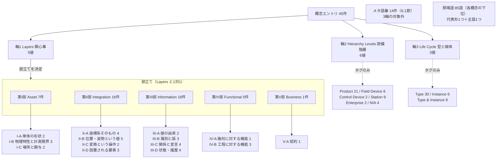

# 汎用概念用語規格 — 空間データを扱うモデリングの共通言語

**Version:** 0.17.0（ドラフト）
**最終更新:** 2026-08-15
**準拠:** RAMI 4.0 (DIN SPEC 91345), ISA-95 (IEC 62264), IEC 63278 (AAS), ROS REP-103, ISO 10303, ISO 704
**収録:** 概念45エントリ（第I部7／第II部16／第III部16／第IV部5／第V部1）＋ 現場語85語（各概念の現場語欄）＋ メタ語彙14エントリ（6.1節）

| | |
| :--- | :--- |
| **この文書** | 用語の定義そのもの。引くための文書。 |
| `decisions.md` | 改訂理由・命名判断・エントリ採用基準・変更履歴。なぜこうなったかを追うための文書。**未作成**（v0.5.0以前の履歴を移す先として確保）。 |
| `backlog.md` | 未収録の語彙・未確認の実例・判断保留事項。**未作成**（現時点の内容は 4.5節と 8.5節にすべて列挙してある）。 |

**バージョン方針:** ドラフト期間中は `0.x` で通し、実装へのマッピング（6.1節の手順4）に着手できる状態になった時点で `1.0.0` とする。マイナー番号は構造再編、パッチ番号はエントリ単位の追加・修正に対応する。

**初めて読む場合:** 1.2節「登場人物」で工場に実在するモノと語彙の対応を掴み、1.3節で登場人物の型を見て、4.2節の構造図で分類の骨格（と 4.4節でMECEがどこまで成立しているか）を確認し、8.4節「テーマ別ビュー」で目的に合う順路を選んでから5章の各エントリへ入るのが早い。

**記法:**

- 章の見出し番号（0〜8の裸数字）と、用語エントリの採番（`1.01`〜`M.14`）は別体系。章は「2章」、エントリは「M.09」の形で参照する。
- 各エントリは**恒久ID**（`term.bounding-volume` 形式）を持つ。恒久IDは一度付与したら変更しない。採番（`1.01`）は部構成に従う表示上の位置であり、再編で変わりうる。外部から参照する際は恒久IDを使う。

**運用方針:**

1. 定義は、特定の製品・リポジトリ・プログラミング言語に依存しないレベルまで抽象化する。
2. 抽象化で意味が薄まることを避けるため、必ず複数分野（生産分野とCAD/ロボティクス分野）からの実例を添える。
3. 片方の分野でしか実例を確認できていない場合は、**実例カバレッジ**欄にその旨を記し、存在しない実例を作らない。
4. エントリ見出しは、分野横断で確立した一般的な語彙を優先する。本アーキテクチャ固有の呼称は括弧内に併記するにとどめる。

---

## 0. ドメイン視点（Producer / Consumer）の定義

各概念には、ツールの名称（CAD/PLC等）ではなく、製造自動化における業務ドメイン（責務）に基づいて、**P: Producer（定義・決定者）** と **C: Consumer（参照・利用者）** を明記する。

### 4つの業務専門領域（対等・相互参照あり）

| ドメインタグ | 英語ロール名 | 主な担当領域・責務 |
| :--- | :--- | :--- |
| **`[製品設計]`** | `ProductDesign` | ワーク幾何、CADモデリング、データム定義、理論質量・公差、リビジョン管理 |
| **`[生技ロボティクス]`** | `MfgRobotics` | ロボット把持計画、ビジョン姿勢認識、アプローチ方向、干渉回避、動作検証 |
| **`[設備制御]`** | `StationControl` | 治具・着座設計、搬送、PLCシーケンス、工程内場所（Station）、IPOネスト、センシング |
| **`[情報MES]`** | `ShopfloorIT` | 個体シリアル発番、工程状態管理、ロットトレーサビリティ、品質履歴、MES連携 |

### 1つの横断ガバナンス役割

| ドメインタグ | 英語ロール名 | 主な担当領域・責務 |
| :--- | :--- | :--- |
| **`[共通アーキテクチャ]`** | `MetaArchitecture` | ドメイン駆動設計（DDD）、ユビキタス言語、データ型規約、スキーマ契約境界 |

上の4つは「業務専門領域」という同じ区分基準で揃っており、互いに定義し合う対等な関係にある。`[共通アーキテクチャ]` はそれらを横断して支えるガバナンス機能であり、全エントリを通じて常にP（定義者）としてのみ現れ、C（利用者）として現れることがない。表を分けているのはこの非対称性のためで、5番目の専門領域ではない。

---

## 1. 適用範囲と登場人物

### 1.1 適用範囲

この辞書は、空間データを扱うモデリング（生産・ロボティクス・CAD・3Dソフトウェア全般）において、ステークホルダー間の共通言語を確立するための概念語彙を対象とする。特定のプログラミング言語、ファイル形式、通信規格、製品、リポジトリには依存しない。実装（JSON Schema、OPC UA情報モデル、特定のクラス設計等）へのマッピングは、この辞書を下敷きにした別工程として扱う（6.2節参照）。

### 1.2 登場人物 — 工場に実在するモノと人

5章のエントリはいずれも実装非依存の抽象概念であるため、初読では「結局どのモノの話をしているのか」が掴みにくい。ここでは、工場に実際に置かれている代表的な設備・モノ・人を先に並べ、それぞれが5章のどの語彙で語られるかを対応づける。**この辞書は、これらの登場人物を語るための言葉の一覧**である。

なお、この節に挙げるのは物理的に実在するモノ（と人）であり、5章のエントリ（概念）とは階層が違う。1つの登場人物が複数のエントリで語られ、1つのエントリが複数の登場人物に適用される、多対多の関係になる。

> **なぜ第I部（Asset層）の中に置かないのか:** 登場人物の多くは物理資産なので、5章の第I部に含めたくなる。しかしそうすると三つの問題が起きる。第一に、第I部は「物理を語るための**概念**」の置き場であり、登場人物は概念ではなく**実在物そのもの**である。メタレベルが1つ違うものを同じ部に混ぜると、4.4節で成立させた「部とLayers軸の一対一対応」が崩れ、機械検証ができなくなる。第二に、MES・CAD/PLMのように物理資産でない登場人物が複数いるため、Asset層に押し込めるのは事実に反する。第三に、登場人物は5章を読み**始める前**の足場として働くものなので、5章の内側にあっては役目を果たせない。したがって関係は「包含」ではなく「実在物 ↔ それを語る語彙」であり、この節と5章は分けたまま相互参照でつなぐ。

**① 対象物 — 工場の中を流れていくもの**

| 登場人物 | 一言でいうと | この辞書ではどう語られるか（主なエントリ） |
| :--- | :--- | :--- |
| **ワーク（被加工物・部品・製品）** | 工場の主役。加工され、運ばれ、組み立てられる当のもの | 形は 1.01 バウンディングボリューム・1.02 トポロジー構造、重さと重心は 1.03 質量特性、どう置けるかは 1.04 安定姿勢、回しても同じかは 3.10 対称性ルール。「品番」は 3.03 型識別子、「その1個」は 3.04 個体識別子、設計変更の版は 3.05 リビジョン、今どの工程かは 3.12 工程状態、辿ってきた履歴は 3.16 トレーサビリティ記録。組み付けられて親子になる関係は 3.07 型付き関係。属性が変わっても同じ1個だと言えるのは M.04 エンティティ、寸法や姿勢の値そのものは M.05 値オブジェクト、品種テンプレートの下に各関心事のデータをまとめるのが M.06 集約ルート |
| **搬送トレー・パレット・コンテナ** | ワークを載せて運ぶ入れ物 | それ自体が置かれる場は 1.06 工程内場所、載せ方の約束は 3.13 状態期待値（例：N個以内・向き不問）、載っている個数の0/1/複数は M.12 多重度状態。積載から引き渡しまでを入れ子に分解するのが 4.03 IPOネスト構造で、参考表4-2にその例がある |

**② 位置を決めるもの — 動かないが、すべての基準になるもの**

| 登場人物 | 一言でいうと | この辞書ではどう語られるか（主なエントリ） |
| :--- | :--- | :--- |
| **治具（ジグ）・位置決めピン・突き当て面** | ワークを毎回同じ位置・姿勢に固定する道具 | 基準となる穴や面そのものは 2.13 基準フィーチャー、そこから立つ座標系は 2.02 参照座標系、固定後にどうなっているべきかは 3.13 状態期待値 |
| **架台・ベースプレート・床** | 設備が据え付けられる土台 | そもそもの物差しの枠組みは 2.01 座標系、シーン全体の基準としての 2.08 ワールド空間、そこからの親子関係は 2.09 階層座標構造 |
| **工程内場所（ステーション・セル）** | 役割を持って区切られた、名前のついた作業場所 | 場所そのものは 1.06 工程内場所、その機能的な役割は 4.02 作業インタフェース（参考表4-1）、内部の入れ子構造は 4.03 IPOネスト構造、通過するワークの状態は 3.12 工程状態、境界での約束は 3.13 状態期待値 |
| **安全柵・ライトカーテン** | 人と機械を隔てる境界 | 立ち入ってはいけない空間として 2.15 干渉禁止領域、人がどう関与するかは 1.07 関与インタフェース分類。通路・区画・目印といった床面の意味づけは 3.08 空間注記の意味分類 |

**③ 動かすもの — ワークの位置・姿勢・形を変えるもの**

| 登場人物 | 一言でいうと | この辞書ではどう語られるか（主なエントリ） |
| :--- | :--- | :--- |
| **産業用ロボット（多関節マニピュレータ）** | 掴んで運ぶ・組み付ける腕 | ベースからTCPまでの関節連鎖は 2.09 階層座標構造、その計算は 2.11 同次変換行列・2.12 座標変換、手先の位置と向きは 2.05 姿勢、その向きをどの形式で書くかが 2.06 回転表現規約 |
| **エンドエフェクタ（ハンド・グリッパ・吸着パッド）** | ロボットの手先。実際にワークに触れる部分 | どこをどう掴むかは 3.09 把持宣言と解決、最後に近づく向きは 2.16 アプローチ方向、触れてはいけない場所は 2.15 干渉禁止領域、持てる重さの判断材料は 1.03 質量特性 |
| **コンベア・シュート** | ワークを一定方向へ流し続ける機構 | 機械インタフェースの一種として 1.07、場所の役割としては 4.02 作業インタフェース（変化対象＝配置 または 無変化） |
| **無人搬送車（AGV／AMR）** | 床を走ってワークを別の場所へ運ぶ | 走行して基準が動くため 2.07 ローカル空間と 2.08 ワールド空間の区別が要になる。1.07 の機械インタフェース値の一つ |
| **工作機械・専用機（CNC、プレス、溶接機など）** | ワークの形そのものを変える設備 | 形状を変える場所として 4.02 作業インタフェース（変化対象＝形状）、加工という操作の抽象は 4.01 掃引操作。軸ごとに順に動かす移動量の見積もりは 2.10 距離定義規約 |

**④ 見るもの・測るもの — 現実の値を読み取るもの**

| 登場人物 | 一言でいうと | この辞書ではどう語られるか（主なエントリ） |
| :--- | :--- | :--- |
| **ビジョンカメラ・3Dスキャナ** | ワークがどこにどの向きであるかを見つける目 | 出力そのものは 2.05 姿勢、読み取れる細かさの限界は 1.05 分解能、どこまで一致とみなすかは 3.10 対称性ルール、その結果が実機検証済みかは 3.11 検証レベル。カメラとロボットの座標系を対応づけるのが 2.14 キャリブレーション基準 |
| **センサ（近接・光電・力覚・エンコーダ）** | 「ある／ない」「どこまで動いた」を検出する | 検出できる最小変化量は 1.05 分解能、検出結果が0個か1個か複数かは M.12 多重度状態 |
| **検査装置（三次元測定機、画像検査機）** | 良否や寸法を判定する | ワークの物理状態は変えず情報だけを付加する場所として 4.02 作業インタフェース（変化対象＝情報）、結果は 3.16 トレーサビリティ記録へ。寸法や角度を数値として取り出す行為が 4.05 計測 |

**⑤ 指示するもの・記録するもの — 情報側の登場人物**

| 登場人物 | 一言でいうと | この辞書ではどう語られるか（主なエントリ） |
| :--- | :--- | :--- |
| **PLC（シーケンサ）** | 設備をどの順で動かすかを制御する頭脳 | 状態遷移の許可の考え方は M.13 遷移許可リスト、扱う状態は 3.12 工程状態、更新経路の統制は M.14 単一更新経路の強制。アラームや稼働ログとして記録されるのは 3.14 イベント |
| **HMI・操作盤** | 人が値を入れ、状況を見る画面 | 人が明示的に入れた値は 3.01 入力値（宣言値）、人インタフェースの区分は 1.07 |
| **MES・上位システム** | 生産計画と実績を管理する情報システム | 個体シリアルの発番は 3.04 個体識別子＋M.14、工程の進捗は 3.12 工程状態、履歴は 3.16、他システムとの取り決めは 5.01 契約境界。時刻つきの出来事は 3.14 イベント、それを日次・週次で束ねるのが 3.15 集計期間 |
| **CADシステム・PLM** | 設計データの出どころ | 型番と版は 3.03 型識別子・3.05 リビジョン、そこから自動計算された値は 3.02 算出値、その最新性の保証は M.11 キャッシュ鮮度の自己保証。他システムへ渡す際の軸の向きと単位の食い違いは 2.03 座標系のハンドネス・2.04 尺度定義。属性の意味を世界共通の識別子へ結びつけるのが 3.06 プロパティ辞書参照 |

**⑥ 人**

| 登場人物 | 一言でいうと | この辞書ではどう語られるか（主なエントリ） |
| :--- | :--- | :--- |
| **作業者・オペレータ・保全担当** | 手を動かす人、見ている人、異常時に呼ばれる人 | 関与の度合いは 1.07 関与インタフェース分類（手動操作／監視／例外対応／無人）、人が判断して入れた値は 3.01 入力値、人が埋めている作業そのものは 4.04 変換行為（ギャップ充填行為） |
| **設計・生技・制御・情報の各担当者（0章の4ドメイン）** | 部署をまたいで会話し、この辞書を書き、使う人たち | 部署間・システム間の取り決めを閉じた形式にするのが 5.01 契約境界、重要な更新の入口を1つに絞る取り決めが M.14 単一更新経路の強制。この人たちが**モデルと辞書をどう作るか**の語彙は5章ではなく6.1節のメタ語彙にある |

**この対応表について（双方向の網羅性）:** 語彙の側から見ると、5章のエントリはいずれも「◯◯である」「◯◯という状態にある」という**述語**であって、それ自体では何についての話か分からない。使える単位は語彙そのものではなく、**（登場人物 × 語彙）の組**である。そのためこの節では次の不変条件を課している。

- **すべての登場人物は、少なくとも1つのエントリに接続する。**（19件すべて成立、最少2件・最多14件）
- **5章のすべてのエントリは、少なくとも1つの登場人物に接続する。**（45件すべて成立。6.1節のメタ語彙はこの条件の対象外＝6章冒頭参照）

両方向の接続はエントリ番号の照合で自動検証しており、どちらかが切れると検出される。現在この対応表が主張している組は71組で、19×45＝855の組み合わせのうち約8%にあたる。**残り92%が空であることは、まだ語られていないという意味ではなく、意味のある組だけを明示的に選んでいるという意味である**（すべての登場人物にすべての語彙が当てはまるわけではない）。逆引きは8.6節にある。

### 1.3 登場人物の型 — どの層まで語られているか

1.2節のグループ分け（①〜⑥）の区分基準は「工場での役割」である。これとは**別の基準**として、各登場人物が5章のどの部（＝どのRAMI層）のエントリで語られているかを見ると、登場人物は4つの型に分かれる。区分基準は「**参照する概念が到達する最も上の層**」であり、各登場人物はちょうど1つの型に属する。現場語数を併記したのは、その登場人物について**実際に現場でどれだけの語が使われているか**が、記述の厚みの直接の指標になるためである。

| 型 | 登場人物 | 語られる層のプロファイル | 概念数 | 現場語数 |
| :--- | :--- | :--- | ---: | ---: |
| **型0 物理型** | センサ（近接・光電・力覚・エンコーダ） | I | 1 | 0 |
| **型1 空間型** | 産業用ロボット（多関節マニピュレータ） | II | 5 | 9 |
| **〃** | 架台・ベースプレート・床 | II | 3 | 6 |
| **〃** | 無人搬送車（AGV／AMR） | I+II | 3 | 0 |
| **型2 情報型** | ワーク（被加工物・部品・製品） | I+III | 11 | 31 |
| **〃** | エンドエフェクタ（ハンド・グリッパ・吸着パッド） | I+II+III | 4 | 6 |
| **〃** | CADシステム・PLM | II+III | 6 | 4 |
| **〃** | ビジョンカメラ・3Dスキャナ | I+II+III | 5 | 4 |
| **〃** | 治具（ジグ）・位置決めピン・突き当て面 | II+III | 3 | 2 |
| **〃** | 安全柵・ライトカーテン | I+II+III | 3 | 2 |
| **〃** | PLC（シーケンサ） | III | 2 | 2 |
| **〃** | HMI・操作盤 | I+III | 2 | 0 |
| **型3 機能型** | 工程内場所（ステーション・セル） | I+III+IV | 5 | 8 |
| **〃** | 搬送トレー・パレット・コンテナ | I+III+IV | 3 | 2 |
| **〃** | 検査装置（三次元測定機、画像検査機） | III+IV | 3 | 2 |
| **〃** | 工作機械・専用機（CNC、プレス、溶接機など） | II+IV | 3 | 1 |
| **〃** | 作業者・オペレータ・保全担当 | I+III+IV | 3 | 0 |
| **〃** | コンベア・シュート | I+IV | 2 | 0 |
| **型4 契約型** | MES・上位システム | III+V | 6 | 6 |
| **〃** | 設計・生技・制御・情報の各担当者（0章の4ドメイン） | V | 1 | 0 |

| 型 | 到達する最上位層 | 語られ方 | 件数 |
| :--- | :--- | :--- | ---: |
| **型0 物理型** | 第I部 | 物理的な性質としてしか語られていない | 1 |
| **型1 空間型** | 第II部 | 位置と姿勢としてしか語られていない | 3 |
| **型2 情報型** | 第III部 | 意味・識別・状態として語られる | 8 |
| **型3 機能型** | 第IV部 | 工程で何かを変える主体として語られる | 6 |
| **型4 契約型** | 第V部 | システム間・部署間の約束を持つ | 2 |

**この型分けは、記述の抜けを見つける道具になる。** 型は「その登場人物が本来どういうものか」ではなく「この辞書がいまどこまで語れているか」を表すため、直感と型がずれている登場人物は記述不足の候補である。

- **産業用ロボットが型1（II止まり）** なのは明らかに不足している。座標変換の話しかなく、ロボット自身の質量・可搬重量（Asset層）も、動作という機能（Functional層）も語彙がない。これは 4.5節の未収録セル `Asset × Field Device` と `Functional × Field Device` にそのまま対応する。
- **工作機械がIVのみ**、**コンベアがI+IV** なのも同様で、設備が「何をするか」だけで語られ、「何であるか」が薄い。
- 一方 **架台・床が型1** なのは不足ではない。座標の基準であること以上の役割を持たないため、これは妥当な到達点である。
- **ワークが参照エントリ14件と突出**しているのは、この辞書が製品中心に育ってきたことの現れである（軸2で `Product` が21件と最多であることと一致する）。

つまり **1.2節の役割による分類と、この節の層による分類は、独立した2つのファセットである**。前者は読者が辞書に入るための入口、後者は編者が記述の偏りを点検するための道具として使う。

### 1.4 1個のワークが工場を通り抜けるまで

上の登場人物がどう噛み合うかを、1個のワークの視点で一続きに追うと以下になる。丸括弧内は、その場面を語るためのエントリである。

1. ワークが梱包されて工場に届く。ここが系の境界であり、**搬入**という工程内場所（1.06、4.02＝境界通過）にあたる。
2. 作業者が開梱し、搬送トレーへ並べる。このとき「N個以内・向き不問」という約束が課される（3.13 状態期待値）。並べるという作業そのものが 4.04 変換行為である。
3. トレーが**マテハン変換**の場所へ運ばれる。ビジョンカメラがワークを見つけ（2.05 姿勢、1.05 分解能）、対称性を考慮して姿勢を確定し（3.10）、ロボットが掴む場所を決める（3.09 把持宣言と解決、2.16 アプローチ方向）。
4. ロボットが掴む。その計算は、治具の基準（2.13）から立てた参照座標系（2.02）を、ロボットのベース基準へ座標変換した結果である（2.11、2.12）。掴んだワークの重さと重心は動作計画に効く（1.03）。
5. **加工**の場所でワークの形が変わる（4.02＝形状、4.01）。工程状態が「原材料」から「半完成」へ遷移する。この遷移が許されるかはPLCが持つ遷移許可リストで決まる（M.13、3.12）。
6. **検査**の場所で良否が判定される。物理状態は変わらず情報だけが付く（4.02＝情報）。理論値ではなく実機で確かめた値であることが記録される（3.11 検証レベル）。
7. 不合格なら**手直し**へ回る。これは標準フローではなく例外フローで呼び出される場所である（4.02 の実行トリガ軸、参考表4-1）。
8. 合格したワークには個体シリアルが紐づき（3.04）、通過設備と時刻がMESに記録される（3.16）。発番できるのは1つのシステムだけである（M.14）。
9. **搬出**でワークは系外へ出る（1.06、4.02＝境界通過）。

この物語の中で、隣り合う2つの場所の「出口でこうなっているはず」と「入口でこうなっていてほしい」が食い違うと、誰の担当でもない作業が発生する。それを構造的に見つけるための道具が 4.03 IPOネスト構造と参考表4-2である。

---

## 2. なぜこの辞書が必要か — 言葉のズレと収束の実例

### 2.1 同じ言葉が違う意味を持つ例（同音異義 → M.08）

| 用語 | 機械設計 (CAD) 文脈 | ロボット / ビジョン 文脈 | 制御 (PLC / 搬送) 文脈 |
| :--- | :--- | :--- | :--- |
| 原点 / 基準 | CAD空間の絶対原点、データム面 | 把持目標（TCPオフセット） | 治具突き当てピン位置、センサON位置 |
| 姿勢 / 向き | 組立基準に対する角度 | ツール座標系（クォータニオン） | ワークの表裏・正逆フラグ |
| クリアランス | 公差・嵌合隙間 | アプローチ経路上の干渉回避マージン | 設備・シリンダストロークの逃げしろ |

### 2.2 1つのリポジトリの中でさえ起きていた同音異義

CADソフトウェアのリポジトリ調査では、「Layout」という言葉が、シーン内の3Dオブジェクト配置を生成するDSL（設計文書A）と、UIパネル・ツールバーの画面上の配置システム（設計文書B）という、2つの別概念に使われていた。1つのプロジェクト内であっても、部署や文書が分かれれば同じ言葉が意味を分岐させる。

### 2.3 分野を超えて言葉が収束していた例（異音同義 → M.09）

生産分野は治具の基準となる穴や面を「データムフィーチャー」と呼ぶ。CADソフトウェアは空間注記の一種を「ハブ（Hub）」と呼び、その定義文自体が「結節点・基準点：交差点、出入口、基準穴、治具固定点」となっていた。「基準穴」「治具固定点」という言葉が、互いを知らない2つの設計判断の中に独立に現れている。これは 2.13「基準フィーチャー」として統合した。

### 2.4 対比によって識別される語彙ペア

互いに混同しやすい概念は、それぞれ独立したエントリとして定義し、対比関係は下表と各エントリの相互参照で表現する。

| 対比ペア | 見分け方の要点 | 該当エントリ |
| :--- | :--- | :--- |
| 同音異義 / 異音同義 | 「同じ言葉なのに意味が違う」か、「違う言葉なのに指す対象が同じ」か | M.08 / M.09 |
| 入力値（宣言値） / 算出値（導出値） | 「誰かが明示的にそう決めた」か、「他のデータから計算で割り出した」か | 3.01 / 3.02 |
| ローカル空間 / ワールド空間 | 「親フレームからの相対値」か、「シーン全体基準の絶対値」か | 2.07 / 2.08 |
| 型識別子 / 個体識別子 | 「設計テンプレートを指す」か、「物理的な一個体を指す」か | 3.03 / 3.04 |

なお 3.09「把持宣言と解決」、4.02「作業インタフェース」、1.07「関与インタフェース分類」は、対比すべき2概念ではなく、1つの枠組みが内部に複数の軸・段階を持つ構造（ファセット分類・逐次ワークフロー）であるため、分割していない。

---

## 3. 基礎規約 (Foundational Physical & Mathematical Rules)

| 項目 | 規定仕様 | 準拠規格 / 備考 |
| :--- | :--- | :--- |
| **空間座標系** | $+X$ 前方、$Y$ 左、$Z$ 上、右手直交座標系 | ROS REP-103 準拠 |
| **長さ・距離** | $\text{mm}$ (ミリメートル) | SI単位系 |
| **角度** | $\text{deg}$ (度) または $\text{rad}$ (ラジアン) | 内部処理は $\text{rad}$、UI/対話は $\text{deg}$ |
| **質量 / 慣性** | $\text{kg}$ / $\text{kg}\cdot\text{m}^2$ | IEC 61360 |
| **力 / トルク** | $\text{N}$ / $\text{N}\cdot\text{m}$ | 把持力・締結トルク |
| **回転姿勢** | クォータニオン $[q_x, q_y, q_z, q_w]$ ($q_w$ は実部) | 補助表示としてオイラー角を併記する場合は、**外因性（extrinsic・固定軸）$X$→$Y$→$Z$**（ROS REP-103 のroll-pitch-yaw、内因性 $Z$-$Y$-$X$ と等価）と明示する。順序と内因性・外因性の指定を欠いた「RPY」表記は姿勢を一意に定めない → 2.06 |
| **空間参照** | 親フレーム中心からの相対オフセット | ローカル空間とワールド空間の混同を禁止 (2.07, 2.08) |

本章は規約そのものを定める。**規約が実データ上で実際にどう扱われるか**（変換・尺度検証・軸の向きの取り違え防止）は第II部（Integration層）の各エントリが扱う → 2.01〜2.12。ただし計測限界（分解能）は計測装置という物理資産そのものの限界であるため 1.05（Asset層）にある。

---

## 4. 分類軸とその構造

### 4.1 三つの分類軸

すべてのエントリに、RAMI 4.0 の以下3つの直交軸メタデータを付与する。

| 軸 | 取りうる値 |
| :--- | :--- |
| **軸1 Layers**（関心事） | `Asset`（物理） / `Integration`（仮想化・座標） / `Information`（意味・データ） / `Functional`（機能・変換） / `Business`（契約） |
| **軸2 Hierarchy Levels**（設備階層） | `Product`（ワーク） / `Field Device`（ハンド・治具） / `Control Device`（PLC・ビジョン） / `Station`（工程内場所・セル） / `Enterprise`（工場・MES） / `N/A（メタ概念）` |
| **軸3 Life Cycle**（ライフサイクル） | `Type`（型・設計・CAD） / `Instance`（個体・現場実機） / `Type & Instance`（型と個体の両段階で同一の構造がそのまま成立する概念） |

**値の使い分けに関する注意:**

- `N/A（メタ概念）` は「階層という問いがそもそも成立しない」ことを意味する。「あらゆる階層で同じ意味を持つ」という意味の `All` とは異なる値であり、混同しないこと（`All` は本辞書では使用しない）。
- `Type & Instance` は、型としての定義と個体への適用が同一構造でそのまま成立する概念にのみ使う（例：1.06 工程内場所、3.13 状態期待値）。

3軸のうち **軸1 Layers だけが5章の部立てを決定**する。軸2・軸3は部立てに影響しない、横断的なタグである。

### 4.2 分類構造の全体図



図の見方：エントリは3本の軸すべてに値を持つ。左の系統（軸1）だけが物理的な配置（何部の何番か）を決め、右の2系統（軸2・軸3）はどのエントリにも付いている検索用のタグにすぎない。**部立てを見ても軸2・軸3の分布は分からない**ため、次節に実際の分布を示す。

### 4.3 実際の分布（5章から機械集計）

**軸1 × 軸2 のクロス表（数字はエントリ件数）**

| | Product | Field Device | Control Device | Station | Enterprise | N/A | 計 |
| :--- | ---: | ---: | ---: | ---: | ---: | ---: | ---: |
| **Asset** | 4 | 0 | 1 | 2 | 0 | 0 | **7** |
| **Integration** | 10 | 3 | 1 | 0 | 0 | 1 | **15** |
| **Information** | 6 | 2 | 0 | 4 | 2 | 2 | **16** |
| **Functional** | 1 | 1 | 0 | 3 | 0 | 0 | **5** |
| **Business** | 0 | 0 | 0 | 0 | 0 | 1 | **1** |
| **計** | **21** | **6** | **2** | **9** | **2** | **4** | **45** |

30セル中、実際に使われているのは16セル。

**軸1 × 軸3 のクロス表**

| | Type | Instance | Type & Instance | 計 |
| :--- | ---: | ---: | ---: | ---: |
| **Asset** | 4 | 0 | 3 | **7** |
| **Integration** | 13 | 0 | 3 | **16** |
| **Information** | 9 | 5 | 2 | **16** |
| **Functional** | 3 | 1 | 1 | **5** |
| **Business** | 1 | 0 | 0 | **1** |
| **計** | **30** | **6** | **9** | **45** |

### 4.4 MECEはどこまで成立しているか

分類が MECE（漏れなく・重複なく）であるかは、**どの分類について問うかによって答えが違う**。この辞書の現状は以下のとおり。

| 検証対象 | ME（重複なし） | CE（漏れなし） | 判定 |
| :--- | :--- | :--- | :--- |
| **軸1 Layers ↔ 部立て** | ○ 各エントリのLayers値は1つで、所属する部と必ず一致（52件全件を自動検証） | ○ RAMI 4.0の5層すべてに最低1件ある | **成立** |
| **サブグループ（I-A〜V-A・M-A〜M-D、18グループ）** | ○ 各エントリはちょうど1グループに属し、号数順で連続する（自動検証） | ○ 各部のサブグループを前文にすべて列挙しており、どこにも属さないエントリはない | **成立**（v0.6.0で是正） |
| **軸2 Hierarchy Levels** | ○ 各エントリに値は1つ | △ 6値のうち `Control Device` と `Enterprise` が各1件のみ。さらに16件が `N/A`（軸が適用されない） | 部分的 → 4.5節 |
| **軸3 Life Cycle** | ○ 各エントリに値は1つ | ✗ `Instance` が5件のみで、しかも全件がInformation層 | **実質2値** → 4.5節 |

**サブグループの区分基準について:** v0.5.0まで、サブグループの分け方には複数の区分基準（characteristic of division）が混在していた。第III部の III-A「概念モデリングとDDDの基礎語彙」・III-B「用語論の語彙」が**借用元の学問分野**による区分だったのに対し、III-C以降は**主題**による区分だったためである。これは4.02が自ら定める原則（区分基準を一つの観点に揃える）に反する内部矛盾だった。v0.6.0で区分基準を **「主題（その概念が何について語っているか）」の一つに統一**した。

**対象語彙とメタ語彙の分離について:** v0.9.0で、方法論・用語論の7件（概念モデリング、ドメイン駆動設計、境界づけられたコンテキスト、ユビキタス言語、同音異義、異音同義、用語正規化）を5章から6.1節へ移した。これらは工場の対象について何も述べておらず、主語がモデル・辞書・語・作業になる**メタ語彙**であるため、RAMI 4.0の3軸そのものが適用できない。5章に置いたままでは、Layers軸に無理に値を与える必要が生じ、部立ての一対一対応が形だけのものになっていた。判定基準は6章冒頭に明記した。

**v0.10.0の再編（対象語彙とメタ語彙の再分離、および現場語の導入）:** 判定基準を「その述語の真偽が、現物・現場・実データを見て確かめられるか」に厳格化した結果、さらに7件がメタ語彙へ移った。内訳は、モデル要素の種別3件（エンティティ、値オブジェクト、集約ルート＝DDDの構成物）と、データ設計の原則4件（キャッシュ鮮度の自己保証、多重度状態、遷移許可リスト、単一更新経路の強制）である。いずれも「ワークはエンティティである」のように文としては言えるが、その真偽は工場ではなくモデルの設計判断が決めるため、対象語彙ではない。

あわせて、各概念の下に**現場語**を置いた。概念（`1.01` 形式）は現場でそのまま口にされることが少ない抽象語であり、実際に使われる語は現場語の側にある。現場語はちょうど1つの代表形とちょうど1つの主語（登場人物）を持ち、この2つの一意性は自動検証される。8.7節が正規化表である。

いずれの再編でも恒久IDは変更していないため、外部からの参照は影響を受けない（新旧の採番対応は `decisions.md`）。

**残る不成立:** 軸2・軸3の網羅性は依然として成立していない。ただしこれは分類の設計不良ではなく、**その組み合わせに該当する語彙をまだ収録していない**ことによる。どのセルが空で、それがなぜ空なのかを次節にすべて列挙する。

### 4.5 空になっている組み合わせの一覧

分類軸を掛け合わせると、エントリが1件もない組み合わせ（セル）が生じる。**空であること自体は問題ではないが、空であることを黙っておくと「網羅した」という誤解を生む。** そのため、以下に全ての空セルを理由つきで列挙する。理由は4種類に分類する。

| ラベル | 意味 |
| :--- | :--- |
| **原理的に空** | その組み合わせは概念として成立しない。今後も埋まらない。 |
| **適用範囲外** | 成立はするが、1.1節の適用範囲の外にある。この辞書では扱わない。 |
| **未収録** | 成立し、適用範囲内でもあるが、まだ語彙を立てていない。埋めるべき候補。 |
| **判断保留** | 成立するかどうかの判断がついていない。 |

**軸1 × 軸2 の空セル（30セル中14セル）**

| 組み合わせ | ラベル | 補足 |
| :--- | :--- | :--- |
| Asset × Field Device | **未収録** | ハンド・治具そのものの質量・剛性・最大把持力といった物理特性。1.03 質量特性のツール版にあたる |
| Asset × Enterprise | 適用範囲外 | 工場建屋・敷地といった規模の物理 |
| Asset × N/A | 原理的に空 | 物理資産は必ずいずれかの設備階層に属するため、`N/A` にはならない |
| Integration × Station | **未収録** | セル原点・ステーション座標系。1.06 工程内場所の座標的な側面 |
| Integration × Enterprise | 適用範囲外 | 工場全体座標系 |
| Information × Control Device | **未収録** | PLCタグ・ビジョン出力のデータ構造 |
| Functional × Field Device | **未収録** | ハンドの開閉・吸着といった、ツール自身が持つ機能 |
| Functional × Control Device | **未収録** | 制御ロジックの機能単位 |
| Functional × Enterprise | 適用範囲外 | 生産計画・スケジューリング機能 |
| Functional × N/A | 判断保留 | 4.01 掃引操作を `Product` としているが、階層に依存しないメタ操作と見る余地がある |
| Business × Product | 原理的に空 | 契約は部品単体に対しては結ばれない |
| Business × Field Device | 原理的に空 | 同上 |
| Business × Control Device | 原理的に空 | 同上 |
| Business × Station | **未収録** | 工程間の受け渡し契約。3.13 状態期待値がInformation層にある分、Business層側が空洞になっている |
| Business × Enterprise | **未収録** | 企業間・システム間の契約。5.01 契約境界を階層に具体化したもの |

**軸1 × 軸3 の空セル（15セル中4セル）**

| 組み合わせ | ラベル | 補足 |
| :--- | :--- | :--- |
| Asset × Instance | **未収録** | 「この1本のワーク」という物理個体そのものを主題とする語彙。軸3が実質2値になっている最大の原因 |
| Integration × Instance | **未収録** | 実機で実測されたこの1台の座標系（キャリブレーション実測値） |
| Functional × Instance | **未収録** | この1回の実行という単位 |
| Business × Instance | 原理的に空 | 契約は型として結ばれ、個体ごとには結ばれない |
| Business × Type & Instance | 原理的に空 | 同上 |

**空セルの内訳:** 原理的に空 7件／適用範囲外 3件／未収録 9件／判断保留 1件。v0.12.0で `Integration × Control Device`（カメラ座標系とキャリブレーション）が 2.14 キャリブレーション基準の追加により埋まった。この穴は4.5節が最優先として挙げていたもので、表が先に予告し、後から実物が入った形になる。

**新たに判明した未収録:** 3.14 イベントの追加に伴い、**集計期間（ウィンドウ）** という概念が欠けていることが分かった。日次・週次・月次のKPIは、イベントそのものではなくイベント列を一定期間で集計した結果であり、その「期間の取り方」を表す語彙がない。Information層かFunctional層かの判断も未定である（判断保留）。**この辞書が主張できるのは「軸1について網羅している」ところまでであり、軸2・軸3については上の10件が未収録であることを明示したうえで使うこと。**

---

## 5. 用語及び定義 (Terminologies & Definitions)

**部構成:** 部立てはRAMI 4.0のLayers軸（4章）と一対一に対応する。第I部＝`Asset`、第II部＝`Integration`、第III部＝`Information`、第IV部＝`Functional`、第V部＝`Business`。RAMI 4.0の層の積み上げ順（物理から契約へ）に従って下から上へ並ぶ。部の内側のサブグループ（I-A等）は、**区分基準を「主題（その概念が何について語っているか）」の一つに揃えて**分割したものである（4.4節）。なお本章に収めるのは、1.2節の登場人物を主語にして述語として言える**対象語彙**のみであり、モデルや辞書そのものについて語るメタ語彙は6.1節にある（判定基準は6章冒頭）。

**エントリの読み方:**

| 欄 | 内容 |
| :--- | :--- |
| **見出し** | `採番 English Name（和文名）`。**主名称は英語**、副名称が和文である。実装（JSON Schema・変数名・API）が英語で書かれるため、辞書から実装への写像に翻訳を挟まないためであり、また外部標準（ISO/IEC/RAMI）が英語で書かれているため、標準由来の語は原語のまま引き写せる。本文中の相互参照は読みやすさのため `採番 和文名` で書く。 |
| **恒久ID** | 変更されない識別子。外部から参照する際はこれを使う。 |
| **責務タグ** | P（定義・決定者）／C（参照・利用者）。0章参照。 |
| **RAMI 4.0** | `Layers / Hierarchy Levels / Life Cycle` の順（4章参照）。Layersの値は所属する部と必ず一致する。 |
| **実例カバレッジ** | 具体例欄に実例を確認できている分野（生産分野 / CAD・ロボティクス分野）。`—` は未確認（運用方針3。調査項目は `backlog.md`）。 |
| **コアイメージ** | 定義を読む前に掴むための一行の比喩。 |
| **和文名 / 別称** | 副名称と、旧称・略称・英語の言い換え。 |
| **語彙区分** | その語の出どころ。**標準**（外部の規格・標準文書に定義がある）／**業界一般**（規格名はないが業界で広く通用する）／**独自**（本アーキテクチャが定義した語。外部に説明が必要）の3値。括弧内に典拠を記す。区分別の一覧は8.8節。**独自の主名称（英語）は本アーキテクチャによる造語であり、外部標準の用語ではない。** |
| **現場語** | この概念が、実際の現場でどう呼ばれているかの一覧。採番は概念の採番＋枝番（`2.13a` 形式）で、階層がそのまま採番に現れる。各現場語は**ちょうど1つの代表形（この概念）**と**ちょうど1つの主語（1.2節の登場人物）**を持つ。まだ収集していない概念には「未抽出」と記す。 |
| **用法上の注意** | 隣接概念との取り違えを防ぐための注記。命名・改訂の経緯は `decisions.md` にある。 |

**名称に使う語の使い分け:** 主名称を英語にしたことで、似た語の混用が目に見えるようになった。以下は本辞書全体で守る使い分けである。

| 語 | 意味 | 見分け方 | 該当エントリ |
| :--- | :--- | :--- | :--- |
| **State** | 対象そのものの様態。定義された状態集合と遷移規則を持ち、「いま何であるか」に答える。対象に内在する。 | 状態機械（M.13）を描けるか | 3.12 Process State、3.13 State Expectation |
| **Status** | 対象に**外から付与される**進捗・評価の報告。判定者がいて、判定基準がある。順序を持たない。 | 「誰が、何を基準に、そう判定したか」が言えるか | （現時点で該当なし。3.11 は順序を持つため Level へ改めた） |
| **Level** | 順序のある段階。大小の比較ができる。 | 1つ上・1つ下が言えるか | 3.11 V&V Level |
| **Reference** | 何かを測る・定める際の拠りどころとなる対象 | 「〜を基準にして」と続けられるか | 2.02 Reference Coordinate Frame、2.13 Datum Reference Feature、2.14 Calibration Reference |
| **Convention** | 複数の選択肢のうちどれを採るかという取り決め。技術的には他の選択肢でも成立する。 | 「別の流儀もあるが、うちはこう」と言えるか | 2.04 Unit Scale Convention、2.06 Rotation Representation Convention |

**関連エントリに種類がないこと（既知の弱点）:** 各エントリの「関連エントリ」欄は、関係があることは示すが**どういう関係か**を示さない。たとえば 2.14 Calibration Reference は 3.08 Spatial Element Classification の「目印」に条件を加えた**下位概念**だが、欄の上では他の関連と区別がつかない。ISO 704 は概念間の関係を類種関係（generic）・部分関係（partitive）・連想関係（associative）に分けており、本辞書はこの区別をまだ持っていない。関係に型を与えるのは今後の課題である（4.5節の未収録と同様、隠さずここに記す）。

**一般語彙と独自語彙:** 全エントリに **語彙区分** を付し、外部から借りてきた語と、この辞書が自前で定義した語を混ぜないようにしている。独自語は他社・他部門に説明が必要になるため、公開・共有の範囲を決めるときはこの区分が判断材料になる。8.8節に区分別の一覧がある。

**この辞書の二層構造:** 見出しになっている概念（`1.01` 形式）は抽象語であり、それ自体が現場で口にされることは少ない。現場で実際に使われるのは、各エントリの**現場語**欄に並ぶ語である（「掴み代」「MCS」「データムフィーチャー」など）。**知識が蓄積するのは現場語の側**で、概念は現場語を束ねる代表形として働く。これは M.10 用語正規化が定義する構造そのものを、この辞書自身に適用したものである。現場語からの逆引きは 8.1 和文索引と 8.7 節にある。

**分野横断で複数のエントリを順に読みたい場合は 8.4節のテーマ別ビューを参照。**

---

### 第I部 物理資産 (Asset層)

**この層とは:** 物理世界に実在するモノ（ワーク・治具・設備・人）そのものと、物理法則に直接支配される性質・限界を扱う関心事（コアイメージ：手で触れられ、置けば場所を取り、落とせば壊れるもの）。デジタル表現（第II部以降）はすべて、この層の物理的実体を写像したものである。

**この部のサブグループ（区分基準＝主題）:** I-A 単体の形状（1.01〜1.02、2件）／ I-B 物理特性と計測限界（1.03〜1.05、3件）／ I-C 場所と関与（1.06〜1.07、2件）。

**I-A. 単体の形状**

#### 1.01 Bounding Volume
* **恒久ID**: `eed:0001#001`
* **旧恒久ID**: `term.bounding-volume`
* **和文名**: バウンディングボリューム
* **別称**: 外接包絡形状
* **読み**: ばうんでぃんぐぼりゅーむ
* **責務タグ**: **P:** `[製品設計]` / **C:** `[生技ロボティクス]` `[設備制御]`
* **RAMI 4.0**: `Asset / Product / Type`
* **語彙区分**: **業界一般**（CG・ロボティクスで広く通用するが、規格上の定義は薄い）
* **実例カバレッジ**: 生産 ◯ / CAD・ロボティクス ◯
* **コアイメージ**: ワークをすっぽり包む透明な段ボール箱
* **定義**: 対象物を包含する最小限の単純な立体（直方体・球など）。搬送経路や干渉チェックの一次スクリーニングに使う簡略表現。
* **具体例**: (生産) 外形バウンディングボックス。搬送経路・パレット仕分けの一次スクリーニングに使用。(CAD) 対象外オブジェクトを障害物として扱う際の外接球近似。
* **現場語**:

| 恒久ID | 採番 | 現場語 | 主語（登場人物） | 使われる場面 | 同義・異表記 |
| :--- | :--- | :--- | :--- | :--- | :--- |
| `eed:0060#001` | `1.01a` | **外形バウンディングボックス** | ワーク（被加工物・部品・製品） | 生産・搬送経路とパレット仕分けの一次スクリーニング | BBox／外形ボックス／AABB |
| `eed:0061#001` | `1.01b` | **外接球近似** | ワーク（被加工物・部品・製品） | CAD・対象外オブジェクトを障害物として扱うとき | バウンディングスフィア |

* **関連エントリ**: 1.02
* **用法上の注意**: 実務でより頻繁に使われる「バウンディングボックス（bounding box）」は、形状を直方体に限定した特殊形（AABB：軸並行境界ボックス、OBB：有向境界ボックス）であり、球や凸包を含む本エントリの部分集合にあたる。

#### 1.02 Topology
* **恒久ID**: `eed:0002#001`
* **旧恒久ID**: `term.topology`
* **和文名**: トポロジー構造
* **別称**: 境界グラフ／boundary graph
* **読み**: とぽろじーこうぞう
* **責務タグ**: **P:** `[製品設計]` / **C:** `[生技ロボティクス]`
* **RAMI 4.0**: `Asset / Product / Type`
* **語彙区分**: **標準**（ISO 10303（B-rep の境界表現））
* **実例カバレッジ**: 生産 ◯ / CAD・ロボティクス ◯
* **コアイメージ**: 立体を頂点・辺・面という骨組みだけで表した針金細工
* **定義**: 頂点・辺・面から成る局所的な幾何構造。次元によって要素数が決まる。
* **具体例**: (生産) データムフィーチャー（面・穴・エッジ）による基準の定義。(CAD) 1次元(頂点2/辺1)、2次元(頂点4/辺4)、3次元(頂点8/辺12/面6)という境界グラフの実装。
* **現場語**:

| 恒久ID | 採番 | 現場語 | 主語（登場人物） | 使われる場面 | 同義・異表記 |
| :--- | :--- | :--- | :--- | :--- | :--- |
| `eed:0062#001` | `1.02a` | **境界グラフ** | ワーク（被加工物・部品・製品） | CAD・頂点／辺／面の接続関係の実装 | B-rep の接続情報 |

* **関連エントリ**: 1.01, 2.13, 4.01
* **用法上の注意**: トポロジーは「頂点・辺・面がどうつながっているか」という connectivity（接続関係）を表し、各頂点の座標値そのもの（形状・寸法、ジオメトリ）とは区別される。本エントリはこのうち、頂点・辺・面数といった構造の数え上げに焦点を当てた側面を指す。

**I-B. 物理特性と計測限界**

#### 1.03 Mass Properties
* **恒久ID**: `eed:0003#001`
* **旧恒久ID**: `term.mass-properties`
* **和文名**: 質量特性
* **読み**: しつりょうとくせい
* **責務タグ**: **P:** `[製品設計]` / **C:** `[生技ロボティクス]` `[設備制御]`
* **RAMI 4.0**: `Asset / Product / Type & Instance`
* **語彙区分**: **標準**（IEC 61360、OPC UA for Robotics）
* **実例カバレッジ**: 生産 ◯ / CAD・ロボティクス —
* **コアイメージ**: ワークを指一本でバランスさせられる、やじろべえの支点
* **定義**: 対象の質量中心位置と質量、慣性テンソル。高速な移動・操作時の遠心力・慣性補償計算に必須。
* **具体例**: (生産) 重心・慣性テンソル。CADの理論値か実測値かの区別が必須。密度が不均一な鋳造品では乖離が大きい。
* **現場語**:

| 恒久ID | 採番 | 現場語 | 主語（登場人物） | 使われる場面 | 同義・異表記 |
| :--- | :--- | :--- | :--- | :--- | :--- |
| `eed:0063#001` | `1.03a` | **重心** | ワーク（被加工物・部品・製品） | 生産・高速動作時の慣性補償 | 質量中心／CoG |
| `eed:0064#001` | `1.03b` | **慣性テンソル** | ワーク（被加工物・部品・製品） | 生産・ロボット動作計画への入力 | イナーシャ |

* **関連エントリ**: 3.01, 3.02

#### 1.04 Stable Pose
* **恒久ID**: `eed:0004#001`
* **旧恒久ID**: `term.stable-pose`
* **和文名**: 安定姿勢
* **読み**: あんていしせい
* **責務タグ**: **P:** `[生技ロボティクス]` / **C:** `[設備制御]`
* **RAMI 4.0**: `Asset / Product / Type`
* **語彙区分**: **業界一般**（ばら積みピッキングの文脈で通用）
* **実例カバレッジ**: 生産 ◯ / CAD・ロボティクス —
* **コアイメージ**: 机の上に置いたときに倒れずに静止する置き方
* **定義**: 対象が外力なしに静止できる姿勢。支持多角形と接地面の法線ベクトルで表す。
* **具体例**: (生産) 搬送安定姿勢。複数の安定姿勢がある部品では供給確率を持たせ、ビジョン認識の事前分布に使う。
* **現場語**:

| 恒久ID | 採番 | 現場語 | 主語（登場人物） | 使われる場面 | 同義・異表記 |
| :--- | :--- | :--- | :--- | :--- | :--- |
| `eed:0065#001` | `1.04a` | **搬送安定姿勢** | ワーク（被加工物・部品・製品） | 生産・供給時にワークが倒れない置き方 | 置き姿勢／安定置き |

* **関連エントリ**: 2.05, 3.09

#### 1.05 Resolution
* **恒久ID**: `eed:0005#001`
* **旧恒久ID**: `term.resolution`
* **和文名**: 分解能
* **読み**: ぶんかいのう
* **責務タグ**: **P:** `[設備制御]` / **C:** `[生技ロボティクス]` `[情報MES]`
* **RAMI 4.0**: `Asset / Control Device / Type`
* **語彙区分**: **標準**（計量用語（VIM）、センサ・エンコーダ仕様書の標準用語）
* **実例カバレッジ**: 生産 ◯ / CAD・ロボティクス —
* **コアイメージ**: ものさしの最小目盛りより細かい違いは、そもそも読み取れないという、計測装置そのものの限界
* **定義**: センサ・エンコーダ・ビジョン系などの計測系が区別できる最小の変化量。対象の実際の精密さがどれほど高くても、計測系の分解能を超えた差異はデータ上で区別できない。
* **具体例**: (生産) ロボット関節エンコーダのパルス分解能、ビジョンカメラの画素分解能。姿勢（2.05）推定誤差の理論的な下限を規定する。
* **現場語**:

| 恒久ID | 採番 | 現場語 | 主語（登場人物） | 使われる場面 | 同義・異表記 |
| :--- | :--- | :--- | :--- | :--- | :--- |
| `eed:0066#001` | `1.05a` | **エンコーダ分解能** | 産業用ロボット（多関節マニピュレータ） | ロボット関節の角度検出限界 | パルス分解能 |
| `eed:0067#001` | `1.05b` | **画素分解能** | ビジョンカメラ・3Dスキャナ | ビジョン系の空間検出限界 | ピクセル分解能／画素サイズ |

* **関連エントリ**: 2.05, 2.14, 3.10, 3.11, 4.05

**I-C. 場所と関与**

#### 1.06 Process Location
* **恒久ID**: `eed:0006#001`
* **旧恒久ID**: `term.process-location`
* **和文名**: 工程内場所
* **別称**: station
* **読み**: こうていないばしょ
* **責務タグ**: **P:** `[設備制御]` / **C:** `[生技ロボティクス]` `[情報MES]`
* **RAMI 4.0**: `Asset / Station / Type & Instance`
* **語彙区分**: **独自**（ISA-95 の Station 階層に対応するが、この呼称は本アーキテクチャのもの）
* **実例カバレッジ**: 生産 ◯ / CAD・ロボティクス —
* **コアイメージ**: 工程図の中の、名前の付いた1つの箱
* **定義**: 生産ラインやワークフローの中で、特定の役割（作業インタフェース 4.02）と、特定の人・機械の関与（1.07）を持つ、機能的に区切られた場所。
* **具体例**: (生産) 搬入場所、搬出場所、加工場所、マテハン変換場所など。これらは「変化対象」「境界位置」「実行トリガ」という3本の独立した軸（4.02）の組み合わせとして整理でき、代表的な組み合わせを参考表4-1に示す。
* **現場語**:

| 恒久ID | 採番 | 現場語 | 主語（登場人物） | 使われる場面 | 同義・異表記 |
| :--- | :--- | :--- | :--- | :--- | :--- |
| `eed:0068#001` | `1.06a` | **搬入場所** | 工程内場所（ステーション・セル） | 生産ライン・系外からワークが入る場所 | 受入／入荷ステーション |
| `eed:0069#001` | `1.06b` | **搬出場所** | 工程内場所（ステーション・セル） | 生産ライン・系外へワークが出る場所 | 出荷ステーション |
| `eed:0070#001` | `1.06c` | **加工場所** | 工程内場所（ステーション・セル） | 生産ライン・ワークの形が変わる場所 | 加工ステーション |
| `eed:0071#001` | `1.06d` | **マテハン変換場所** | 工程内場所（ステーション・セル） | 生産ライン・ばら積みから整列へ変換する場所 | 整列ステーション／ばらし工程 |

* **関連エントリ**: 1.07, 3.08, 3.12, 3.13, 4.02, 4.03
* **用法上の注意**: 場所そのもの（物理資産）は本エントリ、その場所が果たす機能的役割は 4.02、そこを通過する対象の状態は 3.12。層が異なるため部をまたぐ。読み進める順序は 8.4節を参照。

#### 1.07 Human-Machine Function Allocation
* **恒久ID**: `eed:0007#001`
* **旧恒久ID**: `term.involvement-interface`
* **和文名**: 関与インタフェース分類
* **別称**: 人・機械の2軸。Levels of Automation (LoA)／Fitts list 系の機能配分に連なる
* **読み**: かんよいんたふぇーすぶんるい
* **責務タグ**: **P:** `[設備制御]` / **C:** `[生技ロボティクス]` `[情報MES]`
* **RAMI 4.0**: `Asset / Station / Type & Instance`
* **語彙区分**: **業界一般**（Frohm らの Levels of Automation は physical/mechanical と cognitive/information の2変数に分ける。Fitts list 以来の function allocation の系譜）
* **実例カバレッジ**: 生産 ◯ / CAD・ロボティクス —
* **コアイメージ**: その場所で人は「触れる」のか「見ているだけ」なのか。機械は「ロボット」か「コンベア」か「無し」か
* **定義**: ある場所への関与のしかたを、**人インタフェース**（手動操作／監視／例外対応／無人）と**機械インタフェース**（ロボット／専用機／コンベア／搬送車／無し）という2軸の組み合わせで表す分類。1つの場所は両軸の値を同時に持つ。
* **具体例**: (生産) ロボットが把持し人が最終確認する組立場所など、両軸を組み合わせて定義する。参考表4-1に、代表的な場所種別ごとの典型的な組み合わせを示す。
* **現場語**: 未抽出（この概念に対応する現場での呼び名をまだ収集していない）
* **関連エントリ**: 1.06, 4.02
* **用法上の注意**: 4.02「作業インタフェース」が3軸の組み合わせで場所の役割を定義するのと同型のファセット分類であり、対比によって識別すべき2概念ではない。

---

### 第II部 空間統合 (Integration層)

**この層とは:** 物理世界（Asset層）を計算可能な仮想表現へ橋渡しする関心事（コアイメージ：現物の上に透明な方眼紙を重ね、あらゆる位置・向きを数値として読み書きできるようにする層）。

**この部のサブグループ（区分基準＝主題）:** II-A 座標系そのもの（2.01〜2.04、4件）／ II-B 位置・姿勢という値（2.05〜2.09、4件）／ II-C 変換という操作（2.11〜2.12、2件）／ II-D 空間に設置される意味づけられた要素（2.13〜2.16、3件）。3章が固定された規約そのものを定めるのに対し、本部はその規約が実データ上でどう扱われるかを定める。

**II-A. 座標系そのもの**

#### 2.01 Coordinate System
* **恒久ID**: `eed:0008#001`
* **旧恒久ID**: `term.coordinate-system`
* **和文名**: 座標系
* **読み**: ざひょうけい
* **責務タグ**: **P:** `[共通アーキテクチャ]` / **C:** `[製品設計]` `[生技ロボティクス]` `[設備制御]` `[情報MES]`
* **RAMI 4.0**: `Integration / N/A（メタ概念）/ Type`
* **語彙区分**: **標準**（数学・ROS REP-103）
* **実例カバレッジ**: 生産 ◯ / CAD・ロボティクス ◯
* **コアイメージ**: 空間内のあらゆる位置を、原点からの数値の組（X, Y, Z）として一意に読み取れるようにする、物差しと目盛りの枠組みそのもの
* **定義**: 空間上の点の位置・向きを、1つの原点と、互いに直交する軸（本辞書では3章に従い右手系のX, Y, Z軸）に対する数値の組として表現するための、最も基本的な枠組み。第II部の他のエントリ（2.02、2.07、2.08等）は、いずれもこの枠組みが具体的にどこに設置され、他の座標系とどう関係するかを規定する下位概念である。
* **具体例**: (生産・CAD共通) 3章に定めるROS REP-103準拠の右手直交座標系（+X前方、Y左、Z上）。あらゆる位置・姿勢データは、最終的にこの座標系上の数値の組として表現される。
* **現場語**: 未抽出（この概念に対応する現場での呼び名をまだ収集していない）
* **関連エントリ**: 2.02, 2.03, 2.07, 2.08, 2.09, 2.10

#### 2.02 Reference Coordinate Frame
* **恒久ID**: `eed:0009#001`
* **旧恒久ID**: `term.reference-frame`
* **和文名**: 参照座標系
* **読み**: さんしょうざひょうけい
* **責務タグ**: **P:** `[製品設計]` / **C:** `[生技ロボティクス]` `[設備制御]` `[情報MES]`
* **RAMI 4.0**: `Integration / Product / Type`
* **語彙区分**: **標準**（ROS REP-103、ISO 10303-242）
* **実例カバレッジ**: 生産 ◯ / CAD・ロボティクス ◯
* **コアイメージ**: 空間のどこかに立てられた、それ自身の見取り図の原点を持つ旗
* **定義**: 座標系（2.01）のうち、ある親座標系（またはワールド座標系）からの相対的な位置と向きによって定義される、局所的な基準座標系。
* **具体例**: (生産) 製品基準座標系（MCS）。データムフィーチャーの交点として定義され、すべての把持点・配置基準点がこの座標系からの相対値として表現される。(CAD) 親を持ち木構造を成す座標フレーム。並進と回転を持つ。
* **現場語**:

| 恒久ID | 採番 | 現場語 | 主語（登場人物） | 使われる場面 | 同義・異表記 |
| :--- | :--- | :--- | :--- | :--- | :--- |
| `eed:0072#001` | `2.02a` | **製品基準座標系** | ワーク（被加工物・部品・製品） | 製品設計・データムの交点として定義し、把持点や配置基準点の相対原点にする | MCS／ワーク原点 |
| `eed:0073#001` | `2.02b` | **データム系** | ワーク（被加工物・部品・製品） | 一次・二次・三次の3つのデータム平面で6自由度を拘束し、ワーク座標系を確立する（3-2-1拘束） | DRF／datum reference frame／データム参照系 |
| `eed:0074#001` | `2.02c` | **座標フレーム** | 架台・ベースプレート・床 | CAD・親を持ち木構造を成す局所座標 | フレーム／ノード座標系 |

* **関連エントリ**: 2.01, 2.03, 2.04, 2.05, 2.07, 2.08, 2.09, 2.11, 2.12, 2.13, 2.14

#### 2.03 Handedness
* **恒久ID**: `eed:0010#001`
* **旧恒久ID**: `term.handedness`
* **和文名**: 座標系のハンドネス
* **別称**: right-handed / left-handed
* **読み**: ざひょうけいのはんどねす
* **責務タグ**: **P:** `[共通アーキテクチャ]` / **C:** `[製品設計]` `[生技ロボティクス]` `[設備制御]`
* **RAMI 4.0**: `Integration / Product / Type`
* **語彙区分**: **標準**（数学・CG の標準概念）
* **実例カバレッジ**: 生産 ◯ / CAD・ロボティクス ◯
* **コアイメージ**: 右手でも左手でも「X軸→Y軸→Z軸」という並びの名前は同じに見えるが、実際に指を折ってみると、Z軸が上を向くか下を向くかが逆になる
* **定義**: 座標系の3軸（X, Y, Z）の向きの組み合わせが、右手系（$X \times Y = Z$）と左手系（$X \times Y = -Z$）のどちらの規約に従うかという区別。軸のラベル（前方・左・上等）が一致していても、ハンドネスが異なれば回転の正負や外積の結果が反転する。
* **具体例**: (生産) ROS REP-103に基づく右手系を全社的な規約として採用（3章）。(CAD) 一部のCADソフトウェアやゲームエンジンはY-up左手系をデフォルトとするため、外部データ取り込み時にハンドネス変換（Z軸反転等）が必要になる。
* **現場語**: 未抽出（この概念に対応する現場での呼び名をまだ収集していない）
* **関連エントリ**: 2.01, 2.02, 2.07, 2.08, 2.06

#### 2.04 Unit Scale Convention
* **恒久ID**: `eed:0011#001`
* **旧恒久ID**: `term.scale-factor`
* **和文名**: 尺度定義
* **別称**: scale factor／スケールファクタ
* **読み**: しゃくどていぎ
* **責務タグ**: **P:** `[共通アーキテクチャ]` / **C:** `[製品設計]` `[生技ロボティクス]` `[設備制御]`
* **RAMI 4.0**: `Integration / Product / Type`
* **語彙区分**: **業界一般**（データ交換の実務で常に問題になるが、規格名はない）
* **実例カバレッジ**: 生産 ◯ / CAD・ロボティクス ◯
* **コアイメージ**: 図面に書かれた「10」という数値が、mm単位なのかcm単位なのか、それとも単位のない相対値なのかによって、実際の大きさが最大1000倍も変わってしまう取り違えの罠
* **定義**: モデル内部で扱う数値が、どの物理単位（またはどの縮尺）を1として表現されているかを明示し、実データがその規約通りの尺度で保存・送受信されているかを保証する考え方。
* **具体例**: (生産) 異なるCADシステム間でファイルを受け渡す際、内部単位がmmかcmかを確認せずインポートし、ワークが1000倍の大きさで配置されてしまう不具合とその防止策。(CAD) シーンファイルの単位設定（メートル法／インペリアル）を読み込み時に検証し、規約と異なる場合は自動変換または警告を発する仕組み。
* **現場語**: 未抽出（この概念に対応する現場での呼び名をまだ収集していない）
* **関連エントリ**: 2.02, 2.11
* **用法上の注意**: 単位系そのものの規定は3章が担う。本エントリは、個々のCADファイル・センサデータ・通信メッセージが実際にその規約を守れているかを検証・変換する運用側の責務を指す。

**II-B. 位置・姿勢・隔たりという値**

#### 2.05 Pose
* **恒久ID**: `eed:0012#001`
* **旧恒久ID**: `term.pose`
* **和文名**: 姿勢
* **読み**: しせい
* **責務タグ**: **P:** `[製品設計]` `[生技ロボティクス]` / **C:** `[設備制御]` `[情報MES]`
* **RAMI 4.0**: `Integration / Product / Type & Instance`
* **語彙区分**: **標準**（ISO 9787、OPC UA for Robotics）
* **実例カバレッジ**: 生産 ◯ / CAD・ロボティクス ◯
* **コアイメージ**: 「どこにいて、どちらを向いているか」を一組で表す1枚のスナップショット
* **定義**: 位置（並進）と向き（回転）を組み合わせた空間的状態。
* **具体例**: (生産) 把持目標姿勢、搬送安定姿勢。(CAD) 立体の主要状態（原点位置と向き）。
* **現場語**: 未抽出（この概念に対応する現場での呼び名をまだ収集していない）
* **関連エントリ**: 1.04, 1.05, 2.02, 2.06, 2.10, 2.11, 2.16, 3.09, 3.10

#### 2.06 Rotation Representation Convention
* **恒久ID**: `eed:0013#001`
* **旧恒久ID**: `term.rotation-convention`
* **和文名**: 回転表現規約
* **読み**: かいてんひょうげんきやく
* **責務タグ**: **P:** `[共通アーキテクチャ]` / **C:** `[製品設計]` `[生技ロボティクス]` `[設備制御]`
* **RAMI 4.0**: `Integration / Product / Type`
* **語彙区分**: **標準**（ROS REP-103、各ロボットメーカーの姿勢表現仕様）
* **実例カバレッジ**: 生産 ◯ / CAD・ロボティクス ◯
* **コアイメージ**: 「Z→Y→X の順に回す」と言われても、軸が回転に連れて一緒に動くのか、床に描いた線のように固定されたままなのかで、行き着く姿勢はまったく別物になる
* **定義**: 回転をどの形式で表現するか、およびその形式に付随する曖昧さをどう固定するかの取り決め。クォータニオン・回転行列・回転ベクトル（軸角）は表現として一意だが人が直感的に読めない。オイラー角は読める代わりに、次の2つを併記しなければ姿勢が一意に定まらない。
  1. **回転順序**：どの軸をどの順に回すか（Z-Y-X、X-Y-Z など全12通り）
  2. **内因性 / 外因性**：各回転を、直前の回転で一緒に動いた軸まわりに行う**内因性**（intrinsic / rotated axes）か、常に固定された基準軸まわりに行う**外因性**（extrinsic / static axes）か
* **具体例**: (生産) ロボットティーチングペンダントに表示されるRPY値。メーカーごとに内因性・外因性と順序が異なり、同じ数値でも別の姿勢を指す。(CAD) 外部フォーマットからオイラー角を取り込む際、順序と内因性・外因性を確定させないとクォータニオンへ変換できない。
* **現場語**:

| 恒久ID | 採番 | 現場語 | 主語（登場人物） | 使われる場面 | 同義・異表記 |
| :--- | :--- | :--- | :--- | :--- | :--- |
| `eed:0075#001` | `2.06a` | **クォータニオン** | 産業用ロボット（多関節マニピュレータ） | 内部処理・補間と合成に使う一意な表現 | 四元数／$[q_x, q_y, q_z, q_w]$ |
| `eed:0076#001` | `2.06b` | **回転行列** | 産業用ロボット（多関節マニピュレータ） | 座標変換の計算に使う$3 \times 3$表現 | 姿勢行列／DCM |
| `eed:0077#001` | `2.06c` | **回転ベクトル** | 産業用ロボット（多関節マニピュレータ） | 一部のロボットメーカーが姿勢指令に使う軸角表現 | 軸角／Rodriguesベクトル |
| `eed:0078#001` | `2.06d` | **オイラー角** | 産業用ロボット（多関節マニピュレータ） | UI表示と人手ティーチング。順序と内因性・外因性の併記が必須 | RPY／ロール・ピッチ・ヨー／ABC角 |
| `eed:0079#001` | `2.06e` | **内因性・外因性** | 産業用ロボット（多関節マニピュレータ） | オイラー角の解釈を確定させる指定 | intrinsic／extrinsic、rotated axes／static axes、可動軸／固定軸 |

* **関連エントリ**: 2.03, 2.05, 2.11
* **用法上の注意**: ジンバルロックはオイラー角に固有の縮退であり、表現形式の選択理由になる。3章は本アーキテクチャの既定値を定めるが、外部から受け取るデータがその規約に従っている保証はないため、取り込み時に必ず順序と内因性・外因性を確認する。

#### 2.07 Local Space
* **恒久ID**: `eed:0014#001`
* **旧恒久ID**: `term.local-space`
* **和文名**: ローカル空間
* **読み**: ろーかるくうかん
* **責務タグ**: **P:** `[共通アーキテクチャ]` / **C:** `[製品設計]` `[生技ロボティクス]` `[設備制御]`
* **RAMI 4.0**: `Integration / Product / Type`
* **語彙区分**: **業界一般**（CG・ゲームエンジン・ロボティクスで共通）
* **実例カバレッジ**: 生産 ◯ / CAD・ロボティクス ◯
* **コアイメージ**: 「自分の部屋の中での位置」。部屋（親フレーム）が動けば、部屋の中の物の見え方は変わらないまま一緒に動く
* **定義**: ある参照座標系（2.02）を基準とした相対位置・相対姿勢として表現される空間。親フレームからの相対値であり、親フレーム自体が動いても局所的な値は変化しない。
* **具体例**: (生産) すべての位置・姿勢データに参照座標系を明示する基礎規約（3章）における、親フレーム相対の表現。(CAD) オブジェクトの原点位置・向きを親フレーム基準で保持する型システム。
* **現場語**: 未抽出（この概念に対応する現場での呼び名をまだ収集していない）
* **関連エントリ**: 2.01, 2.02, 2.03, 2.08, 2.12
* **用法上の注意**: 対になるワールド空間（2.08）と暗黙に混同してはならない（3章の規約）。

#### 2.08 World Space
* **恒久ID**: `eed:0015#001`
* **旧恒久ID**: `term.world-space`
* **和文名**: ワールド空間
* **読み**: わーるどくうかん
* **責務タグ**: **P:** `[共通アーキテクチャ]` / **C:** `[製品設計]` `[生技ロボティクス]` `[設備制御]`
* **RAMI 4.0**: `Integration / Product / Type`
* **語彙区分**: **業界一般**（CG・ゲームエンジン・ロボティクスで共通）
* **実例カバレッジ**: 生産 ◯ / CAD・ロボティクス ◯
* **コアイメージ**: 「街全体の地図での位置」。どの建物（親フレーム）に属していても、同じ1枚の地図上の1点として表せる
* **定義**: シーン全体（ルートとなる座標系）を基準とした絶対的な空間。ローカル空間（2.07）の値を、階層座標構造（2.09）に沿って親から親へと座標変換（2.12）することで得られる。
* **具体例**: (生産) 搬送経路計画で、複数のロボット・治具の位置を1つの共通基準で比較する際に必要になる表現。(CAD) ワールド座標キャッシュ（M.11）が保持する、シーン全体基準の座標値。
* **現場語**: 未抽出（この概念に対応する現場での呼び名をまだ収集していない）
* **関連エントリ**: 2.01, 2.02, 2.03, 2.07, 2.12, M.11

#### 2.09 Hierarchical Coordinate Structure
* **恒久ID**: `eed:0016#001`
* **旧恒久ID**: `term.coordinate-hierarchy`
* **和文名**: 階層座標構造
* **読み**: かいそうざひょうこうぞう
* **責務タグ**: **P:** `[製品設計]` `[生技ロボティクス]` / **C:** `[設備制御]` `[情報MES]`
* **RAMI 4.0**: `Integration / Product / Type & Instance`
* **語彙区分**: **業界一般**（シーングラフ、ROS の TF ツリー）
* **実例カバレッジ**: 生産 ◯ / CAD・ロボティクス ◯
* **コアイメージ**: 体の各部位が親子関係でつながった骨格アニメーションの骨
* **定義**: 複数の参照座標系を木構造として組み上げ、上位フレームの変化が下位フレームに伝播する構造。
* **具体例**: (生産) アセンブリの親子構成関係や、ロボットのTFツリー。(CAD) 座標フレームの親子関係、ロボットのベースフレームとTCPフレームという2ノード構造。
* **現場語**:

| 恒久ID | 採番 | 現場語 | 主語（登場人物） | 使われる場面 | 同義・異表記 |
| :--- | :--- | :--- | :--- | :--- | :--- |
| `eed:0080#001` | `2.09a` | **TFツリー** | 産業用ロボット（多関節マニピュレータ） | ロボティクス・ベースからTCPまでの座標系の木 | 座標変換ツリー／TF |
| `eed:0081#001` | `2.09b` | **アセンブリ親子構成** | ワーク（被加工物・部品・製品） | 製品設計・部品の組み付け階層 | BOM構造／構成ツリー |

* **関連エントリ**: 2.01, 2.02, 2.11, 2.12, 3.07

#### 2.10 Distance Metric Convention
* **恒久ID**: `eed:0017#001`
* **旧恒久ID**: `term.distance-metric`
* **和文名**: 距離定義規約
* **別称**: メトリック／Minkowski距離（L1・L2・L∞）
* **読み**: きょりていぎきやく
* **責務タグ**: **P:** `[共通アーキテクチャ]` / **C:** `[生技ロボティクス]` `[設備制御]` `[製品設計]`
* **RAMI 4.0**: `Integration / N/A / Type`
* **語彙区分**: **標準**（数学の距離空間、Minkowski距離。L1＝マンハッタン距離、L2＝ユークリッド距離、L∞＝チェビシェフ距離）
* **実例カバレッジ**: 生産 ◯ / CAD・ロボティクス ◯
* **コアイメージ**: 「2点間の距離は5」と言われても、まっすぐ突っ切った5なのか、縦と横に分けて足した5なのかで、意味も所要時間もまったく違う
* **定義**: 2点間の隔たりをどう測るかという取り決め。同じ2点であっても採る距離の定義が変われば数値が変わるため、距離を数値として扱う場面では、どの定義によるかを併記しなければ一意にならない。
* **具体例**: (生産) 直交機構（門型ローダやガントリ）の各軸を順に動かす移動時間は、軸ごとの移動量の和（マンハッタン距離）に比例する。一方、同時5軸で補間しながら動く場合は直線距離（ユークリッド距離）に近い。同じ2点でも、機構が違えば「近い」の意味が変わる。(CAD/ロボティクス) 干渉判定のクリアランスはユークリッド距離、格子状のパス探索コストはマンハッタン距離、バウンディングボックスの重なり判定はチェビシェフ距離が自然になる。
* **現場語**:

| 恒久ID | 採番 | 現場語 | 主語（登場人物） | 使われる場面 | 同義・異表記 |
| :--- | :--- | :--- | :--- | :--- | :--- |
| `eed:0082#001` | `2.10a` | **ユークリッド距離** | ワーク（被加工物・部品・製品） | 2点を直線で結んだときの隔たり。クリアランスや公差の評価 | 直線距離／L2ノルム |
| `eed:0083#001` | `2.10b` | **マンハッタン距離** | 工作機械・専用機（CNC、プレス、溶接機など） | 軸ごとの移動量を足し合わせた隔たり。直交機構の移動コスト評価 | 市街地距離／L1ノルム |
| `eed:0084#001` | `2.10c` | **チェビシェフ距離** | ワーク（被加工物・部品・製品） | 各軸の差の最大値。AABB同士の隔たり判定 | L∞ノルム／最大値ノルム |

* **関連エントリ**: 2.01, 2.05, 4.05
* **用法上の注意**: 2.04 Unit Scale Convention、2.06 Rotation Representation Convention と同じ型の落とし穴である。いずれも「技術的には他の選択肢でも成立するが、どれを採ったかを書かなければ受け手が復元できない」取り決めであり、書き忘れても数値としては通ってしまう。

**II-C. 変換という操作**

#### 2.11 Homogeneous Transformation Matrix
* **恒久ID**: `eed:0018#001`
* **旧恒久ID**: `term.homogeneous-transform`
* **和文名**: 同次変換行列
* **読み**: どうじへんかんぎょうれつ
* **責務タグ**: **P:** `[製品設計]` `[生技ロボティクス]` / **C:** `[設備制御]` `[情報MES]`
* **RAMI 4.0**: `Integration / Product / Type`
* **語彙区分**: **標準**（線形代数・ロボティクスの標準表現）
* **実例カバレッジ**: 生産 ◯ / CAD・ロボティクス ◯
* **コアイメージ**: 「回転」と「平行移動」という別々の操作を、1回の掛け算だけで連続的につなげられるようにする、4×4の計算専用の箱
* **定義**: 回転行列と並進ベクトルを1つの4×4正方行列にまとめ、複数の座標変換を単純な行列積の連鎖として合成できるようにする数学的表現。
* **具体例**: (生産) ロボットのベースフレームからTCPフレームへの変換を表す4×4行列。TFツリー（2.09）のノード間変換の実体。(CAD) 座標フレームの親子関係を辿って、あるオブジェクトのワールド座標を求める際に内部で連鎖させる変換行列。
* **現場語**:

| 恒久ID | 採番 | 現場語 | 主語（登場人物） | 使われる場面 | 同義・異表記 |
| :--- | :--- | :--- | :--- | :--- | :--- |
| `eed:0085#001` | `2.11a` | **4×4変換行列** | 産業用ロボット（多関節マニピュレータ） | ロボティクス・ベースからTCPへの変換の実体 | 同次行列／変換マトリクス |

* **関連エントリ**: 2.02, 2.04, 2.05, 2.06, 2.09, 2.12, 2.14
* **用法上の注意**: 姿勢（2.05）が「位置と向きという値そのもの」を指すのに対し、本エントリはその値を座標変換の計算に使える形に変換した**表現手段**を指す。

#### 2.12 Coordinate Transformation
* **恒久ID**: `eed:0019#001`
* **旧恒久ID**: `term.coordinate-transformation`
* **和文名**: 座標変換
* **読み**: ざひょうへんかん
* **責務タグ**: **P:** `[製品設計]` `[生技ロボティクス]` / **C:** `[設備制御]` `[情報MES]`
* **RAMI 4.0**: `Integration / Product / Type & Instance`
* **語彙区分**: **標準**（線形代数・ロボティクスの標準操作）
* **実例カバレッジ**: 生産 ◯ / CAD・ロボティクス ◯
* **コアイメージ**: 「自分の部屋の中での位置」を「街全体の地図での位置」に翻訳する、変換という作業そのもの
* **定義**: ある参照座標系で表現された位置・姿勢の値を、別の参照座標系（親・子・ワールド等）で表現された値へと変換する操作。設計段階の幾何（Type）にも、実機の姿勢計算（Instance）にも同じ操作が成立する。
* **具体例**: (生産) 製品基準座標系（MCS）で定義された把持点を、ロボットのベースフレーム基準の値へ変換してロボットに渡す処理。(CAD) 親フレームのローカル座標をワールド座標へ変換してレンダリングする処理（ワールド座標キャッシュ、M.11）。
* **現場語**: 未抽出（この概念に対応する現場での呼び名をまだ収集していない）
* **関連エントリ**: 2.02, 2.07, 2.08, 2.09, 2.11, 2.14, M.11
* **用法上の注意**: 階層座標構造（2.09）が座標系同士の木構造そのものを指すのに対し、本エントリはその木を辿って値を実際に計算する**動作**を指す。

**II-D. 空間に設置される意味づけられた要素**

#### 2.13 Datum Reference Feature
* **恒久ID**: `eed:0020#001`
* **旧恒久ID**: `term.datum-feature`
* **和文名**: 基準フィーチャー
* **読み**: きじゅんふぃーちゃー
* **責務タグ**: **P:** `[製品設計]` / **C:** `[生技ロボティクス]` `[設備制御]`
* **RAMI 4.0**: `Integration / Field Device / Type`
* **語彙区分**: **標準**（ISO 5459、ISO 10303-242（GD&T / PMI））
* **実例カバレッジ**: 生産 ◯ / CAD・ロボティクス ◯
* **コアイメージ**: 測るときに誰もが指を置く物差しの起点
* **定義**: 位置決め・原点定義・意味的な基準点となる、面・穴・中心線・結節点などの幾何要素。
* **具体例**: (生産) データムフィーチャーおよび位置決めフィーチャー（治具の基準ピン穴・突き当て面）。(CAD) 空間注記における「ハブ」（結節点・基準点：交差点、出入口、基準穴、治具固定点）。この役割は一般には**ランドマーク**と呼ばれ、校正基準としての側面は 2.14 キャリブレーション基準が扱う。2.3節に、この2分野が独立に同じ語彙へ収束していた経緯を記した。
* **現場語**:

| 恒久ID | 採番 | 現場語 | 主語（登場人物） | 使われる場面 | 同義・異表記 |
| :--- | :--- | :--- | :--- | :--- | :--- |
| `eed:0086#001` | `2.13a` | **データムフィーチャー** | ワーク（被加工物・部品・製品） | 製品設計・GD&T（ISO 5459）における測定と位置決めの起点 | データム／基準面・基準穴 |
| `eed:0087#001` | `2.13b` | **位置決めフィーチャー** | 治具（ジグ）・位置決めピン・突き当て面 | 設備制御・治具側でワークを毎回同じ姿勢に決める要素 | 基準ピン穴／突き当て面 |
| `eed:0088#001` | `2.13c` | **データム** | ワーク（被加工物・部品・製品） | データムフィーチャーから導かれる、理論的に完全な点・軸・平面 | 理論データム／datum |

* **関連エントリ**: 1.02, 2.02, 2.14, 3.07, 3.08

#### 2.14 Calibration Reference
* **恒久ID**: `eed:0021#001`
* **旧恒久ID**: `term.calibration-reference`
* **和文名**: キャリブレーション基準
* **別称**: calibration target
* **読み**: きゃりぶれーしょんきじゅん
* **責務タグ**: **P:** `[設備制御]` / **C:** `[生技ロボティクス]` `[製品設計]`
* **RAMI 4.0**: `Integration / Control Device / Type`
* **語彙区分**: **業界一般**（ビジョン・ロボティクスで確立した実務概念）
* **実例カバレッジ**: 生産 ◯ / CAD・ロボティクス ◯
* **コアイメージ**: 寸法が分かっているものを1つ置いてやると、カメラとロボットが「同じ世界の話をしている」と初めて言えるようになる
* **定義**: **既知の幾何**（寸法・形状・特徴点の配置）を持ち込むことで、2つの座標系のあいだの未知の変換を解けるようにするための基準物または基準特徴。既知量がなければ観測値と真値の差を取れないため、既知の幾何を含むことが本質的な要件であり、単に「目印になる」だけでは足りない。
* **具体例**: (生産) チェッカーボード（格子ピッチが既知）、ARマーカー（辺長と符号が既知）、基準球（直径が既知、3Dスキャナ用）、校正治具（穴位置が既知）。ハンドアイキャリブレーションでは、ロボットのTCPの既知幾何そのものが基準になる。(CAD/ロボティクス) 校正結果はカメラ座標系からロボットベース座標系への同次変換行列（2.11）として保存される。
* **現場語**:

| 恒久ID | 採番 | 現場語 | 主語（登場人物） | 使われる場面 | 同義・異表記 |
| :--- | :--- | :--- | :--- | :--- | :--- |
| `eed:0089#001` | `2.14a` | **ランドマーク** | 架台・ベースプレート・床 | ビジョン系の校正・自己位置推定で、既知の位置に固定して座標系どうしを対応づける | 校正基準／（本アーキテクチャ内の呼称）ハブ |
| `eed:0090#001` | `2.14b` | **チェッカーボード** | ビジョンカメラ・3Dスキャナ | カメラ内部パラメータと外部パラメータの同時校正 | 校正ボード／格子パターン |
| `eed:0091#001` | `2.14c` | **ARマーカー** | ビジョンカメラ・3Dスキャナ | 辺長既知の平面マーカーで単眼から姿勢を得る | ArUco／AprilTag／基準マーカー |
| `eed:0092#001` | `2.14d` | **基準球** | ビジョンカメラ・3Dスキャナ | 直径既知の球で3Dスキャナ間の位置合わせを行う | 校正球／ターゲットスフィア |
| `eed:0093#001` | `2.14e` | **校正治具** | 治具（ジグ）・位置決めピン・突き当て面 | 穴位置が既知の治具でロボットとワーク座標系を対応づける | キャリブレーションジグ／マスタージグ |

* **関連エントリ**: 1.05, 2.02, 2.11, 2.12, 2.13, 3.08
* **用法上の注意**: 2.13 基準フィーチャーとは役割が異なるが、実務では**連鎖して使う**。カメラ座標系とロボットベース座標系はランドマークや校正ボード（本エントリ）で結び、ロボットとワーク座標系はデータム（2.13）を実測して結ぶ。どちらか一方だけでは、カメラで見た点をワークのどこかとして語れない。読み取れる細かさは 1.05 分解能が上限を決める。

#### 2.15 Exclusion Zone
* **恒久ID**: `eed:0022#001`
* **旧恒久ID**: `term.exclusion-zone`
* **和文名**: 干渉禁止領域
* **読み**: かんしょうきんしりょういき
* **責務タグ**: **P:** `[製品設計]` `[生技ロボティクス]` / **C:** `[設備制御]`
* **RAMI 4.0**: `Integration / Field Device / Type`
* **語彙区分**: **独自**（安全領域・干渉チェック領域を1つの概念にまとめたのは本アーキテクチャ）
* **実例カバレッジ**: 生産 ◯ / CAD・ロボティクス —
* **コアイメージ**: 「ここに触れるな」という見えない立入禁止テープ
* **定義**: ツールや治具が接触・侵入してはならないと定義された幾何領域。
* **具体例**: (生産) 鏡面加工部・センサ受光部など、把持ツールの接触が禁止される領域。安全マージンを必ず持つ。
* **現場語**:

| 恒久ID | 採番 | 現場語 | 主語（登場人物） | 使われる場面 | 同義・異表記 |
| :--- | :--- | :--- | :--- | :--- | :--- |
| `eed:0094#001` | `2.15a` | **接触禁止領域** | ワーク（被加工物・部品・製品） | 生産・鏡面加工部やセンサ受光部など触れてはならない面 | タッチ禁止面／NGエリア |

* **関連エントリ**: 3.09

#### 2.16 Approach Vector
* **恒久ID**: `eed:0023#001`
* **旧恒久ID**: `term.approach-vector`
* **和文名**: アプローチ方向
* **読み**: あぷろーちほうこう
* **責務タグ**: **P:** `[生技ロボティクス]` / **C:** `[設備制御]`
* **RAMI 4.0**: `Integration / Field Device / Type`
* **語彙区分**: **業界一般**（ロボットの把持計画で通用）
* **実例カバレッジ**: 生産 ◯ / CAD・ロボティクス ◯
* **コアイメージ**: 手を伸ばす最後の一瞬、どの向きから近づくか
* **定義**: 把持や接触の直前に、ツールが対象へ近づく方向を表す単位ベクトル。
* **具体例**: (生産) 把持目標姿勢に付随する許容アプローチ方向。(CAD) エンドエフェクタのフレームから導出される進入ベクトル。
* **現場語**:

| 恒久ID | 採番 | 現場語 | 主語（登場人物） | 使われる場面 | 同義・異表記 |
| :--- | :--- | :--- | :--- | :--- | :--- |
| `eed:0095#001` | `2.16a` | **許容アプローチ方向** | エンドエフェクタ（ハンド・グリッパ・吸着パッド） | ロボティクス・把持直前の進入向き | 進入ベクトル／アプローチベクトル |

* **関連エントリ**: 2.05, 3.09

---

### 第III部 意味・情報 (Information層)

**この層とは:** データに意味を与え、識別し、状態として管理する関心事（コアイメージ：現物や座標値そのものではなく、「これは何であり、どれと同じで、いまどういう状態か」を語る層）。

**この部のサブグループ（区分基準＝主題）:** III-A 値の由来（3.01〜3.02、2件）／ III-B 識別と意味の同定（3.03〜3.06、4件）／ III-C 関係と宣言（3.07〜3.10、4件）／ III-D 状態・出来事・履歴（3.11〜3.16、6件）。

**III-A. 値の由来**

#### 3.01 Declared Value
* **恒久ID**: `eed:0024#001`
* **旧恒久ID**: `term.declared-value`
* **和文名**: 入力値
* **別称**: 宣言値／input value
* **読み**: にゅうりょくち
* **責務タグ**: **P:** `[共通アーキテクチャ]` / **C:** `[製品設計]` `[生技ロボティクス]` `[情報MES]`
* **RAMI 4.0**: `Information / N/A（メタ概念）/ Type`
* **語彙区分**: **独自**（値の由来という軸で対比させたのは本アーキテクチャ）
* **実例カバレッジ**: 生産 ◯ / CAD・ロボティクス ◯
* **コアイメージ**: 「本人が申告した値」。誰かが明示的にそう決めた、という事実そのもの
* **定義**: 利用者が明示的に指定した情報。幾何やロジックからの自動計算を経ていない値。
* **具体例**: (生産) CADの理論値ではなく、現場で実測して入力した質量特性の値。(CAD) 利用者が明示的に指定した把持位置。
* **現場語**:

| 恒久ID | 採番 | 現場語 | 主語（登場人物） | 使われる場面 | 同義・異表記 |
| :--- | :--- | :--- | :--- | :--- | :--- |
| `eed:0096#001` | `3.01a` | **実測質量** | ワーク（被加工物・部品・製品） | 生産・現場で秤量して入力した値。鋳造品ではCAD理論値と乖離する | 実測値 |
| `eed:0097#001` | `3.01b` | **手動指定把持位置** | エンドエフェクタ（ハンド・グリッパ・吸着パッド） | CAD・利用者が明示的に指定した把持位置 | 手動ティーチ位置 |

* **関連エントリ**: 1.03, 3.02, 3.09, 3.11, 4.04
* **用法上の注意**: プログラミング言語の変数宣言（declare）やアサーション（assert）とは別の軸の概念である。変数宣言は「この名前の変数が存在し、この型を持つ」という構文上の取り決め、assertは「ある条件が真であるはずだ」という実行時の検証手段であり、いずれも**値の由来を問わない**。本エントリは値の出どころが「利用者が明示的に与えた」ものか「システムが計算で導いた」ものかを区別する分類である。対になる算出値（3.02）との違いを、1つの答えの裏に隠さないこと。

#### 3.02 Derived Value
* **恒久ID**: `eed:0025#001`
* **旧恒久ID**: `term.derived-value`
* **和文名**: 算出値
* **別称**: 導出値／computed value
* **読み**: さんしゅつち
* **責務タグ**: **P:** `[共通アーキテクチャ]` / **C:** `[製品設計]` `[生技ロボティクス]` `[情報MES]`
* **RAMI 4.0**: `Information / N/A（メタ概念）/ Type`
* **語彙区分**: **独自**（値の由来という軸で対比させたのは本アーキテクチャ）
* **実例カバレッジ**: 生産 ◯ / CAD・ロボティクス ◯
* **コアイメージ**: 「他のデータから計算で割り出した値」。元になる幾何やロジックが変われば、追従して変わる
* **定義**: 幾何やロジックから自動的に計算された情報。入力値（3.01）と明確に区別する。
* **具体例**: (生産) CADの理論値としての質量特性。(CAD) 幾何から自動導出された把持できる場所。
* **現場語**:

| 恒久ID | 採番 | 現場語 | 主語（登場人物） | 使われる場面 | 同義・異表記 |
| :--- | :--- | :--- | :--- | :--- | :--- |
| `eed:0098#001` | `3.02a` | **CAD理論質量** | ワーク（被加工物・部品・製品） | 製品設計・均一密度を仮定してCADが計算した値 | 理論値／設計質量 |
| `eed:0099#001` | `3.02b` | **自動導出把持候補** | エンドエフェクタ（ハンド・グリッパ・吸着パッド） | CAD・幾何から自動生成した把持できる場所 | 把持候補サンプリング結果 |

* **関連エントリ**: 1.03, 3.01, 3.09, 3.11, 3.15, 4.04, 4.05, M.11

**III-B. 識別と意味の同定**

#### 3.03 Type Identifier
* **恒久ID**: `eed:0026#001`
* **旧恒久ID**: `term.type-id`
* **和文名**: 型識別子
* **読み**: かたしきべつし
* **責務タグ**: **P:** `[製品設計]` `[情報MES]` / **C:** `[生技ロボティクス]` `[設備制御]`
* **RAMI 4.0**: `Information / Product / Type`
* **語彙区分**: **標準**（RAMI 4.0 Life Cycle 軸の Type）
* **実例カバレッジ**: 生産 ◯ / CAD・ロボティクス ◯
* **コアイメージ**: 「その部品の型番名」。設計図が同じであれば、何個作っても同じ型番を名乗る
* **定義**: 設計上のテンプレートを指す識別子。同じ型識別子を持つ個体は、同じ設計（幾何・仕様）を共有する。
* **具体例**: (生産) ワーク品種識別子（設計型番、テンプレートを決定）。(CAD) 部品テンプレート・ファミリを指すID。
* **現場語**:

| 恒久ID | 採番 | 現場語 | 主語（登場人物） | 使われる場面 | 同義・異表記 |
| :--- | :--- | :--- | :--- | :--- | :--- |
| `eed:0100#001` | `3.03a` | **ワーク品種識別子** | ワーク（被加工物・部品・製品） | 生産・MES／設計テンプレートを決定する識別子 | 品番／設計型番／機種コード |
| `eed:0101#001` | `3.03b` | **部品テンプレートID** | CADシステム・PLM | CAD・部品ファミリを指すID | ファミリID |

* **関連エントリ**: 3.04, 3.05, 3.06
* **用法上の注意**: 対になる個体識別子（3.04）と混同してはならない。

#### 3.04 Instance Identifier
* **恒久ID**: `eed:0027#001`
* **旧恒久ID**: `term.instance-id`
* **和文名**: 個体識別子
* **読み**: こたいしきべつし
* **責務タグ**: **P:** `[製品設計]` `[情報MES]` / **C:** `[生技ロボティクス]` `[設備制御]`
* **RAMI 4.0**: `Information / Product / Instance`
* **語彙区分**: **標準**（RAMI 4.0 Life Cycle 軸の Instance、IEC 63278（AAS））
* **実例カバレッジ**: 生産 ◯ / CAD・ロボティクス —
* **コアイメージ**: 「一個一個に貼られたシリアル名札」。同じ型番の部品でも、名札は世界に1つしかない
* **定義**: 物理的・具体的な個体を指す識別子。同じ型識別子（3.03）を共有する個体同士でも、個体識別子は重複しない。発番権限は単一システムに限定される（M.14）。
* **具体例**: (生産) ワーク個体識別子（2次元コード・RFIDで個体に紐づく）。
* **現場語**:

| 恒久ID | 採番 | 現場語 | 主語（登場人物） | 使われる場面 | 同義・異表記 |
| :--- | :--- | :--- | :--- | :--- | :--- |
| `eed:0102#001` | `3.04a` | **ワーク個体識別子** | ワーク（被加工物・部品・製品） | MES・2次元コードやRFIDで物理個体に紐づく | シリアル／製造番号／個体ID |

* **関連エントリ**: M.04, 3.03, 3.16, M.14

#### 3.05 Revision
* **恒久ID**: `eed:0028#001`
* **旧恒久ID**: `term.revision`
* **和文名**: リビジョン
* **読み**: りびじょん
* **責務タグ**: **P:** `[製品設計]` / **C:** `[生技ロボティクス]` `[設備制御]` `[情報MES]`
* **RAMI 4.0**: `Information / Product / Type`
* **語彙区分**: **業界一般**（PLM・図面管理の実務で確立）
* **実例カバレッジ**: 生産 ◯ / CAD・ロボティクス —
* **コアイメージ**: 設計図の版数、何回描き直されたか
* **定義**: 型識別子（3.03）に対する設計変更履歴上のバージョン。
* **具体例**: (生産) 部品リビジョン。幾何・把持ルールがリビジョンで変わる場合、下流システムはこの値の変化を検知して再同期する。
* **現場語**:

| 恒久ID | 採番 | 現場語 | 主語（登場人物） | 使われる場面 | 同義・異表記 |
| :--- | :--- | :--- | :--- | :--- | :--- |
| `eed:0103#001` | `3.05a` | **部品リビジョン** | ワーク（被加工物・部品・製品） | 製品設計・幾何や把持ルールが変わったことを下流に知らせる版数 | 版数／rev／改訂記号 |

* **関連エントリ**: 3.03, 3.06

#### 3.06 Property Dictionary Reference
* **恒久ID**: `eed:0029#001`
* **旧恒久ID**: `term.property-dictionary-reference`
* **和文名**: プロパティ辞書参照
* **読み**: ぷろぱてぃじしょさんしょう
* **責務タグ**: **P:** `[共通アーキテクチャ]` `[製品設計]` / **C:** `[情報MES]` `[設備制御]` `[生技ロボティクス]`
* **RAMI 4.0**: `Information / Product / Type`
* **語彙区分**: **標準**（IEC 61360、ISO 13584、ECLASS、IEC CDD）
* **実例カバレッジ**: 生産 ◯ / CAD・ロボティクス —
* **コアイメージ**: 「定格電圧」という言葉を各社が勝手に書くのではなく、世界共通の番号札を貼っておく。翻訳しても改名しても、同じ札で引ける
* **定義**: 属性（プロパティ）の意味・データ型・単位・許容値を、外部の標準辞書に登録された一意な識別子へ結びつけること。属性名の文字列一致に頼らず、**識別子の一致**で意味の同一性を判定できるようにする。
* **具体例**: (生産) ECLASSは各プロパティにIRDI（International Registration Data Identifier、IEC 61360とISO 13584が形式を定める）を与える。たとえば `0173-1#02-AAO677#002` は「製造者名」を表し、独語 Bemessungsspannung と英語 rated voltage のように表記が違っても同じIRDIへ解決されるため、機械間のカタログ交換が成立する。AASのSubmodelでは、各PropertyのsemanticIdにこのIRDIを入れる。
* **現場語**:

| 恒久ID | 採番 | 現場語 | 主語（登場人物） | 使われる場面 | 同義・異表記 |
| :--- | :--- | :--- | :--- | :--- | :--- |
| `eed:0104#001` | `3.06a` | **IRDI** | CADシステム・PLM | プロパティ・クラス・列挙値に与えられる世界一意な識別子 | International Registration Data Identifier |
| `eed:0105#001` | `3.06b` | **ECLASS** | CADシステム・PLM | 製品分類とプロパティ辞書。BASIC（平坦なプロパティ列）とADVANCED（アスペクト・ブロック構造）がある | eCl@ss |
| `eed:0106#001` | `3.06c` | **semanticId** | MES・上位システム | AASのSubmodel要素に付ける、意味の参照先 | セマンティックID |
| `eed:0107#001` | `3.06d` | **IEC CDD** | CADシステム・PLM | IECが運用する共通データ辞書 | Common Data Dictionary |

* **関連エントリ**: 3.03, 3.05
* **用法上の注意**: 辞書はリリース単位で版が変わり、あるリリースで有効なIRDIが別のリリースでは解決できないことがある。3.05 リビジョンと同じ問題が辞書そのものにも起きるため、どのリリースのIRDIかを併記する。

**III-C. 関係と宣言**

#### 3.07 Typed Relation
* **恒久ID**: `eed:0030#001`
* **旧恒久ID**: `term.typed-relation`
* **和文名**: 型付き関係
* **読み**: かたつきかんけい
* **責務タグ**: **P:** `[製品設計]` `[生技ロボティクス]` / **C:** `[設備制御]` `[情報MES]`
* **RAMI 4.0**: `Information / Product / Type`
* **語彙区分**: **業界一般**（ER図・URDF・シーングラフで共通の考え方）
* **実例カバレッジ**: 生産 ◯ / CAD・ロボティクス ◯
* **コアイメージ**: 二つの物を線でつなぐとき、その線に「何のためにつながっているか」というラベルを必ず貼る
* **定義**: 2つのエンティティ（M.04）間の関係を、幾何情報を持たない純粋な関係性として、種類（型）付きの有向辺で表現する考え方。
* **具体例**: (生産) ワークの親子構成関係（アセンブリ構造）。(CAD) 運動学的種類（固定/回転/直動等）と意味カテゴリ（固定/取付/包含/整列等）の2軸を持つ有向辺。
* **現場語**:

| 恒久ID | 採番 | 現場語 | 主語（登場人物） | 使われる場面 | 同義・異表記 |
| :--- | :--- | :--- | :--- | :--- | :--- |
| `eed:0108#001` | `3.07a` | **親子構成関係** | ワーク（被加工物・部品・製品） | 製品設計・組み付けによって生じる有向の構成関係 | アセンブリ関係 |
| `eed:0109#001` | `3.07b` | **ジョイント種別** | 産業用ロボット（多関節マニピュレータ） | URDF・固定／回転／直動などの運動学的分類 | fixed／revolute／prismatic |

* **関連エントリ**: 2.09, 2.13, M.04

#### 3.08 Spatial Element Classification
* **恒久ID**: `eed:0031#001`
* **旧恒久ID**: `term.spatial-annotation`
* **和文名**: 空間注記の意味分類
* **読み**: くうかんちゅうきのいみぶんるい
* **責務タグ**: **P:** `[製品設計]` `[生技ロボティクス]` / **C:** `[設備制御]`
* **RAMI 4.0**: `Information / Field Device / Type`
* **語彙区分**: **業界一般**（Kevin Lynch『The Image of the City』(1960) の都市イメージ5要素 path／edge／district／node／landmark に由来。アンカーのみ本アーキテクチャによる追加）
* **実例カバレッジ**: 生産 — / CAD・ロボティクス ◯
* **コアイメージ**: 地図記号の凡例。「これは道」「これは区画」「これは目印」と一目で分かる色分け
* **定義**: 空間上に配置される注記要素を、許容されるジオメトリ形状（線／領域／点）ごとに意味分類する体系。
* **具体例**: (CAD) ルート（経路）、境界（区切り）、ゾーン（範囲）、ノード（結節点）、目印、アンカー（外部参照）の6分類。前5者は都市計画のKevin Lynchが『The Image of the City』で示した path／edge／district／node／landmark にそのまま対応する。人が空間を把握するときの要素は、都市でも工場でも変わらないという含意がある。
* **現場語**:

| 恒久ID | 採番 | 現場語 | 主語（登場人物） | 使われる場面 | 同義・異表記 |
| :--- | :--- | :--- | :--- | :--- | :--- |
| `eed:0110#001` | `3.08a` | **ルート** | 架台・ベースプレート・床 | CAD・空間注記のうち経路を表す線 | 経路注記 |
| `eed:0111#001` | `3.08b` | **境界** | 安全柵・ライトカーテン | CAD・空間注記のうち区切りを表す線 | 区画線 |
| `eed:0112#001` | `3.08c` | **ゾーン** | 安全柵・ライトカーテン | CAD・空間注記のうち範囲を表す領域 | エリア／区画 |
| `eed:0113#001` | `3.08d` | **ノード** | 架台・ベースプレート・床 | CAD・空間注記のうち結節点・交差点を表す点 | 結節点／node（本アーキテクチャ内の旧称：ハブ） |
| `eed:0114#001` | `3.08e` | **目印** | 架台・ベースプレート・床 | CAD・空間注記のうち、方向感覚の手がかりになる目立つ対象 | landmark（都市モデル由来。2.14 のキャリブレーション基準は、この目印に「既知の幾何を持つ」という条件を加えた**下位概念**にあたる） |
| `eed:0115#001` | `3.08f` | **アンカー** | 架台・ベースプレート・床 | CAD・空間注記のうち外部参照を表す点。Lynchの5要素にはない本アーキテクチャの追加 | 外部参照点 |

* **関連エントリ**: 1.06, 2.13, 2.14

#### 3.09 Grasp Specification and Synthesis
* **恒久ID**: `eed:0032#001`
* **旧恒久ID**: `term.grasp-declaration`
* **和文名**: 把持宣言と解決
* **別称**: grasp synthesis（解決フェーズの標準語）／grasp specification
* **読み**: はじせんげんとかいけつ
* **責務タグ**: **P:** `[生技ロボティクス]` / **C:** `[製品設計]` `[設備制御]`
* **RAMI 4.0**: `Information / Field Device / Type & Instance`
* **語彙区分**: **業界一般**（grasp synthesis／grasp planning はロボティクスの確立語）
* **実例カバレッジ**: 生産 ◯ / CAD・ロボティクス ◯
* **コアイメージ**: 「ここを持って」と物に貼っておく付箋と、実際にロボットの手が掴む瞬間の、手の形と位置のスナップショット
* **定義**: 対象をどこでどう掴むかを、利用者の明示的な宣言（またはその不在）から解決し、最終的に実行可能な目標姿勢へと落とし込む一連の考え方。
* **具体例**: (生産) 把持目標姿勢（TCP目標姿勢、ツール種別・アプローチ方向・許容把持力）。(CAD) 把持特徴宣言（幾何自動導出／どこでもよい／特定面／不正の4状態）とサンプリング解決。
* **現場語**:

| 恒久ID | 採番 | 現場語 | 主語（登場人物） | 使われる場面 | 同義・異表記 |
| :--- | :--- | :--- | :--- | :--- | :--- |
| `eed:0116#001` | `3.09a` | **把持点** | ワーク（被加工物・部品・製品） | 生産・ワーク側で「ここを持つ」と決めた場所。2.3節の異音同義の代表形 | ピック位置／掴み代／チャック位置 |
| `eed:0117#001` | `3.09b` | **把持目標姿勢** | エンドエフェクタ（ハンド・グリッパ・吸着パッド） | ロボティクス・ツール種別と許容把持力を伴う実行可能な目標 | TCP目標姿勢（ISO 9787） |
| `eed:0118#001` | `3.09c` | **把持特徴宣言** | ワーク（被加工物・部品・製品） | CAD・幾何自動導出／どこでもよい／特定面／不正の4状態 | 把持宣言 |

* **関連エントリ**: 1.04, 2.05, 2.15, 2.16, 3.01, 3.02, 3.10, 3.11, 4.04
* **用法上の注意**: 「宣言してから解決する」という逐次ワークフローを1つの概念としてまとめて扱っており、2.4節の対比ペアとは性質が異なる（分割していない）。

#### 3.10 Symmetry Rule
* **恒久ID**: `eed:0033#001`
* **旧恒久ID**: `term.symmetry-rule`
* **和文名**: 対称性ルール
* **読み**: たいしょうせいるーる
* **責務タグ**: **P:** `[製品設計]` / **C:** `[生技ロボティクス]` `[設備制御]`
* **RAMI 4.0**: `Information / Product / Type`
* **語彙区分**: **業界一般**（ビジョンの姿勢マッチングで通用）
* **実例カバレッジ**: 生産 ◯ / CAD・ロボティクス —
* **コアイメージ**: 回しても見分けがつかない角度の範囲
* **定義**: 幾何学的・機能的な対称性により、認識・把持・配置において同一とみなせる回転角度の許容性。
* **具体例**: (生産) 円柱ワークのZ軸周り連続対称、四角柱の90度刻み対称。ビジョンの姿勢マッチング許容誤差に直結する。
* **現場語**:

| 恒久ID | 採番 | 現場語 | 主語（登場人物） | 使われる場面 | 同義・異表記 |
| :--- | :--- | :--- | :--- | :--- | :--- |
| `eed:0119#001` | `3.10a` | **軸対称** | ワーク（被加工物・部品・製品） | 生産・円柱ワークのZ軸周り連続対称 | 連続対称／回転対称 |
| `eed:0120#001` | `3.10b` | **90度刻み対称** | ワーク（被加工物・部品・製品） | 生産・四角柱など離散的な対称 | 4回対称／N回対称 |

* **関連エントリ**: 1.05, 2.05, 3.09

**III-D. 状態・出来事・履歴**

#### 3.11 V&V Level
* **恒久ID**: `eed:0034#001`
* **旧恒久ID**: `term.validation-status`
* **和文名**: 検証レベル
* **別称**: 旧和文名 検証ステータス／verification and validation level
* **読み**: けんしょうれべる
* **責務タグ**: **P:** `[生技ロボティクス]` `[設備制御]` / **C:** `[情報MES]`
* **RAMI 4.0**: `Information / Station / Instance`
* **語彙区分**: **業界一般**（ISO/IEC/IEEE 15288 系の verification と validation の区別にもとづく）
* **実例カバレッジ**: 生産 ◯ / CAD・ロボティクス —
* **コアイメージ**: 「理論上は正しい」と「現場で確かめた」を混同しない、検品済みの印
* **定義**: あるデータが理論値・シミュレーションのみで検証されたものか、実機・実環境で検証済みのものかを区別する状態情報。
* **具体例**: (生産) 把持目標姿勢や搬送安定姿勢に付与する「シミュレーション検証済」「実機検証済」の区別。
* **現場語**:

| 恒久ID | 採番 | 現場語 | 主語（登場人物） | 使われる場面 | 同義・異表記 |
| :--- | :--- | :--- | :--- | :--- | :--- |
| `eed:0121#001` | `3.11a` | **シミュレーション検証済** | エンドエフェクタ（ハンド・グリッパ・吸着パッド） | 生技・理論値とシミュレーションだけで確認した段階 | シム検証済 |
| `eed:0122#001` | `3.11b` | **実機検証済** | エンドエフェクタ（ハンド・グリッパ・吸着パッド） | 生技・実機で動かして確認した段階 | 実機確認済／立会済 |

* **関連エントリ**: 1.05, 3.01, 3.02, 3.09, 3.13

#### 3.12 Process State
* **恒久ID**: `eed:0035#001`
* **旧恒久ID**: `term.process-state`
* **和文名**: 工程状態
* **別称**: lifecycle state
* **読み**: こうていじょうたい
* **責務タグ**: **P:** `[設備制御]` `[情報MES]` / **C:** `[生技ロボティクス]`
* **RAMI 4.0**: `Information / Station / Instance`
* **語彙区分**: **標準**（ISA-95（IEC 62264）の工程状態モデル）
* **実例カバレッジ**: 生産 ◯ / CAD・ロボティクス —
* **コアイメージ**: その対象が今どの工程の途中にいるかを示す信号機の色
* **定義**: 対象がライフサイクルのどの段階にあるかを表す状態。あらかじめ定義された遷移ルール（M.13）に従ってのみ変化する。
* **具体例**: (生産) 加工工程状態（原材料／半完成／完成／手直し／廃棄）。
* **現場語**:

| 恒久ID | 採番 | 現場語 | 主語（登場人物） | 使われる場面 | 同義・異表記 |
| :--- | :--- | :--- | :--- | :--- | :--- |
| `eed:0123#001` | `3.12a` | **加工工程状態** | ワーク（被加工物・部品・製品） | MES・原材料／半完成／完成／手直し／廃棄 | 工程ステータス／進捗区分 |

* **関連エントリ**: 1.06, 3.14, 3.16, 4.02, M.13
* **用法上の注意**: State と Status を混同しないこと。本エントリは対象に内在する様態であり、遷移規則（M.13）に従ってのみ変化する。これに対し 3.11 V&V Level は、外から判定者が付与する、順序のある段階である。「ワークは半完成である」は工程状態、「この把持姿勢は実機検証済である」は 3.11 V&V Level。

#### 3.13 State Expectation
* **恒久ID**: `eed:0036#001`
* **旧恒久ID**: `term.state-expectation`
* **和文名**: 状態期待値
* **読み**: じょうたいきたいち
* **責務タグ**: **P:** `[設備制御]` / **C:** `[生技ロボティクス]` `[情報MES]`
* **RAMI 4.0**: `Information / Station / Type & Instance`
* **語彙区分**: **業界一般**（契約による設計（Design by Contract）の事前条件・事後条件の適用）
* **実例カバレッジ**: 生産 ◯ / CAD・ロボティクス —
* **コアイメージ**: 「ここに来る時はこうなっていてほしい」「ここを出る時はこうなっていてほしい」という、境界に貼られた事前の言い分
* **定義**: ある処理単位の境界（入口または出口）において、対象がどのような状態であるべきかを表す事前に明示された期待値。入口側を入力状態期待値、出口側を出力状態期待値と呼ぶ。
* **対応する外部規格・慣例**: 契約による設計（Design by Contract）の事前条件・事後条件と同型。5.01「契約境界」の、状態という側面への適用と見ることもできる。
* **具体例**: (生産) 搬入トレー積載時の「個数N個以内・向き不問」と、工程内投入時の「整列済み・向き既知」という異なる期待値定義。
* **現場語**:

| 恒久ID | 採番 | 現場語 | 主語（登場人物） | 使われる場面 | 同義・異表記 |
| :--- | :--- | :--- | :--- | :--- | :--- |
| `eed:0124#001` | `3.13a` | **入力状態期待値** | 搬送トレー・パレット・コンテナ | 設備制御・工程の入口でワークがどうなっているべきか | 事前条件／受入条件 |
| `eed:0125#001` | `3.13b` | **出力状態期待値** | 搬送トレー・パレット・コンテナ | 設備制御・工程の出口でワークがどうなっているべきか | 事後条件／完了条件 |

* **関連エントリ**: 1.06, 3.11, 3.14, 4.02, 4.03, 4.04, 5.01

#### 3.14 Event
* **恒久ID**: `eed:0037#001`
* **旧恒久ID**: `term.event`
* **和文名**: イベント
* **読み**: いべんと
* **責務タグ**: **P:** `[設備制御]` `[情報MES]` / **C:** `[生技ロボティクス]`
* **RAMI 4.0**: `Information / Station / Instance`
* **語彙区分**: **標準**（RAMI 4.0 Information 層、IEC 62541（OPC UA Events））
* **実例カバレッジ**: 生産 ◯ / CAD・ロボティクス —
* **コアイメージ**: 「いま完成品である」（状態）ではなく「17時03分に完成した」（出来事）。起きた瞬間に貼られ、あとから書き換えない付箋
* **定義**: ある時刻に起きた離散的な出来事の記録。**発生時刻・対象個体・種別**を持ち、記録後は変更されない。状態（3.12 工程状態）が「いま何であるか」を表すのに対し、イベントは「何が起きたか」を表す。状態はイベントの列から再構成できるが、逆はできない。
* **具体例**: (生産) 搬入場所への到着、把持の成功／失敗、検査NGの発生、工程状態の遷移。RAMI 4.0では、実世界の重要な出来事が仮想世界のイベントへ写像され、現実が変わればCommunication層を経てInformation層へ報告される、という関係が定められている。
* **現場語**:

| 恒久ID | 採番 | 現場語 | 主語（登場人物） | 使われる場面 | 同義・異表記 |
| :--- | :--- | :--- | :--- | :--- | :--- |
| `eed:0126#001` | `3.14a` | **アラーム** | PLC（シーケンサ） | 異常発生の瞬間を時刻つきで記録する | 警報／異常履歴 |
| `eed:0127#001` | `3.14b` | **稼働ログ** | PLC（シーケンサ） | 起動・停止・段取り替えなどの時刻記録 | 運転ログ／イベントログ |
| `eed:0128#001` | `3.14c` | **サイクル完了信号** | 工程内場所（ステーション・セル） | 1サイクルの終了という出来事を下流へ知らせる | 完了トリガ／サイクルエンド |
| `eed:0129#001` | `3.14d` | **状態遷移ログ** | ワーク（被加工物・部品・製品） | 工程状態が変わった瞬間の記録 | ステータス履歴 |

* **関連エントリ**: 3.12, 3.13, 3.15, 3.16
* **用法上の注意**: 日次・週次・月次のKPIは、イベントそのものではなく**イベント列を一定期間で集計した結果**である。集計の期間（ウィンドウ）はイベントとは別の概念であり、本辞書には未収録（4.5節）。工程のIN/OUTのタイミングは、搬入イベントと搬出イベントという2つのイベントとして表す。

#### 3.15 Aggregation Window
* **恒久ID**: `eed:0038#001`
* **旧恒久ID**: `term.aggregation-window`
* **和文名**: 集計期間
* **別称**: reporting period
* **読み**: しゅうけいきかん
* **責務タグ**: **P:** `[情報MES]` / **C:** `[設備制御]` `[製品設計]`
* **RAMI 4.0**: `Information / Enterprise / Type`
* **語彙区分**: **業界一般**（MES・KPI 管理の実務で確立）
* **実例カバレッジ**: 生産 ◯ / CAD・ロボティクス —
* **コアイメージ**: 同じ出来事の山でも、日で区切るか週で区切るかで、出てくる数字も打つ手も変わる
* **定義**: イベント（3.14）の列を一定の区間で束ね、数え上げ・平均・最大などの集計値を得るための時間の区切り方。**区間の長さ**、**境界の位置**（何時始まりか、締め時刻はいつか）、**区間どうしが重なるか**（固定窓か移動窓か）の3つを指定して初めて、集計値が一意に定まる。
* **具体例**: (生産) 日次・週次・月次の生産台数。シフト単位の稼働率。移動平均による需要予測と、それにもとづく次回部品発注タイミングの見積もり。同じ生産台数でも、シフト境界が日付をまたぐかどうかで日次の値が変わる。
* **現場語**:

| 恒久ID | 採番 | 現場語 | 主語（登場人物） | 使われる場面 | 同義・異表記 |
| :--- | :--- | :--- | :--- | :--- | :--- |
| `eed:0130#001` | `3.15a` | **日次集計** | MES・上位システム | 1日単位で生産台数や不良率を締める | デイリー集計／日報 |
| `eed:0131#001` | `3.15b` | **シフト単位** | 工程内場所（ステーション・セル） | 交替勤務の区切りで稼働率を集計する | 直（ちょく）単位／勤務帯 |
| `eed:0132#001` | `3.15c` | **移動平均** | MES・上位システム | 区間を重ねながらずらして需要をならす | ローリング平均／移動窓 |
| `eed:0133#001` | `3.15d` | **締め時刻** | MES・上位システム | どこで区間を切るかを定める境界 | カットオフ／締め |

* **関連エントリ**: 3.02, 3.14, 3.16
* **用法上の注意**: 集計値はイベントから導出されるため 3.02 算出値であり、元のイベントを書き換えずに何度でも再計算できなければならない。締め時刻を明示しない集計値は、他の期間の値と比較できない。

#### 3.16 Traceability Record
* **恒久ID**: `eed:0039#001`
* **旧恒久ID**: `term.traceability-record`
* **和文名**: トレーサビリティ記録
* **読み**: とれーさびりてぃきろく
* **責務タグ**: **P:** `[生技ロボティクス]` `[設備制御]` / **C:** `[情報MES]`
* **RAMI 4.0**: `Information / Enterprise / Instance`
* **語彙区分**: **標準**（ISA-95、各国のトレーサビリティ規制）
* **実例カバレッジ**: 生産 ◯ / CAD・ロボティクス —
* **コアイメージ**: その個体が辿ってきた旅の記録（足跡）
* **定義**: 個体（3.04）がどの設備・ロット・時刻を経由したかの履歴。
* **具体例**: (生産) 個体識別子に紐づく形で蓄積される、通過設備・日時・ロット・検査結果の記録。
* **現場語**:

| 恒久ID | 採番 | 現場語 | 主語（登場人物） | 使われる場面 | 同義・異表記 |
| :--- | :--- | :--- | :--- | :--- | :--- |
| `eed:0134#001` | `3.16a` | **通過履歴** | ワーク（被加工物・部品・製品） | MES・通過設備／日時／ロット／検査結果の記録 | トレース記録／履歴データ |

* **関連エントリ**: 3.04, 3.12, 3.14, 3.15

---

---

---

---

### 第IV部 機能・変換 (Functional層)

**この層とは:** 入力を出力へ変換する機能（function）そのもの、およびその機能の分解・分類を扱う関心事（コアイメージ：データや現物が「何であるか」ではなく、それらに「何をするか」を語る層）。

**この部のサブグループ（区分基準＝主題）:** IV-A 幾何に対する機能（4.01、4.05、2件）／ IV-B 工程に対する機能（4.02〜4.04、3件）。

**IV-A. 幾何に対する機能**

#### 4.01 Sweep Operation
* **恒久ID**: `eed:0040#001`
* **旧恒久ID**: `term.dimension-raising-op`
* **和文名**: 掃引操作
* **別称**: 旧和文名 次元上昇操作／swept_area_solid・swept_surface (ISO 10303)
* **読み**: そういんそうさ
* **責務タグ**: **P:** `[共通アーキテクチャ]` `[製品設計]` / **C:** `[生技ロボティクス]`
* **RAMI 4.0**: `Functional / Product / Type`
* **語彙区分**: **標準**（ISO 10303 の swept_area_solid／swept_surface。押し出し・回転・ロフトはいずれも sweep の一種）
* **実例カバレッジ**: 生産 ◯ / CAD・ロボティクス ◯
* **コアイメージ**: 点をなぞれば線になり、線を描けば面になり、面を押せば立体になる、という一段ずつ次元が上がっていく操作
* **定義**: 低次元のエンティティに対する操作が、それ自体を変化させず、より高次元の新しいエンティティを生成するという設計パターン。
* **具体例**: (生産) モデリング手順における「基準座標系の固定化→フィーチャーモデリング→スキーマ化」のプロセス。(CAD) ライン作成（点→線分）、スケッチ（点・線→2D輪郭）、押し出し（2D輪郭→3D立体）、回転（2D輪郭→回転体）、ロフト（複数輪郭→3D立体）という操作の総称。ISO 10303 では押し出し・回転・ロフトをまとめて swept_area_solid／swept_surface として扱う。
* **現場語**:

| 恒久ID | 採番 | 現場語 | 主語（登場人物） | 使われる場面 | 同義・異表記 |
| :--- | :--- | :--- | :--- | :--- | :--- |
| `eed:0135#001` | `4.01a` | **ライン作成** | ワーク（被加工物・部品・製品） | 2点を結んで線分という幾何要素を作る | 作図／線分生成 |
| `eed:0136#001` | `4.01b` | **スケッチ** | ワーク（被加工物・部品・製品） | CAD・点や線から2D輪郭を作る操作 | sketch |
| `eed:0137#001` | `4.01c` | **押し出し** | ワーク（被加工物・部品・製品） | CAD・2D輪郭から3D立体を作る操作 | extrude／押出し |

* **関連エントリ**: 1.02, 4.02, 4.05

#### 4.05 Measurement
* **恒久ID**: `eed:0041#001`
* **旧恒久ID**: `term.measurement`
* **和文名**: 計測
* **別称**: 測定／measurement operation
* **読み**: けいそく
* **責務タグ**: **P:** `[製品設計]` `[生技ロボティクス]` / **C:** `[設備制御]` `[情報MES]`
* **RAMI 4.0**: `Functional / Field Device / Instance`
* **語彙区分**: **標準**（計量用語（VIM）における測定。得られる量は測定量と測定手順に依存する）
* **実例カバレッジ**: 生産 ◯ / CAD・ロボティクス ◯
* **コアイメージ**: 線を引いたあとで「で、これは何ミリ？」と聞く行為。線そのものではなく、線から取り出す数値のほう
* **定義**: 既存の幾何要素から距離・角度・面積などの量を取り出す操作。新しい幾何要素を生まない点で 4.01 Sweep Operation と異なり、**幾何を生む操作の副次的な結果**として値を得る。得られる値は 3.02 Derived Value であり、どの距離定義（2.10）によるかに依存する。
* **具体例**: (CAD) 2点間距離、面間距離、角度、面積、体積。同じ2点でも、ユークリッド距離で測るかマンハッタン距離で測るかで値が変わる。(生産) ノギス・三次元測定機・ビジョンによる寸法測定。測定値には 1.05 Resolution が下限を与える。
* **現場語**:

| 恒久ID | 採番 | 現場語 | 主語（登場人物） | 使われる場面 | 同義・異表記 |
| :--- | :--- | :--- | :--- | :--- | :--- |
| `eed:0138#001` | `4.05a` | **寸法測定** | 検査装置（三次元測定機、画像検査機） | 現物の長さ・径を測って図面値と照合する | 実測／採寸 |
| `eed:0139#001` | `4.05b` | **クリアランス確認** | ワーク（被加工物・部品・製品） | 干渉しないだけの隙間があるかを距離で確かめる | 隙間確認／逃げ確認 |
| `eed:0140#001` | `4.05c` | **角度計測** | 検査装置（三次元測定機、画像検査機） | 面や軸のなす角を測る | 振れ測定／傾き測定 |

* **関連エントリ**: 1.05, 2.10, 3.02, 4.01
* **用法上の注意**: 計測を 4.01 Sweep Operation に含めてはならない。掃引は新しい幾何要素を生むが、計測は既存の幾何から値を取り出すだけで、次元は上がらない。「2点を結ぶ計測線」を引く行為のほうは掃引であり、そこから長さを読む行為が本エントリである。両者が同じ操作に見えるのは、CADのUIが一度に両方をやってしまうためにすぎない。


**IV-B. 工程に対する機能**

#### 4.02 Work Interface
* **恒久ID**: `eed:0042#001`
* **旧恒久ID**: `term.work-interface`
* **和文名**: 作業インタフェース
* **別称**: 場所の役割
* **読み**: さぎょういんたふぇーす
* **責務タグ**: **P:** `[設備制御]` / **C:** `[生技ロボティクス]` `[情報MES]`
* **RAMI 4.0**: `Functional / Station / Type`
* **語彙区分**: **独自**（3軸ファセットとして再定義したのは本アーキテクチャ）
* **実例カバレッジ**: 生産 ◯ / CAD・ロボティクス —
* **コアイメージ**: その場所を一言で言うなら「入れる場所」か「出す場所」か「変える場所」か
* **定義**: ある場所で、ワークに対してどのような変化（またはどのような評価）が行われるかを表す分類。単一のカテゴリ名の列挙ではなく、区分基準（characteristic of division）を一つに揃えた3本の独立した軸の組み合わせとして定義する。
  1. **変化対象**：形状（ジオメトリが変わる）／配置（位置・姿勢・整列状態が変わる）／結合構成（複数個体が親子関係を獲得する）／情報（物理状態は不変で判定・測定値のみ付加される）／無変化（時間経過のみ）
  2. **境界位置**：内部（工程内で完結）／境界通過（系外との出入りを伴う）
  3. **実行トリガ**：標準フロー（通常の流れの一部）／例外フロー（検査不合格などの例外条件で呼び出される）
* **具体例**: (生産) 加工＝内部・形状・標準フロー、マテハン変換＝内部・配置・標準フロー、組立＝内部・結合構成・標準フロー、検査＝内部・情報・標準フロー、保管＝内部・無変化・標準フロー、搬入／搬出＝境界通過・配置または無変化・標準フロー、手直し＝内部・(形状/配置/結合構成のいずれか)・例外フロー。全ての組み合わせは参考表4-1を参照。
* **現場語**: 未抽出（3軸の値の組み合わせに定着した現場の呼び名があるかは未調査。場所種別そのものの呼び名は 1.06 にある）
* **関連エントリ**: 1.06, 1.07, 3.12, 3.13, 4.01, 4.03

**参考表4-1（1.06・4.02関連）: 場所種別のファセット分類表**

従来の8つの場所種別（搬入・搬出・加工・マテハン変換・検査・保管／バッファ・組立・手直し）を、4.02の3軸の組み合わせとして再定義したもの。搬入・搬出は「境界位置＝境界通過」の値、手直しは「実行トリガ＝例外フロー」の値がそれぞれ主役であり、他の場所種別（変化対象の値そのものが主役）とは異なる抽象レベルの概念であることが、軸を分けたことで明示的になる。

| 場所種別 | 変化対象 | 境界位置 | 実行トリガ | 典型的な人インタフェース | 典型的な機械インタフェース | 関連エントリ |
| :--- | :--- | :--- | :--- | :--- | :--- | :--- |
| 搬入 | 配置、または無変化 | 境界通過（流入） | 標準フロー | 手動操作、または監視 | コンベア／無人搬送車、または無し | 3.12 |
| 搬出 | 配置、または無変化 | 境界通過（流出） | 標準フロー | 手動操作、または監視 | コンベア／無人搬送車、または無し | 3.12 |
| 加工 | 形状 | 内部 | 標準フロー | 監視、または例外対応 | 専用機（CNC等）、またはロボット | 3.12, 4.01 |
| マテハン変換（例：ばら→整列） | 配置 | 内部 | 標準フロー | 監視 | ロボット（ビジョン誘導把持）、または専用機（振動フィーダ等） | 3.09, 3.10 |
| 検査 | 情報 | 内部 | 標準フロー | 監視、または手動操作（目視検査等） | ロボット（自動検査）、または無し | 3.11, 3.12 |
| 保管・バッファ | 無変化 | 内部（境界通過側にも成立しうる） | 標準フロー | 無人が基本 | コンベア／無人搬送車による出し入れ、または無し | 3.12 |
| 組立 | 結合構成 | 内部 | 標準フロー | 手動操作、または監視 | ロボット、または専用機 | 3.07 |
| 手直し | 形状／配置／結合構成のいずれか | 内部 | 例外フロー | 手動操作が基本 | 無しが基本（人手中心） | 3.11, 3.12 |
| （再検査・従来未命名） | 情報 | 内部 | 例外フロー | 手動操作、または監視 | ロボット（自動検査）、または無し | 3.11, 4.04 |
| （境界通過での簡易処理・従来未命名） | 形状 | 境界通過 | 標準フロー | 監視、または例外対応 | 専用機、または無し | 4.01 |

下2行は、旧8分類には独立した名前が無かった組み合わせである。前者は「手直し後に再検査する」という流れの中に暗黙に埋もれていたもの、後者は「搬入時に簡易な面取り・洗浄を行う」ような、現場ではありうるが旧分類では表現できなかった組み合わせ。保管・バッファは境界位置に依存しない（内部でも境界通過の一部としても成立する）ため、他の行とは軸の性質がやや異なる。

#### 4.03 Nested IPO Decomposition
* **恒久ID**: `eed:0043#001`
* **旧恒久ID**: `term.ipo-nesting`
* **和文名**: IPOネスト構造
* **別称**: nested input-process-output decomposition
* **読み**: あいぴーおーねすとこうぞう
* **責務タグ**: **P:** `[設備制御]` / **C:** `[生技ロボティクス]` `[情報MES]`
* **RAMI 4.0**: `Functional / Station / Type`
* **語彙区分**: **標準**（IDEF0（SADT）の機能分解）
* **実例カバレッジ**: 生産 ◯ / CAD・ロボティクス —
* **コアイメージ**: ロシアの入れ子人形のように、1つの「工程」を開けると、中にまた小さな「入力→処理→出力」が入っている
* **定義**: ある処理単位を、入力状態期待値・処理・出力状態期待値の三つ組として捉え、その処理自体をさらにズームインすると内部に同じ構造が現れる再帰的な分解の考え方。
* **対応する外部規格・慣例**: IDEF0（SADT）における機能分解。上位の1つのボックス（A0）を、内部のより詳細なボックス群（A1、A2、A3…）へと分解していく考え方と同型。
* **具体例**: (生産) 搬入場所を「開梱→トレー積載→工程内投入」へと再帰的に分解する構造。3階層に展開した詳細な適用例を参考表4-2に示す。
* **現場語**: 未抽出（この概念に対応する現場での呼び名をまだ収集していない）
* **関連エントリ**: 1.06, 3.13, 4.02, 4.04
* **用法上の注意**: 分解の境界に置かれる期待値そのもの（3.13）はデータ・意味の関心事であるため `Information`（第III部）に、処理（4.04）と本エントリは機能の関心事であるため `Functional`（本部）にある。Input-Process-OutputのProcessが機能、Input/Outputが状態であることの自然な帰結として、層をまたいで対になる。

**参考表4-2（4.03関連）: 適用例：搬入トレーのIPOネスト**

4.03・4.04・3.18で定義した構造を、実際に「搬入」という工程内場所（1.06）に当てはめた例。上の階層ほど粗く、下の階層ほど細かくズームインしている。

| 階層 | 処理単位 | 入力状態期待値（3.13） | 処理（4.04） | 出力状態期待値（3.13） |
| :--- | :--- | :--- | :--- | :--- |
| 上位（工程内場所そのもの） | 搬入（1.06、参考表4-1） | 系外の入荷状態（例：梱包・ダンボールでのばら積み） | 開梱・搬入という行為全体 | 系内の受け入れ済み状態 |
| 1段ズームイン | 搬入トレーへの積載 | 開梱直後のワーク（向き不問、個数は未確定） | トレーへの人手または機械での配置。制約の例：1トレーあたりN個以内、ワークを傷つけない。選好の例：できるだけ人の移動距離が少ない並べ方 | 搬入トレー上の状態（個数・配置がある程度定まった状態） |
| さらに1段ズームイン | 搬入トレーから工程内への引き渡し | 搬入トレー上の状態 | 次の工程内場所（例：マテハン変換＝ばら→整列）への移載 | 次の場所の入力状態期待値と一致する状態（例：整列・既知姿勢であることが期待される） |

「さらに1段ズームイン」の出力状態期待値が、次の工程内場所の入力状態期待値と一致していない場合、そのギャップを埋める行為が本当は必要なのに、どちらの場所の担当者にとっても「自分の担当範囲ではない」という認識の抜け穴が生まれやすい。隣接する階層の出力／入力を並べて書き出すこと自体が、そうした抜け穴の発見に役立つ。

#### 4.04 Transformation Activity
* **恒久ID**: `eed:0044#001`
* **旧恒久ID**: `term.process-action`
* **和文名**: 変換行為
* **別称**: 旧称 処理／Gap-Filling Action。IDEF0 の Activity（中央のボックス）に相当
* **読み**: へんかんこうい
* **責務タグ**: **P:** `[生技ロボティクス]` `[設備制御]` / **C:** `[設備制御]` `[情報MES]`
* **RAMI 4.0**: `Functional / Station / Type & Instance`
* **語彙区分**: **業界一般**（IDEF0/SADT の Activity。制約と選好の区別は制約充足問題の慣例）
* **実例カバレッジ**: 生産 ◯ / CAD・ロボティクス ◯
* **コアイメージ**: 入力状態期待値と出力状態期待値という2つの「あるべき姿」の間にある溝を、実際に埋める作業
* **定義**: 入力状態期待値を出力状態期待値（3.13）へと実際に変換する処理そのもの。必ず満たすべき**制約**と、可能なら満たしたい**選好**の両方を持ちうる。
* **対応する外部規格・慣例**: 制約充足問題（CSP）における「制約」と「目的関数」の区別。IDEF0（SADT、4.03）のICOM表記における中心のボックス、すなわち入力を出力へ変換する「処理（Process）」そのものに相当する。
* **具体例**: (生産) 搬入トレーから工程内への移載作業。(ロボティクス) 把持候補生成における衝突制約フィルタと加重スコアリング選好。
* **現場語**:

| 恒久ID | 採番 | 現場語 | 主語（登場人物） | 使われる場面 | 同義・異表記 |
| :--- | :--- | :--- | :--- | :--- | :--- |
| `eed:0141#001` | `4.04a` | **制約** | 工程内場所（ステーション・セル） | 生技・必ず満たさなければならない条件（衝突回避など） | ハード制約／必須条件 |
| `eed:0142#001` | `4.04b` | **選好** | 工程内場所（ステーション・セル） | 生技・可能なら満たしたい条件（サイクルタイム最小化など） | 目的関数／評価スコア |

* **関連エントリ**: 3.01, 3.02, 3.09, 3.13, 4.03
* **用法上の注意**: 括弧内の「ギャップ充填行為」は、制約・選好という2つの下位概念を持つことを強調したい場面向けの補足呼称である。

---

### 第V部 契約・ガバナンス (Business層)

**この層とは:** 組織・システム間の取り決め（契約）と、それを守らせる統制（ガバナンス）を扱う関心事（コアイメージ：個々の機能やデータの中身ではなく、部門と部門・システムとシステムの間で交わされる約束事の層）。

**この部のサブグループ（区分基準＝主題）:** V-A 契約と更新経路の統制（5.01〜M.14、2件）のみ。サブグループが1つしかないのは収録が2件だからであり、契約という主題が本来1種類しかないという意味ではない。空になっている領域は4.5節に明示する。

**V-A. 契約**

#### 5.01 Contract Boundary
* **恒久ID**: `eed:0045#001`
* **旧恒久ID**: `term.contract-boundary`
* **和文名**: 契約境界
* **読み**: けいやくきょうかい
* **責務タグ**: **P:** `[共通アーキテクチャ]` / **C:** `[製品設計]` `[生技ロボティクス]` `[設備制御]` `[情報MES]`
* **RAMI 4.0**: `Business / N/A（メタ概念）/ Type`
* **語彙区分**: **業界一般**（スキーマ駆動のシステム間連携で広く通用）
* **実例カバレッジ**: 生産 ◯ / CAD・ロボティクス ◯
* **コアイメージ**: 部署の壁に貼られた「ここから先はこの書式でしかやり取りしない」という掲示
* **定義**: システム間の入出力を、閉じたバージョン管理されたスキーマとして厳密に規定し、それ以外の非公式なやり取りを許さない境界。
* **具体例**: (生産) システム連携のためのスキーマ化（JSON Schema、OPC UA情報モデル）。(CAD) フロントエンドとバックエンド間のJSON Schema契約。
* **現場語**:

| 恒久ID | 採番 | 現場語 | 主語（登場人物） | 使われる場面 | 同義・異表記 |
| :--- | :--- | :--- | :--- | :--- | :--- |
| `eed:0143#001` | `5.01a` | **JSON Schema契約** | MES・上位システム | CAD・フロントエンドとバックエンド間の閉じたスキーマ | スキーマ契約 |
| `eed:0144#001` | `5.01b` | **OPC UA情報モデル** | MES・上位システム | 生産・システム連携のための標準データモデル | OPC UAモデル |

* **関連エントリ**: M.03, M.13, 3.13, M.14

---

## 6. モデリングと用語作業

5章が**工場の対象について語る語彙**（対象語彙）であるのに対し、本章はそれらの語彙を**作り、揃え、使うための語彙と手順**を扱う。両者を分ける基準は次の一つである。

> **その語は、1.2節の登場人物を主語にして述語として言えるか。**
> 言える（例：「ワークはエンティティである」「この値は算出値である」）→ 5章の対象語彙。
> 言えない。主語がモデル・辞書・語・作業のいずれかになる（例：「この設計はDDDに従う」「『原点』は同音異義である」）→ 本章のメタ語彙。

この区別があるため、**5章のエントリはすべて何らかの登場人物に接続する**という不変条件が成立する（1.2節）。本章のメタ語彙にはその条件を課さない。主語が工場のモノではないためであり、欠落ではない。

### 6.1 メタ語彙（14件）

採番は `M.01` 〜 `M.14`。5章の採番（`1.01` 形式）とは別体系であり、混在しない。恒久IDは5章のエントリと同じ名前空間を共有するため、外部からの参照方法は変わらない。RAMI 4.0の3軸は適用しない（軸そのものが工場の対象を前提にしているため）。

**サブグループ（区分基準＝主題）:** M-A 概念モデリングの構え（M.01〜M.03、3件）／ M-B モデル要素の種別（M.04〜M.06、3件）／ M-C 用語と意味の対応（M.07〜M.10、4件）／ M-D データ設計の原則（M.11〜M.14、4件）。

**M-A. 概念モデリングの構え**

#### M.01 Conceptual Modeling
* **恒久ID**: `eed:0046#001`
* **旧恒久ID**: `term.conceptual-modeling`
* **和文名**: 概念モデリング
* **読み**: がいねんもでりんぐ
* **責務タグ**: **P:** `[共通アーキテクチャ]` / **C:** `[製品設計]` `[生技ロボティクス]` `[設備制御]` `[情報MES]`
* **分類**: メタ語彙（工場の対象ではなく、モデル・辞書・用語作業について語る）
* **語彙区分**: **業界一般**（モデリング一般の用語）
* **実例カバレッジ**: 生産 ◯ / CAD・ロボティクス ◯
* **コアイメージ**: 実装の都合をいったん忘れて、対象物の本質だけを紙に描き出す作業
* **定義**: 対象ドメインに存在する概念・関係性・ルールを、特定の実装技術に依存しない形で抽象化・構造化する作業。
* **具体例**: (生産) ワークの共通コア＋コンテキスト別ビューという構成。(CAD) MVCからDDDへの段階的リファクタリングという設計方針。
* **関連エントリ**: M.02

#### M.02 Domain-Driven Design
* **恒久ID**: `eed:0047#001`
* **旧恒久ID**: `term.ddd`
* **和文名**: ドメイン駆動設計
* **別称**: DDD
* **読み**: どめいんくどうせっけい
* **責務タグ**: **P:** `[共通アーキテクチャ]` / **C:** `[製品設計]` `[生技ロボティクス]` `[設備制御]` `[情報MES]`
* **分類**: メタ語彙（工場の対象ではなく、モデル・辞書・用語作業について語る）
* **語彙区分**: **業界一般**（Eric Evans, Domain-Driven Design）
* **実例カバレッジ**: 生産 ◯ / CAD・ロボティクス ◯
* **コアイメージ**: 業務の言葉をそのままプログラムの言葉にする、という約束事
* **定義**: 対象ドメインの専門知識を中心に据え、業務で使われる言葉や概念をそのままモデルに反映させる設計手法。
* **具体例**: (生産) ステークホルダーごとに用語を分けるという構成方針。(CAD) MVCパターンからDDDへの移行が明記されたアーキテクチャ方針。
* **関連エントリ**: M.01, M.03, M.04, M.05, M.06, M.07

#### M.03 Bounded Context
* **恒久ID**: `eed:0048#001`
* **旧恒久ID**: `term.bounded-context`
* **和文名**: 境界づけられたコンテキスト
* **読み**: きょうかいづけられたこんてきすと
* **責務タグ**: **P:** `[共通アーキテクチャ]` / **C:** `[製品設計]` `[生技ロボティクス]` `[設備制御]` `[情報MES]`
* **分類**: メタ語彙（工場の対象ではなく、モデル・辞書・用語作業について語る）
* **語彙区分**: **業界一般**（同上）
* **実例カバレッジ**: 生産 ◯ / CAD・ロボティクス ◯
* **コアイメージ**: 同じ言葉でも部署が違えば辞書を分ける、という縄張り
* **定義**: 特定のモデルや用語が一貫した意味を持つ範囲。境界の外では同じ言葉が別の意味を持ってもよいと割り切る考え方。インダストリー4.0のAAS/Submodel構造もこの考え方の一種。
* **具体例**: (生産) 幾何・マテハン・配置・工程品質という4つの関心事の切り分け。(CAD) ドメイン/モデル/サービス/ビュー/コントローラという層の切り分け、およびフロントエンド/契約/バックエンドという3層構成。
* **関連エントリ**: M.02, M.06, M.08, 5.01

**M-B. モデル要素の種別**

#### M.04 Entity
* **恒久ID**: `eed:0049#001`
* **旧恒久ID**: `term.entity`
* **和文名**: エンティティ
* **読み**: えんてぃてぃ
* **責務タグ**: **P:** `[共通アーキテクチャ]` `[製品設計]` `[情報MES]` / **C:** `[生技ロボティクス]` `[設備制御]`
* **分類**: メタ語彙（工場の対象ではなく、モデル・辞書・用語作業について語る）
* **語彙区分**: **業界一般**（同上）
* **実例カバレッジ**: 生産 ◯ / CAD・ロボティクス ◯
* **コアイメージ**: 見た目や状態が変わっても同一人物だと言えるもの
* **定義**: 固有の識別子によって区別される実体。属性値が変化しても同一性は保たれる。
* **具体例**: (生産) 個体識別子を持つワーク個体。(CAD) 識別子を持つ立体や2D輪郭のエンティティ。
* **関連エントリ**: M.02, M.05, 3.04, 3.07
* **用法上の注意**: OOPの「クラス」「オブジェクト」とは区分基準が異なる。クラス／オブジェクトは**実装をどう組み立てるか**の分類であるのに対し、エンティティは**実装に依存しない同一性の判定基準**（同じ識別子を持つ限り、属性値が全て書き換わっても同じものとみなす）を指す。1エンティティが1クラスのインスタンスに素直に対応することが多いため混同されやすいが、識別子による同一性追跡を要求しないもの（値オブジェクト M.05）はエンティティではない。

#### M.05 Value Object
* **恒久ID**: `eed:0050#001`
* **旧恒久ID**: `term.value-object`
* **和文名**: 値オブジェクト
* **読み**: あたいおぶじぇくと
* **責務タグ**: **P:** `[共通アーキテクチャ]` `[製品設計]` / **C:** `[生技ロボティクス]` `[設備制御]` `[情報MES]`
* **分類**: メタ語彙（工場の対象ではなく、モデル・辞書・用語作業について語る）
* **語彙区分**: **業界一般**（同上）
* **実例カバレッジ**: 生産 ◯ / CAD・ロボティクス ◯
* **コアイメージ**: 千円札のように、中身が同じなら同一とみなせるもの
* **定義**: 固有の識別子を持たず、属性値そのもので同一性が決まる不変のデータ。
* **具体例**: (生産) 外形寸法や把持姿勢の位置・向きそのもの。(CAD) 頂点座標や回転を表す数値の組そのもの。
* **関連エントリ**: M.02, M.04

#### M.06 Aggregate Root
* **恒久ID**: `eed:0051#001`
* **旧恒久ID**: `term.aggregate-root`
* **和文名**: 集約ルート
* **読み**: しゅうやくるーと
* **責務タグ**: **P:** `[共通アーキテクチャ]` / **C:** `[製品設計]` `[情報MES]`
* **分類**: メタ語彙（工場の対象ではなく、モデル・辞書・用語作業について語る）
* **語彙区分**: **業界一般**（同上）
* **実例カバレッジ**: 生産 ◯ / CAD・ロボティクス ◯
* **コアイメージ**: 家の中の全部屋の合鍵を1本だけ管理する、玄関の鍵番
* **定義**: 関連するエンティティ群への外部からのアクセスを一手に引き受け、内部の整合性を保証する境界となるエンティティ。
* **具体例**: (生産) ワーク品種テンプレートの下に各コンテキストのデータをまとめて管理する概念上の集約。(CAD) シーン内のオブジェクトと関係の集合を一元管理する集約ルート。
* **関連エントリ**: M.02, M.03, M.14

**M-C. 用語と意味の対応**

#### M.07 Ubiquitous Language
* **恒久ID**: `eed:0052#001`
* **旧恒久ID**: `term.ubiquitous-language`
* **和文名**: ユビキタス言語
* **読み**: ゆびきたすげんご
* **責務タグ**: **P:** `[共通アーキテクチャ]` / **C:** `[製品設計]` `[生技ロボティクス]` `[設備制御]` `[情報MES]`
* **分類**: メタ語彙（工場の対象ではなく、モデル・辞書・用語作業について語る）
* **語彙区分**: **業界一般**（同上）
* **実例カバレッジ**: 生産 ◯ / CAD・ロボティクス ◯
* **コアイメージ**: 全員が同じ意味で使う社内共通語
* **定義**: 関係者全員が、会話でもコードでも同じ言葉・同じ意味で使う共通の語彙。
* **具体例**: (生産・CAD共通) この統合辞書そのもの。プログラムの変数名・UI表示・通信仕様書と辞書の用語を一致させて初めて機能する。
* **関連エントリ**: M.02, M.08, M.09, M.10

#### M.08 Homonymy
* **恒久ID**: `eed:0053#001`
* **旧恒久ID**: `term.homonymy`
* **和文名**: 同音異義
* **読み**: どうおんいぎ
* **責務タグ**: **P:** `[共通アーキテクチャ]` / **C:** `[製品設計]` `[生技ロボティクス]` `[設備制御]` `[情報MES]`
* **分類**: メタ語彙（工場の対象ではなく、モデル・辞書・用語作業について語る）
* **語彙区分**: **標準**（ISO 704、言語学・用語論）
* **実例カバレッジ**: 生産 ◯ / CAD・ロボティクス ◯
* **コアイメージ**: 同じ発音・同じ綴りの言葉が、話す人の部署によって別の意味を指してしまうすれ違い
* **定義**: 同じ言葉（表記・発音）が、文脈やドメインによって異なる意味を持つ状態。
* **具体例**: (生産・CAD) 「原点」がCAD・ロボット・PLCでそれぞれ別の意味を持つ実例（2.1節）。「Layout」という言葉が1つのリポジトリ内で2つの別概念に使われていた実例（2.2節）。
* **関連エントリ**: M.03, M.07, M.09, M.10
* **用法上の注意**: 対になる異音同義（M.09）とは逆方向の現象であり、混同しないこと。

#### M.09 Synonymy
* **恒久ID**: `eed:0054#001`
* **旧恒久ID**: `term.synonymy`
* **和文名**: 異音同義
* **読み**: いおんどうぎ
* **責務タグ**: **P:** `[共通アーキテクチャ]` / **C:** `[製品設計]` `[生技ロボティクス]` `[設備制御]` `[情報MES]`
* **分類**: メタ語彙（工場の対象ではなく、モデル・辞書・用語作業について語る）
* **語彙区分**: **標準**（ISO 704、言語学・用語論）
* **実例カバレッジ**: 生産 ◯ / CAD・ロボティクス ◯
* **コアイメージ**: 呼び方は違うのに、指さしている先は同じ、という現場ごとの方言
* **定義**: 異なる言葉が、同じ対象を指して使われている状態。
* **具体例**: (生産) 「ピック位置/チャック位置/掴み代」という異なる呼び名が、いずれも同じ概念（把持点）を指していた実例。(CAD) 自然言語表現と形式文書中の用語が、多対1の対応関係にある実例。
* **関連エントリ**: M.07, M.08, M.10
* **用法上の注意**: 対になる同音異義（M.08）とは逆方向の現象であり、混同しないこと。

#### M.10 Canonicalization
* **恒久ID**: `eed:0055#001`
* **旧恒久ID**: `term.canonicalization`
* **和文名**: 用語正規化
* **別称**: terminological canonicalization
* **読み**: ようごせいきか
* **責務タグ**: **P:** `[共通アーキテクチャ]` / **C:** `[製品設計]` `[生技ロボティクス]` `[設備制御]` `[情報MES]`
* **分類**: メタ語彙（工場の対象ではなく、モデル・辞書・用語作業について語る）
* **語彙区分**: **標準**（ISO 704、IEC 61360 の preferred name）
* **実例カバレッジ**: 生産 ◯ / CAD・ロボティクス ◯
* **コアイメージ**: 方言だらけの呼び方を、1つの標準語（代表形）に畳み込む作業
* **定義**: 同音異義（M.08）と異音同義（M.09）によって生じる混乱を、文脈付きの正式名称または代表形（canonical form）に統一することで解消する作業。
* **具体例**: (生産) 「ピック位置/チャック位置/掴み代」を「把持点」に統一した実例。(CAD) この統合辞書そのものが、CAD分野と生産分野の用語を代表形へ正規化した成果物である。
* **関連エントリ**: M.07, M.08, M.09
* **用法上の注意**: 「正規化」という語自体が、データモデリング分野（第三正規形等）で別の意味を持つ同音異義の一例である。分野をまたぐ場面では「用語正規化」と明示する。

**M-D. データ設計の原則**

#### M.11 Freshness Guarantee
* **恒久ID**: `eed:0056#001`
* **旧恒久ID**: `term.freshness-guarantee`
* **和文名**: キャッシュ鮮度の自己保証
* **別称**: 鮮度保証／self-validating cache
* **読み**: きゃっしゅせんどのじこほしょう
* **責務タグ**: **P:** `[共通アーキテクチャ]` / **C:** `[製品設計]` `[生技ロボティクス]` `[情報MES]`
* **分類**: メタ語彙（工場の対象ではなく、モデル・辞書・用語作業について語る）
* **語彙区分**: **業界一般**（キャッシュ設計の一般的な原則）
* **実例カバレッジ**: 生産 ◯ / CAD・ロボティクス ◯
* **コアイメージ**: 冷蔵庫を開けるたびに賞味期限を確認するのは客の仕事ではなく、店の仕事にする
* **定義**: キャッシュされた算出値（3.02）の最新性を保証する責任を、呼び出し側ではなく値を提供する側に持たせる設計原則。
* **具体例**: (CAD) ワールド座標キャッシュがキャッシュミス時に自ら再計算を行う仕組み。(生産) CADを単一の真実源にし、バウンディングボックス等を自動抽出することで手入力の転記ズレを防ぐ運用。
* **関連エントリ**: 2.08, 2.12, 3.02

#### M.12 Cardinality State
* **恒久ID**: `eed:0057#001`
* **旧恒久ID**: `term.cardinality-state`
* **和文名**: 多重度状態
* **別称**: 基数状態／multiplicity state
* **読み**: たじゅうどじょうたい
* **責務タグ**: **P:** `[共通アーキテクチャ]` / **C:** `[製品設計]` `[生技ロボティクス]` `[情報MES]`
* **分類**: メタ語彙（工場の対象ではなく、モデル・辞書・用語作業について語る）
* **語彙区分**: **独自**（ER図の多重度を値の状態へ適用したのは本アーキテクチャ）
* **実例カバレッジ**: 生産 — / CAD・ロボティクス ◯
* **コアイメージ**: 「ゼロ個」「ちょうど1個」「複数個」で振る舞いを変える、信号の3色
* **定義**: 対象の個数が「なし／単一／複数」のどの状態かによって、後続の処理を明示的に分岐させる設計パターン。ゼロを「たまたま何もない」ではなく、それ自体が扱うべき状態として明示的に列挙する。ER図における多重度（cardinality）の考え方を、個々の値の状態にそのまま適用したもの。
* **具体例**: (CAD) ロボットや把持対象の数が0/1/複数のどれかによって機能の有効・無効や選択要求を切り替える仕組み。「ゼロを状態として扱わないと、存在するものを列挙するチェックはそれを黙って見逃す」という原則。
* **関連エントリ**: M.13

#### M.13 Allowed-Transition List
* **恒久ID**: `eed:0058#001`
* **旧恒久ID**: `term.allowed-transition-list`
* **和文名**: 遷移許可リスト
* **別称**: 事前分類ゲート／pre-classification gate
* **読み**: せんいきょかりすと
* **責務タグ**: **P:** `[共通アーキテクチャ]` / **C:** `[生技ロボティクス]` `[設備制御]` `[情報MES]`
* **分類**: メタ語彙（工場の対象ではなく、モデル・辞書・用語作業について語る）
* **語彙区分**: **業界一般**（ステートマシン設計の一般的な原則）
* **実例カバレッジ**: 生産 ◯ / CAD・ロボティクス ◯
* **コアイメージ**: 「この種類の変化だけは起きてよい」というリストを先に決めておき、リストにないものは通さない改札
* **定義**: 起こりうる変化や遷移をあらかじめ決められた種類に分類し、そのいずれにも当てはまらないものを拒否するという設計原則。
* **具体例**: (生産) 加工工程状態がどの状態からどの状態へ遷移できるかを定めたステートマシン。(CAD) すべてのアニメーションを3つの許可された階層（事実駆動／アフォーダンス／演出）のいずれかに事前分類し、それ以外を却下する仕組み。
* **関連エントリ**: M.12, 3.12, 5.01

#### M.14 Single Write Path
* **恒久ID**: `eed:0059#001`
* **旧恒久ID**: `term.single-write-path`
* **和文名**: 単一更新経路の強制
* **別称**: 単一入口の強制／entry point enforcement
* **読み**: たんいつこうしんけいろのきょうせい
* **責務タグ**: **P:** `[共通アーキテクチャ]` `[情報MES]` / **C:** `[生技ロボティクス]` `[設備制御]`
* **分類**: メタ語彙（工場の対象ではなく、モデル・辞書・用語作業について語る）
* **語彙区分**: **業界一般**（単一責任・単一入口というソフトウェア設計の原則）
* **実例カバレッジ**: 生産 ◯ / CAD・ロボティクス ◯
* **コアイメージ**: 家の出入りは正面玄関1か所だけ、勝手口からのこっそり出入りを禁じる
* **定義**: 重要な状態遷移を、必ず1つの決められた入口手続きを経由させ、それを迂回する経路を排除する設計原則。
* **具体例**: (CAD) モード遷移の唯一の入口関数を迂回すると、モデルとビューが分岐し非決定的なバグを生むという指摘。(生産) 発番権限を単一システムに限定するという個体識別子の運用ルール。
* **関連エントリ**: M.06, 3.04, 5.01

### 6.2 モデリングを進める4つの手順
1. **基準座標系の固定化** — すべての基準点・幾何形状を、参照座標系（2.02）からの相対的な位置・向きとして定義する。
2. **フィーチャーモデリング** — 基準点や把持点を単なる座標値にせず、対応ツール・アプローチ方向・許容力といった付随情報を持たせる（2.13、3.09）。
3. **対称性・配置ルールの定義** — 回転対称性がある場合、認識・把持・配置時の許容トレランスをルールとして組み込む（3.10）。
4. **スキーマ化** — システム連携のためのシリアライズフォーマットへマッピングする（5.01）。この辞書はこの手順より手前、実装非依存の段階に位置する。

### 6.3 共通言語を作る5つの手順
1. コンテキスト別の用語を洗い出し、衝突を可視化する（2章）。
2. 物理・数学の約束事を辞書の根底に固定する（3章）。
3. 用語定義フォーマットを定める（5章冒頭のエントリ形式）。
4. 既存の国際標準辞書をベースにして車輪の再発明を防ぐ（7章）。
5. 用語をスキーマに落とし込み、変数名・UI表示・通信仕様書をこの辞書と一致させる。

> **エントリを追加・分割・統合する際の採用基準**（ISO 704準拠の3段階判定）は `decisions.md` にある。この辞書を引く側には不要だが、書き加える側には必ず必要になる。

---

## 7. 外部規格・慣例リファレンス

| 標準規格・慣例 | 何を定めているか | 対応するエントリ |
| :--- | :--- | :--- |
| ROS REP-103 | ワールド座標系の慣例（軸の向き、右手系） | 2.01, 2.02, 2.03, 2.08, 3章 |
| ISO 10303（STEP AP242） | CAD/3Dデータ交換規格。基準座標系の表現 | 1.01, 2.02 |
| ISO 5459 / ISO 10303-242 | 幾何公差（GD&T/PMI）・データムの標準語彙 | 2.13 |
| ISO 9787 | 産業用ロボットの座標系。ツールセンターポイントの概念 | 3.09 |
| OPC UA for Robotics | ロボットの姿勢表現・負荷特性の標準データモデル | 1.03, 3.09 |
| URDF | ロボット記述形式のジョイントタクソノミ | 3.07 |
| IEC 61360（CDD） / ECLASS | 製造業の部品・プロパティに関する世界標準の概念辞書 | 1.03、本辞書の記述形式全体 |
| IEC 63278（AAS） / IEC 62714（AutomationML） | インダストリー4.0のデジタルツイン標準構造 | M.03 |
| JSON Schema | 契約・スキーマ定義の標準的な手段 | 5.01 |
| ISA-95（IEC 62264） | 工程状態モデル、設備階層モデル | 3.12、0章のドメインロール定義全体 |
| RAMI 4.0（DIN SPEC 91345） | Layers / Hierarchy Levels / Life Cycle の3軸モデル | 4章、5章の部構成、全エントリのRAMI 4.0タグ |
| IDEF0（SADT） | 機能の入力・出力・制御・機構（ICOM）による分解表記 | 4.03, 4.04 |
| Design by Contract | 事前条件・事後条件によるインタフェース契約 | 3.13 |
| ファセット分類法（Ranganathanのコロン分類、ISO 704の区分基準） | 区分基準を単一の観点に揃え、独立した軸の組み合わせとして分類対象を表現する方法論 | 1.07, 4.02, 参考表4-1 |
| ISO 704（用語作業の原則） | 概念の輪郭画定（delimitation）と、既存呼称の有無による用語項目の認定基準 | 6.2節の注記、`decisions.md` |
| 言語学・用語論における同音異義／異音同義 | 語と意味の対応関係の分類 | M.08, M.09, M.10 |

---

## 8. 索引

> 8.1〜8.3および8.5〜8.7は各エントリと1.2節から機械的に生成される。手で編集しないこと。

### 8.1 和文名索引（概念・メタ語彙、50音順）

| 和文名 | 読み | 主名称（英） | 採番 | 種別 | 語彙区分 |
| :--- | :--- | :--- | :--- | :--- | :--- |
| **IPOネスト構造** | あいぴーおーねすとこうぞう | Nested IPO Decomposition | `4.03` | 概念 | 標準 |
| **値オブジェクト** | あたいおぶじぇくと | Value Object | `M.05` | メタ語彙 | 業界一般 |
| **アプローチ方向** | あぷろーちほうこう | Approach Vector | `2.16` | 概念 | 業界一般 |
| **安定姿勢** | あんていしせい | Stable Pose | `1.04` | 概念 | 業界一般 |
| **異音同義** | いおんどうぎ | Synonymy | `M.09` | メタ語彙 | 標準 |
| **イベント** | いべんと | Event | `3.14` | 概念 | 標準 |
| **エンティティ** | えんてぃてぃ | Entity | `M.04` | メタ語彙 | 業界一般 |
| **階層座標構造** | かいそうざひょうこうぞう | Hierarchical Coordinate Structure | `2.09` | 概念 | 業界一般 |
| **回転表現規約** | かいてんひょうげんきやく | Rotation Representation Convention | `2.06` | 概念 | 標準 |
| **型識別子** | かたしきべつし | Type Identifier | `3.03` | 概念 | 標準 |
| **型付き関係** | かたつきかんけい | Typed Relation | `3.07` | 概念 | 業界一般 |
| **干渉禁止領域** | かんしょうきんしりょういき | Exclusion Zone | `2.15` | 概念 | 独自 |
| **関与インタフェース分類** | かんよいんたふぇーすぶんるい | Human-Machine Function Allocation | `1.07` | 概念 | 業界一般 |
| **概念モデリング** | がいねんもでりんぐ | Conceptual Modeling | `M.01` | メタ語彙 | 業界一般 |
| **基準フィーチャー** | きじゅんふぃーちゃー | Datum Reference Feature | `2.13` | 概念 | 標準 |
| **キャッシュ鮮度の自己保証** | きゃっしゅせんどのじこほしょう | Freshness Guarantee | `M.11` | メタ語彙 | 業界一般 |
| **キャリブレーション基準** | きゃりぶれーしょんきじゅん | Calibration Reference | `2.14` | 概念 | 業界一般 |
| **境界づけられたコンテキスト** | きょうかいづけられたこんてきすと | Bounded Context | `M.03` | メタ語彙 | 業界一般 |
| **距離定義規約** | きょりていぎきやく | Distance Metric Convention | `2.10` | 概念 | 標準 |
| **空間注記の意味分類** | くうかんちゅうきのいみぶんるい | Spatial Element Classification | `3.08` | 概念 | 業界一般 |
| **計測** | けいそく | Measurement | `4.05` | 概念 | 標準 |
| **契約境界** | けいやくきょうかい | Contract Boundary | `5.01` | 概念 | 業界一般 |
| **検証レベル** | けんしょうれべる | V&V Level | `3.11` | 概念 | 業界一般 |
| **工程状態** | こうていじょうたい | Process State | `3.12` | 概念 | 標準 |
| **工程内場所** | こうていないばしょ | Process Location | `1.06` | 概念 | 独自 |
| **個体識別子** | こたいしきべつし | Instance Identifier | `3.04` | 概念 | 標準 |
| **作業インタフェース** | さぎょういんたふぇーす | Work Interface | `4.02` | 概念 | 独自 |
| **算出値** | さんしゅつち | Derived Value | `3.02` | 概念 | 独自 |
| **参照座標系** | さんしょうざひょうけい | Reference Coordinate Frame | `2.02` | 概念 | 標準 |
| **座標系** | ざひょうけい | Coordinate System | `2.01` | 概念 | 標準 |
| **座標系のハンドネス** | ざひょうけいのはんどねす | Handedness | `2.03` | 概念 | 標準 |
| **座標変換** | ざひょうへんかん | Coordinate Transformation | `2.12` | 概念 | 標準 |
| **姿勢** | しせい | Pose | `2.05` | 概念 | 標準 |
| **質量特性** | しつりょうとくせい | Mass Properties | `1.03` | 概念 | 標準 |
| **尺度定義** | しゃくどていぎ | Unit Scale Convention | `2.04` | 概念 | 業界一般 |
| **集計期間** | しゅうけいきかん | Aggregation Window | `3.15` | 概念 | 業界一般 |
| **集約ルート** | しゅうやくるーと | Aggregate Root | `M.06` | メタ語彙 | 業界一般 |
| **状態期待値** | じょうたいきたいち | State Expectation | `3.13` | 概念 | 業界一般 |
| **遷移許可リスト** | せんいきょかりすと | Allowed-Transition List | `M.13` | メタ語彙 | 業界一般 |
| **掃引操作** | そういんそうさ | Sweep Operation | `4.01` | 概念 | 標準 |
| **対称性ルール** | たいしょうせいるーる | Symmetry Rule | `3.10` | 概念 | 業界一般 |
| **多重度状態** | たじゅうどじょうたい | Cardinality State | `M.12` | メタ語彙 | 独自 |
| **単一更新経路の強制** | たんいつこうしんけいろのきょうせい | Single Write Path | `M.14` | メタ語彙 | 業界一般 |
| **トポロジー構造** | とぽろじーこうぞう | Topology | `1.02` | 概念 | 標準 |
| **トレーサビリティ記録** | とれーさびりてぃきろく | Traceability Record | `3.16` | 概念 | 標準 |
| **同音異義** | どうおんいぎ | Homonymy | `M.08` | メタ語彙 | 標準 |
| **同次変換行列** | どうじへんかんぎょうれつ | Homogeneous Transformation Matrix | `2.11` | 概念 | 標準 |
| **ドメイン駆動設計** | どめいんくどうせっけい | Domain-Driven Design | `M.02` | メタ語彙 | 業界一般 |
| **入力値** | にゅうりょくち | Declared Value | `3.01` | 概念 | 独自 |
| **把持宣言と解決** | はじせんげんとかいけつ | Grasp Specification and Synthesis | `3.09` | 概念 | 業界一般 |
| **バウンディングボリューム** | ばうんでぃんぐぼりゅーむ | Bounding Volume | `1.01` | 概念 | 業界一般 |
| **分解能** | ぶんかいのう | Resolution | `1.05` | 概念 | 標準 |
| **プロパティ辞書参照** | ぷろぱてぃじしょさんしょう | Property Dictionary Reference | `3.06` | 概念 | 標準 |
| **変換行為** | へんかんこうい | Transformation Activity | `4.04` | 概念 | 業界一般 |
| **ユビキタス言語** | ゆびきたすげんご | Ubiquitous Language | `M.07` | メタ語彙 | 業界一般 |
| **用語正規化** | ようごせいきか | Canonicalization | `M.10` | メタ語彙 | 標準 |
| **リビジョン** | りびじょん | Revision | `3.05` | 概念 | 業界一般 |
| **ローカル空間** | ろーかるくうかん | Local Space | `2.07` | 概念 | 業界一般 |
| **ワールド空間** | わーるどくうかん | World Space | `2.08` | 概念 | 業界一般 |

### 8.2 主名称索引（英字順）

| 主名称（英） | 和文名 | 採番 | 種別 | 恒久ID |
| :--- | :--- | :--- | :--- | :--- |
| **Aggregate Root** | 集約ルート | `M.06` | メタ語彙 | `eed:0051#001` |
| **Aggregation Window** | 集計期間 | `3.15` | 概念 | `eed:0038#001` |
| **Allowed-Transition List** | 遷移許可リスト | `M.13` | メタ語彙 | `eed:0058#001` |
| **Approach Vector** | アプローチ方向 | `2.16` | 概念 | `eed:0023#001` |
| **Bounded Context** | 境界づけられたコンテキスト | `M.03` | メタ語彙 | `eed:0048#001` |
| **Bounding Volume** | バウンディングボリューム | `1.01` | 概念 | `eed:0001#001` |
| **Calibration Reference** | キャリブレーション基準 | `2.14` | 概念 | `eed:0021#001` |
| **Canonicalization** | 用語正規化 | `M.10` | メタ語彙 | `eed:0055#001` |
| **Cardinality State** | 多重度状態 | `M.12` | メタ語彙 | `eed:0057#001` |
| **Conceptual Modeling** | 概念モデリング | `M.01` | メタ語彙 | `eed:0046#001` |
| **Contract Boundary** | 契約境界 | `5.01` | 概念 | `eed:0045#001` |
| **Coordinate System** | 座標系 | `2.01` | 概念 | `eed:0008#001` |
| **Coordinate Transformation** | 座標変換 | `2.12` | 概念 | `eed:0019#001` |
| **Datum Reference Feature** | 基準フィーチャー | `2.13` | 概念 | `eed:0020#001` |
| **Declared Value** | 入力値 | `3.01` | 概念 | `eed:0024#001` |
| **Derived Value** | 算出値 | `3.02` | 概念 | `eed:0025#001` |
| **Distance Metric Convention** | 距離定義規約 | `2.10` | 概念 | `eed:0017#001` |
| **Domain-Driven Design** | ドメイン駆動設計 | `M.02` | メタ語彙 | `eed:0047#001` |
| **Entity** | エンティティ | `M.04` | メタ語彙 | `eed:0049#001` |
| **Event** | イベント | `3.14` | 概念 | `eed:0037#001` |
| **Exclusion Zone** | 干渉禁止領域 | `2.15` | 概念 | `eed:0022#001` |
| **Freshness Guarantee** | キャッシュ鮮度の自己保証 | `M.11` | メタ語彙 | `eed:0056#001` |
| **Grasp Specification and Synthesis** | 把持宣言と解決 | `3.09` | 概念 | `eed:0032#001` |
| **Handedness** | 座標系のハンドネス | `2.03` | 概念 | `eed:0010#001` |
| **Hierarchical Coordinate Structure** | 階層座標構造 | `2.09` | 概念 | `eed:0016#001` |
| **Homogeneous Transformation Matrix** | 同次変換行列 | `2.11` | 概念 | `eed:0018#001` |
| **Homonymy** | 同音異義 | `M.08` | メタ語彙 | `eed:0053#001` |
| **Human-Machine Function Allocation** | 関与インタフェース分類 | `1.07` | 概念 | `eed:0007#001` |
| **Instance Identifier** | 個体識別子 | `3.04` | 概念 | `eed:0027#001` |
| **Local Space** | ローカル空間 | `2.07` | 概念 | `eed:0014#001` |
| **Mass Properties** | 質量特性 | `1.03` | 概念 | `eed:0003#001` |
| **Measurement** | 計測 | `4.05` | 概念 | `eed:0041#001` |
| **Nested IPO Decomposition** | IPOネスト構造 | `4.03` | 概念 | `eed:0043#001` |
| **Pose** | 姿勢 | `2.05` | 概念 | `eed:0012#001` |
| **Process Location** | 工程内場所 | `1.06` | 概念 | `eed:0006#001` |
| **Process State** | 工程状態 | `3.12` | 概念 | `eed:0035#001` |
| **Property Dictionary Reference** | プロパティ辞書参照 | `3.06` | 概念 | `eed:0029#001` |
| **Reference Coordinate Frame** | 参照座標系 | `2.02` | 概念 | `eed:0009#001` |
| **Resolution** | 分解能 | `1.05` | 概念 | `eed:0005#001` |
| **Revision** | リビジョン | `3.05` | 概念 | `eed:0028#001` |
| **Rotation Representation Convention** | 回転表現規約 | `2.06` | 概念 | `eed:0013#001` |
| **Single Write Path** | 単一更新経路の強制 | `M.14` | メタ語彙 | `eed:0059#001` |
| **Spatial Element Classification** | 空間注記の意味分類 | `3.08` | 概念 | `eed:0031#001` |
| **Stable Pose** | 安定姿勢 | `1.04` | 概念 | `eed:0004#001` |
| **State Expectation** | 状態期待値 | `3.13` | 概念 | `eed:0036#001` |
| **Sweep Operation** | 掃引操作 | `4.01` | 概念 | `eed:0040#001` |
| **Symmetry Rule** | 対称性ルール | `3.10` | 概念 | `eed:0033#001` |
| **Synonymy** | 異音同義 | `M.09` | メタ語彙 | `eed:0054#001` |
| **Topology** | トポロジー構造 | `1.02` | 概念 | `eed:0002#001` |
| **Traceability Record** | トレーサビリティ記録 | `3.16` | 概念 | `eed:0039#001` |
| **Transformation Activity** | 変換行為 | `4.04` | 概念 | `eed:0044#001` |
| **Type Identifier** | 型識別子 | `3.03` | 概念 | `eed:0026#001` |
| **Typed Relation** | 型付き関係 | `3.07` | 概念 | `eed:0030#001` |
| **Ubiquitous Language** | ユビキタス言語 | `M.07` | メタ語彙 | `eed:0052#001` |
| **Unit Scale Convention** | 尺度定義 | `2.04` | 概念 | `eed:0011#001` |
| **V&V Level** | 検証レベル | `3.11` | 概念 | `eed:0034#001` |
| **Value Object** | 値オブジェクト | `M.05` | メタ語彙 | `eed:0050#001` |
| **Work Interface** | 作業インタフェース | `4.02` | 概念 | `eed:0042#001` |
| **World Space** | ワールド空間 | `2.08` | 概念 | `eed:0015#001` |

### 8.3 ドメインロール別 責任マッピング（P / C 逆引き）

#### `[製品設計]`

**P（定義・決定する 21件）:** 1.01 バウンディングボリューム、1.02 トポロジー構造、1.03 質量特性、2.02 参照座標系、2.05 姿勢、2.09 階層座標構造、2.11 同次変換行列、2.12 座標変換、2.13 基準フィーチャー、2.15 干渉禁止領域、3.03 型識別子、3.04 個体識別子、3.05 リビジョン、3.06 プロパティ辞書参照、3.07 型付き関係、3.08 空間注記の意味分類、3.10 対称性ルール、4.01 掃引操作、4.05 計測、M.04 エンティティ、M.05 値オブジェクト

**C（参照・利用する 23件）:** 2.01 座標系、2.03 座標系のハンドネス、2.04 尺度定義、2.06 回転表現規約、2.07 ローカル空間、2.08 ワールド空間、2.10 距離定義規約、2.14 キャリブレーション基準、3.01 入力値、3.02 算出値、3.09 把持宣言と解決、3.15 集計期間、5.01 契約境界、M.01 概念モデリング、M.02 ドメイン駆動設計、M.03 境界づけられたコンテキスト、M.06 集約ルート、M.07 ユビキタス言語、M.08 同音異義、M.09 異音同義、M.10 用語正規化、M.11 キャッシュ鮮度の自己保証、M.12 多重度状態

#### `[生技ロボティクス]`

**P（定義・決定する 14件）:** 1.04 安定姿勢、2.05 姿勢、2.09 階層座標構造、2.11 同次変換行列、2.12 座標変換、2.15 干渉禁止領域、2.16 アプローチ方向、3.07 型付き関係、3.08 空間注記の意味分類、3.09 把持宣言と解決、3.11 検証レベル、3.16 トレーサビリティ記録、4.05 計測、4.04 変換行為

**C（参照・利用する 43件）:** 1.01 バウンディングボリューム、1.02 トポロジー構造、1.03 質量特性、1.05 分解能、1.06 工程内場所、1.07 関与インタフェース分類、2.01 座標系、2.02 参照座標系、2.03 座標系のハンドネス、2.04 尺度定義、2.06 回転表現規約、2.07 ローカル空間、2.08 ワールド空間、2.10 距離定義規約、2.13 基準フィーチャー、2.14 キャリブレーション基準、3.01 入力値、3.02 算出値、3.03 型識別子、3.04 個体識別子、3.05 リビジョン、3.06 プロパティ辞書参照、3.10 対称性ルール、3.12 工程状態、3.13 状態期待値、3.14 イベント、4.01 掃引操作、4.02 作業インタフェース、4.03 IPOネスト構造、5.01 契約境界、M.01 概念モデリング、M.02 ドメイン駆動設計、M.03 境界づけられたコンテキスト、M.04 エンティティ、M.05 値オブジェクト、M.07 ユビキタス言語、M.08 同音異義、M.09 異音同義、M.10 用語正規化、M.11 キャッシュ鮮度の自己保証、M.12 多重度状態、M.13 遷移許可リスト、M.14 単一更新経路の強制

#### `[設備制御]`

**P（定義・決定する 12件）:** 1.05 分解能、1.06 工程内場所、1.07 関与インタフェース分類、2.14 キャリブレーション基準、3.11 検証レベル、3.12 工程状態、3.13 状態期待値、3.14 イベント、3.16 トレーサビリティ記録、4.02 作業インタフェース、4.03 IPOネスト構造、4.04 変換行為

**C（参照・利用する 41件）:** 1.01 バウンディングボリューム、1.03 質量特性、1.04 安定姿勢、2.01 座標系、2.02 参照座標系、2.03 座標系のハンドネス、2.04 尺度定義、2.05 姿勢、2.06 回転表現規約、2.07 ローカル空間、2.08 ワールド空間、2.09 階層座標構造、2.10 距離定義規約、2.11 同次変換行列、2.12 座標変換、2.13 基準フィーチャー、2.15 干渉禁止領域、2.16 アプローチ方向、3.03 型識別子、3.04 個体識別子、3.05 リビジョン、3.06 プロパティ辞書参照、3.07 型付き関係、3.08 空間注記の意味分類、3.09 把持宣言と解決、3.10 対称性ルール、3.15 集計期間、4.05 計測、4.04 変換行為、5.01 契約境界、M.01 概念モデリング、M.02 ドメイン駆動設計、M.03 境界づけられたコンテキスト、M.04 エンティティ、M.05 値オブジェクト、M.07 ユビキタス言語、M.08 同音異義、M.09 異音同義、M.10 用語正規化、M.13 遷移許可リスト、M.14 単一更新経路の強制

#### `[情報MES]`

**P（定義・決定する 7件）:** 3.03 型識別子、3.04 個体識別子、3.12 工程状態、3.14 イベント、3.15 集計期間、M.04 エンティティ、M.14 単一更新経路の強制

**C（参照・利用する 34件）:** 1.05 分解能、1.06 工程内場所、1.07 関与インタフェース分類、2.01 座標系、2.02 参照座標系、2.05 姿勢、2.09 階層座標構造、2.11 同次変換行列、2.12 座標変換、3.01 入力値、3.02 算出値、3.05 リビジョン、3.06 プロパティ辞書参照、3.07 型付き関係、3.11 検証レベル、3.13 状態期待値、3.16 トレーサビリティ記録、4.05 計測、4.02 作業インタフェース、4.03 IPOネスト構造、4.04 変換行為、5.01 契約境界、M.01 概念モデリング、M.02 ドメイン駆動設計、M.03 境界づけられたコンテキスト、M.05 値オブジェクト、M.06 集約ルート、M.07 ユビキタス言語、M.08 同音異義、M.09 異音同義、M.10 用語正規化、M.11 キャッシュ鮮度の自己保証、M.12 多重度状態、M.13 遷移許可リスト

#### `[共通アーキテクチャ]`

**P（定義・決定する 26件）:** 2.01 座標系、2.03 座標系のハンドネス、2.04 尺度定義、2.06 回転表現規約、2.07 ローカル空間、2.08 ワールド空間、2.10 距離定義規約、3.01 入力値、3.02 算出値、3.06 プロパティ辞書参照、4.01 掃引操作、5.01 契約境界、M.01 概念モデリング、M.02 ドメイン駆動設計、M.03 境界づけられたコンテキスト、M.04 エンティティ、M.05 値オブジェクト、M.06 集約ルート、M.07 ユビキタス言語、M.08 同音異義、M.09 異音同義、M.10 用語正規化、M.11 キャッシュ鮮度の自己保証、M.12 多重度状態、M.13 遷移許可リスト、M.14 単一更新経路の強制

**C（参照・利用する）:** なし（横断ガバナンス役割のため、0章参照）

### 8.4 テーマ別ビュー（部をまたいで読むための導線）

5章の部立てはRAMI 4.0のLayers軸に揃えてあるため、1つの実務テーマに関わるエントリは複数の部に分かれて配置される。テーマから入る場合は以下の順に読む。

| テーマ | 読む順序 |
| :--- | :--- |
| **工程内の場所を設計する** | 1.06 工程内場所 → 4.02 作業インタフェース → 参考表4-1 → 1.07 関与インタフェース分類 → 3.12 工程状態 → 4.03 IPOネスト構造 → 3.13 状態期待値 → 4.04 変換行為 → 参考表4-2 |
| **座標と空間を扱う** | 3章 基礎規約 → 2.01 座標系 → 2.02 参照座標系 → 2.03 ハンドネス → 2.04 尺度定義 → 2.05 姿勢 → 2.07 ローカル空間 → 2.08 ワールド空間 → 2.09 階層座標構造 → 2.11 同次変換行列 → 2.12 座標変換 |
| **把持を宣言し、解決する** | 3.09 把持宣言と解決 → 2.16 アプローチ方向 → 2.15 干渉禁止領域 → 1.04 安定姿勢 → 3.10 対称性ルール → 2.05 姿勢 → 1.03 質量特性 → 3.11 検証レベル |
| **個体を識別し、追跡する** | 3.03 型識別子 → 3.04 個体識別子 → 3.05 リビジョン → M.04 エンティティ → 3.16 トレーサビリティ記録 → M.14 単一更新経路の強制 |
| **用語のズレを解消する** | 2章 → M.07 ユビキタス言語 → M.08 同音異義 → M.09 異音同義 → M.10 用語正規化 → M.03 境界づけられたコンテキスト（すべて6.1節） |
| **値の由来と信頼性を管理する** | 3.01 入力値 → 3.02 算出値 → M.11 キャッシュ鮮度の自己保証 → 3.11 検証レベル → 1.05 分解能 |
| **形状を表現する** | 1.01 バウンディングボリューム → 1.02 トポロジー構造 → 4.01 掃引操作 → 2.13 基準フィーチャー → 3.08 空間注記の意味分類 |
| **システム間の契約を定める** | 5.01 契約境界 → 3.13 状態期待値 → M.13 遷移許可リスト → M.14 単一更新経路の強制 → M.03 境界づけられたコンテキスト → 6.2節 手順4 |

### 8.5 実例カバレッジ一覧

全59エントリ中、両分野の実例を確認できているのは 39 件。以下の 20 件は片方が未確認である（運用方針3）。

| 採番 | 見出し語 | 実例カバレッジ |
| :--- | :--- | :--- |
| `1.03` | 質量特性 | 生産 ◯ / CAD・ロボティクス — |
| `1.04` | 安定姿勢 | 生産 ◯ / CAD・ロボティクス — |
| `1.05` | 分解能 | 生産 ◯ / CAD・ロボティクス — |
| `1.06` | 工程内場所 | 生産 ◯ / CAD・ロボティクス — |
| `1.07` | 関与インタフェース分類 | 生産 ◯ / CAD・ロボティクス — |
| `2.15` | 干渉禁止領域 | 生産 ◯ / CAD・ロボティクス — |
| `3.04` | 個体識別子 | 生産 ◯ / CAD・ロボティクス — |
| `3.05` | リビジョン | 生産 ◯ / CAD・ロボティクス — |
| `3.06` | プロパティ辞書参照 | 生産 ◯ / CAD・ロボティクス — |
| `3.08` | 空間注記の意味分類 | 生産 — / CAD・ロボティクス ◯ |
| `3.10` | 対称性ルール | 生産 ◯ / CAD・ロボティクス — |
| `3.11` | 検証レベル | 生産 ◯ / CAD・ロボティクス — |
| `3.12` | 工程状態 | 生産 ◯ / CAD・ロボティクス — |
| `3.13` | 状態期待値 | 生産 ◯ / CAD・ロボティクス — |
| `3.14` | イベント | 生産 ◯ / CAD・ロボティクス — |
| `3.15` | 集計期間 | 生産 ◯ / CAD・ロボティクス — |
| `3.16` | トレーサビリティ記録 | 生産 ◯ / CAD・ロボティクス — |
| `4.02` | 作業インタフェース | 生産 ◯ / CAD・ロボティクス — |
| `4.03` | IPOネスト構造 | 生産 ◯ / CAD・ロボティクス — |
| `M.12` | 多重度状態 | 生産 — / CAD・ロボティクス ◯ |

### 8.6 概念 → 登場人物 逆引き

1.2節の対応表を機械的に反転したもの。6.1節のメタ語彙は主語が工場のモノではないため本表に現れない（6章冒頭）。

| 採番 | 見出し語 | 語る対象となる登場人物 |
| :--- | :--- | :--- |
| `1.01` | バウンディングボリューム | ワーク |
| `1.02` | トポロジー構造 | ワーク |
| `1.03` | 質量特性 | ワーク、エンドエフェクタ |
| `1.04` | 安定姿勢 | ワーク |
| `1.05` | 分解能 | ビジョンカメラ、センサ |
| `1.06` | 工程内場所 | 搬送トレー、工程内場所 |
| `1.07` | 関与インタフェース分類 | 安全柵、コンベア、無人搬送車、HMI、作業者 |
| `2.01` | 座標系 | 架台 |
| `2.02` | 参照座標系 | 治具 |
| `2.03` | 座標系のハンドネス | CADシステム |
| `2.04` | 尺度定義 | CADシステム |
| `2.05` | 姿勢 | 産業用ロボット、ビジョンカメラ |
| `2.06` | 回転表現規約 | 産業用ロボット |
| `2.07` | ローカル空間 | 無人搬送車 |
| `2.08` | ワールド空間 | 架台、無人搬送車 |
| `2.09` | 階層座標構造 | 架台、産業用ロボット |
| `2.10` | 距離定義規約 | 工作機械 |
| `2.11` | 同次変換行列 | 産業用ロボット |
| `2.12` | 座標変換 | 産業用ロボット |
| `2.13` | 基準フィーチャー | 治具 |
| `2.14` | キャリブレーション基準 | ビジョンカメラ |
| `2.15` | 干渉禁止領域 | 安全柵、エンドエフェクタ |
| `2.16` | アプローチ方向 | エンドエフェクタ |
| `3.01` | 入力値 | HMI、作業者 |
| `3.02` | 算出値 | CADシステム |
| `3.03` | 型識別子 | ワーク、CADシステム |
| `3.04` | 個体識別子 | ワーク、MES |
| `3.05` | リビジョン | ワーク、CADシステム |
| `3.06` | プロパティ辞書参照 | CADシステム |
| `3.07` | 型付き関係 | ワーク |
| `3.08` | 空間注記の意味分類 | 安全柵 |
| `3.09` | 把持宣言と解決 | エンドエフェクタ |
| `3.10` | 対称性ルール | ワーク、ビジョンカメラ |
| `3.11` | 検証レベル | ビジョンカメラ |
| `3.12` | 工程状態 | ワーク、工程内場所、PLC、MES |
| `3.13` | 状態期待値 | 搬送トレー、治具、工程内場所 |
| `3.14` | イベント | PLC、MES |
| `3.15` | 集計期間 | MES |
| `3.16` | トレーサビリティ記録 | ワーク、検査装置、MES |
| `4.01` | 掃引操作 | 工作機械 |
| `4.02` | 作業インタフェース | 工程内場所、コンベア、工作機械、検査装置 |
| `4.03` | IPOネスト構造 | 搬送トレー、工程内場所 |
| `4.04` | 変換行為 | 作業者 |
| `4.05` | 計測 | 検査装置 |
| `5.01` | 契約境界 | MES、設計 |

### 8.7 現場語 → 代表形 正規化表

現場語 85語を、それぞれの代表形（概念）へ写像した表。M.10 用語正規化を、この辞書自身に適用した結果である。同義・異表記の列に載っている語も、同じ代表形へ畳み込まれる。

| 現場語 | 恒久ID | 採番 | 代表形（概念） | 主語（登場人物） | 同義・異表記 |
| :--- | :--- | :--- | :--- | :--- | :--- |
| **外形バウンディングボックス** | `eed:0060#001` | `1.01a` | 1.01 バウンディングボリューム | ワーク（被加工物・部品・製品） | BBox／外形ボックス／AABB |
| **外接球近似** | `eed:0061#001` | `1.01b` | 1.01 バウンディングボリューム | ワーク（被加工物・部品・製品） | バウンディングスフィア |
| **境界グラフ** | `eed:0062#001` | `1.02a` | 1.02 トポロジー構造 | ワーク（被加工物・部品・製品） | B-rep の接続情報 |
| **重心** | `eed:0063#001` | `1.03a` | 1.03 質量特性 | ワーク（被加工物・部品・製品） | 質量中心／CoG |
| **慣性テンソル** | `eed:0064#001` | `1.03b` | 1.03 質量特性 | ワーク（被加工物・部品・製品） | イナーシャ |
| **搬送安定姿勢** | `eed:0065#001` | `1.04a` | 1.04 安定姿勢 | ワーク（被加工物・部品・製品） | 置き姿勢／安定置き |
| **エンコーダ分解能** | `eed:0066#001` | `1.05a` | 1.05 分解能 | 産業用ロボット（多関節マニピュレータ） | パルス分解能 |
| **画素分解能** | `eed:0067#001` | `1.05b` | 1.05 分解能 | ビジョンカメラ・3Dスキャナ | ピクセル分解能／画素サイズ |
| **搬入場所** | `eed:0068#001` | `1.06a` | 1.06 工程内場所 | 工程内場所（ステーション・セル） | 受入／入荷ステーション |
| **搬出場所** | `eed:0069#001` | `1.06b` | 1.06 工程内場所 | 工程内場所（ステーション・セル） | 出荷ステーション |
| **加工場所** | `eed:0070#001` | `1.06c` | 1.06 工程内場所 | 工程内場所（ステーション・セル） | 加工ステーション |
| **マテハン変換場所** | `eed:0071#001` | `1.06d` | 1.06 工程内場所 | 工程内場所（ステーション・セル） | 整列ステーション／ばらし工程 |
| **製品基準座標系** | `eed:0072#001` | `2.02a` | 2.02 参照座標系 | ワーク（被加工物・部品・製品） | MCS／ワーク原点 |
| **データム系** | `eed:0073#001` | `2.02b` | 2.02 参照座標系 | ワーク（被加工物・部品・製品） | DRF／datum reference frame／データム参照系 |
| **座標フレーム** | `eed:0074#001` | `2.02c` | 2.02 参照座標系 | 架台・ベースプレート・床 | フレーム／ノード座標系 |
| **クォータニオン** | `eed:0075#001` | `2.06a` | 2.06 回転表現規約 | 産業用ロボット（多関節マニピュレータ） | 四元数／$[q_x, q_y, q_z, q_w]$ |
| **回転行列** | `eed:0076#001` | `2.06b` | 2.06 回転表現規約 | 産業用ロボット（多関節マニピュレータ） | 姿勢行列／DCM |
| **回転ベクトル** | `eed:0077#001` | `2.06c` | 2.06 回転表現規約 | 産業用ロボット（多関節マニピュレータ） | 軸角／Rodriguesベクトル |
| **オイラー角** | `eed:0078#001` | `2.06d` | 2.06 回転表現規約 | 産業用ロボット（多関節マニピュレータ） | RPY／ロール・ピッチ・ヨー／ABC角 |
| **内因性・外因性** | `eed:0079#001` | `2.06e` | 2.06 回転表現規約 | 産業用ロボット（多関節マニピュレータ） | intrinsic／extrinsic、rotated axes／static axes、可動軸／固定軸 |
| **TFツリー** | `eed:0080#001` | `2.09a` | 2.09 階層座標構造 | 産業用ロボット（多関節マニピュレータ） | 座標変換ツリー／TF |
| **アセンブリ親子構成** | `eed:0081#001` | `2.09b` | 2.09 階層座標構造 | ワーク（被加工物・部品・製品） | BOM構造／構成ツリー |
| **ユークリッド距離** | `eed:0082#001` | `2.10a` | 2.10 距離定義規約 | ワーク（被加工物・部品・製品） | 直線距離／L2ノルム |
| **マンハッタン距離** | `eed:0083#001` | `2.10b` | 2.10 距離定義規約 | 工作機械・専用機（CNC、プレス、溶接機など） | 市街地距離／L1ノルム |
| **チェビシェフ距離** | `eed:0084#001` | `2.10c` | 2.10 距離定義規約 | ワーク（被加工物・部品・製品） | L∞ノルム／最大値ノルム |
| **4×4変換行列** | `eed:0085#001` | `2.11a` | 2.11 同次変換行列 | 産業用ロボット（多関節マニピュレータ） | 同次行列／変換マトリクス |
| **データムフィーチャー** | `eed:0086#001` | `2.13a` | 2.13 基準フィーチャー | ワーク（被加工物・部品・製品） | データム／基準面・基準穴 |
| **位置決めフィーチャー** | `eed:0087#001` | `2.13b` | 2.13 基準フィーチャー | 治具（ジグ）・位置決めピン・突き当て面 | 基準ピン穴／突き当て面 |
| **データム** | `eed:0088#001` | `2.13c` | 2.13 基準フィーチャー | ワーク（被加工物・部品・製品） | 理論データム／datum |
| **ランドマーク** | `eed:0089#001` | `2.14a` | 2.14 キャリブレーション基準 | 架台・ベースプレート・床 | 校正基準／（本アーキテクチャ内の呼称）ハブ |
| **チェッカーボード** | `eed:0090#001` | `2.14b` | 2.14 キャリブレーション基準 | ビジョンカメラ・3Dスキャナ | 校正ボード／格子パターン |
| **ARマーカー** | `eed:0091#001` | `2.14c` | 2.14 キャリブレーション基準 | ビジョンカメラ・3Dスキャナ | ArUco／AprilTag／基準マーカー |
| **基準球** | `eed:0092#001` | `2.14d` | 2.14 キャリブレーション基準 | ビジョンカメラ・3Dスキャナ | 校正球／ターゲットスフィア |
| **校正治具** | `eed:0093#001` | `2.14e` | 2.14 キャリブレーション基準 | 治具（ジグ）・位置決めピン・突き当て面 | キャリブレーションジグ／マスタージグ |
| **接触禁止領域** | `eed:0094#001` | `2.15a` | 2.15 干渉禁止領域 | ワーク（被加工物・部品・製品） | タッチ禁止面／NGエリア |
| **許容アプローチ方向** | `eed:0095#001` | `2.16a` | 2.16 アプローチ方向 | エンドエフェクタ（ハンド・グリッパ・吸着パッド） | 進入ベクトル／アプローチベクトル |
| **実測質量** | `eed:0096#001` | `3.01a` | 3.01 入力値 | ワーク（被加工物・部品・製品） | 実測値 |
| **手動指定把持位置** | `eed:0097#001` | `3.01b` | 3.01 入力値 | エンドエフェクタ（ハンド・グリッパ・吸着パッド） | 手動ティーチ位置 |
| **CAD理論質量** | `eed:0098#001` | `3.02a` | 3.02 算出値 | ワーク（被加工物・部品・製品） | 理論値／設計質量 |
| **自動導出把持候補** | `eed:0099#001` | `3.02b` | 3.02 算出値 | エンドエフェクタ（ハンド・グリッパ・吸着パッド） | 把持候補サンプリング結果 |
| **ワーク品種識別子** | `eed:0100#001` | `3.03a` | 3.03 型識別子 | ワーク（被加工物・部品・製品） | 品番／設計型番／機種コード |
| **部品テンプレートID** | `eed:0101#001` | `3.03b` | 3.03 型識別子 | CADシステム・PLM | ファミリID |
| **ワーク個体識別子** | `eed:0102#001` | `3.04a` | 3.04 個体識別子 | ワーク（被加工物・部品・製品） | シリアル／製造番号／個体ID |
| **部品リビジョン** | `eed:0103#001` | `3.05a` | 3.05 リビジョン | ワーク（被加工物・部品・製品） | 版数／rev／改訂記号 |
| **IRDI** | `eed:0104#001` | `3.06a` | 3.06 プロパティ辞書参照 | CADシステム・PLM | International Registration Data Identifier |
| **ECLASS** | `eed:0105#001` | `3.06b` | 3.06 プロパティ辞書参照 | CADシステム・PLM | eCl@ss |
| **semanticId** | `eed:0106#001` | `3.06c` | 3.06 プロパティ辞書参照 | MES・上位システム | セマンティックID |
| **IEC CDD** | `eed:0107#001` | `3.06d` | 3.06 プロパティ辞書参照 | CADシステム・PLM | Common Data Dictionary |
| **親子構成関係** | `eed:0108#001` | `3.07a` | 3.07 型付き関係 | ワーク（被加工物・部品・製品） | アセンブリ関係 |
| **ジョイント種別** | `eed:0109#001` | `3.07b` | 3.07 型付き関係 | 産業用ロボット（多関節マニピュレータ） | fixed／revolute／prismatic |
| **ルート** | `eed:0110#001` | `3.08a` | 3.08 空間注記の意味分類 | 架台・ベースプレート・床 | 経路注記 |
| **境界** | `eed:0111#001` | `3.08b` | 3.08 空間注記の意味分類 | 安全柵・ライトカーテン | 区画線 |
| **ゾーン** | `eed:0112#001` | `3.08c` | 3.08 空間注記の意味分類 | 安全柵・ライトカーテン | エリア／区画 |
| **ノード** | `eed:0113#001` | `3.08d` | 3.08 空間注記の意味分類 | 架台・ベースプレート・床 | 結節点／node（本アーキテクチャ内の旧称：ハブ） |
| **目印** | `eed:0114#001` | `3.08e` | 3.08 空間注記の意味分類 | 架台・ベースプレート・床 | landmark（都市モデル由来。2.14 のキャリブレーション基準は、この目印に「既知の幾何を持つ」という条件を加えた**下位概念**にあたる） |
| **アンカー** | `eed:0115#001` | `3.08f` | 3.08 空間注記の意味分類 | 架台・ベースプレート・床 | 外部参照点 |
| **把持点** | `eed:0116#001` | `3.09a` | 3.09 把持宣言と解決 | ワーク（被加工物・部品・製品） | ピック位置／掴み代／チャック位置 |
| **把持目標姿勢** | `eed:0117#001` | `3.09b` | 3.09 把持宣言と解決 | エンドエフェクタ（ハンド・グリッパ・吸着パッド） | TCP目標姿勢（ISO 9787） |
| **把持特徴宣言** | `eed:0118#001` | `3.09c` | 3.09 把持宣言と解決 | ワーク（被加工物・部品・製品） | 把持宣言 |
| **軸対称** | `eed:0119#001` | `3.10a` | 3.10 対称性ルール | ワーク（被加工物・部品・製品） | 連続対称／回転対称 |
| **90度刻み対称** | `eed:0120#001` | `3.10b` | 3.10 対称性ルール | ワーク（被加工物・部品・製品） | 4回対称／N回対称 |
| **シミュレーション検証済** | `eed:0121#001` | `3.11a` | 3.11 検証レベル | エンドエフェクタ（ハンド・グリッパ・吸着パッド） | シム検証済 |
| **実機検証済** | `eed:0122#001` | `3.11b` | 3.11 検証レベル | エンドエフェクタ（ハンド・グリッパ・吸着パッド） | 実機確認済／立会済 |
| **加工工程状態** | `eed:0123#001` | `3.12a` | 3.12 工程状態 | ワーク（被加工物・部品・製品） | 工程ステータス／進捗区分 |
| **入力状態期待値** | `eed:0124#001` | `3.13a` | 3.13 状態期待値 | 搬送トレー・パレット・コンテナ | 事前条件／受入条件 |
| **出力状態期待値** | `eed:0125#001` | `3.13b` | 3.13 状態期待値 | 搬送トレー・パレット・コンテナ | 事後条件／完了条件 |
| **アラーム** | `eed:0126#001` | `3.14a` | 3.14 イベント | PLC（シーケンサ） | 警報／異常履歴 |
| **稼働ログ** | `eed:0127#001` | `3.14b` | 3.14 イベント | PLC（シーケンサ） | 運転ログ／イベントログ |
| **サイクル完了信号** | `eed:0128#001` | `3.14c` | 3.14 イベント | 工程内場所（ステーション・セル） | 完了トリガ／サイクルエンド |
| **状態遷移ログ** | `eed:0129#001` | `3.14d` | 3.14 イベント | ワーク（被加工物・部品・製品） | ステータス履歴 |
| **日次集計** | `eed:0130#001` | `3.15a` | 3.15 集計期間 | MES・上位システム | デイリー集計／日報 |
| **シフト単位** | `eed:0131#001` | `3.15b` | 3.15 集計期間 | 工程内場所（ステーション・セル） | 直（ちょく）単位／勤務帯 |
| **移動平均** | `eed:0132#001` | `3.15c` | 3.15 集計期間 | MES・上位システム | ローリング平均／移動窓 |
| **締め時刻** | `eed:0133#001` | `3.15d` | 3.15 集計期間 | MES・上位システム | カットオフ／締め |
| **通過履歴** | `eed:0134#001` | `3.16a` | 3.16 トレーサビリティ記録 | ワーク（被加工物・部品・製品） | トレース記録／履歴データ |
| **ライン作成** | `eed:0135#001` | `4.01a` | 4.01 掃引操作 | ワーク（被加工物・部品・製品） | 作図／線分生成 |
| **スケッチ** | `eed:0136#001` | `4.01b` | 4.01 掃引操作 | ワーク（被加工物・部品・製品） | sketch |
| **押し出し** | `eed:0137#001` | `4.01c` | 4.01 掃引操作 | ワーク（被加工物・部品・製品） | extrude／押出し |
| **制約** | `eed:0141#001` | `4.04a` | 4.04 変換行為 | 工程内場所（ステーション・セル） | ハード制約／必須条件 |
| **選好** | `eed:0142#001` | `4.04b` | 4.04 変換行為 | 工程内場所（ステーション・セル） | 目的関数／評価スコア |
| **寸法測定** | `eed:0138#001` | `4.05a` | 4.05 計測 | 検査装置（三次元測定機、画像検査機） | 実測／採寸 |
| **クリアランス確認** | `eed:0139#001` | `4.05b` | 4.05 計測 | ワーク（被加工物・部品・製品） | 隙間確認／逃げ確認 |
| **角度計測** | `eed:0140#001` | `4.05c` | 4.05 計測 | 検査装置（三次元測定機、画像検査機） | 振れ測定／傾き測定 |
| **JSON Schema契約** | `eed:0143#001` | `5.01a` | 5.01 契約境界 | MES・上位システム | スキーマ契約 |
| **OPC UA情報モデル** | `eed:0144#001` | `5.01b` | 5.01 契約境界 | MES・上位システム | OPC UAモデル |

### 8.8 語彙区分別一覧

全59エントリを出どころで分けたもの。**独自**の6件は、他社・他部門に対して説明責任が生じる語である。外部と共有する資料では、この6件に定義を添える必要がある。

| 区分 | 件数 | 意味 |
| :--- | ---: | :--- |
| **標準** | 24 | 外部の規格・標準文書に定義があり、典拠を示せる |
| **業界一般** | 29 | 規格名はないが、業界で広く通用し説明を要さない |
| **独自** | 6 | 本アーキテクチャが定義した語。外部には通じない |

#### 独自（6件）

| 採番 | 見出し語 | 典拠・補足 |
| :--- | :--- | :--- |
| `1.06` | Process Location（工程内場所） | ISA-95 の Station 階層に対応するが、この呼称は本アーキテクチャのもの |
| `2.15` | Exclusion Zone（干渉禁止領域） | 安全領域・干渉チェック領域を1つの概念にまとめたのは本アーキテクチャ |
| `3.01` | Declared Value（入力値） | 値の由来という軸で対比させたのは本アーキテクチャ |
| `3.02` | Derived Value（算出値） | 値の由来という軸で対比させたのは本アーキテクチャ |
| `4.02` | Work Interface（作業インタフェース） | 3軸ファセットとして再定義したのは本アーキテクチャ |
| `M.12` | Cardinality State（多重度状態） | ER図の多重度を値の状態へ適用したのは本アーキテクチャ |

#### 標準（24件）

| 採番 | 見出し語 | 典拠・補足 |
| :--- | :--- | :--- |
| `1.02` | Topology（トポロジー構造） | ISO 10303（B-rep の境界表現） |
| `1.03` | Mass Properties（質量特性） | IEC 61360、OPC UA for Robotics |
| `1.05` | Resolution（分解能） | 計量用語（VIM）、センサ・エンコーダ仕様書の標準用語 |
| `2.01` | Coordinate System（座標系） | 数学・ROS REP-103 |
| `2.02` | Reference Coordinate Frame（参照座標系） | ROS REP-103、ISO 10303-242 |
| `2.03` | Handedness（座標系のハンドネス） | 数学・CG の標準概念 |
| `2.05` | Pose（姿勢） | ISO 9787、OPC UA for Robotics |
| `2.06` | Rotation Representation Convention（回転表現規約） | ROS REP-103、各ロボットメーカーの姿勢表現仕様 |
| `2.10` | Distance Metric Convention（距離定義規約） | 数学の距離空間、Minkowski距離。L1＝マンハッタン距離、L2＝ユークリッド距離、L∞＝チェビシェフ距離 |
| `2.11` | Homogeneous Transformation Matrix（同次変換行列） | 線形代数・ロボティクスの標準表現 |
| `2.12` | Coordinate Transformation（座標変換） | 線形代数・ロボティクスの標準操作 |
| `2.13` | Datum Reference Feature（基準フィーチャー） | ISO 5459、ISO 10303-242（GD&T / PMI） |
| `3.03` | Type Identifier（型識別子） | RAMI 4.0 Life Cycle 軸の Type |
| `3.04` | Instance Identifier（個体識別子） | RAMI 4.0 Life Cycle 軸の Instance、IEC 63278（AAS） |
| `3.06` | Property Dictionary Reference（プロパティ辞書参照） | IEC 61360、ISO 13584、ECLASS、IEC CDD |
| `3.12` | Process State（工程状態） | ISA-95（IEC 62264）の工程状態モデル |
| `3.14` | Event（イベント） | RAMI 4.0 Information 層、IEC 62541（OPC UA Events） |
| `3.16` | Traceability Record（トレーサビリティ記録） | ISA-95、各国のトレーサビリティ規制 |
| `4.01` | Sweep Operation（掃引操作） | ISO 10303 の swept_area_solid／swept_surface。押し出し・回転・ロフトはいずれも sweep の一種 |
| `4.03` | Nested IPO Decomposition（IPOネスト構造） | IDEF0（SADT）の機能分解 |
| `4.05` | Measurement（計測） | 計量用語（VIM）における測定。得られる量は測定量と測定手順に依存する |
| `M.08` | Homonymy（同音異義） | ISO 704、言語学・用語論 |
| `M.09` | Synonymy（異音同義） | ISO 704、言語学・用語論 |
| `M.10` | Canonicalization（用語正規化） | ISO 704、IEC 61360 の preferred name |

#### 業界一般（29件）

| 採番 | 見出し語 | 典拠・補足 |
| :--- | :--- | :--- |
| `1.01` | Bounding Volume（バウンディングボリューム） | CG・ロボティクスで広く通用するが、規格上の定義は薄い |
| `1.04` | Stable Pose（安定姿勢） | ばら積みピッキングの文脈で通用 |
| `1.07` | Human-Machine Function Allocation（関与インタフェース分類） | Frohm らの Levels of Automation は physical/mechanical と cognitive/information の2変数に分ける。Fitts list 以来の function allocation の系譜 |
| `2.04` | Unit Scale Convention（尺度定義） | データ交換の実務で常に問題になるが、規格名はない |
| `2.07` | Local Space（ローカル空間） | CG・ゲームエンジン・ロボティクスで共通 |
| `2.08` | World Space（ワールド空間） | CG・ゲームエンジン・ロボティクスで共通 |
| `2.09` | Hierarchical Coordinate Structure（階層座標構造） | シーングラフ、ROS の TF ツリー |
| `2.14` | Calibration Reference（キャリブレーション基準） | ビジョン・ロボティクスで確立した実務概念 |
| `2.16` | Approach Vector（アプローチ方向） | ロボットの把持計画で通用 |
| `3.05` | Revision（リビジョン） | PLM・図面管理の実務で確立 |
| `3.07` | Typed Relation（型付き関係） | ER図・URDF・シーングラフで共通の考え方 |
| `3.08` | Spatial Element Classification（空間注記の意味分類） | Kevin Lynch『The Image of the City』(1960) の都市イメージ5要素 path／edge／district／node／landmark に由来。アンカーのみ本アーキテクチャによる追加 |
| `3.09` | Grasp Specification and Synthesis（把持宣言と解決） | grasp synthesis／grasp planning はロボティクスの確立語 |
| `3.10` | Symmetry Rule（対称性ルール） | ビジョンの姿勢マッチングで通用 |
| `3.11` | V&V Level（検証レベル） | ISO/IEC/IEEE 15288 系の verification と validation の区別にもとづく |
| `3.13` | State Expectation（状態期待値） | 契約による設計（Design by Contract）の事前条件・事後条件の適用 |
| `3.15` | Aggregation Window（集計期間） | MES・KPI 管理の実務で確立 |
| `4.04` | Transformation Activity（変換行為） | IDEF0/SADT の Activity。制約と選好の区別は制約充足問題の慣例 |
| `5.01` | Contract Boundary（契約境界） | スキーマ駆動のシステム間連携で広く通用 |
| `M.01` | Conceptual Modeling（概念モデリング） | モデリング一般の用語 |
| `M.02` | Domain-Driven Design（ドメイン駆動設計） | Eric Evans, Domain-Driven Design |
| `M.03` | Bounded Context（境界づけられたコンテキスト） | 同上 |
| `M.04` | Entity（エンティティ） | 同上 |
| `M.05` | Value Object（値オブジェクト） | 同上 |
| `M.06` | Aggregate Root（集約ルート） | 同上 |
| `M.07` | Ubiquitous Language（ユビキタス言語） | 同上 |
| `M.11` | Freshness Guarantee（キャッシュ鮮度の自己保証） | キャッシュ設計の一般的な原則 |
| `M.13` | Allowed-Transition List（遷移許可リスト） | ステートマシン設計の一般的な原則 |
| `M.14` | Single Write Path（単一更新経路の強制） | 単一責任・単一入口というソフトウェア設計の原則 |

> **現場語（85語）の区分は未着手。** 現場語の多くは業界一般だが、「ハブ」のように本アーキテクチャ内でしか通じない呼称も混ざっている。当面は8.7節の同義・異表記欄に「（本アーキテクチャ内の呼称）」と注記して区別している。


### 8.9 恒久IDの体系

**形式:**

```
eed:0042#003
 |    |    |
 |    |    +-- 版（3桁、001から）
 |    +------- 項目コード（4桁の連番、意味を持たない）
 +------------ 名前空間プレフィクス
```

`eed` は名前空間プレフィクスであり、解決可能なURIに束縛される（`eed:` → `https://<authority>/dict/`）。したがって完全形は `https://<authority>/dict/0042/003` となる。公開時に authority を確定させるまで、プレフィクスのみを正とする。IEC 61360／ECLASS の IRDI（`0173-1#02-AAO677#002`）と同じ考え方で、**登録機関・不透明なコード本体・版**の3要素からなる。

**設計上の決めごと:**

| 決めごと | 内容 | 理由 |
| :--- | :--- | :--- |
| 項目コードに意味を持たせない | 採番（`4.05`）・層・部が変わっても番号は動かない | 意味を埋めると、意味が変わったときに恒久でなくなる |
| 種別セグメントを持たない | 概念・メタ語彙・現場語を**単一の番号空間**で採番する | 過去に14件が対象語彙からメタ語彙へ移った。現場語が概念へ昇格することもありうる。種別を埋めるとその移動でIDが変わる |
| 再利用しない | 削除しても欠番のまま残す | 古い参照が別の概念を指し始めるのを防ぐ |
| 版は定義の意味が変わったときだけ上げる | 主名称・和文名・具体例・現場語の追加では上げない | 版が上がる＝「前の版で書いたことが今も真とは限らない」の合図。装飾の変更で上げると合図が鈍る |
| 非互換な変更は新しい項目コードを振る | 旧項目は廃止扱いとし、`後継ID` を書く | 版は互換な精緻化のためのもの。概念そのものが別物になったなら、それは別の項目である |

**現在の割り当て:** `0001`〜`0059` が概念・メタ語彙、`0060`〜`0144` が現場語。すべて版 `#001`。欠番なし。この割り当ては登録順にすぎず、番号の範囲で種別を判定してはならない（今後の追加は末尾に続くため、範囲は混ざる）。

**旧IDからの移行:** v0.17.0 以前は見出し語のスラグ（`term.process-action` 等）を用いていたが、改名のたびに実体と食い違うため廃止した。各エントリに `旧恒久ID` を残してある。スラグ型IDは外部から参照される前に破棄したため、破壊的変更にはあたらない。

